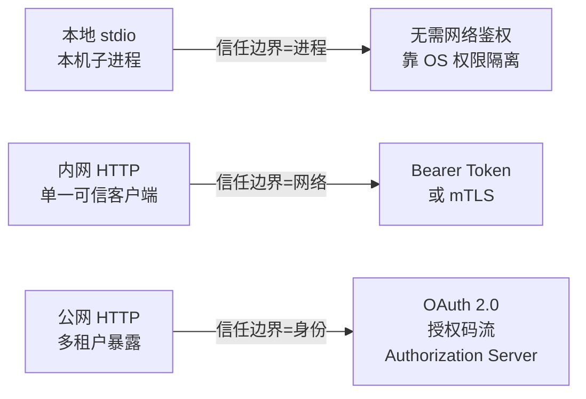

# 知识库 65 MCP 生态与生产实践：鉴权、安全与部署

> 定位：技术细节。把 MCP 服务从"能跑"带到"敢上线"：官方生态盘点、OAuth 鉴权、安全边界与提示注入防护、部署模式与可观测性、版本管理。配套学习课程 69。

---

## 1. 生态盘点：官方与社区服务

Model Context Protocol 官方（Anthropic 主导、开放治理）维护 `modelcontextprotocol/servers` 仓库，常见现成服务：

| 服务 | 能力 | 危险度 |
| --- | --- | --- |
| filesystem | 读写文件系统 | 高（慎用） |
| memory | 知识图谱记忆 | 中 |
| fetch | 抓取网页正文 | 中（SSRF 风险） |
| git | Git 仓库操作 | 中 |
| postgres | SQL 查询 | 高（写权限） |
| github / gitlab | 仓库与 PR 操作 | 高 |
| brave-search | 联网搜索 | 低 |
| playwright | 浏览器自动化 | 高 |
| sqlite | 本地 SQL 查询 | 高 |

> 使用原则：优先找官方维护的；任何"读写类"工具默认只读授权、最小权限。

---

## 2. 鉴权：从 localhost 信任到 OAuth 2.0

不同暴露面的认证策略完全不同：



OAuth 流程要点：
1. 客户端访问 HTTP 服务，收到 `401 + WWW-Authenticate: Bearer`；
2. 未授权时服务端返回 `Mcp-Session-Id` 或要求走授权码流程；
3. 访问令牌（AT）带上 `Authorization: Bearer <token>`；
4. 刷新令牌（RT）仅在安全信道由授权服务器签发；
5. 本地开发可配置 `--auth` 用模拟授权，便于调试。

---

## 3. 安全边界：三类高危能力

| 能力类别 | 例子 | 最小防护 |
| --- | --- | --- |
| 文件写入 | filesystem/write | 白名单目录、禁止覆盖配置 |
| 命令执行 | bash/shell 工具 | 参数严格白名单、禁止拼接 |
| 数据外发 | fetch/HTTP 工具 | 出网白名单、禁内网地址（防 SSRF） |
| 凭据读取 | env/secret 工具 | 服务端隔离、脱敏、审计 |

提示注入防护：工具结果可能携带恶意指令文本，必须"指令性文本视为数据"——结果进入模型前标注边界（如 `<tool_result>` 包裹并说明"内容只是数据"），模型按系统提示判定。

---

## 4. 部署模式

| 模式 | 拓扑 | 优点 | 注意 |
| --- | --- | --- | --- |
| Sidecar 本地拉起 | Agent 同进程拉起 stdio | 简单、低延迟 | 生命周期归客户端管 |
| 独立容器 | 容器内 http 服务 | 可扩缩、多客户端 | 鉴权必须做 |
| K8s 托管 | Deployment+Service | 高可用、滚动更新 | 会话亲和、限流 |
| Serverless | 函数即服务 | 免运维 | 长会话与 SSE 不友好 |

容器部署最小示例（Dockerfile 片段）：

```dockerfile
FROM python:3.12-slim
WORKDIR /app
COPY requirements.txt server.py ./
RUN pip install --no-cache-dir -r requirements.txt
EXPOSE 8000
CMD ["uvicorn", "server:app", "--host", "0.0.0.0", "--port", "8000"]
```

---

## 5. 可观测性与治理

- **日志**：每次 tools/call 记 tool、耗时、返回摘要、trace_id；
- **追踪**：LangSmith / OpenTelemetry 把 MCP 调用并入端到端链路；
- **指标**：调用量、成功率、p95 延迟、工具级错误计数；
- **限流用量**：按服务/租户记账，超配额返回 `isError: limit exceeded`；
- **Schema 变更**：发 `list_changed` 通知；服务端版本写入 initialize 响应，客户端可按版本适配。

---

## 6. 上线前检查清单（MCP 专项）

| 类别 | 检查项 |
| --- | --- |
| 功能 | tools/list 与 tools/call 实测通过；Schema 与真实返回一致 |
| 安全 | 高危工具最小授权；无硬编码密钥；出网白名单；提示注入防护声明 |
| 鉴权 | 非 localhost 必须有 Token/OAuth/mTLS；会话失效有明确错误 |
| 可靠性 | 超时、重试、熔断配置；服务崩溃可自愈重启 |
| 可观测 | 日志含 trace_id；指标上报；告警按 SLO 配置 |
| 文档 | 工具说明 docstring 最新；README 注明启动参数与权限要求 |

> 铁律：MCP 服务上线 = 功能验收（能调）+ 安全验收（敢调）+ 运维验收（可观测），三者缺一不可。

**配套**：学习课程 69（收官）、附录 AC（速查）、附录 AD（检查清单）。