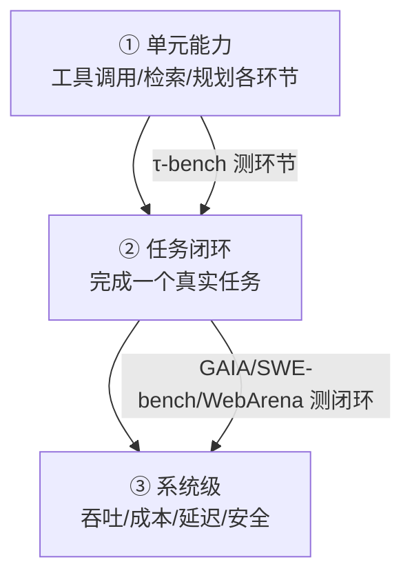
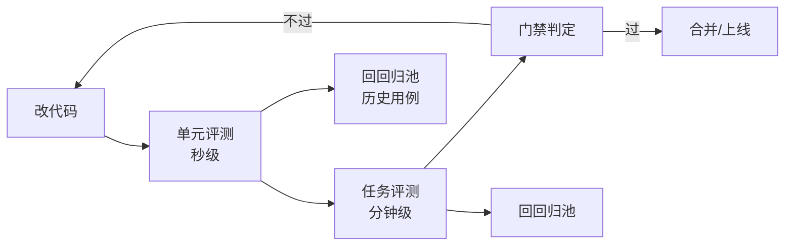

# 知识库 66 Agent 评测全景：金字塔、四类基准与核心指标

> 定位：技术细节。系统化认识 Agent 评测：为什么"感觉好"不算数、评测金字塔分层、四类代表性基准（GAIA / τ-bench / SWE-bench / WebArena）、以及每一层的核心指标。配套学习课程 70。

---

## 1. 为什么需要 Agent 级评测

RAG 评测（上一章）回答"检索+生成答得准不准"；Agent 评测回答"会规划、会调工具、能完成任务闭环"。后者引入两个新问题：

- **过程正确性**：工具调用是否合规（该用工具时用了、不该用时没用、参数合法）；
- **结果可验证性**：任务是否有客观终态（机票是否真的订上、bug 是否真的修好）。

一句话：Agent 用"做题得分"而不是"听感"来验收。

---

## 2. 评测金字塔

三层分工：单元能力快而准（定位到具体环节），任务闭环真实（综合能力），系统级看生产表现。

---

## 3. 四类代表性基准

| 基准 | 类型 | 任务示例 | 成功判定 | 组织 |
| --- | --- | --- | --- | --- |
| GAIA | 现实多步推理 | 看图替你估算、查资料汇总 | 人类评审答案 | Meta 等 |
| τ-bench | 工具调用智能体 | 航空/ 零售客服对话 | 目标奖励 × 工具合规 | Sierra |
| SWE-bench | 代码修复 | 修 GitHub issue 并过测试 | 隐藏测试通过 | Princeton |
| WebArena | 网页操作 | 在 电商/论坛 网站完成任务 | 站点状态断言 | UW 等 |

> 补充：SWE-bench Verified 是人工筛选的高质量子集，常作为代码 Agent 的对照线。

---

## 4. 核心指标族

| 指标 | 含义 | 适用 |
| --- | --- | --- |
| Task Success Rate（TSR） | 完整任务成功率 | 全部 |
| Partial Reward | 分步奖励累积 | τ-bench 式 |
| Tool Violation Rate | 工具调用违规率 | 工具型 |
| Pass@k | 采样 k 次至少一次通过 | 代码型 |
| Cost per Task | 单任务 API 成本 | 生产 |
| Latency p50/p95 | 任务耗时 | 生产 |

生产决策公式：**上线看 TSR 门槛 + 成本预算 + 违规率上限**，三者一起看，单看 TSR 会被"作弊性短答"骗过。

---

## 5. 评测在研发生命周期的位置

---

## 6. 选基准的决策表

| 你的 Agent 类型 | 首选基准 | 备选 |
| --- | --- | --- |
| 客服/工具型 | τ-bench | 自建场景 |
| 代码型 | SWE-bench Verified | 自建 issue 池 |
| 网页操作 | WebArena | WebVoyager |
| 知识问答型 | GAIA | 自建 Q&A 集 |
| 生产系统 | 自建回归池（KB68） | 一两个公开基准打底 |

> 铁律：公开基准打底（对齐业内水平）+ 自建回归池（守住你的业务）双轨并行，缺一不可。

**配套**：知识库 67（τ-bench 实战）、学习课程 70（比喻入门）。