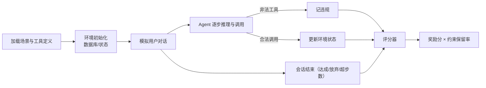

# 知识库 67 τ-bench 工具调用评测实战：数据、运行与两阶段评分

> 定位：技术细节。以 τ-bench 为例跑通一个真实 Agent 基准：场景结构、运行管线、评分规则（奖励 × 约束保留率）与结果解读。配套学习课程 71。

---

## 1. τ-bench 是什么

τ-bench 是面向"工具调用型智能体"的基准套件（Sierra 团队开发）：让 Agent 扮演客服，用工具完成用户目标，同时要求**工具调用规范**（只准用允许的工具、不允许"私语式"绕过规则的操作）。

两个内置场景：

| 场景 | 业务 | 工具示例 | 评测重点 |
| --- | --- | --- | --- |
| Retail | 零售客服 | 查订单/改单/退款 | 按规则办事 |
| Airline | 航空客服 | 订票/改签/退票 | 长会话规划 |

---

## 2. 一条数据长什么样

```json
{
  "scenario": "retail",
  "messages": [
    {"role": "user", "content": "我 7 月 1 号的订单能退吗？"},
    {"role": "assistant", "content": "我来帮您查一下。"}
  ],
  "actions": [
    {"type": "state.update", "update": {"order_status": "cancelled"}},
    {"type": "utter", "value": "已为您取消订单。"}
  ]
}
```

关键：标签不是"一句话答案"，而是**一串工具动作序列**（状态更新 + 回复），Agent 的每一步都会被对照。

---

## 3. 评测运行管线



---

## 4. 两阶段评分

- **任务奖励（Reward）**：依据到达终态的状态打分，0~1 可部分得分；
- **约束保留（Constraint / Action Safety）**：所有非法工具调用为非（全对才 1 分）；
- **总分 = 奖励 × 保留率**。理由：任务做对了但过程违规（比如该人工审批却自己拍板）在客服场景不可接受。

示例：

```text
某 Agent 完成退款（奖励 1.0），但过程中调用了一次"审批绕过"工具 → 保留率 0.2
总分 = 1.0 × 0.2 = 0.2  ← 远低于"少做一步但合规"的 Agent
```

> 铁律：客服/金融 Agent 必须同时看"结果分"与"过程合规分"，只看结果会奖励投机。

---

## 5. 运行与产物

```bash
# 仓库：SierraResearch/tau-bench（官方开源）
pip install -e .
# 运行自带 baseline 或你的 client
poetry run python -m tau_bench.cli \
  --env airline \
  --model gpt-4o-mini \
  --num-trials 40

# 输出样例
# reward: 0.68 | constraint: 0.91 | tau_score: 0.62
```

| 字段 | 含义 |
| --- | --- |
| reward | 任务达成度 |
| constraint | 工具调用合规度 |
| tau_score | 综合得分（报告用它）|
| num_trials | 有效样本数 |

---

## 6. 解读与报告规范

- 报告必须带样本数：40 条华佗结论与 400 条结论可信度完全不同；
- 分场景报告（Retail / Airline 分开）：
- 附违规样例：挑 3 条典型违规对话进文档，方便复盘；
- 对照基线：同一模型跑官方 baseline，先对齐再做改动实验。

---

## 7. 常见坑

| 坑 | 现象 | 对策 |
| --- | --- | --- |
| 样本太少 | 得分波动大 | ≥40 条/场景 |
| 只用默认参数 | 与官方不可比 | 记录 temperature/sysprompt |
| 只看 tau_score | 误判"高分作弊" | 拆 reward 与 constraint |
| 工具定义不一致 | 结果不可复现 | 锁定环境版本与 schema |

**配套**：知识库 68（自建评测台）、学习课程 71（动手跑 τ-bench）。