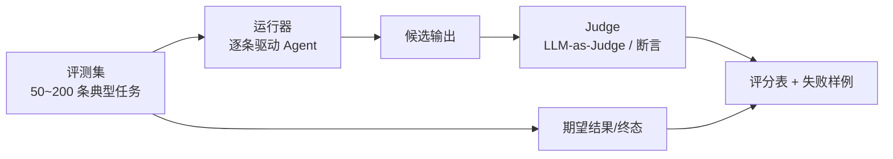
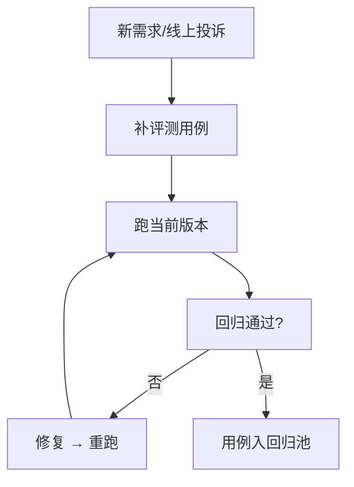

# 知识库 68 自建 Agent 评测台：评测集、LLM-as-Judge 与运行报告

> 定位：技术细节。公开基准打底之外，必须有一套自己业务的评测台：评测集怎么造、LLM-as-Judge 怎么定标准、运行器与报告长什么样。配套学习课程 72。

---

## 1. 评测台三大件

| 组件 | 职责 | 本库章节 |
| --- | --- | --- |
| 评测集（Eval Set） | 业务任务的"标准考卷" | 第 2 节 |
| 判定器（Judge） | 对输出打分 | 第 3 节 |
| 运行器（Runner） | 批量跑、汇总、出报告 | 第 4 节 |



---

## 2. 评测集构造方法论

**四步法：**

1. **拆场景**：按用户意图聚类（查单、改单、退单…每个场景 ≥10 条）；
2. **写任务**：自然语言 + 明确终态（"订单状态变为 cancelled 且告知用户"）；
3. **设难度梯度**：简单（单工具）/ 中等（两工具）/ 难（多轮规划 + 例外）各 20%~30%；
4. **双人标注**：两条独立标注期望终态，不一致的地方讨论到一致。

**持久化格式示例：**

```json
{
  "id": "retail-014",
  "scenario": "retail",
  "user_msg": "订单 1024 能改地址吗？",
  "gold_tools": ["order.lookup", "order.update_address"],
  "success": "state.order.address 更新且回复包含新地址"
}
```

---

## 3. LLM-as-Judge：怎么评"像不像人"

两类判定：

| 类型 | 适用 | 做法 |
| --- | --- | --- |
| 硬断言 | 终态可判（状态/字段） | 代码检查 state |
| LLM Judge | 开放答案（回复质量/语气） | 打分提示词 + 评分规则 |

**Judge 提示词模板（要点）：**

```text
你是客服质检员。依据以下标准打分（0-5）：
1) 正确性：是否达成用户目标
2) 完整性：是否主动补充必要信息
3) 合规性：是否遵循规则（如退款需授权）
只给整数分；给出单条理由，不超过 30 字。
【用户需求】...
【Agent 回复】...
```

**可信度三原则：**

- Judge 模型与生成模型**不同家**（避免自我偏好偏差）；
- 每条给**明确评分标准**而非"感觉打分"；
- 抽样 20% 人工复核，Judge 与人类一致性（Cohen's Kappa）低于 0.6 就回炉。

---

## 4. 运行器与报告

```python
# 伪代码骨架
async def run_eval(eval_set, agent, judge_cfg):
    rows = []
    for case in eval_set:
        traj = await agent.run(case.user_msg)          # 跑 Agent
        state = env.apply(traj)                         # 应用环境
        score = judge.score(state, case.success)        # 判定
        rows.append({**case, "score": score, "trace": traj})
    return summarize(rows)
```

**报告四段式：**

| 段落 | 内容 |
| --- | --- |
| 总结 | 总分、分场景分、与基线对比 |
| 失败样例 Top5 | 每条带对话片段 + 失败原因标签 |
| 违规/耗时/成本 | 工具违规率、p95 延迟、token 成本 |
| 行动项 | 定位到环节（检索/规划/工具）的改进建议 |

---

## 5. 评测集生命周期



> 铁律：线上每出现一次失败，就该沉淀一条评测用例——评测集是"运营出来的"，不是"写出来就不动的"。

---

## 6. 工具与落地建议

| 能力 | 现成方案 |
| --- | --- |
| 评测框架 | LangSmith Eval / Ragas / 自研 Runner |
| 追踪 | LangSmith / Langfuse |
| 数据集版本 | Git + JSON，PR 评审用例变更 |
| 定时回归 | CI 或定时任务（见知识库 69） |

**配套**：知识库 69（评测驱动开发与门禁）、学习课程 72（动手造考卷）。