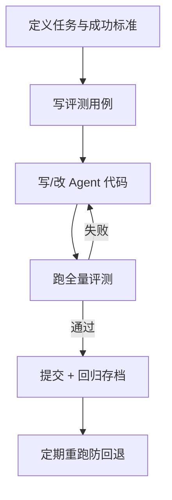
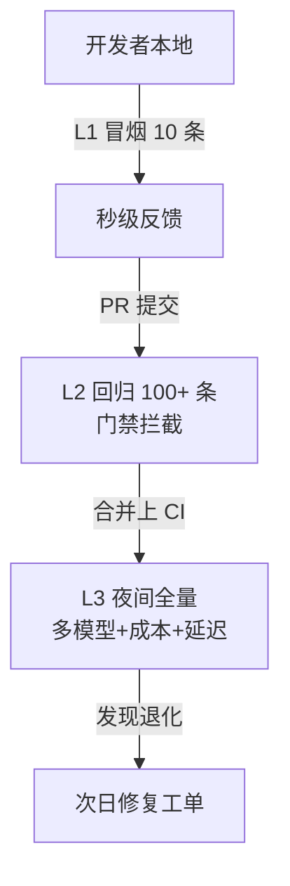

# 知识库 69 评测驱动开发（EDD）与 CI 门禁：让评测拦住烂版本

> 定位：技术细节。把评测从"上线前抽查"变成"每次改动必过"的工程制度：三套评测分层、门禁阈值设定、CI 集成与回归治理。配套学习课程 73。

---

## 1. EDD 的闭环思维

评测驱动开发（Eval-Driven Development）：**先写考卷，再写代码**——每一次改动都要先过评测，不过不合并。这与 TDD 同构，只是"单测"换成"任务评测"。



> 顺序不可反：先有考卷、后有实现，才叫 EDD；先有代码再补考卷，很容易"题库迁就答案"。

---

## 2. 三套评测分层（成本与速度匹配）

| 层级 | 名称 | 内容 | 耗时 | 时机 |
| --- | --- | --- | --- | --- |
| L1 | Smoke | 10 条冒烟 | 秒级 | 本地每次 |
| L2 | Regression | 全量回归池 | 分钟级 | 每次 PR |
| L3 | Nightly | 大样本 + 多模型 + 压力 | 小时级 | 每晚 |



---

## 3. 门禁阈值设定（宁可严，不可虚）

| 指标 | 建议阈值（示例） | 不可突破（红线） |
| --- | --- | --- |
| 任务成功率 TSR | ≥ 基线 -2pp | 低于 60% 禁止上线 |
| τ 分/工具合规 | ≥ 基线 -1pp | 违规率高于 5% 禁止 |
| 成本/任务 | ≤ 预算 1.2× | 超预算即警告 |
| p95 延迟 | ≤ 基线 1.3× | 超 2× 禁止 |

> 阈值与基线都要"版本化"：每轮发布记录基线值，防止基线悄悄烂掉（漂移）。

---

## 4. CI 集成（GitHub Actions 示例）

```yaml
name: agent-eval
on: [pull_request]
jobs:
  eval:
    runs-on: ubuntu-latest
    steps:
      - uses: actions/checkout@v4
      - uses: actions/setup-python@v5
        with: { python-version: "3.12" }
      - run: pip install -r requirements.txt
      - name: Run L2 regression
        run: python eval/run.py --suite regression --gate
      - name: Upload report
        uses: actions/upload-artifact@v4
        with: { name: eval-report, path: report/ }
```

要点：`--gate` 模式失败即非零退出码 → PR 红叉；报告作为 artifact 可下载复盘。

---

## 5. 回归治理：防"回退"与防"过拟合"

- **对抗回退**：Nightly 记录每个版本的 TSR 时间序列，出现单调下降自动开票；
- **对抗过拟合**：评测集定期抽取 20% 换新题，防止 Agent 背题；
- **用例评审**：新增/修改评测用例要 PR 评审，防止"删难题保分"；
- **双盲校准**：季度抽 50 条人工重审，校准 Judge 一致性。

---

## 6. 落地路线图（两周版）

| 阶段 | 时间 | 交付 |
| --- | --- | --- |
| 摸底 | D1-2 | 建 50 条评测集，跑当前版本出基线 |
| 固化 | D3-5 | Judge 完成 + 人机一致性 ≥0.6 |
| 门禁 | D6-10 | L1/L2 接入 CI，阈值生效 |
| 观察 | D11-14 | Nightly 跑 3 晚，沉淀首次趋势 |

---

## 7. 常见失败模式

| 模式 | 症状 | 对策 |
| --- | --- | --- |
| 题库迁就答案 | 分数虚高 | 外部评审用例 |
| 门禁形同虚设 | 常被"跳过" | 门禁结果进发布审批 |
| 基线漂移 | 分数缓慢下降 | 趋势监控 + 冻结基线 |
| Judge 偏见 | 与人类偏差大 | 换 Judge 模型/人机校准 |

> 铁律：评测门禁的价值 = 分数可信度 × 执行刚性。分数再科学，不强制执行等于零。

**配套**：知识库 66-68、学习课程 73（收官）、附录 AF（模板库）。