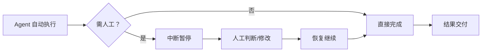
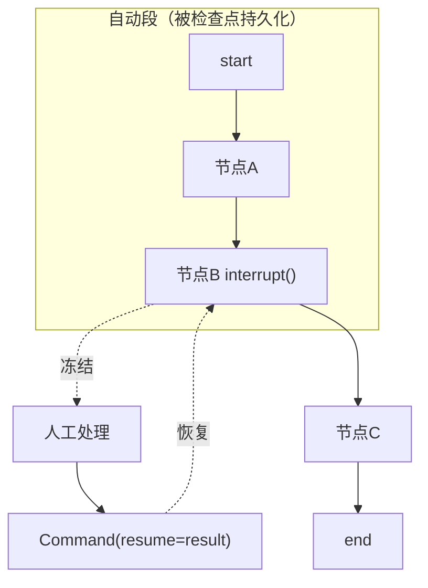

# 知识库 70 Human-in-the-Loop 概念全景与 LangGraph 中断恢复机制

> 定位：技术细节。讲清楚 HITL 是什么、为什么需要、LangGraph 用什么原语实现中断与恢复。配套学习课程第 74 课、附录 AG。

---

## 1. HITL 是什么

Human-in-the-Loop（HITL，人在回路）指在 Agent 自动执行流程的某些节点上，暂停自动化、引入人工判断后再继续的协同模式。它不是"把活儿全丢给人"，而是**在关键决策点把方向盘交还给人**。

与全自动（full autonomy）和纯人工的区别：

| 模式 | 谁决策 | 速度 | 安全 | 适用 |
| --- | --- | --- | --- | --- |
| 全自动 | Agent | 快 | 低（错也照跑） | 低风险可逆任务 |
| 纯人工 | 人 | 慢 | 高 | 高价值一次性 |
| **HITL** | **Agent 跑 + 人把关** | **中** | **高** | **高风险/不可逆/低置信** |



---

## 2. 为什么需要 HITL

三类硬需求，每类对应一种中断时机：

1. **不可逆操作前置确认**：发邮件、转账、删数据、下单——执行后无法撤销，必须在执行前停。
2. **低置信度兜底**：Agent 检索置信度低、多步推理分叉、工具调用结果异常——停下来让人定夺。
3. **纠错与回退**：Agent 走偏了，人改一下输出或回退到某个检查点重跑。

> 反模式：把 HITL 当万能兜底，什么都让人审——这叫**审批疲劳**，人会麻木，等于没有护栏。正确做法是只在高风险点设卡（详见知识库 73）。

---

## 3. LangGraph 的中断恢复原语

LangGraph 用两个核心 API 实现 HITL，都建立在**检查点（checkpoint）**之上（检查点机制见第 28 课）：

| 原语 | 作用 | 触发位置 |
| --- | --- | --- |
| `interrupt(value)` | 在节点内暂停图执行，把 value 抛给调用方 | 需要人工介入的节点 |
| `Command(resume=...)` | 恢复执行，把人工结果注入回中断点 | 调用方收到中断后 |
| `get_state(config)` | 读取当前状态与"下一步可执行节点" | 中断后、恢复前 |

关键：**中断不是结束，而是"冻结"**。图的当前状态被检查点持久化，人工处理完后用 `Command(resume=)` 把结果送回，图从中断处继续，而不是从头重跑。



---

## 4. 最小可运行示例

```python
from typing import Annotated
from typing_extensions import TypedDict
from langgraph.graph import StateGraph, START, END
from langgraph.types import interrupt, Command
from langgraph.checkpoint.memory import MemorySaver

class State(TypedDict):
    msg: str
    approved: bool

def review_node(state: State):
    # 把待审批内容抛给调用方，等待人工 resume
    decision = interrupt({"ask": "是否发送？", "msg": state["msg"]})
    return {"approved": decision == "yes"}

def send_node(state: State):
    if state["approved"]:
        return {"msg": "已发送: " + state["msg"]}
    return {"msg": "已取消发送"}

g = StateGraph(State)
g.add_node("review", review_node)
g.add_node("send", send_node)
g.add_edge(START, "review")
g.add_conditional_edges("review", lambda s: "send" if s["approved"] is not None else END)
g.add_edge("send", END)
app = g.compile(checkpointer=MemorySaver())
```

调用方：

```python
config = {"configurable": {"thread_id": "t1"}}
# 第一次跑：在 review 节点中断
result = app.invoke({"msg": "你好，确认下单"}, config)
# result 含 __interrupt__，人工看完后恢复
app.invoke(Command(resume="yes"), config)  # 注入人工决策，继续到 send
```

---

## 5. 中断点设计原则

| 原则 | 说明 |
| --- | --- |
| 只在必要处中断 | 每个中断都是一次延迟，能自动判定的别找人 |
| 中断值要可操作 | `interrupt()` 抛出的内容必须让人能做决策（待审批内容+上下文） |
| 恢复值要可验证 | 人工 `resume` 的值先校验再注入，防注入脏数据 |
| thread_id 要稳定 | 中断恢复靠 thread_id 定位同一会话，别用随机 id |
| 状态要可观测 | 中断后用 `get_state` 看清"卡在哪、下一步是谁"再恢复 |

> 配套：检查点机制（第 28 课）是 HITL 的地基；记忆系统（第 27 课）保证中断前后状态不丢。三者一起构成 LangGraph 的可中断执行模型。

---

## 6. 与评测/可观测的协同

HITL 不是孤立功能，它和评测门禁（第 73 课）、可观测性（第 62 课）共同构成质量护栏：

- **评测门禁**拦截烂版本不上线；
- **可观测性**让线上问题可见；
- **HITL** 在线上高风险点兜底。

三者关系：评测是"出厂质检"，可观测是"行车记录仪"，HITL 是"紧急制动"。缺了紧急制动，即便质检过关、记录齐全，遇到突发仍可能撞车。


---

## 小结

- HITL = 自动执行 + 关键点人工把关，用于高风险/不可逆/低置信场景；
- LangGraph 用 `interrupt()` 冻结、`Command(resume=)` 恢复，状态由检查点持久化；
- 设计纪律：少而精的中断点、可操作的中断值、可验证的恢复值、稳定的 thread_id；
- HITL 与评测、可观测共同构成质量护栏，缺一不可。

**配套**：学习课程第 74 课（入门）、知识库 71（工具审批）、附录 AG（速查）。