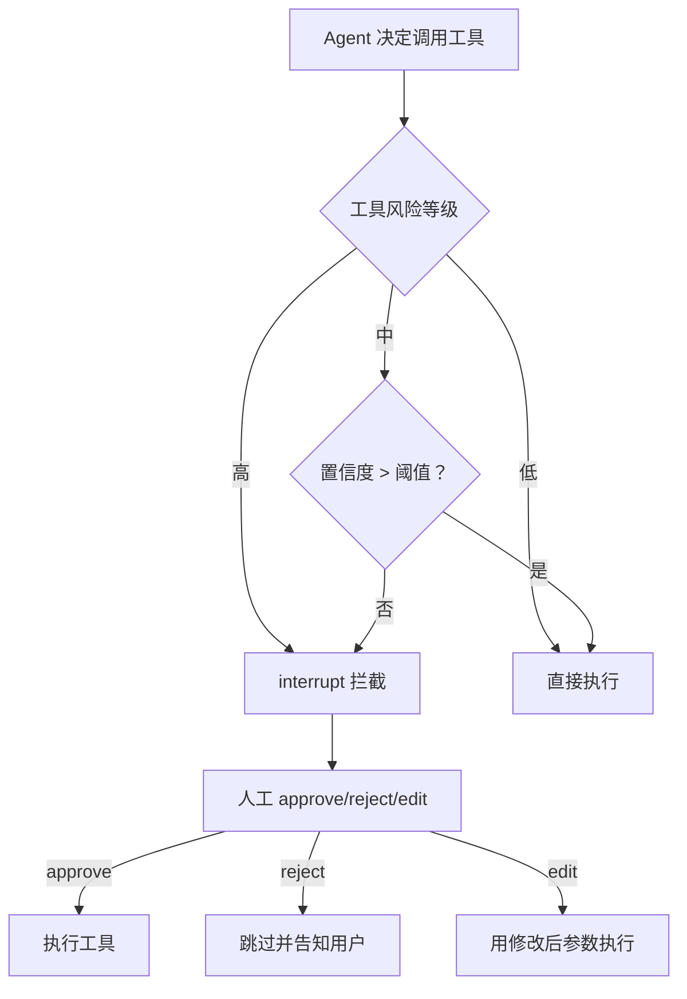
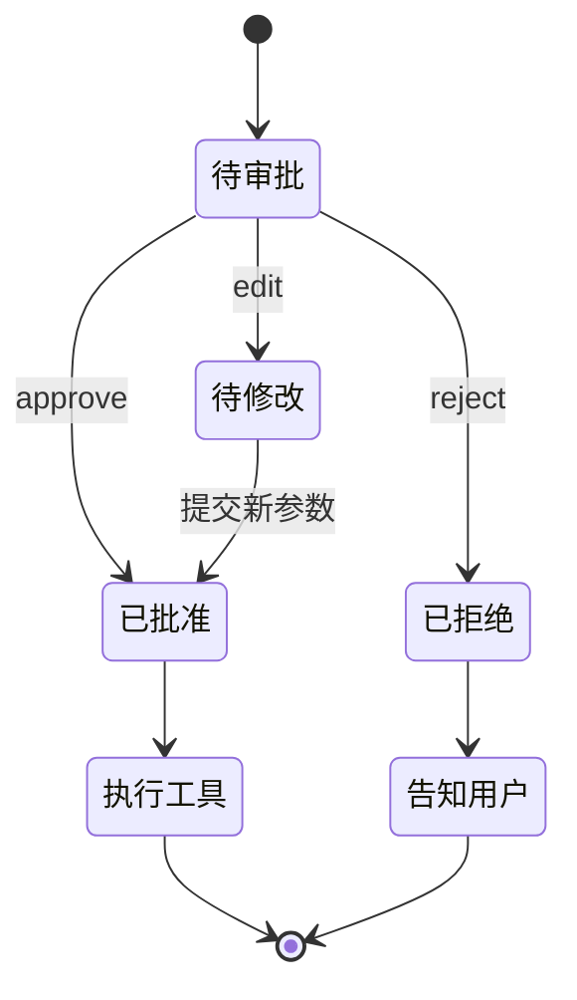

# 知识库 71 工具调用前人工确认与审批节点设计

> 定位：技术细节。讲清楚如何在工具执行前拦截、设计审批分支、处理 approve/reject/edit 三种人工动作。配套学习课程第 75 课、附录 AH。

---

## 1. 为什么在工具调用前拦截

工具是 Agent 改变外部世界的手段：发邮件、调 API、写数据库。**工具调用一旦执行，往往不可逆**。因此 HITL 最常见的中断点就在"工具执行前"——让 Agent 决定要调用什么工具、把参数亮给人看、人确认后才真正执行。

| 拦截时机 | 风险 | 典型工具 |
| --- | --- | --- |
| 工具执行前 | 不可逆外部动作 | send_email、transfer_money、delete_record |
| 工具执行后 | 结果可能错误但可补救 | search、query_db |
| 不拦截 | 低风险可逆 | calculator、echo |

> 经验：不是所有工具都要拦。按风险分级——高风险工具强制拦截、中风险按置信度拦截、低风险放行。



---

## 2. 拦截工具的三种实现方式

### 方式一：在 ToolNode 前插审批节点

把审批做成图里的独立节点，工具调用前必经：

```python
def approve_tool_calls(state):
    # state["tool_calls"] 由 Agent 节点产出
    pending = state.get("tool_calls", [])
    high_risk = [tc for tc in pending if tc["name"] in HIGH_RISK_TOOLS]
    if not high_risk:
        return {"approved_calls": pending}   # 低风险直接放行
    # 高风险：抛给人工
    decision = interrupt({"pending": high_risk})
    if decision.get("action") == "approve":
        return {"approved_calls": high_risk}
    if decision.get("action") == "edit":
        return {"approved_calls": decision["edited"]}
    return {"approved_calls": []}   # reject → 清空
```

### 方式二：自定义 Tool 包装器

在工具执行函数内部第一步就 interrupt：

```python
def send_email(to, subject, body):
    # 执行前先让人确认收件人与内容
    decision = interrupt({"to": to, "subject": subject, "body": body})
    if decision.get("action") != "approve":
        return f"已取消: {decision.get('reason','')}"
    return smtp_send(decision.get("to", to), decision.get("subject", subject),
                     decision.get("body", body))
```

### 方式三：PreModelHook / 工具调用前置守卫

在框架层统一拦截（LangChain 的 tool_calls 生成阶段），适合做全局策略。适合需要按规则动态判定风险等级的场景。

| 方式 | 优点 | 缺点 |
| --- | --- | --- |
| 审批节点 | 流程清晰、易观测 | 要改图结构 |
| 工具包装器 | 改动最小、工具自管 | 分散、难统一策略 |
| 全局守卫 | 统一策略 | 实现复杂、与框架耦合 |

---

## 3. 审批分支设计：approve / reject / edit

人工不只是"同意/拒绝"，还有第三种——**edit（修改参数后执行）**。这三种动作对应不同的状态流转：

| 人工动作 | 含义 | 状态处理 |
| --- | --- | --- |
| approve | 同意原参数执行 | 放行 tool_calls |
| reject | 拒绝执行 | 清空 tool_calls，可选返回拒绝原因给 Agent |
| edit | 修改参数后执行 | 用新参数替换 tool_calls |

edit 是最容易被忽略却最有价值的一种：人发现 Agent 把收件人填错了，改一下再发，而不是非黑即白地批准或拒绝。



---

## 4. 完整示例：带审批的邮件工具

```python
from langgraph.types import interrupt, Command

HIGH_RISK = {"send_email", "delete_record", "transfer"}

def agent_node(state):
    # 让 LLM 产出 tool_calls（伪代码）
    tool_calls = llm_with_tools.invoke(state["messages"]).tool_calls
    return {"tool_calls": tool_calls}

def approval_gate(state):
    calls = state.get("tool_calls", [])
    risky = [c for c in calls if c["name"] in HIGH_RISK]
    if not risky:
        return {"approved": calls}
    decision = interrupt({"need_approval": risky,
                          "context": state["messages"][-1:]})
    action = decision.get("action", "reject")
    if action == "approve":
        return {"approved": risky}
    if action == "edit":
        return {"approved": decision["edited_calls"]}
    return {"approved": [], "reject_reason": decision.get("reason", "")}

def tool_executor(state):
    results = []
    for c in state.get("approved", []):
        results.append(run_tool(c["name"], c["args"]))
    return {"tool_results": results}
```

> 注意：`interrupt` 抛出的内容要包含足够上下文（待审批调用 + 触发它的用户消息），让人能判断；`resume` 回来的值要先校验结构（action 是否合法、edited_calls 是否完整）再注入。

---

## 5. 风险分级策略表

| 风险等级 | 判定依据 | 默认动作 |
| --- | --- | --- |
| 高 | 工具名在 HIGH_RISK 白名单 | 强制 interrupt |
| 中 | 参数含金额>阈值 / 收件人外部域 | 按置信度 interrupt |
| 低 | 只读工具 / 幂等工具 | 放行，仅记录日志 |

> 实操：维护一份 `tool_risk_registry.json`，每上线一个工具就登记风险等级和拦截策略，审批策略跟着工具清单走，而非散落在代码里。

---

## 小结

- 工具执行前拦截是 HITL 最高频的场景，按风险分级决定拦不拦；
- 三种实现：审批节点（清晰）、工具包装器（自管）、全局守卫（统一）；
- 人工动作不止 approve/reject，**edit 让人改参数后执行**往往更实用；
- 中断值带足上下文、恢复值先校验，是审批可靠的两条铁律。

**配套**：知识库 70（中断恢复原语）、学习课程第 75 课（装刹车）、附录 AH（审批模板库）。