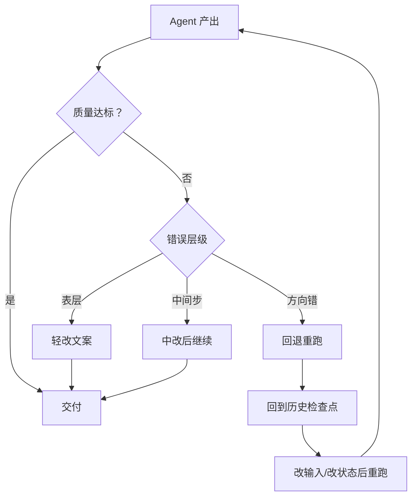
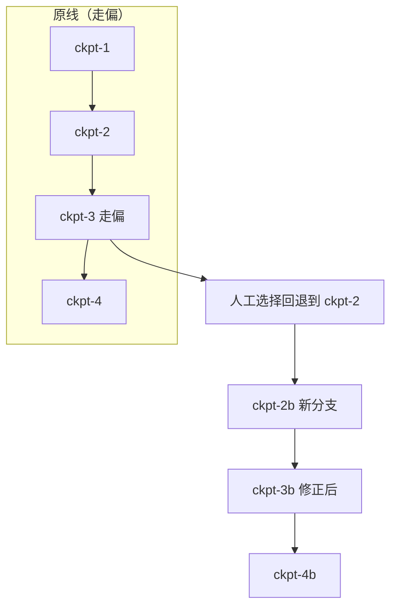
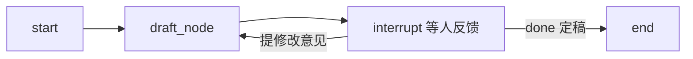
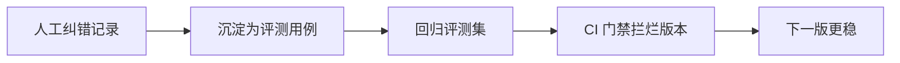

# 知识库 72 纠错回退与多轮人机协同

> 定位：技术细节。讲清楚人工如何纠正 Agent 输出、如何回退到历史检查点重跑、多轮交互式修正怎么实现。衔接第 28 课检查点与第 30 课时间旅行。配套学习课程第 76 课。

---

## 1. 纠错的三种粒度

Agent 走偏时，人工介入的粒度由浅到深：

| 粒度 | 做什么 | 成本 | 适用 |
| --- | --- | --- | --- |
| 轻改 | 改 Agent 最终回复的文案 | 低 | 表述不准但结论对 |
| 中改 | 改中间某步输出后继续跑 | 中 | 某步推理错、后续可救 |
| 重跑 | 回退到某检查点，改输入重跑 | 高 | 方向性错误，要重来 |

> 判断口诀：**能轻改不中改、能中改不重跑**。回退成本最高（要丢弃中间所有产出），只在方向性错误时用。



---

## 2. 中改：改中间输出后继续

LangGraph 的状态是可写的。人工可以直接修改某个节点产出的状态字段，然后从下一节点继续，而不必从头跑。

```python
# 假设图在 answer_node 后中断
state = app.get_state(config)
# 人工发现 answer 不对，直接改
app.update_state(config, {"answer": "修正后的答案"})
# 从下一节点继续（不重跑 answer_node）
app.invoke(None, config)   # 传 None 表示从当前断点继续
```

关键 API：

| API | 作用 |
| --- | --- |
| `get_state(config)` | 读取当前状态与下一步节点 |
| `update_state(config, values)` | 人工写入/覆盖状态字段 |
| `invoke(None, config)` | 从当前断点继续执行 |

---

## 3. 回退：回到历史检查点重跑

每个检查点都有版本（checkpoint_id）。LangGraph 支持列出历史检查点，选择某个回到那时，再重跑——这就是**时间旅行**（第 30 课讲过概念，这里讲怎么和 HITL 结合）。

```python
# 列出该会话所有历史检查点
history = list(app.get_state_history(config))
# 找到要回退的那一步（比如第 3 个检查点）
target = history[3]
# 用该检查点的 config 继续执行 → 从那一刻重跑
replay_config = target.config
app.invoke(None, replay_config)
```

> 注意：回退后从该检查点继续，会**生成新的分支历史**，不覆盖原历史。你可以同时保留"走偏的那条线"和"修正后的这条线"，便于事后对比。



---

## 4. 多轮交互式修正

不是"中断一次就完"，而是人与 Agent 来回多轮打磨。典型流程：Agent 出草稿 → 人提修改意见 → Agent 改 → 人再确认 → 定稿。

```python
def draft_node(state):
    draft = llm.invoke(state["task"]).content
    feedback = interrupt({"draft": draft, "round": state.get("round", 0)})
    if feedback.get("done"):
        return {"final": draft}
    return {"task": state["task"] + "\n修改意见:" + feedback["comment"],
            "round": state.get("round", 0) + 1}
```

循环结构：`draft_node` 自带条件边——只要人没说 done，就回到自己继续改。



---

## 5. 纠错回退的纪律

| 纪律 | 为什么 |
| --- | --- |
| 先 get_state 看清再动手 | 盲改状态会破坏图的不变量 |
| update_state 只改必要字段 | 大范围覆写会让后续节点拿到的状态不可预期 |
| 回退前备份当前 config | 万一改得更糟，能回到改之前 |
| 多轮修正设上限 | 防止人机无限循环空耗 token |
| 记录每次纠错 | 纠错记录是评测数据金矿（见第 68 课） |

> 重要的协同：每一次人工纠错都应被记录成评测用例。人帮 Agent 改了一次，就说明这里有个 Agent 会犯的错——把它沉淀进回归评测集（附录 AF），下次发版前用评测门禁（第 73 课）拦住。



---

## 小结

- 纠错三粒度：轻改文案 → 中改中间步 → 回退重跑，按错误层级递进选择；
- 中改用 `update_state` 覆写字段后 `invoke(None)` 继续；回退用 `get_state_history` 选历史检查点重跑，生成新分支；
- 多轮交互式修正是"草稿→反馈→改→定稿"的循环，要设轮次上限；
- 每次纠错都该沉淀为评测用例——纠错是免费的标注，别浪费。

**配套**：第 28 课（检查点）、第 30 课（时间旅行）、知识库 73（生产落地）、附录 AH（纠错模板）。