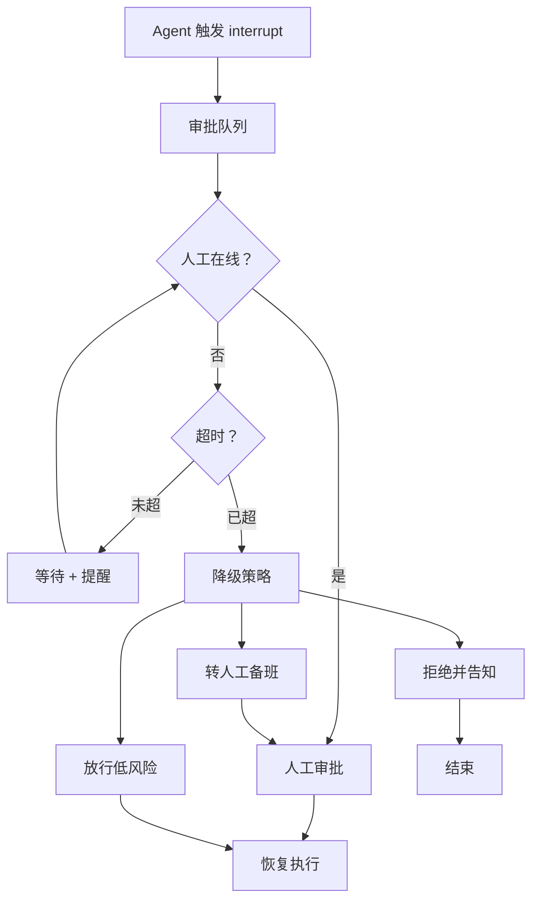
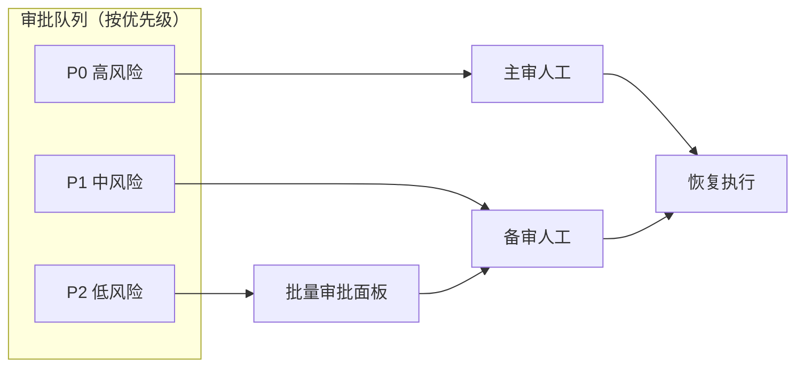
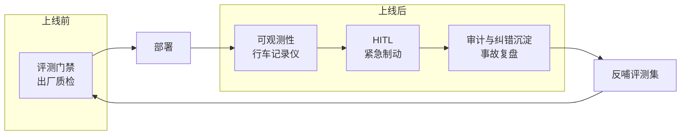

# 知识库 73 HITL 生产落地反模式与质量护栏协同

> 定位：技术细节。把 HITL 从"能跑的 demo"推到"能上线的生产系统"：审批 SLA、超时降级、队列化、反模式清单、与评测可观测的协同。配套学习课程第 77 课（收官）。

---

## 1. 生产级 HITL 与 demo 的差距

demo 里人工"随时在线、秒回确认"。生产环境里人工会下班、会忙、会忘——所以生产级 HITL 必须解决三个问题：

| 问题 | demo 假设 | 生产现实 | 对策 |
| --- | --- | --- | --- |
| 人工不及时 | 立刻回复 | 可能耗时数小时 | 超时降级策略 |
| 审批堆积 | 一次一个 | 高峰批量涌入 | 审批队列 + 批量处理 |
| 审批质量 | 人全对 | 人会疲劳出错 | 审批疲劳监控 + 抽样复核 |



---

## 2. 超时降级策略

中断不能无限等。每个审批点要配超时阈值和降级动作：

| 风险等级 | 超时阈值 | 降级动作 |
| --- | --- | --- |
| 高（不可逆） | 不设超时 / 转备班 | 必须人工，宁可阻塞 |
| 中 | 30~60 分钟 | 超时后拒绝并告知用户"稍后处理" |
| 低 | 5~10 分钟 | 超时后放行（低风险可逆） |

实现要点：用后台定时器检查中断时长，超时后自动 `Command(resume=)` 注入降级决策。

```python
import time

TIMEOUT_SEC = {"high": None, "mid": 3600, "low": 600}
DEGRADE = {"high": "escalate", "mid": "reject", "low": "approve"}

def check_and_degrade(app, config, risk, interrupted_at):
    timeout = TIMEOUT_SEC[risk]
    if timeout is None:
        return None   # 高风险不自动降级
    if time.time() - interrupted_at > timeout:
        app.invoke(Command(resume={"action": DEGRADE[risk], 
                                   "reason": "auto-degrade: timeout"}), config)
        return "degraded"
    return None
```

---

## 3. 审批队列与批量处理

高峰期审批请求会堆积。直接让人逐条审会疲劳。生产做法：

- **队列化**：所有中断进统一队列，按优先级排序；
- **批量审批**：同类型低风险请求合并展示、一次批准多条；
- **委派**：高优先级转主审、低优先级转备审；
- **提醒**：队列积压超阈值触发告警（对接第 62 课可观测）。



---

## 4. 反模式清单

| 反模式 | 症状 | 后果 | 正解 |
| --- | --- | --- | --- |
| 万能兜底 | 什么都让人审 | 审批疲劳，人麻木=没护栏 | 只在高风险点设卡 |
| 阻塞无降级 | 人工不在就卡死 | 用户体验崩塌 | 配超时降级 |
| 中断值缺上下文 | 人看到"是否同意"却不知同意什么 | 瞎批 | 中断值带待审批内容+上下文 |
| 恢复值不校验 | 人随便填，脏数据注入 | 后续崩溃 | resume 先 schema 校验 |
| 审批不记录 | 改了不记，无法复盘 | 同样的错反复犯 | 每次审批落审计日志 |
| 纠错不沉淀 | 人工改完就丢 | 错误持续，评测集不增长 | 纠错转评测用例（第 68 课） |

> 最危险的是"万能兜底+无降级"组合：人不在就全卡死，人在就审到麻木。生产系统必须同时避免两者。

---

## 5. 质量护栏协同：评测 × 可观测 × HITL

三者构成生产 Agent 的纵深防御：



| 护栏 | 拦什么 | 何时生效 |
| --- | --- | --- |
| 评测门禁 | 烂版本不上线 | 发版前 |
| 可观测性 | 线上异常可见 | 运行中 |
| HITL | 高风险动作兜底 | 执行前 |
| 审计沉淀 | 同类错不重犯 | 事后 |

闭环：线上 HITL 拦下的每一次偏差 → 审计记录 → 沉淀为评测用例 → 下次发版前评测门禁就能拦住同类问题。**这是 HITL 反哺评测、让系统越跑越稳的飞轮。**

---

## 6. 上线检查清单

- [ ] 每个高风险工具有明确的 interrupt 点与风险等级登记
- [ ] 中断值含待审批内容 + 触发上下文
- [ ] 恢复值有 schema 校验，拒绝非法输入
- [ ] 中风险以上审批配超时阈值与降级动作
- [ ] 审批进统一队列，有积压告警
- [ ] 每次审批（含自动降级）落审计日志
- [ ] 人工纠错定期抽取转评测用例
- [ ] 审批疲劳指标（通过率、耗时）纳入监控面板
- [ ] 高风险场景有备班兜底机制

---

## 小结

- 生产级 HITL 要解决人工不及时、审批堆积、审批疲劳三大现实问题；
- 超时降级 + 队列化 + 批量审批是三件标配；
- 六大反模式中"万能兜底"和"无降级阻塞"最致命，必须同时规避；
- HITL 不是终点，而是质量护栏的一环——与评测门禁、可观测、审计沉淀组成飞轮，让系统越跑越稳。

**配套**：知识库 70-72（机制）、学习课程第 77 课（收官）、附录 AG（速查）、附录 AH（模板）。