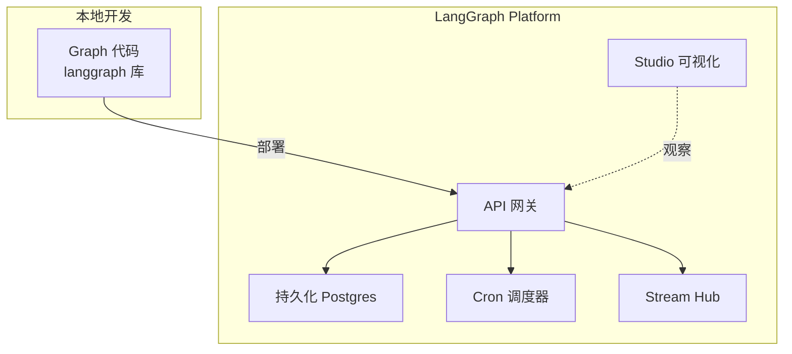
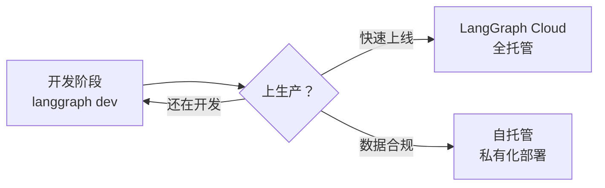
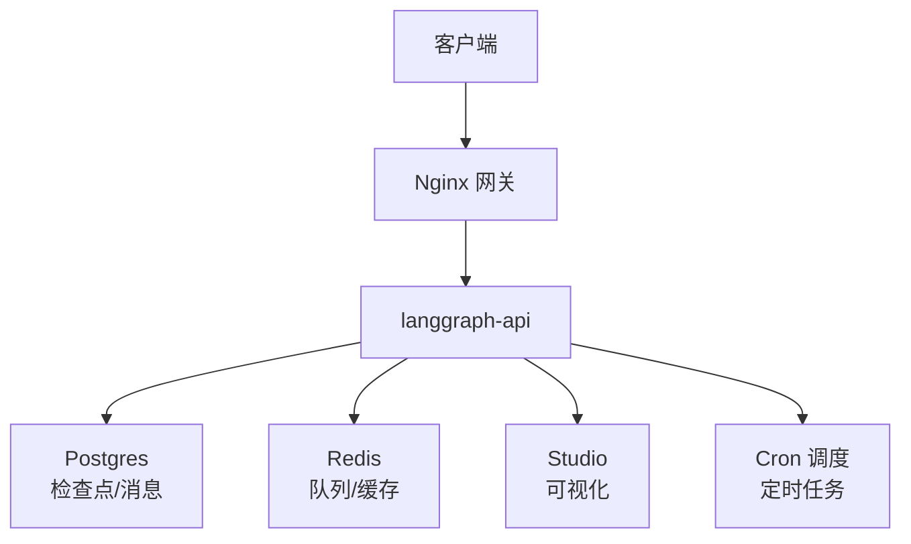

# 知识库 74 LangGraph Platform 架构全景与三种部署模式

> 定位：技术细节。讲清楚 LangGraph Platform 是什么、和本地 LangGraph 的关系、三种部署模式怎么选。配套学习课程第 78 课、附录 AI。

---

## 1. Platform 解决了什么问题

本地用 `langgraph` 库开发的 Agent 能跑，但要上生产还要解决一堆工程问题：持久化存储、并发管理、定时任务、流式输出、可观测性、API 网关。**LangGraph Platform 把这些工程能力打包成托管服务**，让你专注写 Graph 逻辑，部署运维交给平台。

| 能力 | 本地 langgraph | LangGraph Platform |
| --- | --- | --- |
| 持久化 | 自己接 checkpointer | 内置 Postgres/Redis 后端 |
| 定时任务 | 自己写 scheduler | 内置 Cron 调度 |
| 流式输出 | 自己管理 | Stream Hub 统一管理 |
| 可视化 | 无 | Studio 可视化调试 |
| API | 自己包 FastAPI | 内置 REST/WS API |
| 扩缩容 | 自己做 | 平台托管 |



---

## 2. 三种部署模式

| 模式 | 说明 | 适合 | 成本 |
| --- | --- | --- | --- |
| LangGraph Cloud | 全托管 SaaS，零运维 | 快速上线、团队小 | 按量付费 |
| 自托管（Self-hosted） | 自己部署 Platform 运行时 | 数据合规、私有化 | 自担运维 |
| 本地开发服务器 | `langgraph dev` 本地跑 | 开发调试 | 免费 |

> 选择口诀：开发用 `langgraph dev`、快速上生产用 Cloud、数据不能出墙用自托管。



---

## 3. 自托管架构详解

自托管模式的核心是 `langgraph-api` 运行时（Docker 镜像），配合 Postgres 做持久化：

| 组件 | 作用 | 必需 |
| --- | --- | --- |
| langgraph-api | 运行 Graph 的 API 服务器 | 是 |
| Postgres | 检查点/消息/运行记录持久化 | 是 |
| Redis | 任务队列与缓存 | 推荐 |
| Nginx/网关 | TLS/负载均衡 | 推荐 |
| Studio | 可视化调试前端 | 可选 |



---

## 4. 核心概念速查

| 概念 | 说明 |
| --- | --- |
| App | 一个 LangGraph 图项目，对应一个代码仓库 |
| Deployment | App 的一次部署实例 |
| Thread | 一个会话，有唯一 thread_id，状态跨轮持久化 |
| Checkpoint | Thread 在某一步的快照，支持中断恢复 |
| Run | 一次图执行（同步/异步/流式/Cron） |
| Assistant | App 下的一组配置版本，一个 App 可有多个 Assistant |

> 注意 Thread 和 Run 的区别：Thread 是"会话容器"，Run 是"一次执行"。一个 Thread 里可以有多次 Run（多轮对话），状态靠检查点累积。

---

## 5. 部署一个 App 的最小步骤

```bash
# 1. 初始化项目（生成 langgraph.json 配置）
langgraph init --path my-agent

# 2. 本地开发服务器
langgraph dev   # 自动热重载，Studio 在 localhost:1634

# 3. 构建 Docker 镜像（自托管）
langgraph build -t my-agent:latest

# 4. 运行（docker-compose 或 k8s）
docker run -p 8000:8000 \
  -e POSTGRES_URI=postgres://... \
  -e REDIS_URI=redis://... \
  my-agent:latest
```

`langgraph.json` 核心字段：

```json
{
  "dependencies": ["./pyproject.toml"],
  "graphs": {
    "agent": "./src/agent/graph.py:graph"
  },
  "env": ".env"
}
```

---

## 6. 与既有课程的衔接

- 第 19 课（生产部署）：讲的是"把 Chain 部署成 API"的基础，Platform 是它的升级版——把 Graph 连同持久化、调度、流式一起托管；
- 第 46 课（LangGraph 云平台入门）：只介绍了 Cloud 的概念，本阶段深入到三种模式的选型、自托管架构和配置细节；
- 第 65 课（生产运营收官）：讲的可观测/可靠性/安全成本，在 Platform 上都有对应内置能力。

---

## 小结

- LangGraph Platform 把持久化、调度、流式、可视化、API 网关打包成托管服务，让你专注写 Graph；
- 三种模式：Cloud（全托管）、自托管（私有化）、`langgraph dev`（开发调试）；
- 自托管核心是 langgraph-api + Postgres，Redis 和网关推荐配置；
- App/Deployment/Thread/Run/Assistant 是 Platform 的核心概念模型。

**配套**：知识库 75（持久化）、76（Cron 定时）、77（Stream Hub + Studio）、附录 AI（速查）。