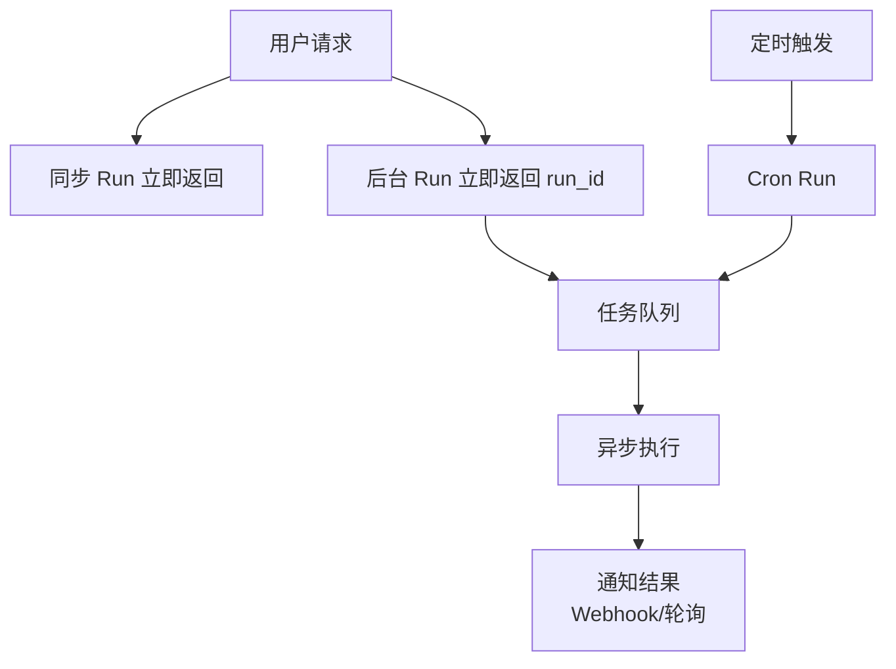
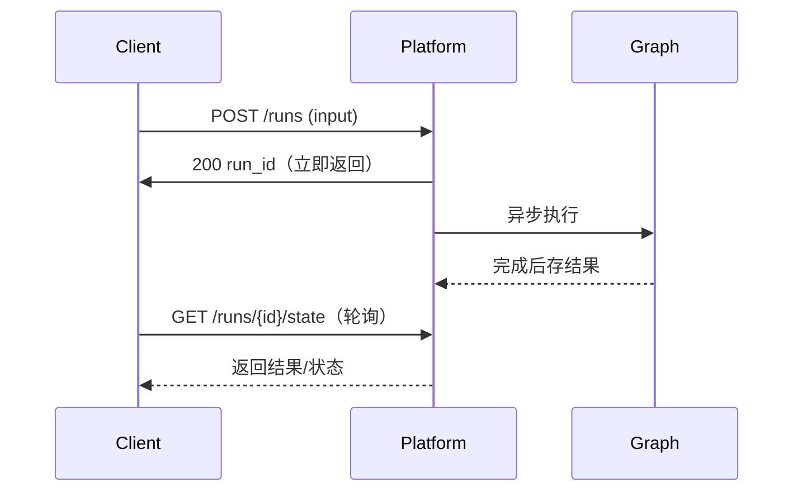
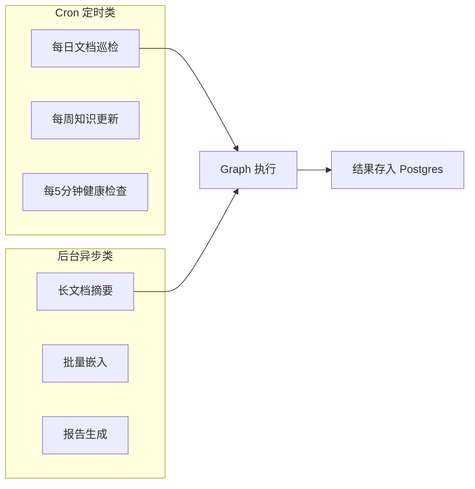
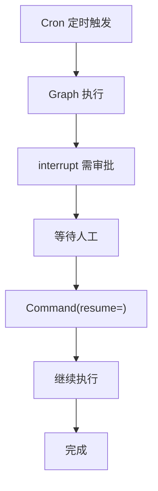

# 知识库 76 Cron 定时任务与后台异步任务实战

> 定位：技术细节。讲清楚 Platform 的 Cron 调度和后台任务（background runs）怎么用、和普通 Run 的区别、适用场景。配套学习课程第 80 课、附录 AI。

---

## 1. 为什么需要 Cron 和后台任务

普通 Run 是"用户请求→立即执行→返回结果"。但有些任务不需要等用户：

- **定时巡检**：每天凌晨扫描知识库检查过期文档；
- **批量处理**：每小时处理积压的文档队列；
- **异步长任务**：用户发起，但跑完要几分钟，不等结果先返回。

Platform 内置 Cron 调度和后台任务能力，不用自己搭 Celery/Airflow。

| 任务类型 | 触发方式 | 等不等结果 | 例子 |
| --- | --- | --- | --- |
| 同步 Run | 用户请求 | 等 | 实时问答 |
| 流式 Run | 用户请求 | 边出边等 | 实时对话 |
| 后台 Run | API 触发 | 不等 | 长文档摘要 |
| Cron Run | 定时触发 | 不等 | 每日巡检 |



---

## 2. Cron 调度配置

Cron Run 在 `langgraph.json` 里声明，Platform 会按 cron 表达式定时触发指定 Graph：

```json
{
  "graphs": {"agent": "./src/graph.py:graph"},
  "cron": {
    "schedules": [
      {
        "graph": "agent",
        "cron": "0 2 * * *",
        "input": {"task": "daily_scan"},
        "config": {"configurable": {"mode": "batch"}}
      }
    ]
  }
}
```

| 字段 | 说明 |
| --- | --- |
| graph | 要触发的 Graph 名 |
| cron | 5 段 cron 表达式（分 时 日 月 周） |
| input | 传给 Graph 的初始状态 |
| config | 运行配置（可覆盖默认） |

> 常用 cron：`0 2 * * *`（每天凌晨2点）、`*/30 * * * *`（每30分钟）、`0 0 * * 1`（每周一）。

---

## 3. 后台任务（Background Runs）

后台 Run 通过 API 触发，立即返回 run_id，不阻塞调用方：

```python
import httpx

# 触发后台任务
resp = httpx.post(
    "http://localhost:8000/threads/{thread_id}/runs",
    json={
        "assistant_id": "agent",
        "input": {"task": "summarize_long_doc", "doc_id": "123"},
        "stream_mode": None,   # 不流式，后台跑
    }
)
run_id = resp.json()["run_id"]   # 拿到 run_id 后就不管了

# 之后可查询状态
status = httpx.get(f"http://localhost:8000/threads/{thread_id}/runs/{run_id}/state")
```



---

## 4. Cron + 后台任务的典型场景

| 场景 | 触发 | Graph 做什么 |
| --- | --- | --- |
| 每日文档巡检 | Cron `0 2 * * *` | 扫描知识库，标记过期文档 |
| 每小时摘要队列 | Cron `0 * * * *` | 处理积压长文档摘要 |
| 用户发起长任务 | 后台 Run API | 摘要100页PDF，完成 webhook 通知 |
| 定期知识更新 | Cron `0 0 * * 1` | 重新嵌入全量文档 |
| 监控告警 | Cron `*/5 * * * *` | 检查 Agent 健康指标 |



---

## 5. 任务可观测性

Cron 和后台任务"不等结果"，所以可观测性更重要——你得知道它跑没跑、成没成：

| 监控点 | 怎么看 |
| --- | --- |
| Cron 是否触发 | Platform 日志 / `GET /runs?cron=true` |
| 任务是否完成 | `GET /runs/&#123;id&#125;/state` 看状态 |
| 任务失败 | 对接可观测（第 62 课）告警 |
| 执行耗时 | run 记录的 started_at / ended_at |
| 结果输出 | `GET /threads/&#123;id&#125;/state` 取最终状态 |

> 经验：Cron 任务必须有失败告警。静默失败的定时任务是生产事故的常见来源（与第 64 课可靠性工程一致）。

---

## 6. 与 HITL 的配合

Cron 和后台任务也能和 HITL 配合：定时任务跑到需要人工审批的点，用 `interrupt()` 暂停，人工处理完用 `Command(resume=)` 恢复——thread_id 跨时间保持一致，因为检查点在 Postgres 里。



---

## 小结

- Platform 内置 Cron 调度和后台任务，不用自己搭 Celery/Airflow；
- Cron 在 `langgraph.json` 声明，后台任务通过 API 触发立即返回 run_id；
- 定时巡检/批量处理/异步长任务是三大典型场景；
- Cron 任务必须有失败告警——静默失败是事故常见来源；
- Cron + HITL 可以跨时间配合，检查点在 Postgres 持久化。

**配套**：知识库 74（架构）、75（持久化）、77（Stream Hub + Studio）、附录 AI（速查）。