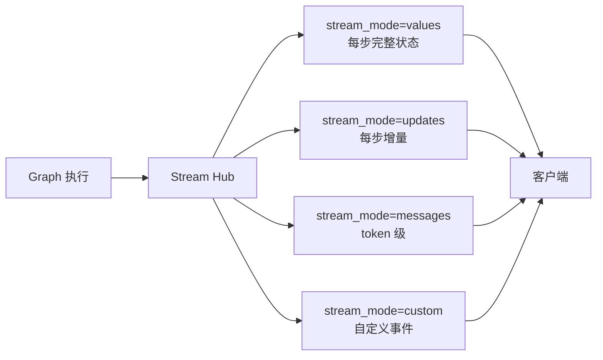
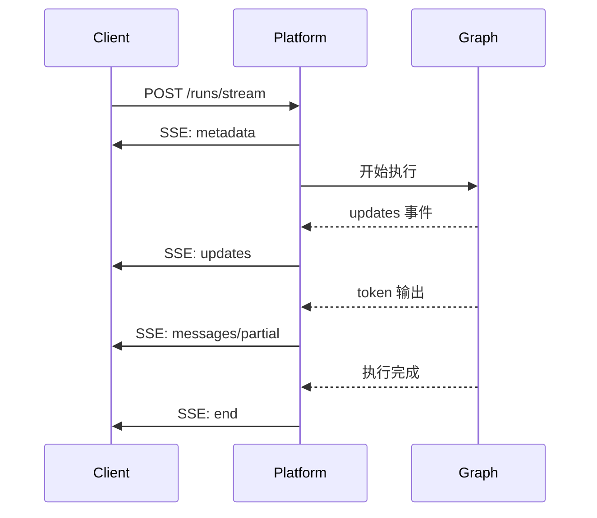
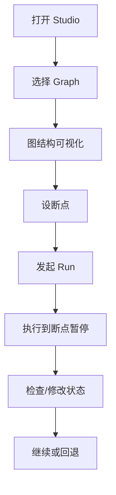
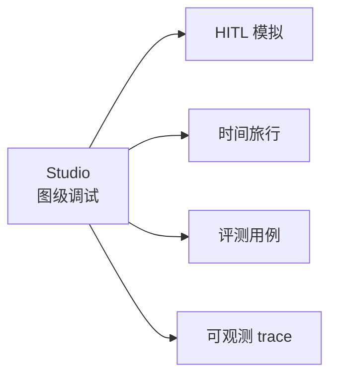

# 知识库 77 Stream Hub 实时流式与 LangGraph Studio 可视化调试

> 定位：技术细节。讲清楚 Platform 的流式输出体系和 Studio 可视化调试怎么用。配套学习课程第 81 课（收官）、附录 AI。

---

## 1. 流式输出：为什么需要 Stream Hub

用户等 Agent 回复时，"等 10 秒一次性出全文"和"边生成边看到字"体验天差地别。**Stream Hub 让 Platform 统一管理流式输出**，不管你的 Graph 内部多复杂，对外都是一条流。

| 输出方式 | 体验 | 实现复杂度 |
| --- | --- | --- |
| 同步等完 | 差（干等） | 低 |
| 流式 token | 好（边出边看） | 中 |
| 流式 + 事件 | 最好（可看中间步骤） | 高 |

Platform 内置多种 `stream_mode`，让你选择流的粒度：



---

## 2. 四种 stream_mode 对比

| stream_mode | 流什么 | 粒度 | 适合 |
| --- | --- | --- | --- |
| `values` | 每步执行后的完整状态 | 粗 | 调试看状态变化 |
| `updates` | 每步的增量变更 | 中 | 前端渐进渲染 |
| `messages` | LLM token 级输出 | 细 | 聊天打字机效果 |
| `custom` | 自定义事件（如工具调用进度） | 灵活 | 复杂前端交互 |

> 可以同时开多个 mode，用 `stream_mode=["updates","messages"]` 一次订阅多种事件。

```python
# 调用 Platform 的流式 API
import httpx

with httpx.stream(
    "POST",
    "http://localhost:8000/threads/{thread_id}/runs/stream",
    json={
        "assistant_id": "agent",
        "input": {"messages": [{"role": "user", "content": "帮我分析报告"}]},
        "stream_mode": ["updates", "messages"],
    }
) as resp:
    for line in resp.iter_lines():
        event = parse_sse(line)
        if event["event"] == "updates":
            print("状态更新:", event["data"])
        elif event["event"] == "messages/partial":
            print("打字:", event["data"]["content"], end="", flush=True)
```

---

## 3. SSE 事件格式

Platform 流式输出用 SSE（Server-Sent Events）协议，每个事件有 `event` 和 `data`：

| 事件 | 含义 |
| --- | --- |
| `metadata` | Run 元信息（run_id, thread_id） |
| `updates` | 节点状态增量 |
| `messages/complete` | 一条消息完成 |
| `messages/partial` | token 级增量 |
| `custom` | 自定义事件 |
| `end` | Run 结束 |



---

## 4. LangGraph Studio 可视化调试

Studio 是 Platform 内置的可视化工具，把你的 Graph 画成交互式状态图，支持：

| 功能 | 做什么 |
| --- | --- |
| 图结构可视化 | 看 Graph 的节点和边长什么样 |
| 断点调试 | 在任意节点设断点，执行到那就停 |
| 状态检查 | 看每步的状态值 |
| 时间旅行 | 回退到历史检查点重跑 |
| HITL 模拟 | 在断点处手动注入值继续 |
| Replay | 重放历史 Run |



> 本地 `langgraph dev` 会自动启动 Studio（默认 `localhost:1634`），开发时配合断点调试比 print 高效十倍。

---

## 5. Studio 与其他工具的协同

| 协同 | 场景 |
| --- | --- |
| Studio + HITL | 在断点处模拟人工审批（第 74-77 课） |
| Studio + 时间旅行 | 回退到某检查点重跑（第 30 课） |
| Studio + 评测 | 在 Studio 里跑评测用例看结果（第 72 课） |
| Studio + 可观测 | Studio 看图级流程，trace 看调用级细节（第 62 课） |



---

## 6. 前端集成示例

```javascript
// 前端用 EventSource 订阅 SSE 流
const es = new EventSource(
  `http://localhost:8000/threads/${threadId}/runs/stream`
);

es.addEventListener("messages/partial", (e) => {
  const data = JSON.parse(e.data);
  appendToChatBox(data.content);   // 打字机效果
});

es.addEventListener("updates", (e) => {
  const data = JSON.parse(e.data);
  updateProgress(data);            // 渐进渲染中间步骤
});

es.addEventListener("end", () => {
  es.close();
});
```

---

## 小结

- Stream Hub 统一管理流式输出，四种 mode（values/updates/messages/custom）按粒度选；
- SSE 协议传输，前端用 EventSource 订阅，可同时多 mode；
- Studio 把 Graph 可视化，支持断点/状态检查/时间旅行/HITL 模拟/Replay；
- Studio 是开发调试利器，配合 HITL、评测、可观测形成完整工具链。

**配套**：知识库 74-76（Platform 架构/持久化/Cron）、第 25 课（流式与异步）、第 30 课（时间旅行）、附录 AI（速查）。