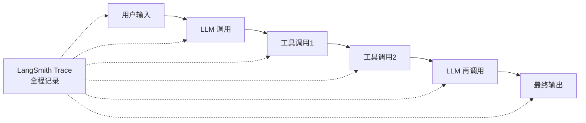
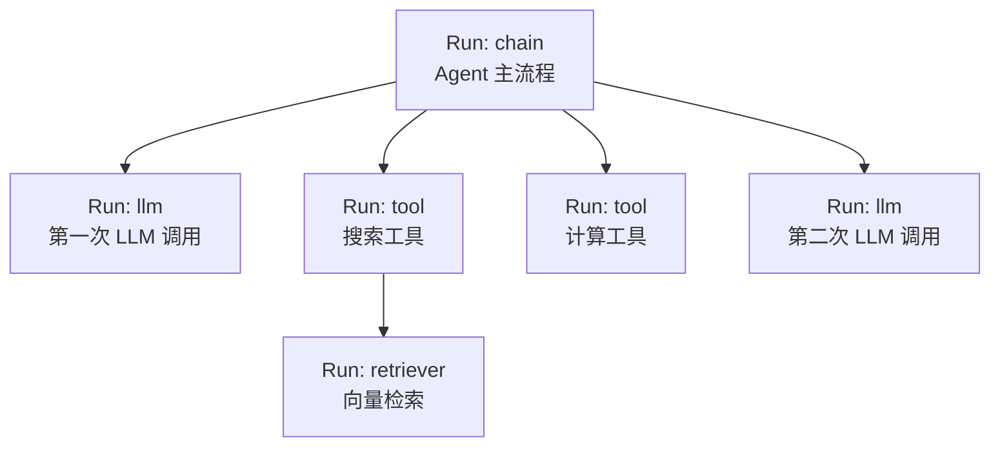
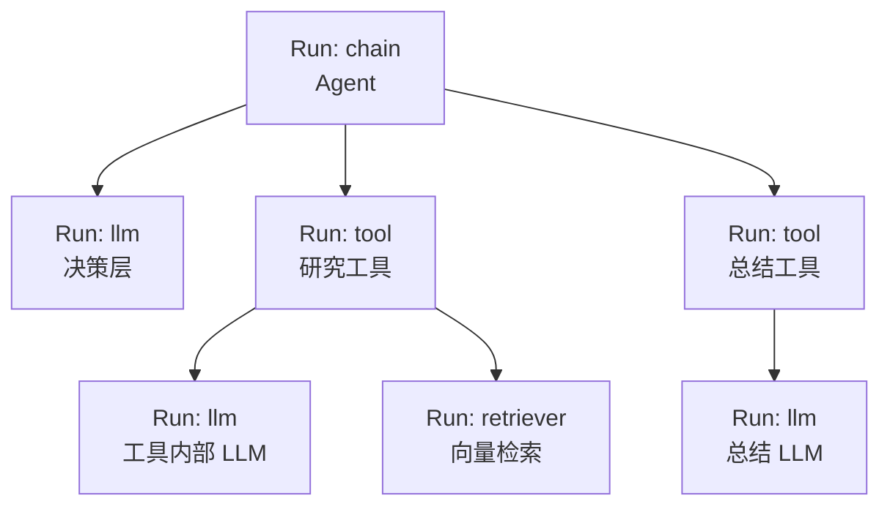

# 78. LangSmith 追踪系统深度解析

> 知识库 KB78。配套学习课程第 82-83 课。衔接第 62 课（可观测性入门）与第 79 课（CI/CD 流水线）。

---

## 1. 为什么需要追踪系统

Agent 上线后最大的问题不是"能不能跑"，而是"为什么跑出这个结果"。传统日志只能看到输入输出，看不到中间发生了什么——调了哪些工具、LLM 返回了什么、哪一步出了偏差。

LangSmith 追踪系统就是给 Agent 装上"行车记录仪"：每一步都录下来，随时回放。



---

## 2. Run Tree：追踪的核心数据结构

LangSmith 的追踪围绕 **Run** 这个概念组织。每次 LLM 调用、工具执行、链式调用都是一个 Run，Run 之间通过 parent-child 关系组成一棵树。

| 概念 | 说明 | 示例 |
| --- | --- | --- |
| Run | 一次可观测的执行单元 | 一次 `llm.invoke()` |
| run_type | Run 的类型 | `llm` / `tool` / `chain` / `embedding` / `retriever` |
| parent_run | 父 Run | Agent 的 Run 是工具 Run 的 parent |
| child_runs | 子 Run 列表 | Agent 下所有工具调用 |
| start_time / end_time | 开始/结束时间戳 | 用于算延迟 |
| inputs / outputs | 输入输出 | 用户的 prompt 和 LLM 的回复 |
| extra | 额外元数据 | token 用量、模型名、温度等 |



> 这棵树就是你在 LangSmith UI 上看到的 trace 视图——展开每个节点可以看到输入、输出、耗时、token 数。

---

## 3. Run 的类型体系

LangSmith 定义了 5 种 run_type，对应不同环节：

| run_type | 含义 | 追踪什么 |
| --- | --- | --- |
| `llm` | LLM 调用 | prompt、completion、token、模型名 |
| `chain` | 链/Agent 执行 | 编排流程、子 Run |
| `tool` | 工具执行 | 工具名、输入参数、返回值 |
| `embedding` | Embedding 调用 | 文本、向量维度 |
| `retriever` | 检索器 | 查询、召回文档列表 |

> 关键：不是每个函数都会被追踪——只有通过 LangChain/LangGraph 的 `Runnable` 或 `@traceable` 装饰器注册的函数才会生成 Run。

---

## 4. @traceable 装饰器

对于自定义函数，用 `@traceable` 把普通函数变成可追踪的：

```python
from langsmith import traceable
from openai import OpenAI

client = OpenAI()

@traceable(run_type="llm")
def call_llm(prompt: str) -> str:
    response = client.chat.completions.create(
        model="gpt-4o",
        messages=[{"role": "user", "content": prompt}]
    )
    return response.choices[0].message.content

@traceable(run_type="tool")
def search_docs(query: str) -> str:
    # 你的检索逻辑
    return f"搜索结果: {query}"

@traceable(run_type="chain")
def answer_question(question: str) -> str:
    docs = search_docs(question)        # 子 Run: tool
    answer = call_llm(f"基于以下内容回答：{docs}\n问题：{question}")  # 子 Run: llm
    return answer

# 自动生成 Run Tree:
# chain(answer_question)
#   ├── tool(search_docs)
#   └── llm(call_llm)
```

---

## 5. Token 追踪与成本分析

LangSmith 在每个 `llm` 类型的 Run 中记录 token 用量：

```python
# Run 的 extra 字段示例
{
    "usage_metadata": {
        "input_tokens": 152,
        "output_tokens": 87,
        "total_tokens": 239
    },
    "model_name": "gpt-4o",
    "temperature": 0.7,
    "invocation_params": {
        "model": "gpt-4o",
        "temperature": 0.7
    }
}
```

| 指标 | 含义 | 用途 |
| --- | --- | --- |
| input_tokens | 输入 token 数 | 优化 prompt |
| output_tokens | 输出 token 数 | 控制回复长度 |
| total_tokens | 总 token 数 | 成本计算 |
| 延迟 (end-start) | 耗时 | 性能优化 |
| 错误率 | Run 报错比例 | 稳定性监控 |

---

## 6. 嵌套 Run 与深度追踪

当 Agent 调用工具、工具内部又调用 LLM 时，Run 会嵌套多层。LangSmith 的 trace 视图支持任意深度展开：



嵌套深度的管理建议：

| 场景 | 典型深度 | 注意事项 |
| --- | --- | --- |
| 简单 Chain | 2-3 层 | 无需特殊处理 |
| RAG 系统 | 3-4 层 | retriever + llm |
| 单 Agent + 工具 | 3-5 层 | 工具内部可能再调 LLM |
| 多 Agent 编排 | 5-8 层 | 深度过深时考虑拆分 |

> 经验：嵌套超过 8 层通常意味着架构需要重构——要么工具太复杂（拆成更小工具），要么 Agent 间调用链太长（减少层级）。

---

## 7. 自动追踪 vs 手动追踪

| 方式 | 怎么用 | 适合场景 |
| --- | --- | --- |
| 自动追踪 | 设置 `LANGSMITH_TRACING=true` 环境变量 | LangChain/LangGraph 原生组件 |
| @traceable | 装饰器标记自定义函数 | 自定义逻辑 |
| RunTree 手动构建 | 代码创建 RunTree 对象 | 非 LangChain 项目集成 |

环境变量配置：

```bash
# .env
LANGSMITH_TRACING=true
LANGSMITH_API_KEY=ls_在此填入你的API密钥
LANGSMITH_PROJECT=my-agent-prod
```

```python
import os
os.environ["LANGSMITH_TRACING"] = "true"
os.environ["LANGSMITH_API_KEY"] = "ls_在此填入你的API密钥"
os.environ["LANGSMITH_PROJECT"] = "my-agent-prod"
# 之后所有 LangChain/LangGraph 调用自动被追踪
```

---

## 8. 追踪数据查询 API

LangSmith 提供 SDK 查询 trace 数据：

```python
from langsmith import Client

client = Client()

# 查询某项目的 trace
runs = list(client.list_runs(
    project_name="my-agent-prod",
    run_type="chain",
    limit=10,
    order_by="-start_time"  # 按开始时间倒序
))

for run in runs:
    print(f"{run.name} | {run.status} | {run.start_time} | "
          f"{(run.end_time - run.start_time).total_seconds():.1f}s")
    # 查看子 Run
    children = list(client.list_runs(
        project_name="my-agent-prod",
        parent_run_id=run.id
    ))
    for child in children:
        print(f"  └─ {child.name} [{child.run_type}]")
```

---

## 9. 与第 62 课/第 79 课的衔接

| 既有知识 | LangSmith 追踪如何衔接 |
| --- | --- |
| 第 62 课可观测性三支柱 | Trace 是"链路追踪"支柱的核心实现 |
| 第 63 课评测门禁 | Trace 数据可导出为评测用例 |
| 第 79 课 CI/CD | CI 中跑完评测后，trace 自动上传 LangSmith |
| 第 66-69 课 MCP | MCP 工具调用也会被 trace 捕获 |

---

## 10. 常见问题

| 问题 | 原因 | 解决方案 |
| --- | --- | --- |
| Trace 没出现 | 环境变量没设 | 检查 `LANGSMITH_TRACING=true` |
| Run 不完整 | 函数异常退出 | 用 try/finally 确保 Run 正常关闭 |
| 嵌套关系丢失 | 手动构建时没设 parent | 用 @traceable 或设 parent_run_id |
| Token 用量为空 | LLM 返回不含 usage | 确保模型返回 usage 信息 |
| Trace 太大 | 输入输出太大 | 设置 `max_payload_bytes` 截断 |

---

**配套**：学习课程第 82-83 课、附录 AK（速查）、附录 AL（代码模板）。