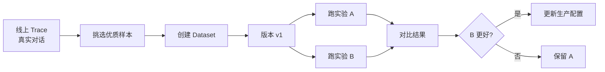
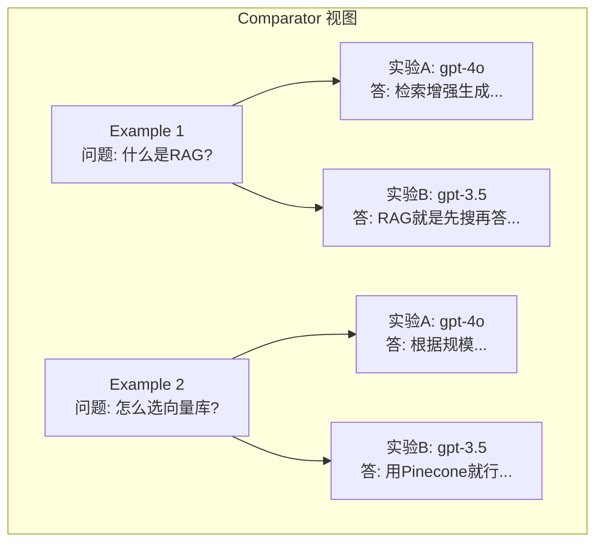

# 79. 数据集管理与实验对比

> 知识库 KB79。配套学习课程第 84 课。衔接第 59/63 课（评测门禁）与第 70 课（Agent 评测）。

---

## 1. 为什么需要数据集

第 59 课你学会了跑评测——但评测的"考卷"从哪来？如果每次临时编几道题，无法保证一致性和可比性。LangSmith 的 **Dataset** 就是把考卷固定下来、版本管理、反复跑的工具。



---

## 2. Dataset 的数据结构

一个 Dataset 由多个 **Example**（样例）组成，每个 Example 包含：

| 字段 | 类型 | 说明 |
| --- | --- | --- |
| `id` | UUID | 唯一标识 |
| `inputs` | dict | 输入（如用户问题） |
| `outputs` | dict | 期望输出（如标准答案） |
| `metadata` | dict | 附加标签（如难度、类别） |
| `dataset_id` | UUID | 所属数据集 |
| `source_run_id` | UUID | 来源 trace（如有） |

```python
from langsmith import Client

client = Client()

# 创建数据集
dataset = client.create_dataset(
    name="qa-eval-v1",
    description="问答系统评测集 v1"
)

# 添加样例
client.create_example(
    inputs={"question": "什么是 RAG?"},
    outputs={"answer": "RAG 是检索增强生成，先检索再生成。"},
    dataset_id=dataset.id,
    metadata={"category": "concept", "difficulty": "easy"}
)

client.create_example(
    inputs={"question": "怎么选向量数据库?"},
    outputs={"answer": "根据规模、延迟、成本选型，参考附录 H。"},
    dataset_id=dataset.id,
    metadata={"category": "architecture", "difficulty": "medium"}
)
```

---

## 3. 从 Trace 自动创建数据集

这是 LangSmith 最实用的功能之一——从线上真实对话中挑选有价值的样本，直接沉淀为评测数据集：

```python
# 从 trace 中挑选优质对话
runs = list(client.list_runs(
    project_name="my-agent-prod",
    run_type="chain",
    execution_type="chain",
    error=False,
    limit=50
))

# 把好的对话加入数据集
for run in runs:
    if run.outputs and len(run.outputs.get("output", "")) > 50:
        client.create_example(
            inputs=run.inputs,
            outputs=run.outputs,
            dataset_id=dataset.id,
            metadata={"source_run_id": str(run.id)}
        )
```

> 第 63 课的评测门禁用的就是 Dataset——CI/CD 跑评测时自动拉取 Dataset 中的全部样例批量执行。

---

## 4. 实验对比

LangSmith 的核心价值：对同一个 Dataset 跑多次实验，然后 **对比结果**。

```python
from langsmith import Client
from langchain_openai import ChatOpenAI

client = Client()

# 定义被测函数
def answer_with_gpt4(question: str) -> str:
    llm = ChatOpenAI(model="gpt-4o")
    return llm.invoke(question).content

def answer_with_gpt35(question: str) -> str:
    llm = ChatOpenAI(model="gpt-3.5-turbo")
    return llm.invoke(question).content

# 实验 A: GPT-4o
experiment_a = client.run_on_dataset(
    dataset_name="qa-eval-v1",
    llm_or_chain_factory=answer_with_gpt4,
    experiment_name="exp-gpt4o",
    evaluation_name="correctness",
)

# 实验 B: GPT-3.5
experiment_b = client.run_on_dataset(
    dataset_name="qa-eval-v1",
    llm_or_chain_factory=answer_with_gpt35,
    experiment_name="exp-gpt35",
    evaluation_name="correctness",
)
```

---

## 5. 评估器

评估器决定实验结果怎么打分。LangSmith 支持多种评估方式：

| 评估器 | 原理 | 适用场景 |
| --- | --- | --- |
| `LLMEvalString` | LLM 判断输出是否正确 | 开放式问答 |
| `EmbeddingDistance` | 向量相似度 | 语义近似 |
| `StringDistance` | 字符串编辑距离 | 精确匹配 |
| `RunEvalConfig` | 自定义函数 | 特定业务规则 |

```python
# 自定义评估器
from langsmith.evaluation import RunEvaluator

class KeywordHitEvaluator(RunEvaluator):
    def evaluate(self, run, example):
        output = run.outputs.get("output", "")
        expected_keywords = example.outputs.get("keywords", [])
        hits = sum(1 for kw in expected_keywords if kw in output)
        score = hits / len(expected_keywords) if expected_keywords else 0
        return {
            "key": "keyword_hit",
            "score": score,
            "comment": f"命中 {hits}/{len(expected_keywords)} 关键词"
        }

# 在实验中使用
experiment = client.run_on_dataset(
    dataset_name="qa-eval-v1",
    llm_or_chain_factory=answer_with_gpt4,
    evaluation=RunEvalConfig(
        custom_evaluators=[KeywordHitEvaluator()]
    ),
    experiment_name="exp-gpt4o-keywords"
)
```

---

## 6. Comparator：实验对比视图

在 LangSmith UI 上，Comparator 让你逐条对比两个实验的结果：



| 对比维度 | 看什么 | 决策依据 |
| --- | --- | --- |
| 正确性 | 哪个答案更准确 | 评估器分数 |
| 完整性 | 哪个覆盖更多要点 | 关键词命中率 |
| 一致性 | 哪个格式更稳定 | 格式合规率 |
| 成本 | 哪个 token 更少 | total_tokens |
| 延迟 | 哪个更快 | 端到端耗时 |

---

## 7. 回归测试

每次改代码/换模型后，对同一 Dataset 重跑实验，确保新版本不比旧版本差：

```python
# CI/CD 中的回归测试（衔接第79课）
def run_regression_test():
    """在 CI 中自动跑回归"""
    experiment = client.run_on_dataset(
        dataset_name="qa-eval-v1",
        llm_or_chain_factory=current_agent_fn,
        evaluation=RunEvalConfig(
            custom_evaluators=[KeywordHitEvaluator()]
        ),
        experiment_name=f"regression-{os.getenv('GIT_SHA', 'local')}"
    )
    
    # 获取平均分
    results = list(client.list_experiment_results(experiment.id))
    avg_score = sum(r.score for r in results) / len(results)
    
    # 与基线对比
    baseline_score = 0.75  # 上线时的基线分
    if avg_score < baseline_score:
        print(f"回归测试失败: {avg_score:.3f} < {baseline_score}")
        return False
    return True
```

---

## 8. Dataset 版本管理

| 策略 | 说明 | 何时用 |
| --- | --- | --- |
| 固定版本 | 每次实验用同一版本 | 回归测试 |
| 增量添加 | 不改旧样例，只加新的 | 扩充覆盖面 |
| 替换版本 | 创建新版本 Dataset | 发现旧样例有误 |
| 分桶管理 | 按类别/难度分多个 Dataset | 分类评估 |

> 铁律：上线时的 Dataset 版本要锁定。后续改进用新版本，旧版保留——回溯问题时需要用当时的考卷复现。

---

## 9. 与既有课程的衔接

| 课程 | 内容 | LangSmith 如何衔接 |
| --- | --- | --- |
| 第 59 课 | 评测入门 | Dataset = 评测考卷 |
| 第 63 课 | CI/CD 门禁 | 回归测试 = CI 中跑 Dataset |
| 第 70 课 | Agent 评测 | Agent 用例 → Dataset |
| 第 79 课 | CI/CD 流水线 | 评测脚本从 Dataset 拉取样例 |

---

**配套**：学习课程第 84 课、附录 AK（速查）、附录 AL（代码模板）。