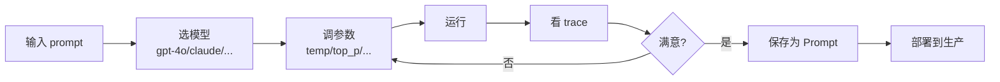
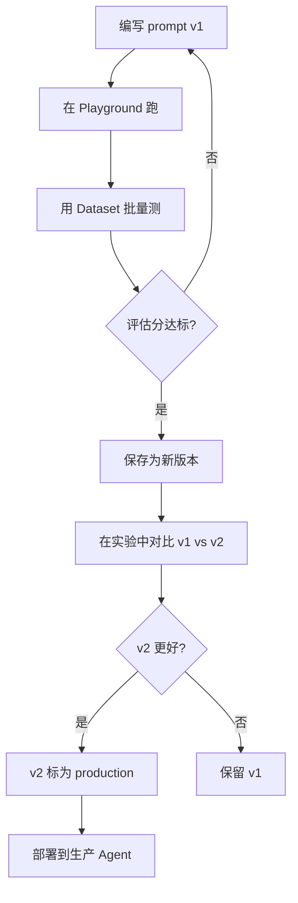
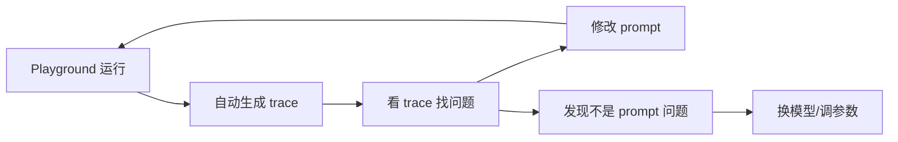

# 80. LangSmith Playground 与提示词实验

> 知识库 KB80。配套学习课程第 84 课。衔接第 7 课（提示词工程）与第 36 课（自定义模型集成）。

---

## 1. Playground 是什么

LangSmith Playground 是一个交互式实验环境：**不写代码就能调试 prompt、换模型、看 trace**。相当于 LangChain 版的"试衣间"——改参数、看效果、满意了再上线。



---

## 2. Playground 核心功能

| 功能 | 说明 | 对应课程 |
| --- | --- | --- |
| Prompt 编辑器 | 在线编写/修改 prompt | 第 7 课 |
| 模型切换 | 一键换模型对比 | 第 36 课 |
| 参数调节 | temperature、top_p、max_tokens | 第 7 课 |
| Trace 查看 | 每次运行自动生成 trace | KB78 |
| 样本测试 | 用 Dataset 批量跑 | KB79 |
| 版本管理 | prompt 修改有版本记录 | 第 7 课 |
| 团队协作 | 分享 playground 链接 | 生产协作 |

---

## 3. Prompt 版本管理

LangSmith 的 Prompt Hub 把 prompt 当代码管理：

```python
from langsmith import Client

client = Client()

# 从 Hub 拉取 prompt
prompt = client.pull_prompt("my-agent-system-prompt", label="production")
# prompt 包含 messages 模板、模型配置、参数

# 推送新版本到 Hub
client.push_prompt(
    name="my-agent-system-prompt",
    object=chat_prompt,
    description="v2: 增加了工具使用规范",
    is_public=False
)
```

| 版本管理操作 | API | 说明 |
| --- | --- | --- |
| 推送新版本 | `push_prompt` | 每次推送自动递增版本 |
| 拉取特定版本 | `pull_prompt` | label 指定 production/staging |
| 查看历史 | UI 版本列表 | 在 LangSmith 页面查看 |
| 回滚 | `pull_prompt` + 旧 label | 拉取旧版本重新推送 |

---

## 4. 提示词实验流程



---

## 5. A/B 测试：prompt 对比

在 Playground 中对同一 Dataset 跑两个版本的 prompt：

```python
from langchain_core.prompts import ChatPromptTemplate

# prompt v1
prompt_v1 = ChatPromptTemplate.from_messages([
    ("system", "你是一个助手。"),
    ("user", "{question}")
])

# prompt v2: 增加角色设定
prompt_v2 = ChatPromptTemplate.from_messages([
    ("system", "你是一个专业的技术助手，回答要简洁准确。"),
    ("user", "{question}")
])

# 实验 A
client.run_on_dataset(
    dataset_name="qa-eval-v1",
    llm_or_chain_factory=prompt_v1 | ChatOpenAI(model="gpt-4o"),
    experiment_name="prompt-v1"
)

# 实验 B
client.run_on_dataset(
    dataset_name="qa-eval-v1",
    llm_or_chain_factory=prompt_v2 | ChatOpenAI(model="gpt-4o"),
    experiment_name="prompt-v2"
)

# 在 LangSmith UI 用 Comparator 对比
```

---

## 6. 模型对比实验

同一个 prompt + Dataset，换不同模型看效果：

| 对比维度 | gpt-4o | claude-3.5 | gpt-3.5 |
| --- | --- | --- | --- |
| 正确率 | 最高 | 高 | 中 |
| 成本 | 高 | 中 | 低 |
| 延迟 | 中 | 低 | 低 |
| 中文能力 | 强 | 强 | 一般 |

```python
from langchain_openai import ChatOpenAI
from langchain_anthropic import ChatAnthropic

models = {
    "gpt-4o": ChatOpenAI(model="gpt-4o"),
    "gpt-3.5": ChatOpenAI(model="gpt-3.5-turbo"),
    "claude-3.5": ChatAnthropic(model="claude-3-5-sonnet-20241022"),
}

for name, llm in models.items():
    client.run_on_dataset(
        dataset_name="qa-eval-v1",
        llm_or_chain_factory=prompt_v2 | llm,
        experiment_name=f"model-{name}"
    )
```

---

## 7. 生产环境 Prompt 动态拉取

不把 prompt 写死在代码里，而是从 LangSmith 动态拉取——改 prompt 不用改代码、不用重新部署：

```python
import os
from langsmith import Client
from langchain_core.prompts import ChatPromptTemplate

client = Client()

def get_production_prompt() -> ChatPromptTemplate:
    """从 LangSmith 拉取生产 prompt"""
    return client.pull_prompt(
        "my-agent-system-prompt",
        label="production"  # 拉取标记为 production 的版本
    )

# Agent 启动时拉取
prompt = get_production_prompt()

# 定期刷新（支持不重启更新 prompt）
import schedule
schedule.every().hour.do(lambda: globals().__setitem__("prompt", get_production_prompt()))
```

| 方式 | 优点 | 缺点 |
| --- | --- | --- |
| 写死在代码 | 简单 | 改 prompt 要改代码+部署 |
| 环境变量 | 不用改代码 | 长 prompt 不适合 |
| LangSmith Hub | 版本管理+动态拉取 | 依赖网络 |
| 混合 | Hub 不可用时 fallback | 需要缓存逻辑 |

---

## 8. Playground 与 Trace 联动

Playground 中的每次运行都会生成 trace，你可以：

1. 在 Playground 调试 prompt
2. 发现某条回答不理想
3. 点开 trace 看中间过程
4. 定位是 prompt 问题还是模型问题
5. 修改 prompt 重试



---

## 9. 与既有课程的衔接

| 课程 | 内容 | Playground 如何衔接 |
| --- | --- | --- |
| 第 7 课 | 提示词工程 | Playground 是 prompt 调试器 |
| 第 36 课 | 自定义模型 | 在 Playground 切换模型对比 |
| 第 59 课 | 评估入门 | 用 Dataset 批量测试 prompt |
| KB78 | 追踪系统 | Playground 每次运行有 trace |
| KB79 | 数据集实验 | A/B 测试在 Dataset 上跑 |

---

**配套**：学习课程第 84 课、附录 AK（速查）、附录 AL（代码模板）。