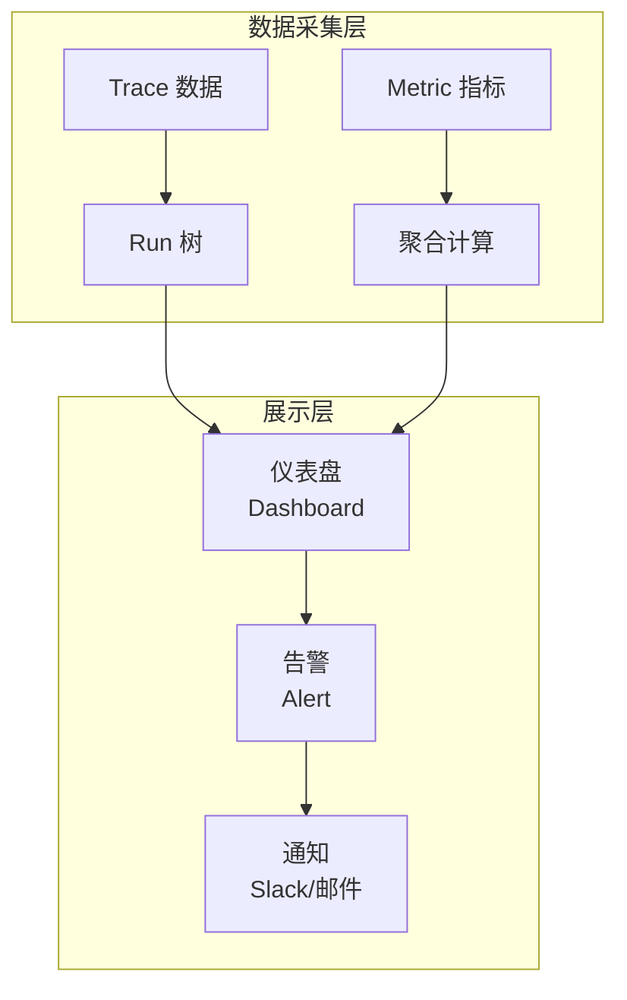
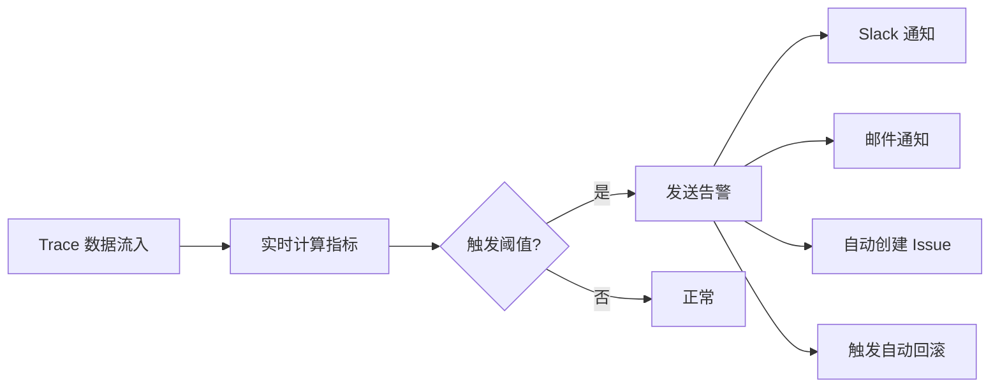
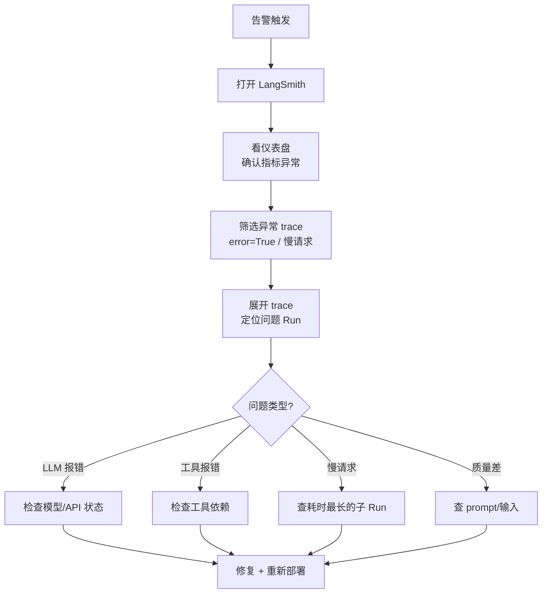

# 81. LangSmith 可观测性仪表盘与告警

> 知识库 KB81。配套学习课程第 85 课。衔接第 62 课（可观测性入门）与第 64 课（可靠性工程）。

---

## 1. 从追踪到可观测性

第 62 课讲了可观测性三支柱（指标、日志、链路追踪）。LangSmith 不仅做追踪，还把追踪数据聚合成 **指标** 和 **仪表盘**，让你看到系统整体健康度。



---

## 2. 仪表盘指标体系

| 指标分类 | 具体指标 | 含义 | 告警阈值 |
| --- | --- | --- | --- |
| 质量 | 评估分均值 | 问答正确率 | < 0.75 |
| 质量 | 幻觉率 | 编造内容比例 | > 10% |
| 性能 | P50 延迟 | 中位数响应时间 | > 5s |
| 性能 | P99 延迟 | 99 分位响应时间 | > 15s |
| 成本 | 日均 token | 每日总 token | > 预算上限 |
| 成本 | 单次成本 | 每次调用成本 | > $0.05 |
| 可靠性 | 错误率 | Run 失败比例 | > 5% |
| 可靠性 | 超时率 | 超时 Run 比例 | > 3% |
| 工具 | 工具调用成功率 | 工具执行成功/总调用 | < 90% |
| 用户 | 用户满意度 | 正反馈比例 | < 80% |

---

## 3. 自定义仪表盘

LangSmith UI 支持创建自定义仪表盘，聚合 trace 数据成可视化指标：

```python
from langsmith import Client
from datetime import datetime, timedelta

client = Client()

# 统计过去 24 小时的关键指标
end = datetime.now()
start = end - timedelta(hours=24)

runs = list(client.list_runs(
    project_name="my-agent-prod",
    start_time={"gte": start, "lte": end},
    run_type="chain"
))

# 计算指标
total = len(runs)
errors = sum(1 for r in runs if r.status == "error")
latencies = [(r.end_time - r.start_time).total_seconds() for r in runs if r.end_time]
latencies.sort()

metrics = {
    "total_runs": total,
    "error_rate": errors / total if total else 0,
    "p50_latency": latencies[len(latencies)//2] if latencies else 0,
    "p99_latency": latencies[int(len(latencies)*0.99)] if latencies else 0,
    "avg_latency": sum(latencies)/len(latencies) if latencies else 0,
}

print(f"总运行: {metrics['total_runs']}")
print(f"错误率: {metrics['error_rate']:.1%}")
print(f"P50: {metrics['p50_latency']:.1f}s")
print(f"P99: {metrics['p99_latency']:.1f}s")
```

---

## 4. 告警机制



告警脚本示例（配合 cron 定时执行）：

```python
#!/usr/bin/env python3
"""LangSmith 指标监控告警脚本"""
import os, sys, json
from datetime import datetime, timedelta
from langsmith import Client
import httpx

def check_and_alert():
    client = Client()
    end = datetime.now()
    start = end - timedelta(hours=1)
    
    runs = list(client.list_runs(
        project_name="my-agent-prod",
        start_time={"gte": start, "lte": end},
        run_type="chain"
    ))
    
    total = len(runs)
    if total == 0:
        return
    
    errors = sum(1 for r in runs if r.status == "error")
    error_rate = errors / total
    latencies = [(r.end_time - r.start_time).total_seconds() 
                 for r in runs if r.end_time]
    p99 = sorted(latencies)[int(len(latencies)*0.99)] if latencies else 0
    
    alerts = []
    if error_rate > 0.05:
        alerts.append(f"错误率 {error_rate:.1%} 超过 5%")
    if p99 > 15:
        alerts.append(f"P99 延迟 {p99:.1f}s 超过 15s")
    
    if alerts:
        msg = f"Agent 告警 ({total} runs):\n" + "\n".join(alerts)
        # 发送 Slack
        httpx.post(os.getenv("SLACK_WEBHOOK_URL"), 
                  json={"text": msg})
        print(f"ALERT: {msg}")
        sys.exit(1)
    else:
        print(f"OK: {total} runs, error_rate={error_rate:.1%}, p99={p99:.1f}s")

check_and_alert()
```

---

## 5. SLO 设定与追踪

衔接第 64 课的 SLO 概念，用 LangSmith 数据追踪 SLO 达成情况：

| SLO | 目标 | 计算方式 | 数据来源 |
| --- | --- | --- | --- |
| 可用性 | 99.5% | (1 - error_rate) × 100% | trace status |
| 延迟 | P99 < 10s | 99 分位耗时 | trace end-start |
| 质量 | 评估分 > 0.80 | 评测 Dataset 平均分 | 实验 results |
| 成本 | 日均 < $50 | token × 单价 | trace usage |

```python
# SLO 周报生成
def generate_slo_report():
    """生成 SLO 周报"""
    client = Client()
    end = datetime.now()
    start = end - timedelta(days=7)
    
    runs = list(client.list_runs(
        project_name="my-agent-prod",
        start_time={"gte": start, "lte": end}
    ))
    
    total = len(runs)
    errors = sum(1 for r in runs if r.status == "error")
    availability = (1 - errors/total) * 100 if total else 0
    
    latencies = [(r.end_time - r.start_time).total_seconds() 
                 for r in runs if r.end_time]
    latencies.sort()
    p99 = latencies[int(len(latencies)*0.99)] if latencies else 0
    
    report = f"""
    SLO 周报 ({start.date()} ~ {end.date()})
    ================================
    总运行: {total}
    可用性: {availability:.2f}% (目标 99.5%) {'达标' if availability >= 99.5 else '未达标'}
    P99 延迟: {p99:.1f}s (目标 <10s) {'达标' if p99 < 10 else '未达标'}
    """
    return report
```

---

## 6. 故障排查工作流



---

## 7. 仪表盘最佳实践

| 实践 | 说明 | 理由 |
| --- | --- | --- |
| 分层看 | 先看总指标，再下钻 | 快速定位 |
| 设基线 | 上线后先跑一周建立基线 | 没基线无法判断异常 |
| 分维度 | 按用户/工具/模型分组 | 找到细分问题 |
| 时序图 | 看趋势而非快照 | 发现退化趋势 |
| 关联 trace | 指标异常可点击到 trace | 快速排查 |

---

## 8. 与既有课程的衔接

| 课程 | 内容 | LangSmith 仪表盘如何衔接 |
| --- | --- | --- |
| 第 62 课 | 可观测性三支柱 | Trace→指标→仪表盘 = 三支柱落地 |
| 第 64 课 | SLO/熔断/故障演练 | SLO 数据从 LangSmith 取 |
| 第 65 课 | 生产运营收官 | 仪表盘 = 运营日常工具 |
| KB78 | 追踪系统 | 仪表盘 = trace 数据的聚合视图 |
| KB79 | 数据集实验 | 评估分指标 = 实验结果聚合 |

---

**配套**：学习课程第 85 课、附录 AK（速查）、附录 AL（代码模板）。