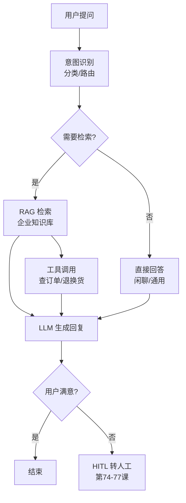
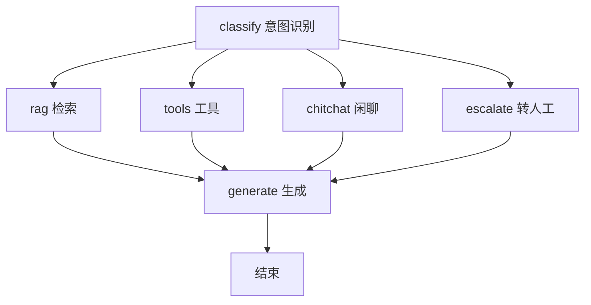

# 82. 客服 Agent 端到端项目实战

> 知识库 KB82。配套学习课程第 86-87 课。衔接第 10 课（RAG 入门）、第 20 课（LangGraph）、第 78-81 课（Platform）、第 82-85 课（LangSmith）。

---

## 1. 客服 Agent 的架构全景

客服 Agent 是 LLM 落地最常见的场景：用户提问 → Agent 理解意图 → 检索知识库/调用工具 → 生成回复 → 不满意时转人工。



---

## 2. 核心组件与技术选型

| 组件 | 技术选型 | 对应课程 |
| --- | --- | --- |
| 意图识别 | LLM 分类 / 规则路由 | 第 7 课 |
| RAG 检索 | LangGraph + 向量库 | 第 10/20 课 |
| 工具调用 | LangChain Tools | 第 12/26 课 |
| 记忆系统 | 检查点 + PostgresSaver | 第 28/75 课 |
| 人工转接 | HITL interrupt | 第 74-77 课 |
| 部署 | LangGraph Platform | 第 78-81 课 |
| 监控 | LangSmith Trace + 告警 | 第 82-85 课 |
| 评测 | Dataset + 回归测试 | 第 84 课 |

---

## 3. 意图识别与路由

客服 Agent 的第一步是理解用户想干什么：

```python
from langgraph.graph import StateGraph, MessagesState
from langchain_openai import ChatOpenAI

llm = ChatOpenAI(model="gpt-4o")

# 意图分类
INTENT_PROMPT = """判断用户意图，只返回类别名：
- faq: 常见问题（产品介绍、使用方法、政策）
- order: 订单相关（查询、退换货、物流）
- complaint: 投诉（质量问题、服务不满）
- chitchat: 闲聊（问候、闲谈）
- escalate: 要求转人工
"""

def classify_intent(state: MessagesState):
    last_msg = state["messages"][-1].content
    intent = llm.invoke(INTENT_PROMPT + "\n\n用户: " + last_msg).content.strip().lower()
    return {"intent": intent}

def route_by_intent(state: MessagesState):
    intent = state.get("intent", "chitchat")
    if intent == "faq": return "rag"
    elif intent == "order": return "tools"
    elif intent == "complaint": return "escalate"
    elif intent == "escalate": return "human"
    else: return "chitchat"
```

---

## 4. 知识库构建

客服知识库的典型来源：

| 数据来源 | 格式 | 处理方式 | 更新频率 |
| --- | --- | --- | --- |
| FAQ 文档 | Word/PDF | 第 55 课文档治理 | 月 |
| 产品手册 | PDF | 分块+向量化 | 季 |
| 帮助中心 | HTML | 爬取+清洗 | 周 |
| 历史工单 | CSV/JSON | 脱敏+分块 | 日 |
| 政策公告 | Markdown | 直接导入 | 按需 |

```python
# 客服知识库检索器
from langchain_community.vectorstores import PGVector
from langchain_openai import OpenAIEmbeddings

embeddings = OpenAIEmbeddings(model="text-embedding-3-small")
vector_store = PGVector(
    connection_string="postgresql://...",
    embedding_function=embeddings,
    collection_name="customer_service_kb"
)

def retrieve_from_kb(state: MessagesState):
    query = state["messages"][-1].content
    docs = vector_store.similarity_search(query, k=3, filter={"category": "faq"})
    return {"context": docs}
```

---

## 5. 工具集成

客服 Agent 常用工具：

```python
from langchain_core.tools import tool

@tool
def query_order(order_id: str) -> dict:
    """查询订单状态"""
    # 对接 ERP/订单系统
    return {"order_id": order_id, "status": "已发货", "eta": "明天到达"}

@tool
def create_return(order_id: str, reason: str) -> dict:
    """发起退换货申请"""
    return {"return_id": "R2024-001", "status": "已创建"}

@tool
def check_logistics(order_id: str) -> dict:
    """查询物流信息"""
    return {"carrier": "顺丰", "tracking_no": "SF1234", "status": "运输中"}

tools = [query_order, create_return, check_logistics]
llm_with_tools = llm.bind_tools(tools)
```

---

## 6. HITL 人工转接

当用户不满意或问题超出 Agent 能力时，转人工：

```python
from langgraph.types import interrupt, Command

def maybe_escalate(state: MessagesState):
    intent = state.get("intent")
    if intent == "escalate":
        # 第75课的 interrupt 机制
        human_decision = interrupt({
            "prompt": "用户要求转人工，是否转接?",
            "context": state["messages"][-3:]
        })
        if human_decision == "approve":
            return {"messages": [{"role": "assistant", 
                    "content": "正在为您转接人工客服，请稍候..."}]}
        else:
            return {"messages": [{"role": "assistant",
                    "content": "让我再尝试帮您解决..."}]}
    return {}
```

---

## 7. 完整 Graph 组装

```python
from langgraph.graph import StateGraph, MessagesState, END

builder = StateGraph(MessagesState)
builder.add_node("classify", classify_intent)
builder.add_node("rag", retrieve_from_kb)
builder.add_node("tools", agent_with_tools)
builder.add_node("chitchat", chitchat_response)
builder.add_node("escalate", maybe_escalate)
builder.add_node("generate", generate_response)

builder.set_entry_point("classify")
builder.add_conditional_edges("classify", route_by_intent, {
    "rag": "rag",
    "tools": "tools",
    "escalate": "escalate",
    "chitchat": "chitchat",
    "human": "escalate"
})
builder.add_edge("rag", "generate")
builder.add_edge("tools", "generate")
builder.add_edge("chitchat", "generate")
builder.add_edge("escalate", "generate")
builder.add_edge("generate", END)

graph = builder.compile(checkpointer=checkpointer)
```



---

## 8. 评测指标

| 指标 | 计算方式 | 目标 |
| --- | --- | --- |
| 解决率 | Agent 解决 / 总工单 | > 60% |
| 转人工率 | 转人工 / 总工单 | < 30% |
| 首次解决率 | 首次回复即解决 | > 40% |
| 平均轮次 | 用户平均对话轮数 | < 3 轮 |
| 满意度 | 用户正反馈比例 | > 85% |
| 准确率 | 回答正确 / 评测集 | > 0.80 |

---

## 9. 生产部署

```yaml
# langgraph.json
{
  "dependencies": ["./pyproject.toml"],
  "graphs": {"customer_service": "./src/cs/graph.py:graph"},
  "env": ".env"
}
```

```bash
langgraph build -t cs-agent:latest
docker-compose up -d  # Postgres + Redis + API
```

> 部署后用 LangSmith（第 82-85 课）监控 trace、用 Dataset（第 84 课）跑回归、用 HITL（第 74-77 课）处理转人工。

---

## 10. 与既有课程的衔接

| 课程 | 内容 | 客服 Agent 如何用 |
| --- | --- | --- |
| 第 7 课 | 提示词工程 | 意图识别 prompt |
| 第 10 课 | RAG 入门 | FAQ 知识库检索 |
| 第 20 课 | LangGraph | 状态图编排 |
| 第 55 课 | 文档治理 | 知识库数据管线 |
| 第 75 课 | HITL | 人工转接 |
| 第 79 课 | CI/CD | 评测门禁 |
| 第 82-85 课 | LangSmith | 监控与告警 |

---

**配套**：学习课程第 86-87 课、附录 AM（速查）、附录 AN（代码模板）。