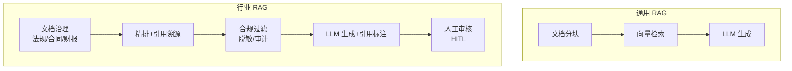

# 83. 法律金融行业 RAG 系统实战

> 知识库 KB83。配套学习课程第 88 课。衔接第 10/15/23 课（RAG）、第 44 课（合规隐私）、第 55 课（文档治理）。

---

## 1. 行业 RAG 的差异化挑战

通用 RAG 和行业 RAG 的核心区别：**准确性和合规性是底线，不是加分项**。法律答错一条法条、金融算错一个数字，后果比"答得不太好"严重得多。



---

## 2. 法律 RAG 系统

### 2.1 数据源与处理

| 数据源 | 格式 | 特点 | 处理要点 |
| --- | --- | --- | --- |
| 法律法规 | PDF/HTML | 条款编号、层级结构 | 按条款分块，保留编号 |
| 判例文书 | PDF | 长文本、格式复杂 | 按段落分块+摘要 |
| 合同模板 | Word | 结构化条款 | 按条款提取 |
| 法律评注 | Markdown | 已结构化 | 直接导入 |

```python
# 法律文档分块：按条款而非按长度
from langchain_text_splitters import RecursiveCharacterTextSplitter

legal_splitter = RecursiveCharacterTextSplitter(
    chunk_size=500,
    chunk_overlap=50,
    separators=["\n第", "\n条", "\n\n", "\n", "。", "；"],
    # 优先在"第X条"处断开
)

# 关键：每个 chunk 带上法规名+条款号
def process_legal_doc(doc_path, law_name):
    text = load_document(doc_path)
    chunks = legal_splitter.split_text(text)
    for chunk in chunks:
        chunk.metadata = {
            "law_name": law_name,
            "source": doc_path,
            "type": "legal_regulation"
        }
    return chunks
```

### 2.2 引用溯源

法律 RAG 必须标注来源——回答中的每一句话都要能追溯到具体法条：

```python
# 生成时要求标注引用
LEGAL_ANSWER_PROMPT = """基于以下法律条文回答问题。
要求：
1. 只基于提供的条文回答，不要编造
2. 每个论点后标注引用来源，格式：[来源：法规名 第X条]
3. 如果提供的条文无法回答，明确说"根据现有资料无法回答"

法律条文：
{context}

问题：{question}
"""
```

### 2.3 合规过滤

```python
# 法律建议必须加免责声明
COMPLIANCE_PROMPT = """
重要声明：本系统提供的法律信息仅供参考，不构成法律意见。
如需正式法律意见，请咨询执业律师。
"""
```

---

## 3. 金融 RAG 系统

### 3.1 数据源

| 数据源 | 格式 | 处理要点 |
| --- | --- | --- |
| 财报 | PDF | 表格提取（第 18 课多模态） |
| 研报 | PDF | 分块+摘要 |
| 公告 | HTML | 结构化提取 |
| 合同 | Word | 按条款分块 |

```python
# 金融文档表格提取
from langchain_community.document_loaders import PyPDFLoader

def extract_financial_report(pdf_path):
    loader = PyPDFLoader(pdf_path)
    pages = loader.load()
    
    # 识别财报中的表格
    tables = []
    for page in pages:
        # 用 LLM 或 OCR 提取表格
        table_data = extract_tables_from_pdf(page)
        tables.extend(table_data)
    
    return pages, tables
```

### 3.2 数值精度

金融场景中数字不能错：

```python
# 数值验证器
def validate_financial_numbers(response: str, context: str) -> bool:
    """检查回复中的数字是否来自原文"""
    import re
    # 提取回复中的所有数字
    numbers_in_response = set(re.findall(r'\d+\.?\d*', response))
    # 提取上下文中的所有数字
    numbers_in_context = set(re.findall(r'\d+\.?\d*', context))
    # 回复中的数字必须全部来自上下文
    fabricated = numbers_in_response - numbers_in_context
    if fabricated:
        print(f"警告: 回复中出现了上下文没有的数字: {fabricated}")
        return False
    return True
```

### 3.3 合规要求

| 要求 | 说明 | 实现 |
| --- | --- | --- |
| 数据脱敏 | 用户身份信息不进 LLM | 第 44 课 |
| 审计日志 | 每次查询留痕 | LangSmith trace |
| 投资建议免责 | 不直接给投资建议 | prompt 约束 |
| 实时性 | 使用最新财报 | 定期更新向量库 |

---

## 4. 精排与重排

行业 RAG 需要精排提升准确率：


```python
# 使用 Cross-Encoder 精排
from langchain.retrievers import ContextualCompressionRetriever
from langchain.retrievers.document_compressors import LLMChainExtractor

# 方法1: LLM 精排
compressor = LLMChainExtractor.from_llm(llm)
compression_retriever = ContextualCompressionRetriever(
    base_compressor=compressor,
    base_retriever=vector_store.as_retriever(search_kwargs={"k": 20})
)
# 先召回 20 条，再用 LLM 精选最相关的 5 条
docs = compression_retriever.invoke(query)
```

---

## 5. 评测指标

| 指标 | 法律 RAG | 金融 RAG |
| --- | --- | --- |
| 引用准确率 | 引用来源正确 / 总引用 | 同 |
| 幻觉率 | 编造法条比例 | 编造数据比例 |
| 拒答率 | 正确拒答 / 无法回答 | 同 |
| 覆盖率 | 能回答的问题类型 | 同 |
| 延迟 | P99 < 10s | P99 < 5s |

---

## 6. 安全合规清单

| 检查项 | 法律 | 金融 | 实现 |
| --- | --- | --- | --- |
| 免责声明 | 必须有 | 必须有 | prompt |
| 引用溯源 | 必须 | 必须 | metadata |
| 数据脱敏 | 当事人姓名 | 用户身份 | 第 44 课 |
| 审计日志 | 全量 | 全量 | LangSmith |
| 人工审核 | 复杂案件 | 投资建议 | HITL |
| 版本追溯 | 法规版本 | 财报版本 | metadata |

---

## 7. 与既有课程的衔接

| 课程 | 内容 | 行业 RAG 如何用 |
| --- | --- | --- |
| 第 10/15 课 | RAG 入门/高级 | 基础架构 |
| 第 18 课 | 多模态 | 财报表格提取 |
| 第 23 课 | RAG 架构 | 精排+重排 |
| 第 44 课 | 合规隐私 | 脱敏+审计 |
| 第 55 课 | 文档治理 | 法规/财报处理 |
| 第 75 课 | HITL | 人工审核 |
| 第 85 课 | LangSmith | trace 审计 |

---

**配套**：学习课程第 88 课、附录 AM（速查）、附录 AN（代码模板）。