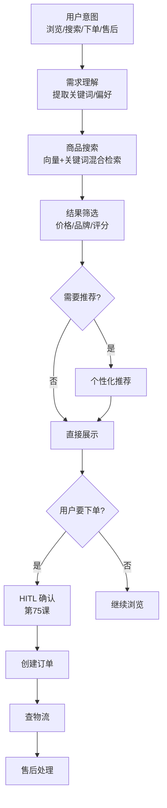
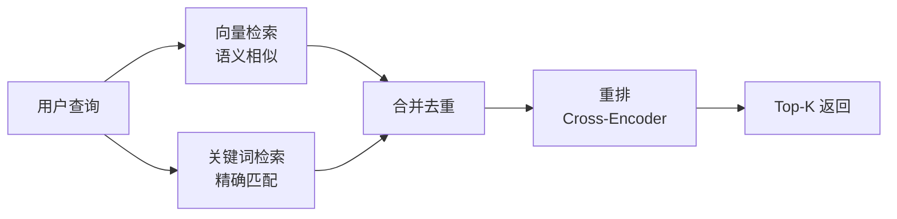

# 84. 电商购物 Agent 全流程实战

> 知识库 KB84。配套学习课程第 89 课。衔接第 12 课（工具调用）、第 20 课（LangGraph）、第 26 课（工具集成）、第 75 课（HITL）。

---

## 1. 电商 Agent 架构

购物 Agent 不只是"推荐商品"——它要理解用户需求、搜索商品、比价、加购物车、下单、查物流、处理售后，是一条完整的购物链路。



---

## 2. 核心工具集

| 工具 | 功能 | 对接系统 |
| --- | --- | --- |
| search_products | 商品搜索 | 搜索引擎/向量库 |
| get_product_detail | 商品详情 | 商品中心 |
| compare_prices | 价格比较 | 比价服务 |
| add_to_cart | 加购物车 | 购物车服务 |
| create_order | 创建订单 | 订单系统 |
| check_logistics | 查物流 | 物流系统 |
| process_return | 退换货 | 售后系统 |

```python
from langchain_core.tools import tool

@tool
def search_products(query: str, max_price: float = None, 
                    brand: str = None, top_k: int = 5) -> list:
    """搜索商品。参数：query 搜索词, max_price 最高价, brand 品牌, top_k 返回数量"""
    # 混合检索：向量 + 关键词
    results = hybrid_search(query, top_k=top_k * 2)
    # 筛选
    if max_price:
        results = [r for r in results if r["price"] <= max_price]
    if brand:
        results = [r for r in results if brand.lower() in r["brand"].lower()]
    return results[:top_k]

@tool
def create_order(product_id: str, quantity: int, 
                 address: str) -> dict:
    """创建订单（需要用户确认）"""
    # 这个工具在 HITL 确认后才执行
    order = order_system.create(
        product_id=product_id,
        quantity=quantity,
        address=address
    )
    return {"order_id": order.id, "total": order.total}

@tool
def check_logistics(order_id: str) -> dict:
    """查询物流状态"""
    return logistics_system.track(order_id)
```

---

## 3. 个性化推荐

```python
from langchain_core.prompts import ChatPromptTemplate

RECOMMEND_PROMPT = ChatPromptTemplate.from_messages([
    ("system", """你是购物推荐助手。基于用户偏好推荐商品。
    要求：
    1. 给出推荐理由
    2. 按相关度排序
    3. 如果信息不足，先问用户偏好
    """),
    ("user", "用户偏好: {preferences}\n搜索结果: {search_results}")
])

def recommend(state: dict):
    prefs = state.get("preferences", {})
    results = state.get("search_results", [])
    chain = RECOMMEND_PROMPT | llm
    response = chain.invoke({
        "preferences": json.dumps(prefs, ensure_ascii=False),
        "search_results": json.dumps(results, ensure_ascii=False)
    })
    return {"recommendation": response.content}
```

---

## 4. 混合检索

电商搜索需要同时匹配关键词和语义：

```python
# 混合检索 = 向量检索 + 关键词检索 + 重排
def hybrid_search(query: str, top_k: int = 10):
    # 向量检索（语义相似）
    vector_results = vector_store.similarity_search(query, k=top_k)
    
    # 关键词检索（精确匹配）
    keyword_results = keyword_search(query, top_k=top_k)
    
    # 合并去重
    merged = merge_and_dedup(vector_results, keyword_results)
    
    # 重排
    reranked = rerank(query, merged)
    
    return reranked[:top_k]
```



---

## 5. HITL 下单确认

下单涉及真实交易，必须人工确认：

```python
from langgraph.types import interrupt, Command

def confirm_order(state: dict):
    """下单前必须人工确认"""
    order_info = {
        "商品": state.get("selected_product"),
        "数量": state.get("quantity", 1),
        "地址": state.get("address"),
        "总价": state.get("total_price")
    }
    
    decision = interrupt({
        "prompt": "请确认订单信息",
        "order": order_info,
        "actions": ["approve", "reject", "edit"]
    })
    
    if decision == "approve":
        result = create_order.invoke({
            "product_id": state["selected_product"]["id"],
            "quantity": state["quantity"],
            "address": state["address"]
        })
        return {"order": result, "confirmed": True}
    elif decision == "edit":
        return {"need_edit": True}
    else:
        return {"cancelled": True}
```

---

## 6. 多轮对话管理

```python
from langgraph.checkpoint.memory import MemorySaver

# 多轮对话状态
class ShoppingState(MessagesState):
    intent: str           # browse/search/order/after_sale
    preferences: dict    # 用户偏好
    search_results: list  # 搜索结果
    selected_product: dict # 选中的商品
    quantity: int         # 数量
    address: str          # 地址
    order: dict           # 订单信息
    history: list         # 浏览历史

# 检查点持久化（用户可能离开后回来）
checkpointer = PostgresSaver.from_conn_string(DB_URI)
checkpointer.setup()
```

---

## 7. 评测指标

| 指标 | 目标 | 说明 |
| --- | --- | --- |
| 搜索准确率 | > 85% | 搜到的商品是否符合需求 |
| 推荐点击率 | > 30% | 推荐的商品用户是否点开 |
| 下单完成率 | > 60% | 开始下单的用户中完成的比例 |
| 售后解决率 | > 70% | Agent 自主解决的售后比例 |
| 平均对话轮次 | < 4 | 完成一次购物所需轮数 |
| 用户满意度 | > 80% | 购物后评分 |

---

## 8. 生产部署

```yaml
# 电商 Agent 部署配置
graphs:
  shopping_agent: ./src/ecommerce/graph.py:graph
env:
  - OPENAI_API_KEY=...
  - DB_URI=postgresql://...
  - ELASTICSEARCH_URL=http://...
  - ORDER_API_BASE=https://order-service...
```

---

## 9. 与既有课程的衔接

| 课程 | 内容 | 电商 Agent 如何用 |
| --- | --- | --- |
| 第 12 课 | 工具调用 | 商品/订单/物流工具 |
| 第 20 课 | LangGraph | 购物流程状态图 |
| 第 26 课 | 工具集成 | 多系统对接 |
| 第 75 课 | HITL | 下单确认 |
| 第 78-81 课 | Platform | 部署上线 |
| 第 82-85 课 | LangSmith | 监控购物流程 |

---

**配套**：学习课程第 89 课、附录 AM（速查）、附录 AN（代码模板）。