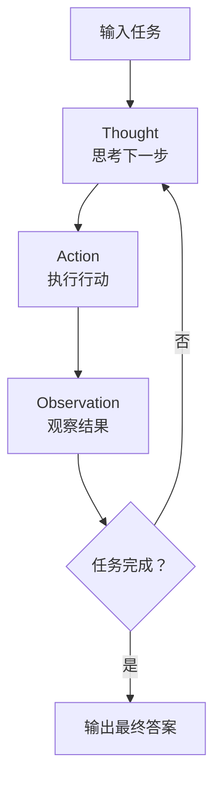
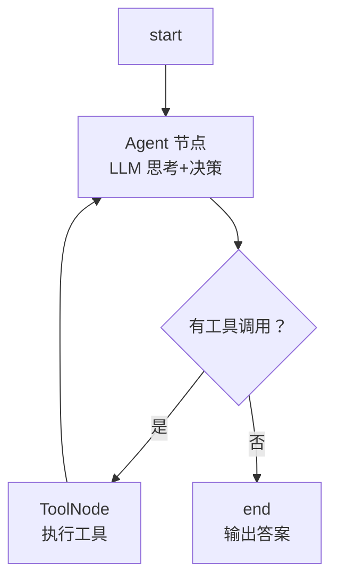

# 86 ReAct 推理行动模式深度解析

> 知识库·阶段 16·Agent 设计模式大全与实战。ReAct 是最经典的 Agent 模式——推理（Reasoning）+ 行动（Acting）循环交替，让 LLM 像人一样"想一步、做一步"。

---

## 一、ReAct 的核心思想

传统 LLM 是"一次性回答"——直接给结论。ReAct 是"分步思考+行动"：先想该做什么，再做，再看结果，再想下一步。



| 阶段 | 名称 | 作用 |
| --- | --- | --- |
| Thought | 推理 | 思考当前状态和下一步 |
| Action | 行动 | 调用工具或生成内容 |
| Observation | 观察 | 看行动的结果 |
| 循环 | 迭代 | 重复直到完成 |

---

## 二、ReAct 与传统 Chain 的区别

| 维度 | Chain | ReAct |
| --- | --- | --- |
| 流程 | 固定线性 | 动态循环 |
| 工具 | 固定顺序 | 按需选择 |
| 步骤数 | 预先确定 | 动态决定 |
| 中间结果 | 不看 | 每步观察 |
| 适用 | 简单任务 | 复杂多步任务 |

---

## 三、ReAct 的 Prompt 设计

```text
你是一个能使用工具的助手。请按以下格式回答：

Thought: 你对当前情况的思考
Action: 你要调用的工具名
Action Input: 工具的输入参数
Observation: 工具返回的结果（系统填写）

（重复上述步骤直到你确定答案）

Thought: 我现在知道了答案
Final Answer: 最终答案

可用工具：
- search: 搜索网络。输入：搜索关键词
- calculator: 计算器。输入：数学表达式
```

---

## 四、LangGraph 实现 ReAct

```python
from typing import TypedDict, Annotated
from langgraph.graph import StateGraph, END
from langgraph.prebuilt import ToolNode
from langchain_openai import ChatOpenAI
from langchain_core.tools import tool

class AgentState(TypedDict):
    messages: Annotated[list, "add_messages"]
    iteration: int

@tool
def search(query: str) -> str:
    """搜索网络获取信息"""
    return f"搜索结果：{query} 的相关信息..."

@tool
def calculator(expression: str) -> str:
    """数学计算"""
    try:
        return str(eval(expression))
    except:
        return "计算错误"

tools = [search, calculator]
llm = ChatOpenAI(model="gpt-4o").bind_tools(tools)

def agent_node(state: AgentState) -> AgentState:
    response = llm.invoke(state["messages"])
    state["messages"].append(response)
    state["iteration"] += 1
    return state

def should_continue(state: AgentState) -> str:
    last_msg = state["messages"][-1]
    if hasattr(last_msg, "tool_calls") and last_msg.tool_calls:
        return "tools"
    return END

# 构建图
g = StateGraph(AgentState)
g.add_node("agent", agent_node)
g.add_node("tools", ToolNode(tools))
g.set_entry_point("agent")
g.add_conditional_edges("agent", should_continue, {"tools": "tools", END: END})
g.add_edge("tools", "agent")
app = g.compile()
```

---

## 五、ReACT 的状态流转图



关键点：Agent 节点和 ToolNode 形成循环——每次工具执行后回到 Agent 重新思考。

---

## 六、ReAct 的优缺点

| 优点 | 说明 |
| --- | --- |
| 灵活 | 动态决定步骤和工具 |
| 可解释 | 每步有 Thought 可追踪 |
| 自纠错 | 看结果后可以换策略 |

| 缺点 | 说明 |
| --- | --- |
| 慢 | 多次 LLM 调用 |
| 可能死循环 | 需要加 max_iterations |
| 成本高 | 每轮消耗 Token |

---

## 七、ReACT 的关键参数

| 参数 | 推荐值 | 说明 |
| --- | --- | --- |
| max_iterations | 10-20 | 防止死循环 |
| max_tool_calls_per_step | 5 | 限制单步工具调用数 |
| temperature | 0 | 推理需要确定性 |
| system_prompt | 明确角色+工具列表 | 减少幻觉 |

---

## 八、与其他设计模式的衔接

| 模式 | 与 ReAct 的关系 | 衔接课程 |
| --- | --- | --- |
| Plan-and-Execute | 先规划再执行，ReAct 是边想边做 | KB87 |
| Reflection | ReAct 的 Observation 可加入自省 | KB88 |
| Multi-Agent | 多个 ReAct Agent 协作 | KB89 |

---

## 小结

- ReAct = Reasoning + Acting 循环：思考→行动→观察→重复；
- 核心 Prompt 格式：Thought/Action/Observation 循环；
- LangGraph 实现：Agent 节点 + ToolNode + 条件边循环；
- 关键控制：max_iterations 防死循环、temperature=0 保确定性。