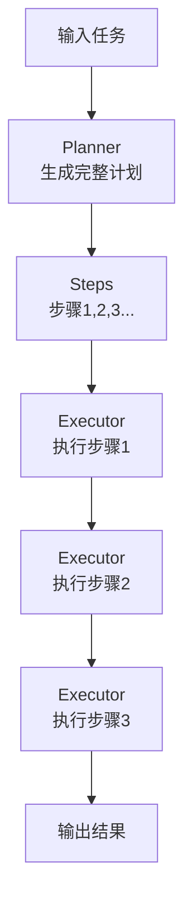
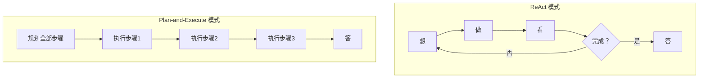

# 87 Plan-and-Execute 规划执行模式

> 知识库·阶段 16。Plan-and-Execute 把复杂任务拆成两阶段：先规划所有步骤，再逐步执行。比 ReAct 更有全局视野。

---

## 一、核心思想

ReAct 是"走一步看一步"，Plan-and-Execute 是"先画路线图再走"。



| 组件 | 职责 | 对应 ReAct |
| --- | --- | --- |
| Planner | 生成步骤列表 | 一次性 Thought |
| Executor | 逐步执行 | Action + Observation |
| Replanner | 必要时调整计划 | 无（ReAct 天然动态） |

---

## 二、Planner 的 Prompt 设计

```text
你是一个任务规划器。给定一个任务，请分解为可执行的步骤列表。

任务：帮我研究Transformer架构并写一篇总结

步骤：
1. 搜索Transformer论文的核心内容
2. 提取关键概念（Self-Attention、Multi-Head、Positional Encoding）
3. 搜索每个概念的通俗解释
4. 整合为结构化总结
5. 检查总结的完整性和准确性
```

---

## 三、LangGraph 实现

```python
from typing import TypedDict, List
from langgraph.graph import StateGraph, END
from langchain_openai import ChatOpenAI

class PlanState(TypedDict):
    task: str
    plan: List[str]
    current_step: int
    results: List[str]

llm = ChatOpenAI(model="gpt-4o", temperature=0)

def planner(state: PlanState) -> PlanState:
    prompt = f"""将以下任务分解为3-7个步骤，每步一行：
    任务：{state['task']}"""
    response = llm.invoke(prompt)
    steps = [s.strip() for s in response.content.split("\n") if s.strip() and s[0].isdigit()]
    state["plan"] = steps
    state["current_step"] = 0
    return state

def executor(state: PlanState) -> PlanState:
    step = state["plan"][state["current_step"]]
    prompt = f"执行步骤：{step}"
    response = llm.invoke(prompt)
    state["results"].append(response.content)
    state["current_step"] += 1
    return state

def should_continue(state: PlanState) -> str:
    if state["current_step"] < len(state["plan"]):
        return "execute"
    return END

g = StateGraph(PlanState)
g.add_node("plan", planner)
g.add_node("execute", executor)
g.set_entry_point("plan")
g.add_edge("plan", "execute")
g.add_conditional_edges("execute", should_continue, {"execute": "execute", END: END})
app = g.compile()
```

---

## 四、Plan-and-Execute vs ReAct



| 维度 | ReAct | Plan-and-Execute |
| --- | --- | --- |
| 全局视野 | 弱（只看当前） | 强（先看全局） |
| 灵活性 | 高（随时换策略） | 低（计划固定） |
| 速度 | 慢（多次思考） | 快（规划一次+执行） |
| 成本 | 高 | 中 |
| 适用 | 探索性任务 | 明确流程任务 |
| 错误恢复 | 天然支持 | 需要 Replanner |

---

## 五、Replanner：动态调整计划

```python
def replanner(state: PlanState) -> PlanState:
    """根据当前结果判断是否需要调整计划"""
    prompt = f"""当前任务：{state['task']}
已完成步骤：{state['current_step']}
已执行结果：{state['results']}

剩余计划：{state['plan'][state['current_step']:]}

是否需要调整剩余计划？如果需要，给出新计划。"""
    response = llm.invoke(prompt)
    if "调整" in response.content.lower():
        new_steps = [s.strip() for s in response.content.split("\n") if s.strip()]
        state["plan"] = state["plan"][:state["current_step"]] + new_steps
    return state
```

---

## 六、适用场景

| 场景 | 适合度 | 原因 |
| --- | --- | --- |
| 研究报告 | 高 | 多步骤可规划 |
| 代码生成 | 高 | 设计→编码→测试 |
| 数据分析 | 高 | 取数→清洗→分析→可视化 |
| 客服问答 | 低 | 难以预先规划 |
| 随机探索 | 低 | 步骤不确定 |

---

## 小结

- Plan-and-Execute = 先规划全部步骤再逐步执行；
- 比 ReAct 更有全局视野，但灵活性更低；
- 关键组件：Planner（规划）+ Executor（执行）+ Replanner（动态调整）；
- 适合流程明确的复杂任务，不适合探索性任务。