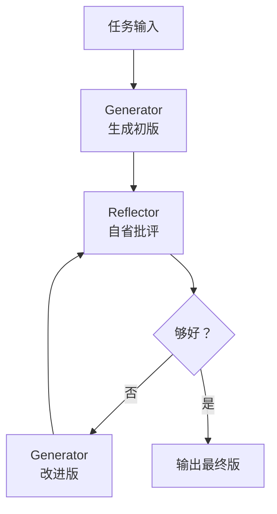
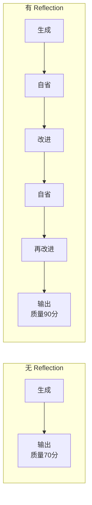

# 88 Reflection 自省纠错模式

> 知识库·阶段 16。Reflection 让 Agent "自我审视"——做完后回头看哪里不好，再改进。这是让 Agent 从"能用"到"好用"的关键模式。

---

## 一、核心思想



| 组件 | 职责 | 类比 |
| --- | --- | --- |
| Generator | 生成回答 | 写作业的学生 |
| Reflector | 批评改进 | 批改的老师 |
| 循环 | 迭代改进 | 改到满意为止 |

---

## 二、Reflection vs ReAct

| 维度 | ReAct | Reflection |
| --- | --- | --- |
| 循环内容 | 思考→行动→观察 | 生成→自省→重做 |
| 关注点 | 外部工具结果 | 内部质量提升 |
| 适用 | 信息获取类任务 | 创作/生成类任务 |
| LLM 调用 | 每轮调工具 | 每轮自我批评 |

---

## 三、Reflector 的 Prompt 设计

```text
你是一个严格的审稿人。请审视以下回答，找出问题：

原始问题：{question}
当前回答：{answer}

请从以下维度批评：
1. 准确性：事实是否正确？
2. 完整性：是否遗漏关键信息？
3. 清晰度：表达是否清楚？
4. 相关性：是否回答了问题？

批评结果：
（列出具体问题）

改进建议：
（给出具体改进方向）
```

---

## 四、LangGraph 实现

```python
from typing import TypedDict
from langgraph.graph import StateGraph, END
from langchain_openai import ChatOpenAI

class ReflectState(TypedDict):
    question: str
    answer: str
    critique: str
    iteration: int
    max_iter: int

llm = ChatOpenAI(model="gpt-4o", temperature=0)

def generator(state: ReflectState) -> ReflectState:
    if state["iteration"] == 0:
        prompt = f"请回答以下问题：{state['question']}"
    else:
        prompt = f"""问题：{state['question']}
你上一版回答：{state['answer']}
批评意见：{state['critique']}
请根据批评意见改进回答。"""
    
    response = llm.invoke(prompt)
    state["answer"] = response.content
    return state

def reflector(state: ReflectState) -> ReflectState:
    prompt = f"""你是一个严格的审稿人。审视以下回答：

问题：{state['question']}
回答：{state['answer']}

找出问题并给出改进建议。"""
    response = llm.invoke(prompt)
    state["critique"] = response.content
    state["iteration"] += 1
    return state

def should_continue(state: ReflectState) -> str:
    if "没有问题" in state["critique"] or state["iteration"] >= state["max_iter"]:
        return END
    return "regenerate"

g = StateGraph(ReflectState)
g.add_node("generate", generator)
g.add_node("reflect", reflector)
g.set_entry_point("generate")
g.add_edge("generate", "reflect")
g.add_conditional_edges("reflect", should_continue, {"regenerate": "generate", END: END})
app = g.compile()
```

---

## 五、Reflection 的质量提升效果



| 迭代次数 | 质量提升 | 成本倍数 |
| --- | --- | --- |
| 0（无自省） | 基准 | 1x |
| 1 轮自省 | +10-15% | 3x |
| 2 轮自省 | +15-20% | 5x |
| 3 轮自省 | +20-25% | 7x |

> 3 轮后边际收益递减，通常 1-2 轮最优。

---

## 六、与其他模式组合

| 组合 | 效果 | 适用场景 |
| --- | --- | --- |
| ReAct + Reflection | 行动后自省 | 复杂研究任务 |
| Plan-Execute + Reflection | 执行后检查 | 代码生成 |
| Multi-Agent + Reflection | 多角色互审 | 团队协作场景 |

---

## 七、Reflector 的高级设计

### 多维度评审

```python
DIMENSIONS = {
    "accuracy": "事实是否准确？",
    "completeness": "信息是否完整？",
    "clarity": "表达是否清晰？",
    "relevance": "是否切题？",
    "safety": "是否安全合规？",
}

def multi_dimension_reflect(state):
    critiques = {}
    for dim, question in DIMENSIONS.items():
        prompt = f"{question}\n回答：{state['answer']}"
        critiques[dim] = llm.invoke(prompt).content
    state["critique"] = str(critiques)
    return state
```

### LLM-as-Judge

```python
def llm_as_judge(answer, reference=None):
    """用 LLM 做评审"""
    prompt = f"""请给以下回答打分（1-10）：
回答：{answer}
参考答案：{reference or '无'}

评分维度：准确性、完整性、清晰度。
给出总分和改进建议。"""
    return llm.invoke(prompt).content
```

---

## 小结

- Reflection = 生成→自省→重做的迭代改进循环；
- 核心组件：Generator（生成）+ Reflector（批评）+ 循环控制；
- 1-2 轮自省性价比最高，3 轮后边际递减；
- 可与 ReAct、Plan-Execute、Multi-Agent 组合使用。