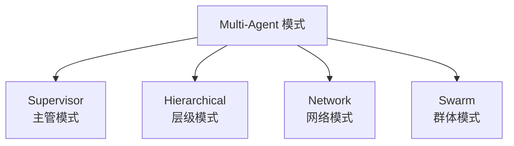
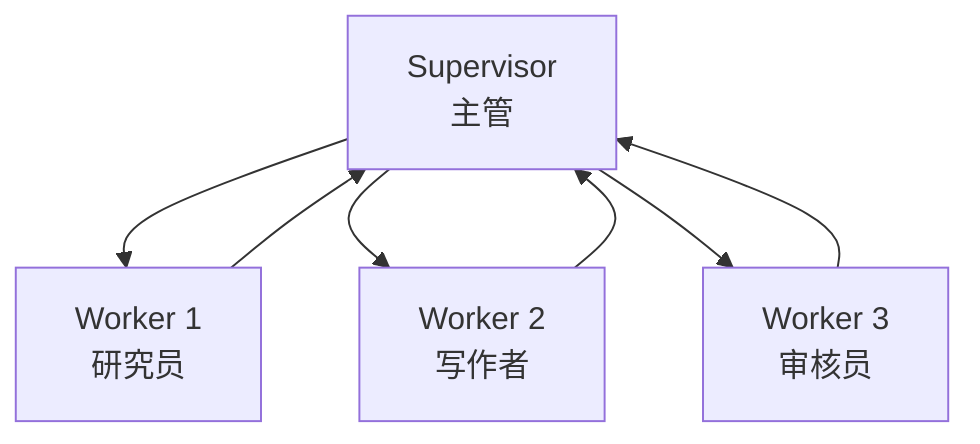
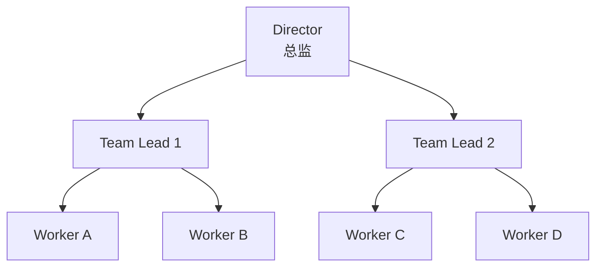
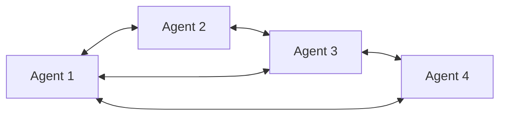
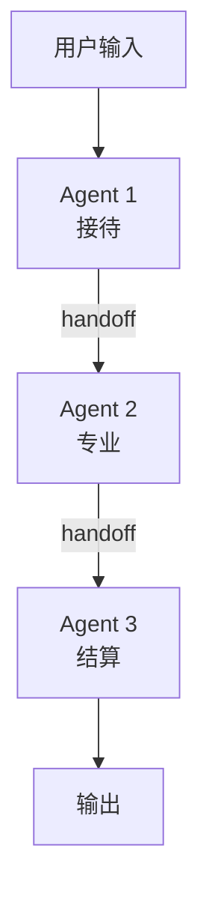
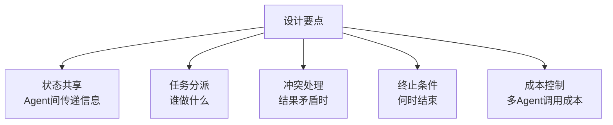

# 89 Multi-Agent 协作模式大全

> 知识库·阶段 16。Multi-Agent 让多个 Agent 像团队一样协作——分工、协调、审核。这是最复杂也最强大的 Agent 模式。

---

## 一、四种 Multi-Agent 协作模式



| 模式 | 结构 | 协调方式 | 适用 |
| --- | --- | --- | --- |
| Supervisor | 1 主管 + N 工人 | 主管分发 | 明确分工 |
| Hierarchical | 树状层级 | 上级分派 | 大型项目 |
| Network | 网状互联 | 直接通信 | 复杂协作 |
| Swarm | 动态交接 | Handoff | 灵活流转 |

---

## 二、Supervisor 主管模式



```python
from typing import TypedDict, Literal
from langgraph.graph import StateGraph, END

class TeamState(TypedDict):
    task: str
    next_worker: str
    research: str
    draft: str
    review: str

def supervisor(state: TeamState) -> TeamState:
    """主管决定下一步派给谁"""
    if not state.get("research"):
        state["next_worker"] = "researcher"
    elif not state.get("draft"):
        state["next_worker"] = "writer"
    elif not state.get("review"):
        state["next_worker"] = "reviewer"
    else:
        state["next_worker"] = "done"
    return state

def researcher(state: TeamState) -> TeamState:
    state["research"] = f"研究完成：{state['task']}"
    return state

def writer(state: TeamState) -> TeamState:
    state["draft"] = f"写作完成：基于{state['research']}"
    return state

def reviewer(state: TeamState) -> TeamState:
    state["review"] = "审核通过"
    return state

def route(state: TeamState) -> str:
    w = state["next_worker"]
    if w == "done":
        return END
    return w

g = StateGraph(TeamState)
g.add_node("supervisor", supervisor)
g.add_node("researcher", researcher)
g.add_node("writer", writer)
g.add_node("reviewer", reviewer)
g.set_entry_point("supervisor")
g.add_conditional_edges("supervisor", route, {
    "researcher": "researcher",
    "writer": "writer",
    "reviewer": "reviewer",
    END: END,
})
for w in ["researcher", "writer", "reviewer"]:
    g.add_edge(w, "supervisor")
app = g.compile()
```

---

## 三、Hierarchical 层级模式



适用：大型项目需要多级分工。总监→组长→组员。

---

## 四、Network 网络模式



适用：Agent 之间需要直接通信，无固定层级。

---

## 五、Swarm 群体模式



```python
from langgraph.graph import StateGraph, END

def agent_1(state):
    """接待Agent——判断是否需要转交"""
    if state["query"] 涉及专业问题:
        return {"handoff_to": "agent_2"}
    return {"answer": "已接待处理"}

def agent_2(state):
    """专业Agent——处理专业问题"""
    if state["query"] 涉及结算:
        return {"handoff_to": "agent_3"}
    return {"answer": "专业问题已处理"}

def agent_3(state):
    """结算Agent"""
    return {"answer": "已结算完成"}

def route(state) -> str:
    if "handoff_to" in state:
        return state["handoff_to"]
    return END
```

---

## 六、模式对比与选型

| 维度 | Supervisor | Hierarchical | Network | Swarm |
| --- | --- | --- | --- | --- |
| 复杂度 | 中 | 高 | 极高 | 中 |
| 协调 | 中心化 | 层级化 | 去中心化 | 动态交接 |
| 扩展性 | 中 | 好 | 好 | 好 |
| 可控性 | 高 | 高 | 低 | 中 |
| 适用规模 | 3-5 Agent | 5-20 Agent | 3-10 Agent | 2-5 Agent |

---

## 七、Multi-Agent 的关键设计点



| 设计点 | 方案 | 注意事项 |
| --- | --- | --- |
| 状态共享 | 共享 State | 避免状态污染 |
| 任务分派 | Supervisor 路由 | 明确分工边界 |
| 冲突处理 | 投票/仲裁 | 避免死锁 |
| 终止条件 | 任务完成/超时 | 加 max_iterations |
| 成本控制 | 小模型+大模型混用 | 避免全用大模型 |

---

## 八、常见反模式

| 反模式 | 问题 | 正确做法 |
| --- | --- | --- |
| 全用大模型 | 成本暴增 | 简单任务用小模型 |
| 无终止条件 | 可能死循环 | 加 max_iterations |
| Agent 职责重叠 | 互相干扰 | 明确分工边界 |
| 无状态隔离 | 状态污染 | 每个 Agent 独立输出 |
| 过度设计 | 简单任务用 Multi-Agent | 先试单 Agent |

---

## 小结

- 四种 Multi-Agent 模式：Supervisor、Hierarchical、Network、Swarm；
- Supervisor 最常用：1 主管分发 + N 工人执行 + 回主管汇总；
- Swarm 用 Handoff 实现动态交接；
- 关键设计：状态共享、任务分派、冲突处理、终止条件、成本控制；
- 反模式：不要为简单任务过度设计 Multi-Agent。