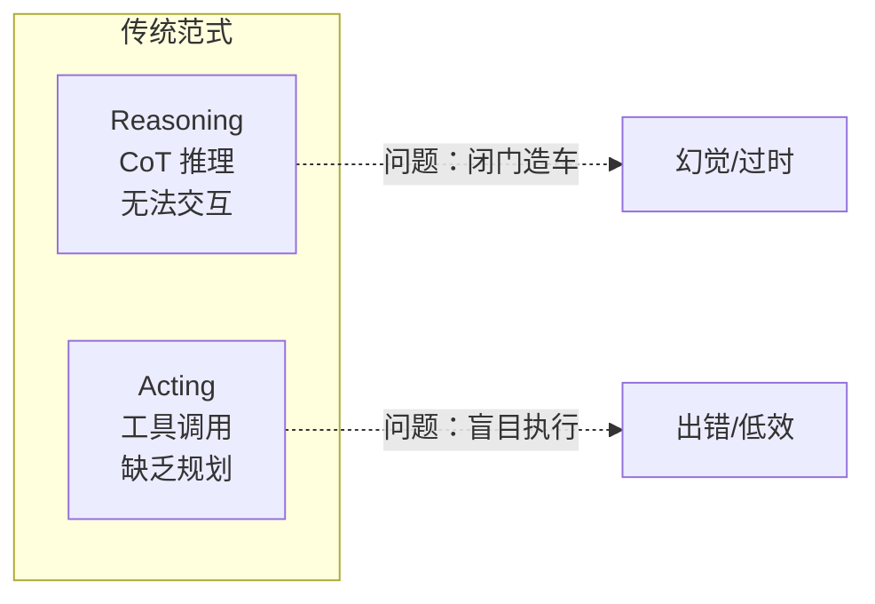
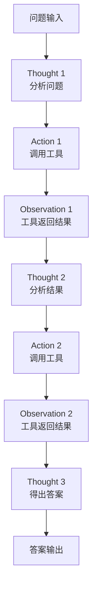
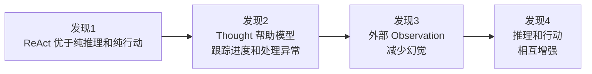
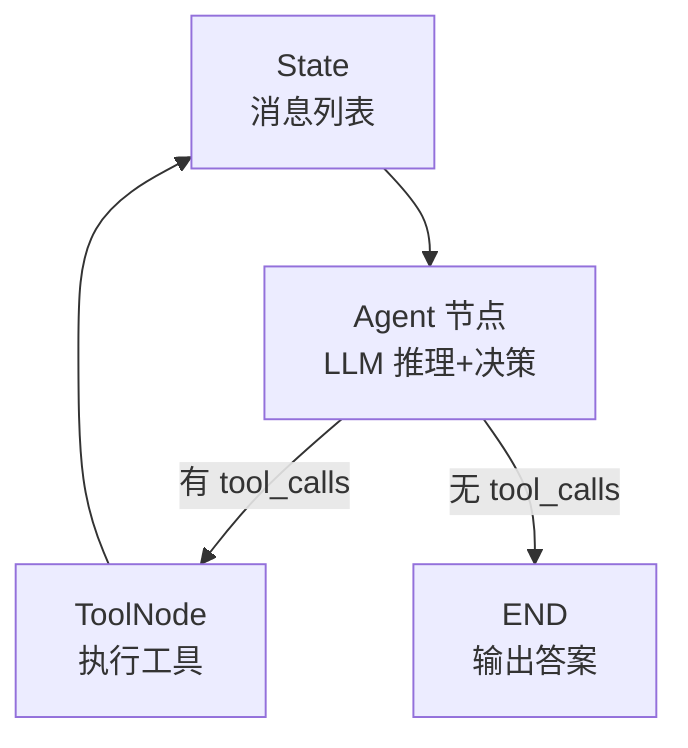
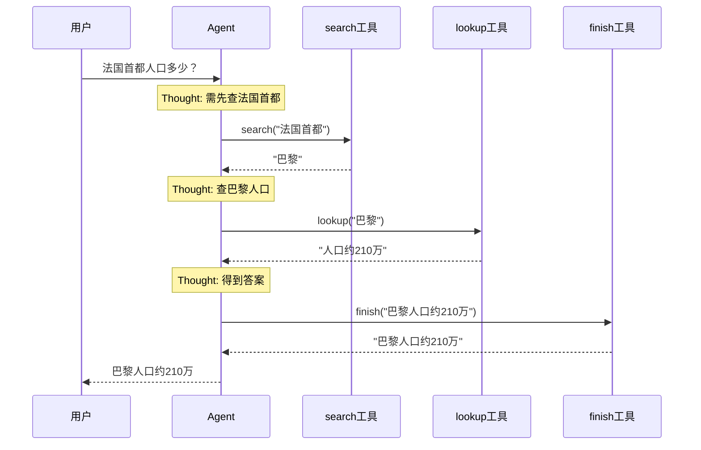
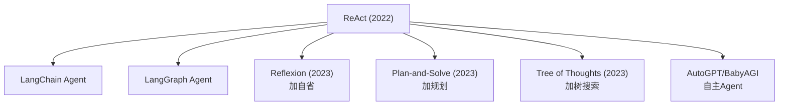

# KB90 ReAct 论文精读与代码复现

> 知识库第 90 篇。精读 ReAct 原始论文（Yao et al., 2022），并用 LangGraph 完整复现。

---

## 一、论文信息

| 项目 | 内容 |
| --- | --- |
| 标题 | ReAct: Synergizing Reasoning and Acting in Language Models |
| 作者 | Shunyu Yao, Jeffrey Zhao, Yu Su, Dian Yu, Izhak Shaer, Karthik Narasimhan |
| 发表 | 2022 年，ICLR 2023 |
| 核心贡献 | 提出推理（Reasoning）与行动（Acting）协同的 Agent 框架 |

---

## 二、核心思想

### 2.1 问题背景

传统 LLM 有两种范式：
- **推理（Reasoning）**：Chain-of-Thought 等，擅长逻辑推理但无法与外部世界交互；
- **行动（Acting）**：工具调用等，能执行操作但缺乏规划和推理能力。



### 2.2 ReAct 的解决方案

将推理和行动交织在一起：Thought → Action → Observation 循环。



### 2.3 关键设计

| 设计点 | 说明 |
| --- | --- |
| Thought 自由文本 | 模型用自然语言推理，不受格式限制 |
| Action 结构化 | 动作有明确格式（工具名 + 参数） |
| Observation 外部反馈 | 工具返回结果作为下一轮推理输入 |
| 交替进行 | 推理→行动→观察循环直到得出答案 |

---

## 三、论文实验结果

### 3.1 任务与数据集

| 任务 | 数据集 | ReAct 表现 |
| --- | --- | --- |
| 问答 | HotpotQA | 优于 CoT 和 Act-only |
| 事实验证 | FEVER | 幻觉率降低 |
| 交互决策 | ALFWorld | 超越模仿学习基线 |

### 3.2 与其他方法对比

| 方法 | HotpotQA EM | FEVER Acc | 特点 |
| --- | --- | --- | --- |
| CoT（纯推理） | 28.7 | 0.57 | 不用外部工具 |
| Act-only（纯行动） | 25.7 | 0.60 | 不推理直接调工具 |
| ReAct | **35.1** | **0.64** | 推理+行动协同 |

### 3.3 关键发现



---

## 四、LangGraph 代码复现

### 4.1 架构设计



### 4.2 完整复现代码

```python
"""
ReAct 论文复现：基于 LangGraph 的 ReAct Agent
论文：ReAct: Synergizing Reasoning and Acting in Language Models (Yao et al., 2022)
"""
from langgraph.graph import StateGraph, END
from langgraph.prebuilt import ToolNode
from langchain_openai import ChatOpenAI
from langchain_core.tools import tool
from typing import TypedDict, Annotated
from langgraph.graph.message import add_messages

# === 1. 定义工具（论文中的 Action） ===
@tool
def search(query: str) -> str:
    """搜索网络获取信息。输入搜索关键词。"""
    # 实际实现可替换为 SerpAPI/Tavily 等
    results = {
        "法国首都": "巴黎",
        "巴黎人口": "约210万",
        "法国人口": "约6700万",
    }
    return results.get(query, f"未找到'{query}'的相关信息")

@tool
def lookup(entity: str) -> str:
    """查找实体信息。输入实体名称。"""
    data = {
        "巴黎": "法国首都，人口约210万",
        "法国": "欧洲国家，首都巴黎，人口约6700万",
    }
    return data.get(entity, f"未找到'{entity}'的信息")

@tool
def finish(answer: str) -> str:
    """提交最终答案。输入答案文本。"""
    return answer

tools = [search, lookup, finish]

# === 2. 配置模型（论文中的 LLM + Few-shot Prompt） ===
llm = ChatOpenAI(model="gpt-4o", temperature=0).bind_tools(tools)

SYSTEM_PROMPT = """你是一个 ReAct Agent。请按以下步骤工作：
1. Thought：分析当前情况，决定下一步
2. Action：选择一个工具执行
3. Observation：查看工具返回的结果
4. 重复上述步骤直到得出答案
最后使用 finish 工具提交答案。"""

# === 3. 定义状态 ===
class State(TypedDict):
    messages: Annotated[list, add_messages]

# === 4. 定义 Agent 节点 ===
def agent_node(state: State):
    messages = [{"role": "system", "content": SYSTEM_PROMPT}] + state["messages"]
    response = llm.invoke(messages)
    return {"messages": [response]}

# === 5. 定义路由（论文中的控制流） ===
def should_use_tools(state: State) -> str:
    last_msg = state["messages"][-1]
    if hasattr(last_msg, "tool_calls") and last_msg.tool_calls:
        return "tools"
    return END

# === 6. 构建 LangGraph ===
graph = StateGraph(State)
graph.add_node("agent", agent_node)
graph.add_node("tools", ToolNode(tools))
graph.set_entry_point("agent")
graph.add_conditional_edges("agent", should_use_tools, {"tools": "tools", END: END})
graph.add_edge("tools", "agent")
app = graph.compile()

# === 7. 测试 ===
if __name__ == "__main__":
    question = "法国首都的人口是多少？"
    result = app.invoke({"messages": [{"role": "user", "content": question}]})
    print("最终答案:", result["messages"][-1].content)
```

### 4.3 运行轨迹示例



---

## 五、论文核心贡献总结

| 贡献 | 说明 |
| --- | --- |
| ReAct 框架 | 首次系统提出推理+行动协同的 Agent 范式 |
| Thought-Action-Observation 循环 | 成为后续 Agent 的标准结构 |
| 实验验证 | 证明推理和行动相互增强 |
| 可解释性 | Thought 链提供推理过程的可追溯性 |

---

## 六、论文影响与后续工作



ReAct 是几乎所有现代 Agent 框架的基石。

---

## 七、复现注意事项

| 注意点 | 说明 |
| --- | --- |
| Few-shot Prompt | 论文用手工 Few-shot 示例，现代可用系统提示词替代 |
| 工具定义 | 论文用文本解析 Action，现代用 function calling |
| 温度 | 推理任务 temperature=0 更稳定 |
| 循环上限 | 设 max_iterations 防死循环 |
| LangSmith | 复现时用 LangSmith Trace 观察 Thought 链 |

---

> 本篇配合第 103 课学习，论文原文：arxiv.org/abs/2210.03629