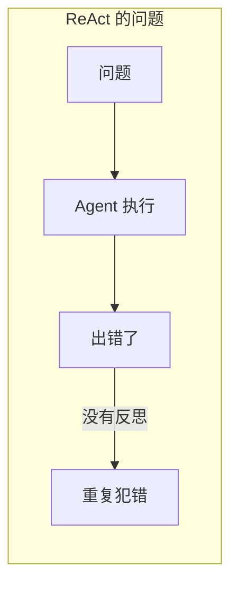
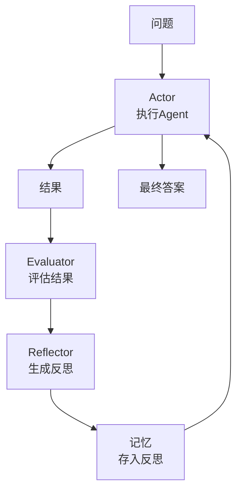
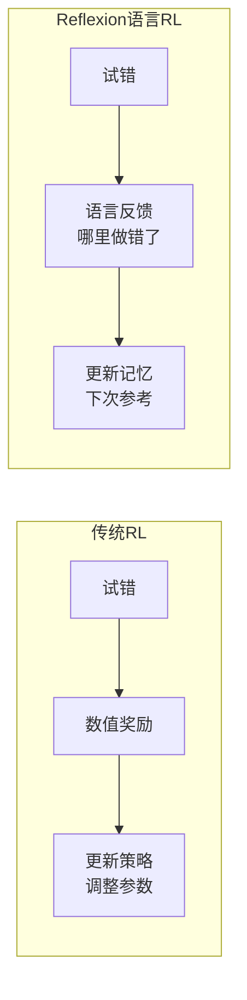
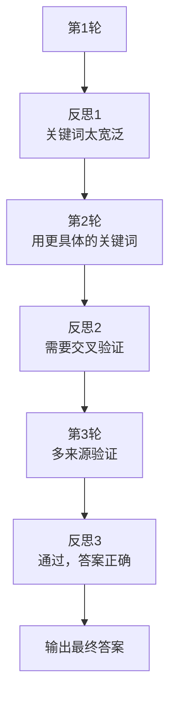
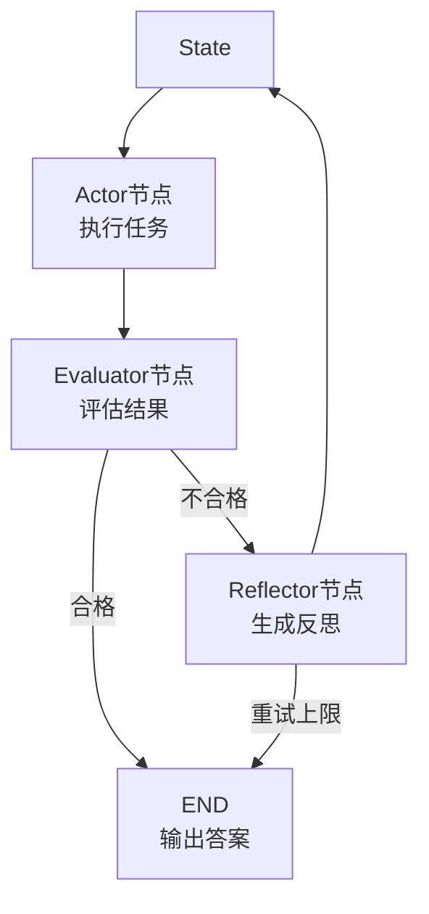
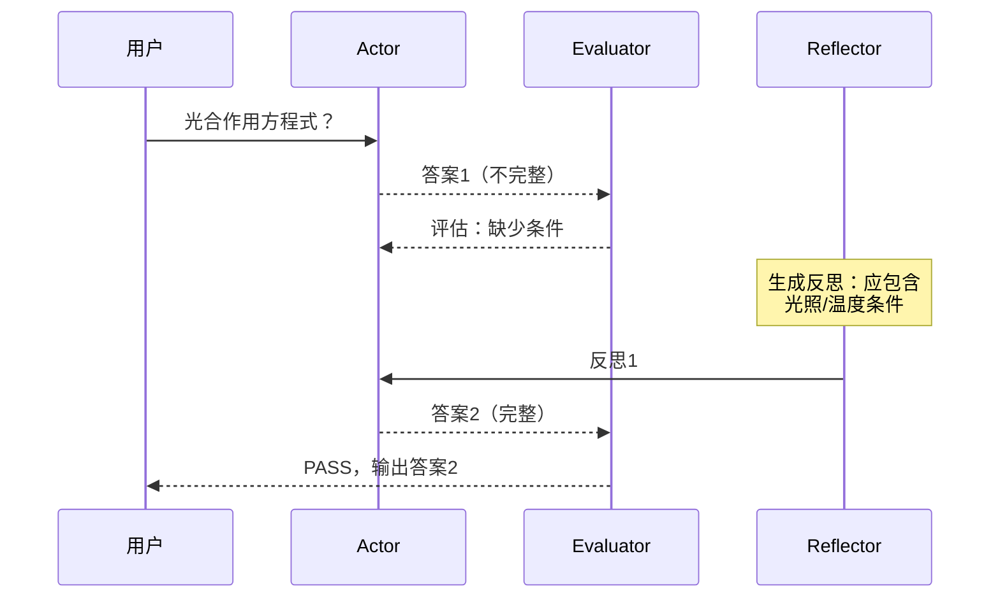
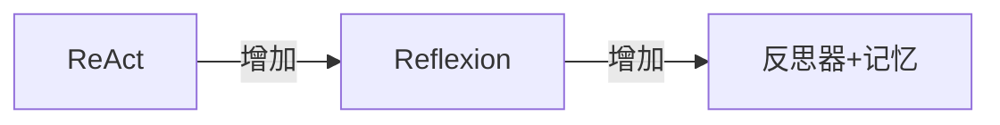

# KB91 Reflexion 论文精读与代码复现

> 知识库第 91 篇。精读 Reflexion 原始论文（Shinn et al., 2023），并用 LangGraph 完整复现。

---

## 一、论文信息

| 项目 | 内容 |
| --- | --- |
| 标题 | Reflexion: Language Agents with Verbal Reinforcement Learning through Self-Reflection |
| 作者 | Noah Shinn, Federico Cassano, Edward Berman, Ashwin Gopinath, Karthik Narasimhan |
| 发表 | 2023 年，NeurIPS 2023 |
| 核心贡献 | 提出通过语言反馈（自省）进行自我改进的 Agent 框架 |

---

## 二、核心思想

### 2.1 问题背景

ReAct 解决了推理+行动的问题，但 Agent 犯错后缺乏自我纠正机制——错了就错了，没有从错误中学习。



### 2.2 Reflexion 的解决方案

在 ReAct 基础上增加一个 **Reflector（反思器）**：执行完成后，由一个独立的 LLM 评审执行过程，生成语言反馈，存入记忆，下次执行时参考。



### 2.3 三个核心组件

| 组件 | 角色 | 说明 |
| --- | --- | --- |
| Actor | 执行者 | ReAct Agent，执行任务 |
| Evaluator | 评估者 | 判断执行结果是否正确 |
| Self-Reflector | 反思者 | 生成语言反馈（哪里做错了，怎么改进） |

---

## 三、论文核心机制

### 3.1 语言强化学习

Reflexion 的核心创新是 **"verbal reinforcement learning"（语言强化学习）**：



| 对比 | 传统 RL | Reflexion 语言 RL |
| --- | --- | --- |
| 反馈形式 | 数值奖励 | 自然语言文本 |
| 学习方式 | 调整参数 | 更新记忆 |
| 是否需要训练 | 是 | 否（纯推理时） |
| 适用场景 | 游戏/控制 | 文本/推理任务 |

### 3.2 反思记忆

反思以文本形式存储，下次执行时作为上下文注入：

```
[反思记忆]
上次执行中的问题：
1. 在搜索时用了过于宽泛的关键词，应更具体
2. 没有交叉验证多个来源的信息
3. 过早得出了结论，应多收集一轮证据
```

### 3.3 迭代改进



---

## 四、论文实验结果

### 4.1 任务与表现

| 任务 | 数据集 | 基线 | Reflexion | 提升 |
| --- | --- | --- | --- | --- |
| 编程 | HumanEval | 80.1% | 91.0% | +10.9 |
| 推理 | HotpotQA | 35.1% | 46.6% | +11.5 |
| 决策 | ALFWorld | 77.0% | 91.0% | +14.0 |

### 4.2 关键发现

| 发现 | 说明 |
| --- | --- |
| 自省有效 | 仅靠语言反馈就能显著提升 |
| 记忆累积 | 多轮反思效果递增 |
| 优于 CoT-SC | 比自洽 CoT 更高效 |
| 无需训练 | 不需要微调模型参数 |

---

## 五、LangGraph 代码复现

### 5.1 架构设计



### 5.2 完整复现代码

```python
"""
Reflexion 论文复现：基于 LangGraph 的自省 Agent
论文：Reflexion: Language Agents with Verbal Reinforcement Learning
"""
from langgraph.graph import StateGraph, END
from langchain_openai import ChatOpenAI
from typing import TypedDict, List

llm = ChatOpenAI(model="gpt-4o", temperature=0)

class State(TypedDict):
    question: str
    answer: str
    critique: str
    reflections: List[str]  # 累积的反思记忆
    retry_count: int

# === Actor：执行任务 ===
def actor(state: State):
    reflections_text = ""
    if state.get("reflections"):
        reflections_text = "\n\n过往反思（请参考改进）：\n" + "\n".join(state["reflections"])
    
    prompt = f"""认真回答以下问题{reflections_text}：
    
    问题：{state['question']}
    
    请给出详细、准确的回答。"""
    
    resp = llm.invoke(prompt)
    state["answer"] = resp.content
    return state

# === Evaluator：评估结果 ===
def evaluator(state: State):
    prompt = f"""评估以下回答是否正确且完整。

    问题：{state['question']}
    回答：{state['answer']}

    如果正确且完整，只回复"PASS"。
    如果有问题，说明具体问题。"""
    
    resp = llm.invoke(prompt)
    state["critique"] = resp.content
    state["retry_count"] = state.get("retry_count", 0) + 1
    return state

# === Reflector：生成反思 ===
def reflector(state: State):
    prompt = f"""你是一个反思器。分析以下执行中的问题并生成改进建议。

    问题：{state['question']}
    回答：{state['answer']}
    评估意见：{state['critique']}

    请生成简洁的改进建议（1-3条），帮助下次执行时改进。"""
    
    resp = llm.invoke(prompt)
    reflections = state.get("reflections", [])
    reflections.append(resp.content)
    state["reflections"] = reflections
    return state

# === 路由函数 ===
def should_retry(state: State) -> str:
    if "PASS" in state.get("critique", ""):
        return END
    if state["retry_count"] >= 3:
        return END
    return "reflector"

# === 构建 LangGraph ===
graph = StateGraph(State)
graph.add_node("actor", actor)
graph.add_node("evaluator", evaluator)
graph.add_node("reflector", reflector)
graph.set_entry_point("actor")
graph.add_edge("actor", "evaluator")
graph.add_conditional_edges("evaluator", should_retry,
    {"reflector": "reflector", END: END})
graph.add_edge("reflector", "actor")
app = graph.compile()

# === 测试 ===
if __name__ == "__main__":
    result = app.invoke({
        "question": "光合作用的总化学方程式是什么？",
        "reflections": [],
        "retry_count": 0
    })
    print("最终答案:", result["answer"])
    print(f"反思轮数: {result['retry_count']}")
    if result.get("reflections"):
        print("反思记录:", result["reflections"])
```

### 5.3 运行轨迹示例



---

## 六、与 ReAct 的关系

| 维度 | ReAct | Reflexion |
| --- | --- | --- |
| 基础 | 推理+行动循环 | 在 ReAct 之上增加自省 |
| 错误处理 | 执行中纠正 | 执行后反思+记忆 |
| 学习方式 | 无记忆累积 | 反思记忆累积 |
| 适用场景 | 工具调用 | 质量要求高的任务 |



---

## 七、论文核心贡献总结

| 贡献 | 说明 |
| --- | --- |
| 语言强化学习 | 用语言反馈替代数值奖励 |
| 反思记忆 | 将经验以文本形式累积和复用 |
| 三组件架构 | Actor + Evaluator + Reflector |
| 无需训练 | 纯推理时自我改进，不需微调 |

---

## 八、复现注意事项

| 注意点 | 说明 |
| --- | --- |
| 重试上限 | 设 retry_count 防止无限循环 |
| 反思简洁 | 反思文本不宜过长，否则上下文膨胀 |
| Evaluator 准确性 | 评估质量决定反思方向 |
| 记忆管理 | 反思过多时需摘要或裁剪 |
| LangSmith Trace | 用 Trace 观察每轮反思改进 |

---

> 本篇配合第 104 课学习，论文原文：arxiv.org/abs/2303.11366