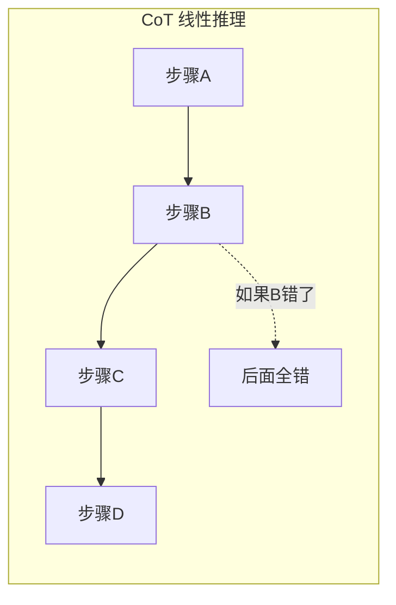
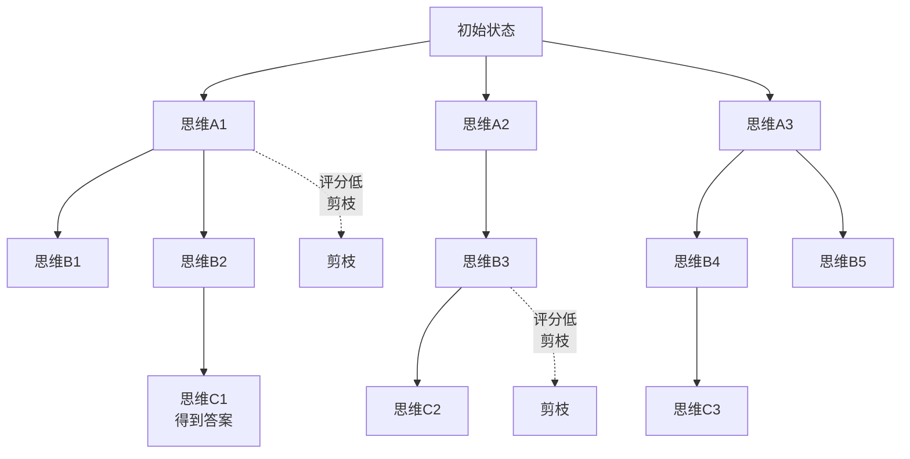
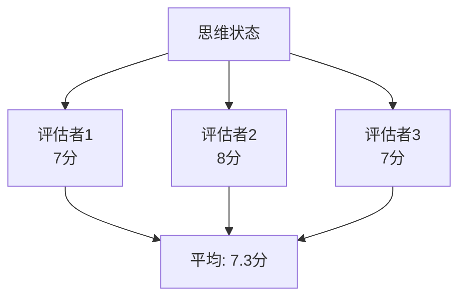
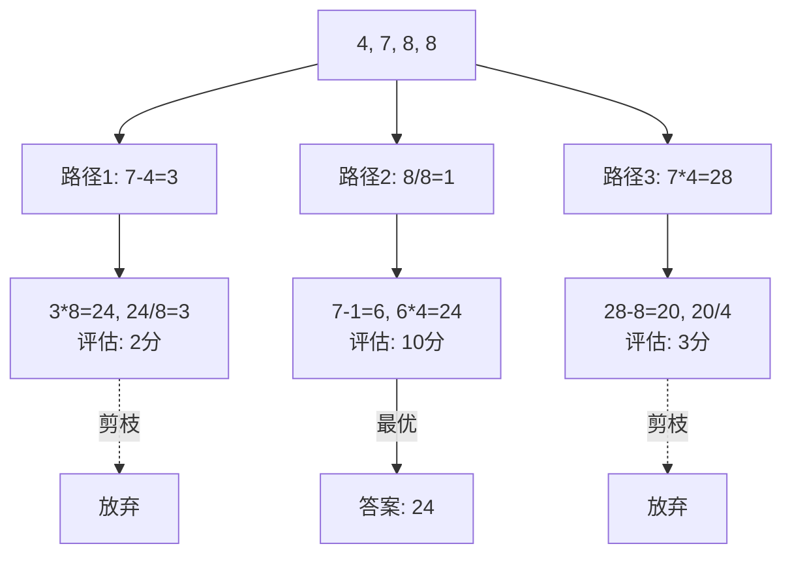
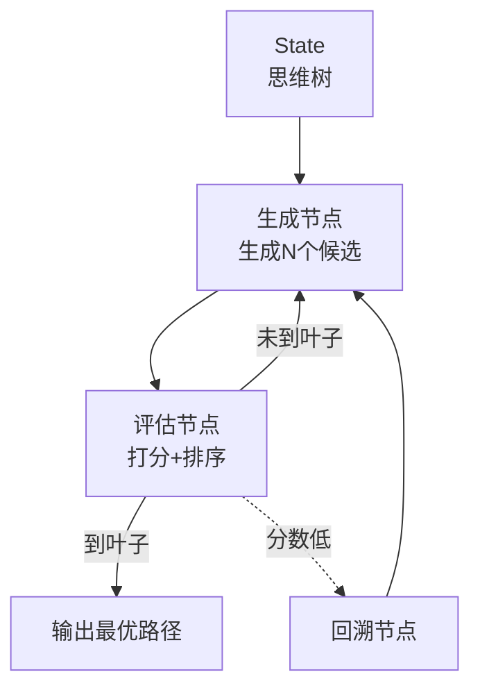
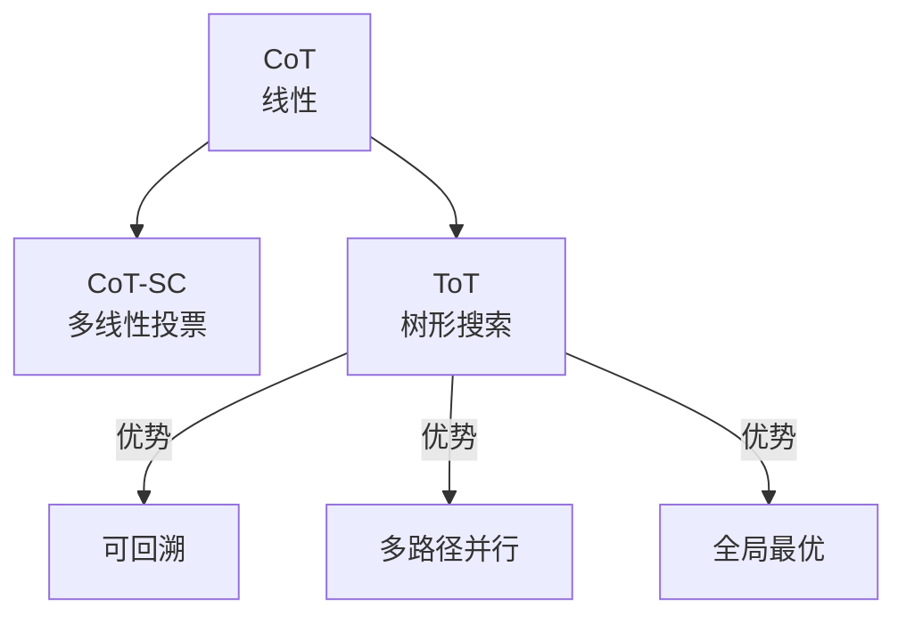

# KB92 Tree of Thoughts 论文精读与代码复现

> 知识库第 92 篇。精读 Tree of Thoughts 原始论文（Yao et al., 2023），并用 LangGraph 完整复现。

---

## 一、论文信息

| 项目 | 内容 |
| --- | --- |
| 标题 | Tree of Thoughts: Deliberate Problem Solving with Large Language Models |
| 作者 | Shunyu Yao, Dian Yu, Jeffrey Zhao, Joshua Tenenbaum, Caiming Xiong |
| 发表 | 2023 年，NeurIPS 2023 |
| 核心贡献 | 将思维链从线性扩展为树形搜索，支持回溯和多路径探索 |

---

## 二、核心思想

### 2.1 问题背景

CoT（Chain of Thought）是线性推理：A→B→C→D。如果中间某步错了，后面全错，且无法回头。



### 2.2 Tree of Thoughts 的解决方案

将推理过程组织为树形结构：每个节点是一个"思维状态"，可以生成多个候选、评估后选择最优路径，还可以回溯。



### 2.3 四个核心操作

| 操作 | 说明 | 类比 |
| --- | --- | --- |
| Thought 生成 | 生成多个候选下一步 | 头脑风暴 |
| 评估 | 对每个候选打分 | 评委打分 |
| 搜索 | 选择最优路径（BFS/DFS） | 选最优路线 |
| 回溯 | 放弃当前路径回到上一层 | 走错路掉头 |

---

## 三、论文核心机制

### 3.1 思维状态（Thought State）

每个节点是一个"思维状态"——中间推理结果。不是单步推理，而是完整的状态快照。

```
状态0: 初始问题
状态1A: "先计算面积"
状态1B: "先计算体积"
状态2A1: "面积 = 长 x 宽 = 6 x 4 = 24"  ← 评估: 8分
状态2B1: "体积 = 长 x 宽 x 高 = 6 x 4 x 3 = 72"  ← 评估: 9分
```

### 3.2 评估方式

论文提出两种评估方式：

| 方式 | 说明 | 优劣 |
| --- | --- | --- |
| 数值评估 | 给每个状态打分（1-10） | 简单但可能不准 |
| 投票评估 | 生成多个评估，取多数意见 | 更准但成本高 |



### 3.3 搜索算法


---

## 四、论文实验结果

### 4.1 任务表现

| 任务 | 数据集 | CoT | ToT | 提升 |
| --- | --- | --- | --- | --- |
| 24点游戏 | 24-Game | 4.0% | **74.0%** | +70.0 |
| 创意写作 | Creative Writing | 21% | **46%** | +25 |
| 填字游戏 | Mini Crosswords | 4.0% | **20.0%** | +16.0 |

### 4.2 24点游戏详解

24点游戏：用4个数字和+,-,*,/得到24。这是ToT的经典展示场景。

```
输入数字: 4, 7, 8, 8

思维路径1: (7-4) = 3, 3*8 = 24, 24/8 = 3 ✗ 错误
思维路径2: 8/8 = 1, 7-1 = 6, 6*4 = 24 ✓ 正确

ToT 同时探索两条路径，评估后选择路径2。
```



---

## 五、LangGraph 代码复现

### 5.1 架构设计



### 5.2 完整复现代码

```python
"""
Tree of Thoughts 论文复现：基于 LangGraph 的树搜索 Agent
论文：Tree of Thoughts: Deliberate Problem Solving with Large Language Models
"""
from langgraph.graph import StateGraph, END
from langchain_openai import ChatOpenAI
from typing import TypedDict, List, Optional
import json

llm = ChatOpenAI(model="gpt-4o", temperature=0.8)  # 高温度增加多样性

class ThoughtNode:
    """思维树节点"""
    def __init__(self, thought: str, parent=None):
        self.thought = thought
        self.parent = parent
        self.children = []
        self.score = 0.0
        self.visited = False

class ToTState(TypedDict):
    problem: str
    root_thought: str
    current_path: List[str]
    all_states: List[dict]  # 记录所有探索过的状态
    best_answer: str
    best_score: float
    iteration: int

N_CANDIDATES = 3  # 每步生成候选数
MAX_DEPTH = 4      # 最大搜索深度
MAX_ITERATIONS = 10 # 最大迭代次数

def generate_thoughts(state: ToTState):
    """生成多个候选思维"""
    current_thought = state["current_path"][-1] if state["current_path"] else ""
    
    prompt = f"""问题：{state['problem']}

当前推理进度：
{current_thought}

请生成 {N_CANDIDATES} 个不同的下一步推理方向。每个方向一句话。
用编号列表输出。"""
    
    resp = llm.invoke(prompt)
    lines = [l.strip().lstrip('0123456789.') for l in resp.content.split('\n') if l.strip()]
    
    new_states = []
    for line in lines[:N_CANDIDATES]:
        new_path = state["current_path"] + [line]
        new_states.append({"path": new_path, "thought": line})
    
    state["all_states"].extend(new_states)
    return state

def evaluate_states(state: ToTState):
    """评估所有待评估的状态"""
    unevaluated = [s for s in state["all_states"] if "score" not in s]
    
    for s in unevaluated:
        prompt = f"""评估以下推理步骤对解决问题有多大帮助。

        问题：{state['problem']}
        推理路径：{' -> '.join(s['path'])}

        请打分 1-10，只输出数字。"""
        
        resp = llm.invoke(prompt)
        try:
            s["score"] = float(resp.content.strip())
        except:
            s["score"] = 5.0
        
        # 更新最优
        if s["score"] > state["best_score"]:
            state["best_score"] = s["score"]
            state["best_answer"] = s["path"][-1]
            state["current_path"] = s["path"]
    
    state["iteration"] += 1
    return state

def should_continue(state: ToTState) -> str:
    """决定是否继续搜索"""
    if state["iteration"] >= MAX_ITERATIONS:
        return "finalize"
    if state["best_score"] >= 9.0:
        return "finalize"
    return "generate"

def finalize(state: ToTState):
    """输出最终答案"""
    prompt = f"""基于以下推理路径，给出最终答案：

    问题：{state['problem']}
    最佳推理路径：{' -> '.join(state['current_path'])}
    
    请给出简洁的最终答案。"""
    
    resp = llm.invoke(prompt)
    state["best_answer"] = resp.content
    return state

# === 构建 LangGraph ===
graph = StateGraph(ToTState)
graph.add_node("generate", generate_thoughts)
graph.add_node("evaluate", evaluate_states)
graph.add_node("finalize", finalize)
graph.set_entry_point("generate")
graph.add_edge("generate", "evaluate")
graph.add_conditional_edges("evaluate", should_continue,
    {"generate": "generate", "finalize": "finalize"})
graph.add_edge("finalize", END)
app = graph.compile()

# === 测试 ===
if __name__ == "__main__":
    result = app.invoke({
        "problem": "用 4, 7, 8, 8 四个数字，通过加减乘除得到 24",
        "root_thought": "",
        "current_path": [],
        "all_states": [],
        "best_answer": "",
        "best_score": 0.0,
        "iteration": 0
    })
    print("最终答案:", result["best_answer"])
    print(f"搜索轮数: {result['iteration']}")
    print(f"最高评分: {result['best_score']}")
```

---

## 六、与其他方法的对比

| 方法 | 结构 | 回溯 | 多路径 | 适用场景 |
| --- | --- | --- | --- | --- |
| CoT | 线性 | 否 | 否 | 简单推理 |
| CoT-SC | 多线性 | 否 | 是（投票） | 有明确答案 |
| ToT | 树形 | 是 | 是 | 复杂搜索 |
| ReAct | 线性+工具 | 否 | 否 | 工具调用 |
| Reflexion | 迭代改进 | 是（重试） | 否 | 质量提升 |



---

## 七、论文核心贡献总结

| 贡献 | 说明 |
| --- | --- |
| 树形思维 | 将线性 CoT 扩展为树形搜索 |
| 评估+剪枝 | 引入 LLM 作为评估器进行剪枝 |
| 回溯能力 | 可以放弃错误路径回到上一层 |
| 通用框架 | 适用于任何需要搜索的推理任务 |

---

## 八、复现注意事项

| 注意点 | 说明 |
| --- | --- |
| 温度设置 | 生成阶段 temperature=0.8 增加多样性 |
| 评估温度 | 评估阶段 temperature=0 保稳定 |
| 搜索深度 | MAX_DEPTH 不宜过大，成本指数增长 |
| 剪枝策略 | 每层保留 top-k 防爆炸 |
| 24点场景 | 论文经典场景，适合验证复现正确性 |

---

> 本篇配合第 104 课学习，论文原文：arxiv.org/abs/2305.10601