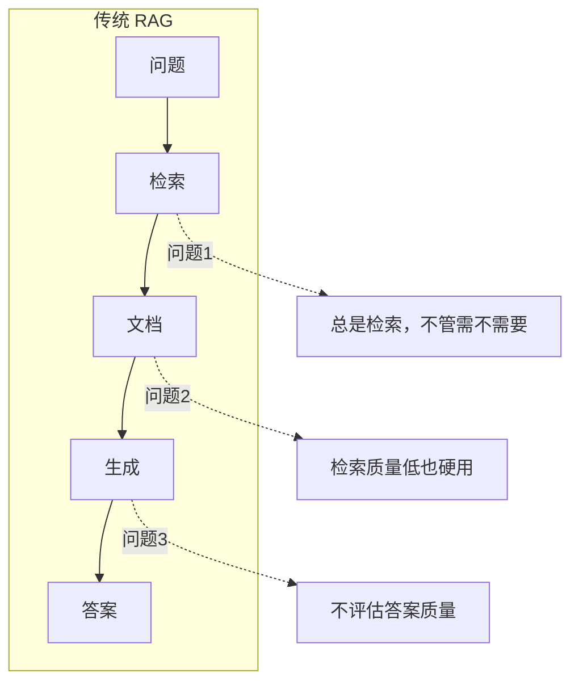
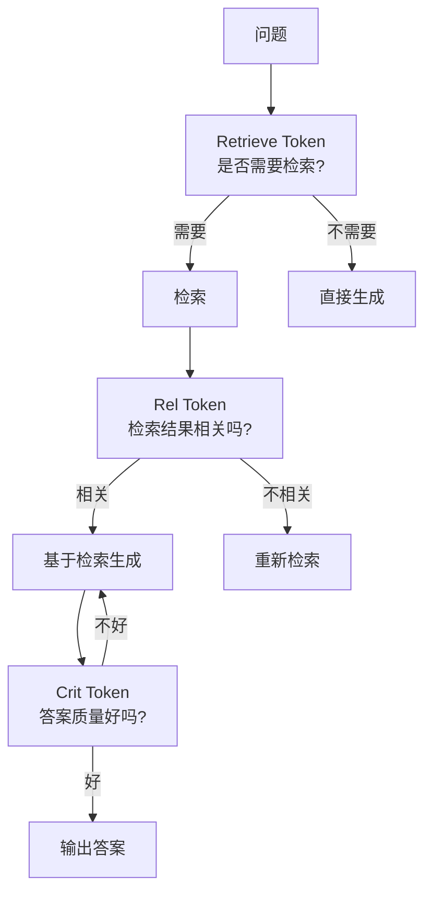
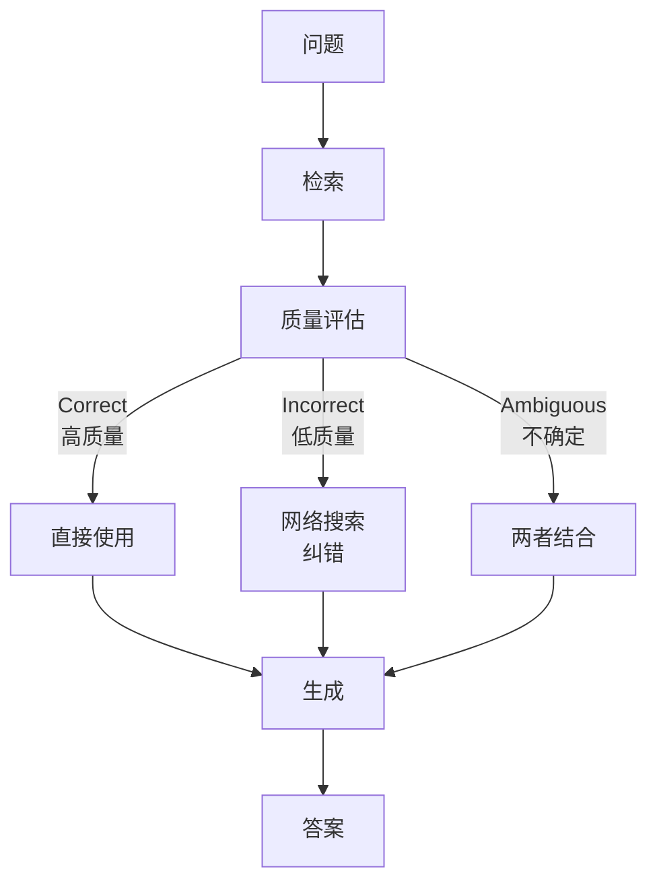
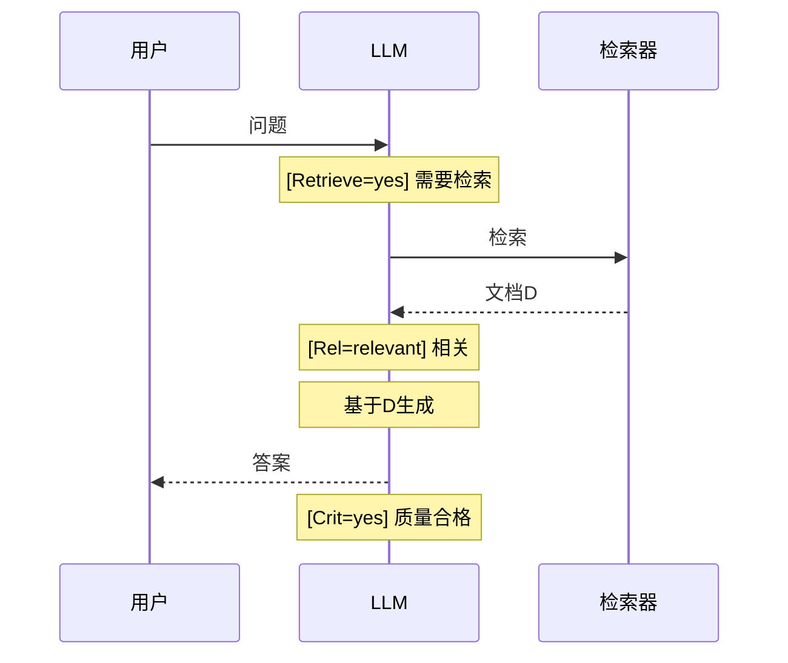
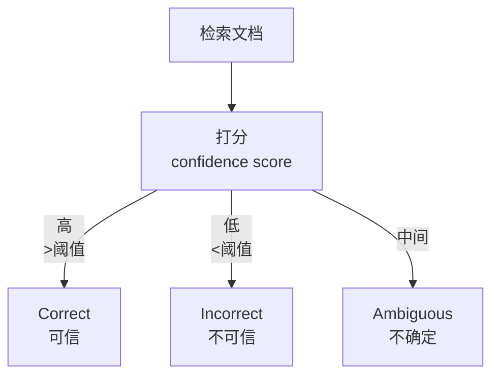
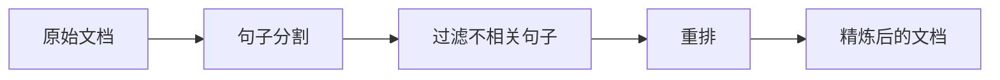
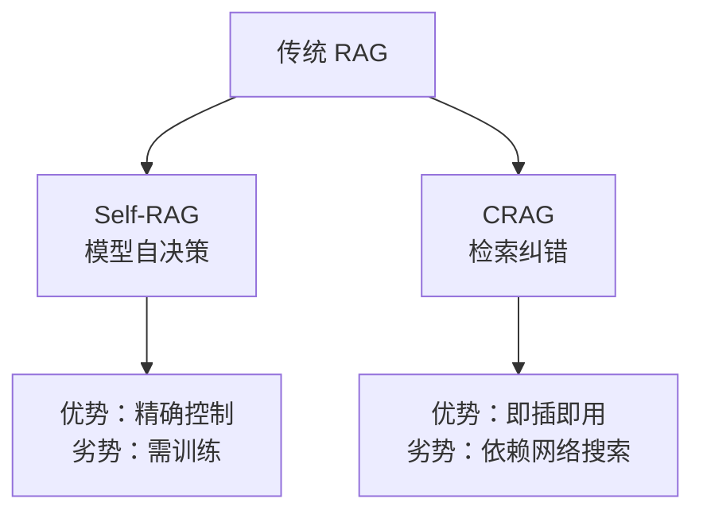
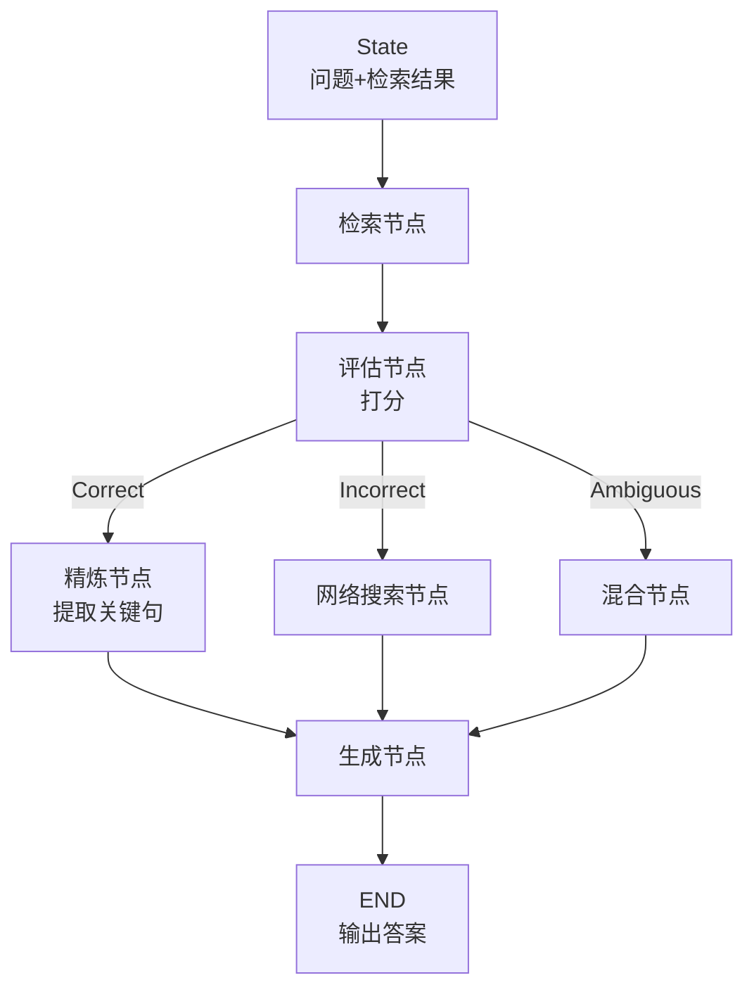
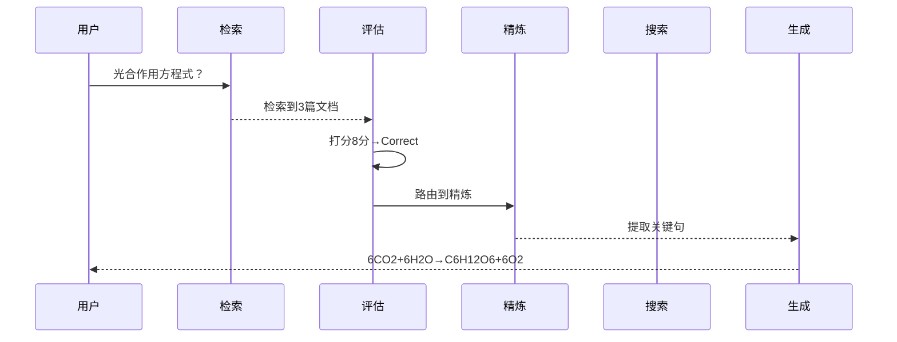
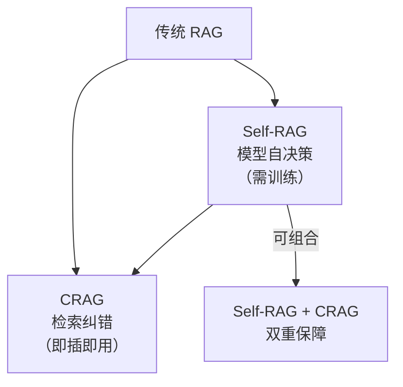

# KB93 Self-RAG 与 CRAG 论文精读与代码复现

> 知识库第 93 篇。精读 Self-RAG（Asai et al., 2023）和 CRAG（Yan et al., 2024）两篇 RAG 改进论文，并用 LangGraph 完整复现。

---

## 一、论文信息

### Self-RAG

| 项目 | 内容 |
| --- | --- |
| 标题 | Self-RAG: Learning to Retrieve, Generate, and Critique through Self-Reflection |
| 作者 | Akari Asai, Zeqiu Wu, Yizhong Wang, Avirup Sil, Hannaneh Hajishirzi |
| 发表 | 2023 年，ICLR 2024 |
| 核心贡献 | 让 LLM 自己决定何时检索、检索什么、如何使用检索结果 |

### CRAG (Corrective RAG)

| 项目 | 内容 |
| --- | --- |
| 标题 | Corrective Retrieval Augmented Generation (CRAG) |
| 作者 | Shi-Qi Yan, Jia-Chen Gu, Yun Zhu, Zhen-Hua Ling |
| 发表 | 2024 年，ICLR 2024 |
| 核心贡献 | 对检索结果做质量评估，低质量时触发网络搜索纠错 |

---

## 二、核心思想

### 2.1 传统 RAG 的问题



### 2.2 Self-RAG 的解决方案

引入 **反思标记（Reflection Tokens）**：模型在推理过程中生成特殊标记，自己决定是否检索、检索结果是否相关、生成答案是否好。



### 2.3 CRAG 的解决方案

对检索结果做 **质量评估**：如果检索结果质量低，用网络搜索补充纠错。



---

## 三、Self-RAG 核心机制

### 3.1 三种反思标记

| 标记 | 全称 | 作用 | 取值 |
| --- | --- | --- | --- |
| Retrieve | 检索标记 | 决定是否检索 | yes / no / continue |
| Rel(relevance) | 相关性标记 | 评估检索结果 | relevant / irrelevant |
| Crit(critique) | 评判标记 | 评估生成质量 | yes / no |

### 3.2 工作流程



### 3.3 训练方式

| 步骤 | 说明 |
| --- | --- |
| 1. 生成训练数据 | 用 Critic 模型标注反思标记 |
| 2. 训练生成器 | 让 LLM 学习输出反思标记 |
| 3. 推理时自省 | 模型自己生成标记做决策 |

---

## 四、CRAG 核心机制

### 4.1 检索评估器（Retrieval Evaluator）



### 4.2 三种纠正策略

| 策略 | 触发条件 | 动作 |
| --- | --- | --- |
| Refine（精炼） | Correct | 对文档做分解+重排，提取最相关片段 |
| Search（搜索） | Incorrect | 丢弃检索结果，用网络搜索补充 |
| Combine（混合） | Ambiguous | 精炼+网络搜索结合 |

### 4.3 知识精炼



---

## 五、两种方法对比

| 维度 | Self-RAG | CRAG |
| --- | --- | --- |
| 改进重点 | 模型自身决策 | 检索结果质量 |
| 是否需要训练 | 需要（微调） | 不需要 |
| 核心创新 | 反思标记 | 检索评估器+纠正 |
| 适用模型 | 需微调的 LLM | 任何 LLM |
| 检索纠错 | 重新检索 | 网络搜索 |
| 实现难度 | 高（需训练） | 中（纯推理时） |



---

## 六、LangGraph 代码复现

### 6.1 CRAG 复现（推荐，无需训练）



### 6.2 完整 CRAG 复现代码

```python
"""
CRAG 论文复现：基于 LangGraph 的纠错 RAG
论文：Corrective Retrieval Augmented Generation
"""
from langgraph.graph import StateGraph, END
from langchain_openai import ChatOpenAI
from langchain_core.vectorstores import InMemoryVectorStore
from langchain_openai import OpenAIEmbeddings
from typing import TypedDict, List, Optional
import re

llm = ChatOpenAI(model="gpt-4o", temperature=0)
embeddings = OpenAIEmbeddings()

class CRAGState(TypedDict):
    question: str
    retrieved_docs: List[str]
    retrieval_score: float
    retrieval_confidence: str  # correct / incorrect / ambiguous
    refined_docs: List[str]
    web_search_results: str
    final_context: str
    answer: str

# === 1. 检索节点 ===
def retrieve(state: CRAGState):
    """从向量库检索文档"""
    # 模拟检索（实际使用 vectorstore）
    docs = [
        "光合作用是植物利用光能将二氧化碳和水转化为有机物的过程。",
        "巴黎是法国的首都，位于法国北部。",
        "Machine learning is a subset of artificial intelligence.",
    ]
    # 简单检索：选包含关键词的文档
    relevant = [d for d in docs if any(w in d for w in state["question"].split())]
    state["retrieved_docs"] = relevant if relevant else docs
    return state

# === 2. 评估节点 ===
def evaluate_retrieval(state: CRAGState):
    """评估检索结果质量"""
    docs_text = "\n".join(state["retrieved_docs"])
    
    prompt = f"""评估以下检索结果对回答问题的帮助程度。

    问题：{state['question']}
    检索结果：{docs_text}

    请打分 1-10（只输出数字）：
    - 7-10：检索结果高度相关
    - 4-6：部分相关
    - 1-3：基本不相关"""
    
    resp = llm.invoke(prompt)
    try:
        score = float(re.search(r'\d+', resp.content).group())
    except:
        score = 5.0
    
    state["retrieval_score"] = score
    
    if score >= 7:
        state["retrieval_confidence"] = "correct"
    elif score <= 3:
        state["retrieval_confidence"] = "incorrect"
    else:
        state["retrieval_confidence"] = "ambiguous"
    
    return state

# === 3. 精炼节点（Correct 路径） ===
def refine_docs(state: CRAGState):
    """精炼文档：提取最相关片段"""
    docs_text = "\n".join(state["retrieved_docs"])
    
    prompt = f"""从以下文档中提取与问题最相关的关键句子。
    
    问题：{state['question']}
    文档：{docs_text}
    
    只输出相关句子，每句一行。"""
    
    resp = llm.invoke(prompt)
    state["refined_docs"] = [l.strip() for l in resp.content.split('\n') if l.strip()]
    state["final_context"] = "\n".join(state["refined_docs"])
    return state

# === 4. 网络搜索节点（Incorrect 路径） ===
def web_search(state: CRAGState):
    """网络搜索纠错"""
    # 模拟网络搜索（实际可用 Tavily/SerpAPI）
    state["web_search_results"] = f"网络搜索结果：关于'{state['question']}'的信息..."
    state["final_context"] = state["web_search_results"]
    return state

# === 5. 混合节点（Ambiguous 路径） ===
def combine_results(state: CRAGState):
    """混合精炼结果和网络搜索"""
    docs_text = "\n".join(state["retrieved_docs"])
    state["final_context"] = f"检索文档：\n{docs_text}\n\n网络搜索：关于'{state['question']}'的补充信息..."
    return state

# === 6. 生成节点 ===
def generate(state: CRAGState):
    """基于最终上下文生成答案"""
    prompt = f"""基于以下信息回答问题。

    问题：{state['question']}
    参考资料：{state['final_context']}

    请给出准确、简洁的答案。"""
    
    resp = llm.invoke(prompt)
    state["answer"] = resp.content
    return state

# === 路由函数 ===
def route_by_confidence(state: CRAGState) -> str:
    conf = state.get("retrieval_confidence", "ambiguous")
    if conf == "correct":
        return "refine"
    elif conf == "incorrect":
        return "web_search"
    else:
        return "combine"

# === 构建 LangGraph ===
graph = StateGraph(CRAGState)
graph.add_node("retrieve", retrieve)
graph.add_node("evaluate", evaluate_retrieval)
graph.add_node("refine", refine_docs)
graph.add_node("web_search", web_search)
graph.add_node("combine", combine_results)
graph.add_node("generate", generate)

graph.set_entry_point("retrieve")
graph.add_edge("retrieve", "evaluate")
graph.add_conditional_edges("evaluate", route_by_confidence, {
    "refine": "refine",
    "web_search": "web_search",
    "combine": "combine"
})
graph.add_edge("refine", "generate")
graph.add_edge("web_search", "generate")
graph.add_edge("combine", "generate")
graph.add_edge("generate", END)
app = graph.compile()

# === 测试 ===
if __name__ == "__main__":
    result = app.invoke({
        "question": "光合作用的化学方程式是什么？",
        "retrieved_docs": [],
        "retrieval_score": 0.0,
        "retrieval_confidence": "",
        "refined_docs": [],
        "web_search_results": "",
        "final_context": "",
        "answer": ""
    })
    print("答案:", result["answer"])
    print(f"检索置信度: {result['retrieval_confidence']} (分数: {result['retrieval_score']})")
```

### 6.3 运行轨迹



---

## 七、论文实验结果

### 7.1 Self-RAG

| 任务 | 基线 | Self-RAG | 提升 |
| --- | --- | --- | --- |
| OpenQA (NQ) | 35.0 | **40.4** | +5.4 |
| 事实验证 (FEVER) | 75.0 | **76.2** | +1.2 |
| 推理 (HotpotQA) | 30.0 | **32.4** | +2.4 |

### 7.2 CRAG

| 任务 | 基线 RAG | CRAG | 提升 |
| --- | --- | --- | --- |
| PopQA | 51.0 | **57.2** | +6.2 |
| PubHealth | 63.0 | **69.4** | +6.4 |
| Natural Questions | 40.0 | **43.3** | +3.3 |

---

## 八、两种方法的关系



---

## 九、论文核心贡献总结

| 论文 | 贡献 | 实用性 |
| --- | --- | --- |
| Self-RAG | 反思标记、模型自决策 | 需训练，效果上限高 |
| CRAG | 检索评估器、三路纠正 | 即插即用，适用性广 |

---

## 十、复现注意事项

| 注意点 | Self-RAG | CRAG |
| --- | --- | --- |
| 模型 | 需微调 | 原始模型即可 |
| 评估阈值 | 需调参 | 可用 LLM 打分 |
| 网络搜索 | 不需要 | 需要外部搜索 API |
| 成本 | 训练成本高 | 多一次评估+可能的搜索 |
| LangSmith | Trace 观察 | Trace 观察路由决策 |

---

> 本篇配合第 105 课学习。Self-RAG：arxiv.org/abs/2310.11511 | CRAG：arxiv.org/abs/2401.01584