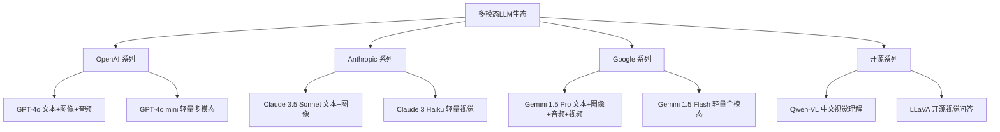
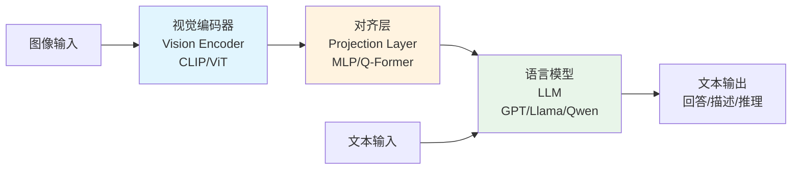
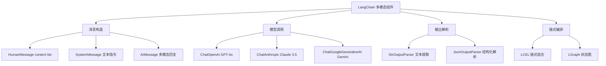
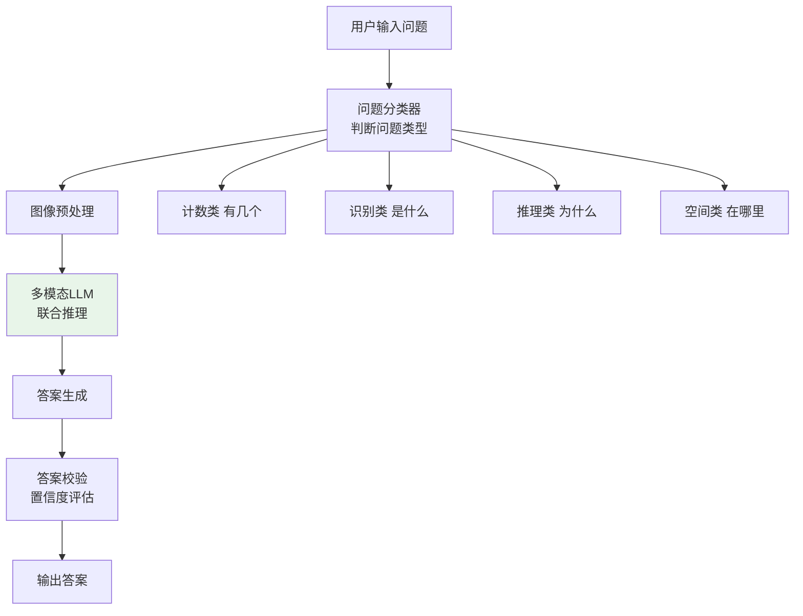
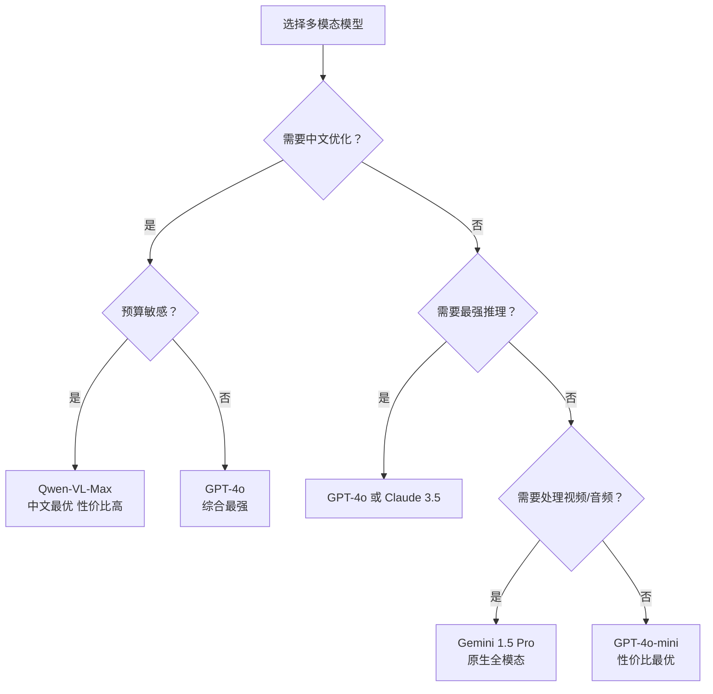

# 98. 多模态LLM基础架构与视觉问答

> **知识库编号：KB98** | **阶段：19** | **难度：中级** | **前置知识：第1-13课（基础入门）、第38-53课（高级应用）**
>
> 本篇系统讲解多模态大语言模型的基础架构、核心组件与视觉问答（VQA）实战。面向已掌握 LangChain/LangGraph 文本处理基础的学习者，从单模态过渡到多模态，理解图像与文本的联合推理机制。

---

## 1. 多模态LLM概述

### 1.1 什么是多模态

多模态（Multimodal）是指模型能够同时理解和处理多种类型的数据——文本、图像、音频、视频等。传统 LLM 只处理文本，而多模态 LLM（Multimodal LLM，简称 MLLM）能"看"图片、"听"声音、"读"表格。

**一句话理解**：就像人类不仅通过文字获取信息，还能通过眼睛看图、耳朵听声来理解世界，多模态 LLM 让 AI 从"只能读"进化到"能看能听"。

### 1.2 多模态 vs 单模态对比

| 维度 | 单模态LLM | 多模态LLM |
|------|-----------|-----------|
| 输入类型 | 纯文本 | 文本+图像+音频+视频 |
| 理解维度 | 语言语义 | 跨模态语义对齐 |
| 应用场景 | 聊天、写作、代码 | 图文问答、文档解析、视频理解 |
| 架构复杂度 | Transformer解码器 | 视觉编码器+对齐层+语言模型 |
| 计算成本 | 较低 | 较高（图像编码消耗大） |
| Token表示 | 文本Token | 文本Token+图像Token+音频Token |

### 1.3 主流多模态模型一览



---

## 2. 多模态LLM架构基础

### 2.1 三大核心组件

多模态 LLM 的标准架构由三部分组成：



**各组件职责**：

| 组件 | 功能 | 常见实现 | 输出 |
|------|------|----------|------|
| 视觉编码器 | 将图像编码为特征向量 | CLIP-ViT、SigLIP、EVA-CLIP | 图像特征序列 |
| 对齐层 | 将视觉特征映射到语言空间 | 线性投影、MLP、Q-Former、Perceiver | 语言空间视觉Token |
| 语言模型 | 融合视觉与文本Token进行推理 | GPT-4、Llama 3、Qwen2 | 文本回答 |

### 2.2 图像Token化过程

图像变成 LLM 可理解的 Token，需要经历以下步骤：

```
原始图像 (H×W×3)
    ↓ 预处理（Resize/Crop/Normalize）
补丁分割 (224×224 patches)
    ↓ 视觉编码器
特征图 (N×D)  N=补丁数, D=特征维度
    ↓ 对齐层
视觉Token (M×D')  M=压缩后Token数, D'=语言维度
    ↓ 拼接到文本Token前
[图像Token] + [文本Token] → LLM推理
```

### 2.3 对齐层的三种主流方案

| 方案 | 原理 | 优点 | 缺点 | 代表模型 |
|------|------|------|------|----------|
| 线性投影 | 简单线性变换 W·x+b | 参数少、训练快 | 保留全部视觉Token，计算量大 | LLaVA |
| MLP投影 | 多层感知机变换 | 表达力更强 | 参数稍多 | LLaVA-1.5 |
| Q-Former | 查询机制压缩视觉Token | 大幅减少Token数 | 架构复杂 | BLIP-2 |
| Perceiver | 交叉注意力压缩 | 灵活控制输出长度 | 训练不稳定 | Flamingo |

---

## 3. LangChain多模态组件

### 3.1 消息类型扩展

LangChain 在 `HumanMessage` 中支持 `content` 字段传入图像：

```python
from langchain_core.messages import HumanMessage, SystemMessage
from langchain_openai import ChatOpenAI

# 方式1：Base64编码图片
import base64

def encode_image(path):
    with open(path, "rb") as f:
        return base64.b64encode(f.read()).decode("utf-8")

image_base64 = encode_image("chart.png")

# 构造多模态消息
message = HumanMessage(
    content=[
        {"type": "text", "text": "请分析这张图表中的数据趋势。"},
        {
            "type": "image_url",
            "image_url": {"url": f"data:image/png;base64,{image_base64}"},
        },
    ]
)

# 调用多模态模型
llm = ChatOpenAI(model="gpt-4o", temperature=0)
response = llm.invoke([message])
print(response.content)
```

### 3.2 支持URL直传

```python
# 方式2：直接使用图片URL
message = HumanMessage(
    content=[
        {"type": "text", "text": "这张图片中有什么物体？请逐一列出。"},
        {
            "type": "image_url",
            "image_url": {"url": "https://example.com/photo.jpg"},
        },
    ]
)
response = llm.invoke([message])
```

### 3.3 多图对比

```python
# 方式3：多张图片对比分析
message = HumanMessage(
    content=[
        {"type": "text", "text": "请对比以下两张设计稿的差异，指出改进点。"},
        {"type": "image_url", "image_url": {"url": "url_design_v1.jpg"}},
        {"type": "image_url", "image_url": {"url": "url_design_v2.jpg"}},
    ]
)
response = llm.invoke([message])
```

### 3.4 LangChain多模态组件架构



---

## 4. 视觉问答（VQA）架构

### 4.1 VQA任务定义

视觉问答（Visual Question Answering，VQA）是指给定一张图像和一个关于该图像的自然语言问题，模型需要理解图像内容并给出准确答案。

```
输入：图像 + 问题（"这张图中有几个人？"）
输出：答案（"3个人"）
```

### 4.2 VQA系统架构



### 4.3 完整VQA实现

```python
from langchain_openai import ChatOpenAI
from langchain_core.messages import HumanMessage, SystemMessage
from langchain_core.output_parsers import StrOutputParser
from langchain_core.prompts import ChatPromptTemplate
import base64

class VisualQA:
    """视觉问答系统"""
    
    def __init__(self, model="gpt-4o"):
        self.llm = ChatOpenAI(model=model, temperature=0)
        self.parser = StrOutputParser()
    
    def encode_image(self, image_path):
        """将图片编码为Base64"""
        with open(image_path, "rb") as f:
            return base64.b64encode(f.read()).decode("utf-8")
    
    def ask(self, image_path, question):
        """对图片提问"""
        img_b64 = self.encode_image(image_path)
        
        system_prompt = """你是一个专业的视觉问答助手。
请仔细观察图片，准确回答用户的问题。
- 计数类问题：精确计数
- 识别类问题：给出具体名称
- 推理类问题：基于图像证据推理
- 不确定时：明确说明不确定性"""
        
        message = HumanMessage(
            content=[
                {"type": "text", "text": question},
                {
                    "type": "image_url",
                    "image_url": {"url": f"data:image/png;base64,{img_b64}"},
                },
            ]
        )
        
        response = self.llm.invoke([
            SystemMessage(content=system_prompt),
            message
        ])
        return self.parser.invoke(response)
    
    def batch_ask(self, image_path, questions):
        """批量提问"""
        results = []
        for q in questions:
            answer = self.ask(image_path, q)
            results.append({"question": q, "answer": answer})
        return results

# 使用示例
vqa = VisualQA()
answer = vqa.ask("product_photo.jpg", "这个产品的品牌是什么？包装上有哪些信息？")
print(answer)

# 批量问答
questions = [
    "图片中有哪些物体？",
    "整体色调是什么？",
    "这张图是在室内还是室外？",
]
results = vqa.batch_ask("scene.jpg", questions)
for r in results:
    print(f"Q: {r['question']}\nA: {r['answer']}\n")
```

---

## 5. 图像描述生成

### 5.1 任务定义

图像描述生成（Image Captioning）是指自动为图像生成一段自然语言描述。

### 5.2 描述层级

| 层级 | 描述粒度 | 示例 |
|------|---------|------|
| 简要描述 | 一句话概括 | "一只猫坐在窗台上" |
| 详细描述 | 多句展开 | "一只橘色的猫坐在白色窗台上，窗外是晴朗的天空，阳光照在猫的背上" |
| 结构化描述 | 字段化输出 | {"主体": "猫", "颜色": "橘色", "位置": "窗台", "背景": "晴朗天空"} |
| 情感描述 | 带情感色彩 | "温暖的午后，一只慵懒的橘猫在窗台上享受阳光" |

### 5.3 结构化描述生成

```python
from langchain_core.output_parsers import JsonOutputParser
from pydantic import BaseModel, Field

class ImageDescription(BaseModel):
    scene: str = Field(description="场景类型：室内/室外/自然")
    subjects: list = Field(description="主要对象列表")
    colors: list = Field(description="主色调列表")
    mood: str = Field(description="画面氛围")
    text_content: str = Field(description="图中文字内容，无则填none")

# 使用JsonOutputParser
parser = JsonOutputParser(pydantic_object=ImageDescription)

llm = ChatOpenAI(model="gpt-4o", temperature=0)

message = HumanMessage(
    content=[
        {"type": "text", "text": "请分析这张图片，按JSON格式输出描述。\n{format_instructions}"},
        {"type": "image_url", "image_url": {"url": f"data:image/png;base64,{img_b64}"}},
    ]
)

chain = llm | parser
result = chain.invoke([message])
print(result)
# {'scene': '室外', 'subjects': ['山', '湖', '树'], 
#  'colors': ['绿色', '蓝色', '白色'], 'mood': '宁静', 'text_content': 'none'}
```

---

## 6. 多模态提示工程

### 6.1 提示策略对比

| 策略 | 描述 | 适用场景 |
|------|------|---------|
| 直接提问 | 直接问图片相关问题 | 简单VQA |
| 引导观察 | 先让模型描述图片再提问 | 复杂推理 |
| 多步推理 | 分步引导模型思考 | 计数、空间推理 |
| 对比分析 | 提供多张图片对比 | 设计对比、差异分析 |
| 角色设定 | 给模型设定专业角色 | 专业领域分析 |

### 6.2 引导观察提示

```python
# 策略：先描述再回答
prompt = """请按以下步骤分析图片：
1. 首先描述你看到的整体场景
2. 列出图片中的主要物体
3. 描述物体之间的关系
4. 最后回答问题：{question}

请确保每个步骤都基于图片中的实际内容。"""

message = HumanMessage(
    content=[
        {"type": "text", "text": prompt.format(question="图中发生了什么事？")},
        {"type": "image_url", "image_url": {"url": f"data:image/png;base64,{img_b64}"}},
    ]
)
```

### 6.3 多步计数推理

```python
# 策略：分步计数避免遗漏
prompt = """请仔细数一数图片中的人数，按以下步骤：
1. 先从左到右扫描，数出第一行的人数
2. 再从上到下扫描，数出每一列的人数
3. 汇总总人数
4. 描述每个人的位置和大致特征

请务必逐一检查，不要遗漏。"""
```

---

## 7. 模型选型对比

### 7.1 多模态模型能力矩阵

| 模型 | 图像理解 | 文字识别 | 表格识别 | 推理能力 | 中文支持 | API成本 |
|------|---------|---------|---------|---------|---------|---------|
| GPT-4o | 优秀 | 优秀 | 优秀 | 优秀 | 良好 | 高 |
| GPT-4o-mini | 良好 | 良好 | 一般 | 良好 | 良好 | 低 |
| Claude 3.5 Sonnet | 优秀 | 优秀 | 优秀 | 优秀 | 良好 | 高 |
| Gemini 1.5 Pro | 优秀 | 优秀 | 良好 | 优秀 | 良好 | 中 |
| Gemini 1.5 Flash | 良好 | 良好 | 一般 | 良好 | 良好 | 低 |
| Qwen-VL-Max | 良好 | 优秀 | 良好 | 良好 | 优秀 | 低 |

### 7.2 选型决策树



---

## 8. 性能优化与成本控制

### 8.1 图像预处理优化

```python
from PIL import Image
import io

def optimize_image(image_path, max_size=1024, quality=85):
    """优化图像大小以降低Token消耗"""
    img = Image.open(image_path)
    
    # 按比例缩放
    if max(img.size) > max_size:
        ratio = max_size / max(img.size)
        new_size = tuple(int(d * ratio) for d in img.size)
        img = img.resize(new_size, Image.LANCZOS)
    
    # 转为JPEG压缩
    buffer = io.BytesIO()
    img.save(buffer, format="JPEG", quality=quality)
    return base64.b64encode(buffer.getvalue()).decode("utf-8")

# 使用优化后的图片
optimized_b64 = optimize_image("large_photo.png", max_size=768)
```

### 8.2 成本对比

| 策略 | 图像大小 | Token消耗 | 相对成本 |
|------|---------|----------|---------|
| 原图直传（4K） | ~10MB | ~2000 tokens | 5x |
| 压缩到1024px | ~200KB | ~750 tokens | 1.8x |
| 压缩到768px | ~100KB | ~425 tokens | 1x |
| 缩略图512px | ~50KB | ~200 tokens | 0.5x |

### 8.3 缓存策略

```python
from langchain_core.caches import InMemoryCache
from langchain_core.globals import set_llm_cache

# 设置全局缓存
set_llm_cache(InMemoryCache())

# 相同图片+相同问题只调用一次API
llm = ChatOpenAI(model="gpt-4o", temperature=0)

# 第一次调用（消耗Token）
response1 = llm.invoke([message])
# 第二次相同调用（命中缓存，免费）
response2 = llm.invoke([message])
```

---

## 9. 错误处理与降级

### 9.1 常见错误

| 错误类型 | 原因 | 处理方式 |
|---------|------|---------|
| 图片过大 | 超过API限制 | 预处理压缩 |
| 格式不支持 | WebP/BMP等 | 转为JPEG/PNG |
| 模型不支持图片 | 使用了纯文本模型 | 切换到多模态模型 |
| 超时 | 图片编码传输慢 | 降低分辨率 |
| 识别不准确 | 图片模糊/角度差 | 引导多步推理 |

### 9.2 降级链

```python
from langchain_openai import ChatOpenAI
from langchain_core.messages import HumanMessage

class ResilientVQA:
    """带降级机制的视觉问答"""
    
    def __init__(self):
        self.models = [
            ("gpt-4o", "最强多模态"),
            ("gpt-4o-mini", "轻量降级"),
            ("gpt-3.5-turbo", "纯文本兜底"),
        ]
        self.llm_cache = {}
    
    def ask(self, image_b64, question):
        errors = []
        for model_name, desc in self.models:
            try:
                llm = ChatOpenAI(model=model_name, temperature=0, timeout=30)
                if "3.5" in model_name:
                    # 纯文本兜底：只用文字描述问题
                    msg = HumanMessage(content=f"无法分析图片。问题：{question}")
                else:
                    msg = HumanMessage(content=[
                        {"type": "text", "text": question},
                        {"type": "image_url", "image_url": {"url": f"data:image/png;base64,{image_b64}"}},
                    ])
                response = llm.invoke([msg])
                return {"answer": response.content, "model": model_name}
            except Exception as e:
                errors.append(f"{model_name}: {str(e)}")
                continue
        
        return {"answer": "所有模型均失败", "errors": errors}

# 使用
vqa = ResilientVQA()
result = vqa.ask(img_b64, "图片中有哪些产品？")
```

---

## 10. 小结

本篇从多模态 LLM 的基础架构出发，系统讲解了：

1. **架构基础**：视觉编码器 + 对齐层 + 语言模型的三段式架构
2. **LangChain组件**：HumanMessage content list 支持图文混合输入
3. **视觉问答**：完整的 VQA 系统实现与批量问答
4. **图像描述**：从简要描述到结构化输出的全层级方案
5. **提示工程**：引导观察、多步推理等策略
6. **模型选型**：六大模型能力矩阵与决策树
7. **性能优化**：图像预处理、成本控制与缓存策略
8. **容错降级**：多模型降级链与错误处理

下一篇将深入图文混排处理与视觉文档解析，解决更复杂的真实文档场景。
