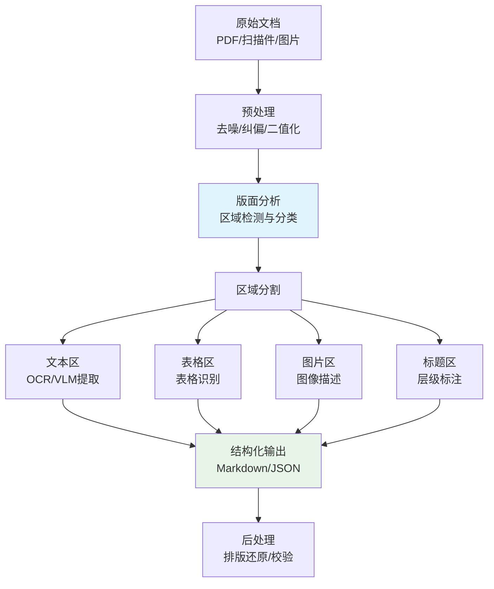
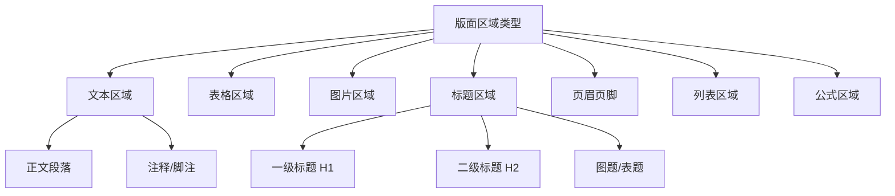
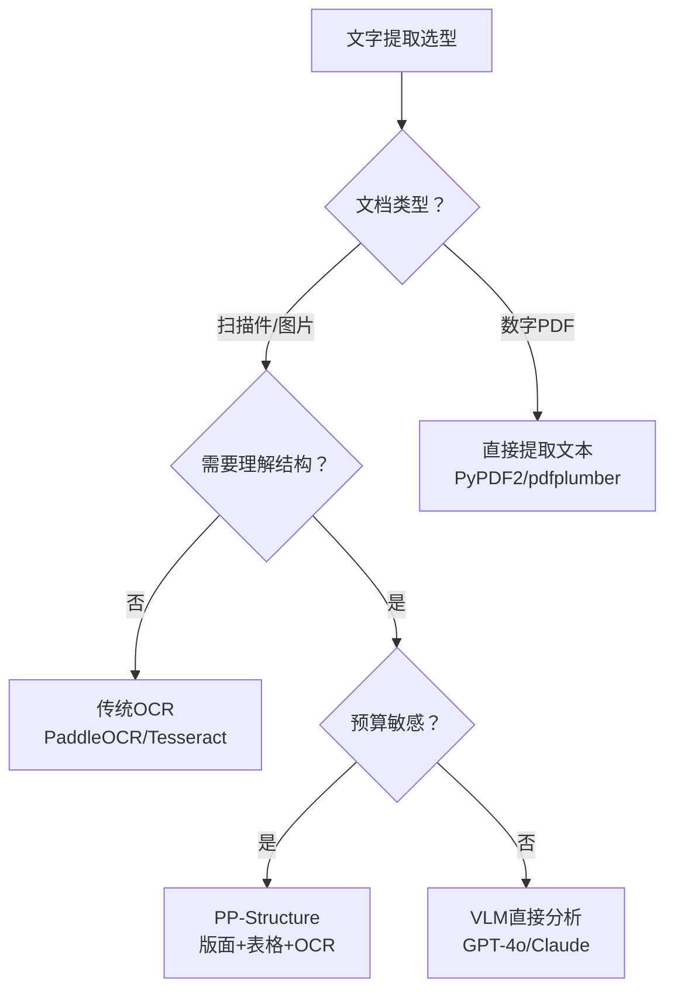
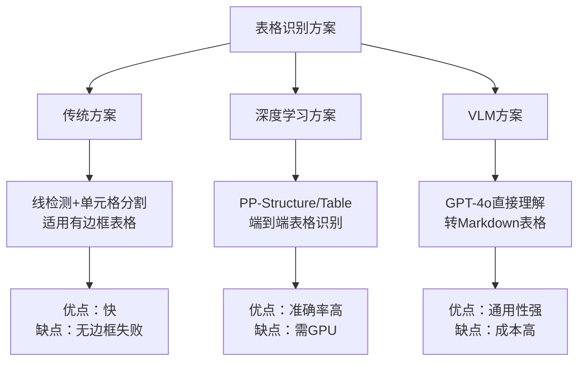
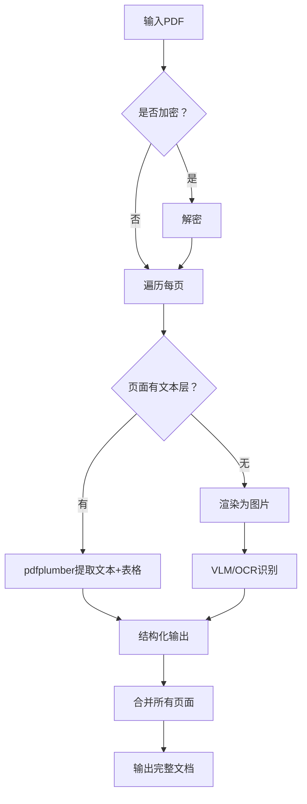
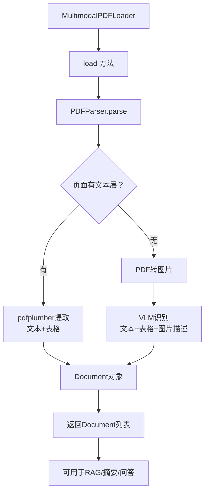
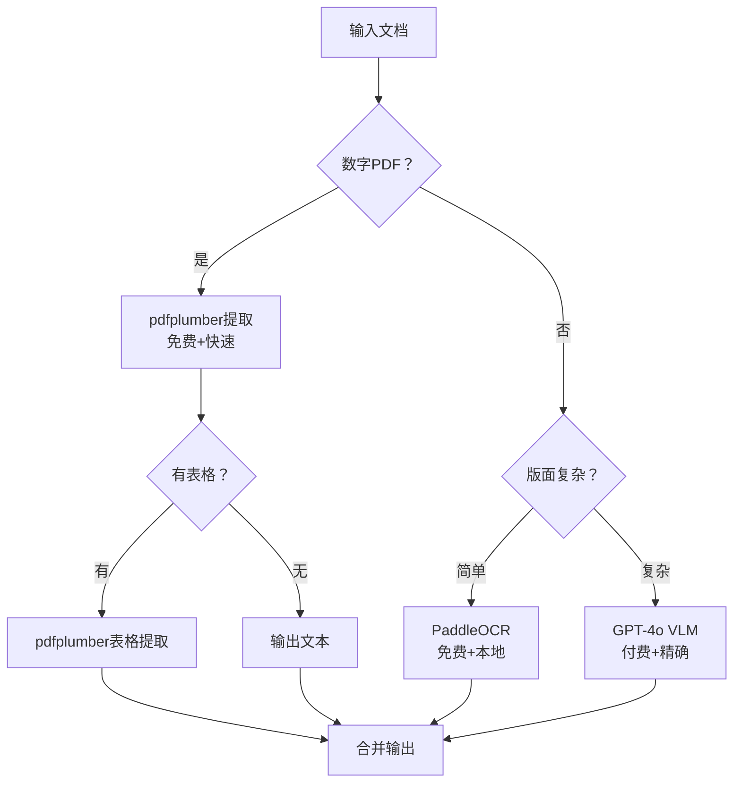

# 99. 图文混排处理与视觉文档解析

> **知识库编号：KB99** | **阶段：19** | **难度：中高级** | **前置知识：KB98（多模态LLM基础）**
>
> 本篇系统讲解图文混排文档的解析方法，涵盖版面分析、OCR vs VLM 对比、表格识别、PDF/扫描件处理流水线，以及 LangChain 文档加载器的多模态扩展。

---

## 1. 图文混排文档解析概述

### 1.1 什么是图文混排文档

图文混排文档是指同时包含文本、表格、图片、图表等多种元素的文档，如 PDF 报告、扫描合同、产品手册、学术论文等。

**一句话理解**：就像一份杂志页面，上面有标题、正文段落、配图、表格和边栏，人眼能自然区分各区域，但机器需要"版面分析"才能正确拆解。

### 1.2 解析挑战

| 挑战 | 描述 | 传统方法痛点 |
|------|------|-------------|
| 版面复杂 | 多栏、跨页、浮动元素 | OCR只能逐行提取，丢失结构 |
| 表格识别 | 合并单元格、嵌套表格 | 纯文本OCR无法还原图格关系 |
| 图片文字混合 | 图中嵌字、字间嵌图 | 区域分割困难 |
| 扫描质量 | 倾斜、模糊、水印 | OCR识别率骤降 |
| 多语言混排 | 中英日混排 | 需切换OCR引擎 |

### 1.3 解析流程总览



---

## 2. 版面分析

### 2.1 版面分析的任务

版面分析（Document Layout Analysis，DLA）是将文档图像分割为不同类型的区域（文本段、标题、表格、图片、页眉页脚等）。

### 2.2 主流派面分析方法

| 方法 | 原理 | 优点 | 缺点 | 代表工具 |
|------|------|------|------|----------|
| 规则法 | 投影/连通域分析 | 速度快、无需训练 | 仅适用简单版面 | OpenCV |
| 目标检测 | YOLO/Detectron检测区域 | 准确率高 | 需标注数据训练 | PP-Structure |
| 语义分割 | 像素级分类 | 边界精确 | 计算量大 | LayoutLM |
| VLM直接分析 | 多模态LLM理解全页 | 理解语义 | Token消耗大 | GPT-4o |

### 2.3 版面分析区域类型



---

## 3. OCR vs VLM 对比

### 3.1 两种文字提取路径

| 维度 | 传统OCR | VLM直接识别 |
|------|---------|------------|
| 原理 | 字符级识别 | 语义级理解 |
| 准确率 | 印刷体高，手写体低 | 整体较高 |
| 结构理解 | 需后处理排版 | 天然理解版面 |
| 表格处理 | 需专用表格OCR | 可直接理解 |
| 速度 | 快（本地部署） | 慢（API调用） |
| 成本 | 低 | 高（Token消耗） |
| 中文识别 | PaddleOCR优秀 | 取决于模型 |

### 3.2 选型决策



### 3.3 PaddleOCR示例

```python
from paddleocr import PaddleOCR

# 初始化OCR引擎
ocr = PaddleOCR(
    use_angle_cls=True,    # 方向分类
    lang="ch",             # 中文
    show_log=False,
)

# 识别图片中的文字
result = ocr.ocr("document_scan.png", cls=True)

# 提取文本和坐标
for idx in range(len(result)):
    res = result[idx]
    for line in res:
        box = line[0]       # 文字框坐标
        text = line[1][0]   # 文字内容
        conf = line[1][1]   # 置信度
        print(f"[{conf:.2f}] {text}")
```

### 3.4 VLM直接分析

```python
from langchain_openai import ChatOpenAI
from langchain_core.messages import HumanMessage
import base64

def vlm_extract_document(image_path):
    """使用VLM直接分析文档图片"""
    with open(image_path, "rb") as f:
        img_b64 = base64.b64encode(f.read()).decode("utf-8")
    
    llm = ChatOpenAI(model="gpt-4o", temperature=0)
    
    prompt = """请分析这张文档图片，按以下格式输出：
1. 文档标题
2. 正文章节（保留层级）
3. 表格（转为Markdown表格格式）
4. 图片描述
5. 其他元素（页眉/页脚/注释等）

请保持原文档的阅读顺序和结构关系。"""
    
    message = HumanMessage(content=[
        {"type": "text", "text": prompt},
        {"type": "image_url", "image_url": {"url": f"data:image/png;base64,{img_b64}"}},
    ])
    
    response = llm.invoke([message])
    return response.content

# 使用
doc_text = vlm_extract_document("report_page.png")
```

---

## 4. 表格识别与结构化提取

### 4.1 表格识别的难点

| 难点 | 示例 | 影响 |
|------|------|------|
| 合并单元格 | 跨行跨列的表头 | 还原为标准表格困难 |
| 嵌套表格 | 表格中嵌套小表格 | 层级关系丢失 |
| 空白单元格 | 大量空白 | 难以区分"无值"和"未识别" |
| 线框缺失 | 无边框表格 | 区域分割困难 |
| 跨页表格 | 表头重复 | 需合并处理 |

### 4.2 表格识别方案对比



### 4.3 VLM表格提取实现

```python
from langchain_openai import ChatOpenAI
from langchain_core.messages import HumanMessage, SystemMessage
from langchain_core.output_parsers import StrOutputParser
import base64

def extract_table_from_image(image_path):
    """从图片中提取表格为Markdown格式"""
    with open(image_path, "rb") as f:
        img_b64 = base64.b64encode(f.read()).decode("utf-8")
    
    llm = ChatOpenAI(model="gpt-4o", temperature=0)
    
    system_prompt = """你是表格识别专家。请将图片中的表格转换为Markdown格式。
要求：
1. 保持原始表格结构（行数、列数、合并单元格）
2. 表头用粗体
3. 数字保持原样，不要添加千位分隔符
4. 空单元格用空字符串表示
5. 如果有多张表格，用分割线分开"""
    
    message = HumanMessage(content=[
        {"type": "text", "text": "请识别这张图片中的所有表格，输出为Markdown表格格式。"},
        {"type": "image_url", "image_url": {"url": f"data:image/png;base64,{img_b64}"}},
    ])
    
    response = llm.invoke([SystemMessage(content=system_prompt), message])
    return response.content

# 使用
table_md = extract_table_from_image("financial_report_table.png")
print(table_md)
# 输出示例：
# | 项目 | 2024年Q1 | 2024年Q2 | 同比增长 |
# |------|---------|---------|---------|
# | 营收 | 1,200万 | 1,500万 | 25.0% |
# | 成本 | 800万 | 950万 | 18.8% |
```

### 4.4 结构化表格输出

```python
from pydantic import BaseModel, Field
from langchain_core.output_parsers import JsonOutputParser

class TableCell(BaseModel):
    row: int = Field(description="行号，从0开始")
    col: int = Field(description="列号，从0开始")
    value: str = Field(description="单元格内容")
    is_header: bool = Field(description="是否为表头")

class TableData(BaseModel):
    rows: int = Field(description="总行数")
    cols: int = Field(description="总列数")
    cells: list = Field(description="单元格列表")
    title: str = Field(description="表格标题，无则填none")

parser = JsonOutputParser(pydantic_object=TableData)

llm = ChatOpenAI(model="gpt-4o", temperature=0)
message = HumanMessage(content=[
    {"type": "text", "text": "识别表格并按JSON格式输出。\n{format_instructions}"},
    {"type": "image_url", "image_url": {"url": f"data:image/png;base64,{img_b64}"}},
])

chain = llm | parser
table_json = chain.invoke([message])
```

---

## 5. PDF文档解析

### 5.1 PDF类型分类

| 类型 | 特点 | 推荐方案 |
|------|------|---------|
| 数字PDF | 可选中文本 | PyPDF2/pdfplumber直接提取 |
| 扫描PDF | 图片形式 | OCR或VLM识别 |
| 混合PDF | 部分数字部分扫描 | 分页判断后分别处理 |
| 加密PDF | 需密码 | PyPDF2解密后处理 |

### 5.2 PDF解析流程



### 5.3 完整PDF解析实现

```python
import pdfplumber
from pdf2image import convert_from_path
from langchain_openai import ChatOpenAI
from langchain_core.messages import HumanMessage
import base64
import io

class PDFParser:
    """PDF文档解析器：自动判断数字/扫描页"""
    
    def __init__(self, model="gpt-4o"):
        self.llm = ChatOpenAI(model=model, temperature=0)
    
    def parse(self, pdf_path):
        """解析PDF文档"""
        pages_content = []
        
        with pdfplumber.open(pdf_path) as pdf:
            for i, page in enumerate(pdf.pages):
                # 尝试提取文本
                text = page.extract_text()
                
                if text and len(text.strip()) > 50:
                    # 数字PDF：直接提取
                    tables = page.extract_tables()
                    pages_content.append({
                        "page": i + 1,
                        "type": "digital",
                        "text": text,
                        "tables": tables,
                    })
                else:
                    # 扫描PDF：转为图片用VLM识别
                    img_b64 = self._page_to_image_base64(pdf_path, i)
                    content = self._vlm_parse_page(img_b64, i + 1)
                    pages_content.append({
                        "page": i + 1,
                        "type": "scanned",
                        "text": content,
                    })
        
        return pages_content
    
    def _page_to_image_base64(self, pdf_path, page_num):
        """PDF指定页转为Base64图片"""
        images = convert_from_path(pdf_path, first_page=page_num+1, last_page=page_num+1, dpi=200)
        buffer = io.BytesIO()
        images[0].save(buffer, format="PNG")
        return base64.b64encode(buffer.getvalue()).decode("utf-8")
    
    def _vlm_parse_page(self, img_b64, page_num):
        """VLM解析扫描页"""
        prompt = f"""这是文档第{page_num}页。请提取全部内容：
1. 保持原文顺序
2. 表格转为Markdown
3. 图片位置用[图片]标注
4. 保留标题层级"""
        
        message = HumanMessage(content=[
            {"type": "text", "text": prompt},
            {"type": "image_url", "image_url": {"url": f"data:image/png;base64,{img_b64}"}},
        ])
        response = self.llm.invoke([message])
        return response.content
    
    def to_markdown(self, pages_content):
        """将解析结果转为Markdown"""
        md = ""
        for page in pages_content:
            md += f"## 第{page['page']}页\n\n"
            md += page["text"] + "\n\n"
            if page.get("tables"):
                for i, table in enumerate(page["tables"]):
                    md += f"**表格{i+1}**\n\n"
                    for row in table:
                        md += "| " + " | ".join(str(c or "") for c in row) + " |\n"
                    md += "\n"
        return md

# 使用
parser = PDFParser()
pages = parser.parse("annual_report.pdf")
md_output = parser.to_markdown(pages)
print(md_output)
```

---

## 6. LangChain文档加载器扩展

### 6.1 内置文档加载器

| 加载器 | 适用格式 | 特点 |
|--------|---------|------|
| PyPDFLoader | PDF | 按页提取文本 |
| PDFPlumberLoader | PDF | 支持表格提取 |
| UnstructuredImageLoader | 图片 | OCR提取 |
| AzureAIDocumentIntelligenceLoader | 多格式 | Azure云服务 |
| AmazonTextractPDFLoader | PDF/图片 | AWS OCR |

### 6.2 自定义多模态加载器

```python
from langchain_core.documents import Document
from langchain_openai import ChatOpenAI
from langchain_core.messages import HumanMessage
import base64

class MultimodalPDFLoader:
    """多模态PDF加载器：支持数字+扫描混合PDF"""
    
    def __init__(self, model="gpt-4o"):
        self.llm = ChatOpenAI(model=model, temperature=0)
        self.file_path = None
    
    def load(self, file_path):
        """加载PDF文件，返回Document列表"""
        self.file_path = file_path
        parser = PDFParser(model=self.llm.model_name)
        pages = parser.parse(file_path)
        
        documents = []
        for page in pages:
            doc = Document(
                page_content=page["text"],
                metadata={
                    "source": file_path,
                    "page": page["page"],
                    "type": page["type"],
                }
            )
            documents.append(doc)
        
        return documents

# 在RAG中使用
from langchain_text_splitters import RecursiveCharacterTextSplitter

loader = MultimodalPDFLoader()
docs = loader.load("scanned_report.pdf")

# 文本分割
splitter = RecursiveCharacterTextSplitter(chunk_size=1000, chunk_overlap=200)
chunks = splitter.split_documents(docs)
print(f"共加载 {len(docs)} 页，分割为 {len(chunks)} 个块")
```

### 6.3 加载器架构



---

## 7. 扫描件增强处理

### 7.1 图像预处理流水线

```python
import cv2
import numpy as np

class DocumentPreprocessor:
    """文档图像预处理"""
    
    @staticmethod
    def deskew(image):
        """倾斜矫正"""
        gray = cv2.cvtColor(image, cv2.COLOR_BGR2GRAY)
        gray = cv2.bitwise_not(gray)
        coords = np.column_stack(np.where(gray > 0))
        angle = cv2.minAreaRect(coords)[-1]
        
        if angle < -45:
            angle = -(90 + angle)
        else:
            angle = -angle
        
        (h, w) = image.shape[:2]
        center = (w // 2, h // 2)
        M = cv2.getRotationMatrix2D(center, angle, 1.0)
        rotated = cv2.warpAffine(image, M, (w, h), flags=cv2.INTER_CUBIC, borderMode=cv2.BORDER_REPLICATE)
        return rotated
    
    @staticmethod
    def denoise(image):
        """去噪"""
        return cv2.fastNlMeansDenoisingColored(image, None, 10, 10, 7, 21)
    
    @staticmethod
    def enhance_contrast(image):
        """对比度增强"""
        lab = cv2.cvtColor(image, cv2.COLOR_BGR2LAB)
        l, a, b = cv2.split(lab)
        clahe = cv2.createCLAHE(clipLimit=3.0, tileGridSize=(8, 8))
        l = clahe.apply(l)
        enhanced = cv2.merge((l, a, b))
        return cv2.cvtColor(enhanced, cv2.COLOR_LAB2BGR)
    
    @staticmethod
    def remove_shadow(image):
        """阴影去除"""
        rgb_planes = cv2.split(image)
        result_planes = []
        for plane in rgb_planes:
            dilated = cv2.dilate(plane, np.ones((7, 7), np.uint8))
            bg = cv2.medianBlur(dilated, 21)
            diff = 255 - cv2.absdiff(plane, bg)
            result_planes.append(diff)
        return cv2.merge(result_planes)
    
    def process(self, image_path):
        """完整预处理流水线"""
        img = cv2.imread(image_path)
        img = self.deskew(img)
        img = self.denoise(img)
        img = self.enhance_contrast(img)
        img = self.remove_shadow(img)
        return img

# 使用
preprocessor = DocumentPreprocessor()
clean_img = preprocessor.process("scan_tilted.png")
cv2.imwrite("scan_clean.png", clean_img)
```

### 7.2 预处理效果对比

| 预处理步骤 | OCR准确率提升 | 适用场景 |
|-----------|-------------|---------|
| 无处理 | 基准 65% | 清晰扫描件 |
| 倾斜矫正 | +10% | 倾斜扫描 |
| 去噪 | +5% | 噪声扫描 |
| 对比度增强 | +8% | 模糊/低对比度 |
| 阴影去除 | +7% | 拍照文档 |
| 全流程 | +20% | 复杂场景 |

---

## 8. 多页文档合并与结构化

### 8.1 跨页表格合并

```python
def merge_cross_page_tables(pages_content):
    """合并跨页表格"""
    merged = []
    i = 0
    while i < len(pages_content):
        page = pages_content[i]
        tables = page.get("tables", [])
        
        if tables:
            last_table = tables[-1]
            # 检查下一页是否有续表
            if i + 1 < len(pages_content):
                next_tables = pages_content[i + 1].get("tables", [])
                if next_tables and _is_continuation(last_table, next_tables[0]):
                    # 合并表格
                    merged_table = last_table + next_tables[0][1:]  # 去掉重复表头
                    last_table = merged_table
                    i += 1  # 跳过下一页
        
        merged.append(page)
        i += 1
    
    return merged

def _is_continuation(table1, table2):
    """判断table2是否是table1的续表"""
    # 方法1：表头相同
    if table1[0] == table2[0]:
        return True
    # 方法2：第一行无表头样式
    if table2[0] == table1[0]:
        return True
    return False
```

### 8.2 文档结构化输出

```python
class DocumentStructurer:
    """将解析结果转为结构化JSON"""
    
    def to_structured(self, pages_content):
        """转为结构化文档"""
        doc = {
            "title": "",
            "sections": [],
            "tables": [],
            "images": [],
            "metadata": {
                "total_pages": len(pages_content),
                "page_types": [p["type"] for p in pages_content],
            }
        }
        
        current_section = None
        for page in pages_content:
            lines = page["text"].split("\n")
            for line in lines:
                if self._is_heading(line):
                    current_section = {"heading": line.strip(), "content": [], "page": page["page"]}
                    doc["sections"].append(current_section)
                elif current_section:
                    current_section["content"].append(line)
                else:
                    doc["title"] = doc["title"] or line.strip()
        
        return doc
    
    def _is_heading(self, line):
        """简单标题判断"""
        line = line.strip()
        if not line:
            return False
        if line.startswith("#"):
            return True
        if len(line) < 30 and line.endswith("章") or line.endswith("节"):
            return True
        return False
```

---

## 9. 性能基准与成本分析

### 9.1 解析方案对比

| 方案 | 准确率 | 速度(10页) | 成本(10页) | 适用场景 |
|------|--------|-----------|-----------|---------|
| pdfplumber | 95%+ | 2秒 | 免费 | 数字PDF |
| PaddleOCR | 90% | 15秒 | 免费 | 扫描件批量 |
| GPT-4o VLM | 95%+ | 60秒 | ~$0.5 | 复杂版面 |
| Claude 3.5 VLM | 95%+ | 45秒 | ~$0.4 | 复杂版面 |
| 混合方案 | 97%+ | 20秒 | ~$0.2 | 生产推荐 |

### 9.2 混合方案策略



---

## 10. 小结

本篇系统讲解了图文混排文档解析的完整技术栈：

1. **版面分析**：区域检测与分类的四类方法
2. **OCR vs VLM**：两种文字提取路径的对比与选型
3. **表格识别**：VLM表格提取与结构化输出
4. **PDF解析**：数字/扫描混合PDF的自动判断与处理
5. **LangChain扩展**：自定义多模态加载器集成到RAG流水线
6. **扫描增强**：倾斜矫正/去噪/对比度/阴影去除预处理
7. **跨页合并**：跨页表格合并与文档结构化输出
8. **性能基准**：五大方案的准确率/速度/成本对比

下一篇将深入多模态RAG与跨模态检索引擎，解决图文混合知识库的检索问题。
