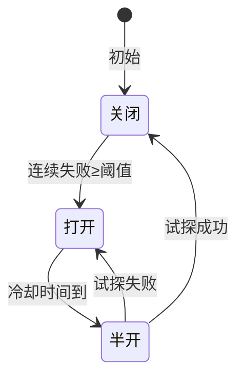

# LLM 应用断路器模式

> 当 LLM API 连续失败时，断路器自动"熔断"，停止发送请求，避免雪崩。这份指南覆盖断路器的完整实现。

---

## 一、断路器的价值

```mermaid
graph TB
    subgraph 无断路器 &#123;"❌ 无断路器"&#125;
        U1["用户请求"] --> LLM1["调用LLM"]
        LLM1 --> F1["❌ 超时"]
        F1 --> R1["重试"]
        R1 --> LLM1
        Note1["雪崩: 所有请求都超时<br/>服务器资源耗尽"]
    end

    subgraph 有断路器 &#123;"✅ 有断路器"&#125;
        U2["用户请求"] --> CB&#123;"断路器"&#125;
        CB -->|"关闭(正常)"| LLM2["调用LLM"]
        CB -->|"打开(熔断)"| FALL["立即返回降级"]
        CB -->|"半开(试探)"| LLM3["试探性调用"]
    end

    style 无断路器 fill:'#FFCDD2'
    style 有断路器 fill:'#C8E6C9'
```

## 二、断路器三态



| 状态 | 行为 | 转换条件 |
|------|------|---------|
| 关闭(Closed) | 正常调用，记录失败 | 连续失败≥阈值→打开 |
| 打开(Open) | 不调用，立即降级 | 冷却时间到→半开 |
| 半开(Half-Open) | 允许少量试探调用 | 成功→关闭；失败→打开 |

## 三、实现

```python
import time
from datetime import datetime, timedelta

class CircuitBreaker:
    """断路器"""
    def __init__(
        self,
        failure_threshold: int = 5,       # 连续失败阈值
        recovery_timeout: int = 60,        # 冷却时间(秒)
        half_open_max_calls: int = 3,     # 半开状态最大试探次数
    ):
        self.failure_threshold = failure_threshold
        self.recovery_timeout = recovery_timeout
        self.half_open_max_calls = half_open_max_calls

        self.state = "closed"              # closed / open / half_open
        self.failure_count = 0
        self.last_failure_time = None
        self.half_open_calls = 0

    def call(self, func, *args, **kwargs):
        """通过断路器调用函数"""
        # 检查状态
        if self.state == "open":
            if self._should_try_half_open():
                self._transition_to_half_open()
            else:
                raise CircuitBreakerOpenError(
                    f"断路器打开中，冷却还剩&#123;self._remaining_cooldown()&#125;秒"
                )

        if self.state == "half_open":
            if self.half_open_calls >= self.half_open_max_calls:
                raise CircuitBreakerOpenError("半开状态试探次数已满")
            self.half_open_calls += 1

        # 执行调用
        try:
            result = func(*args, **kwargs)
            self._on_success()
            return result
        except Exception as e:
            self._on_failure()
            raise

    def _on_success(self):
        """调用成功"""
        self.failure_count = 0
        if self.state == "half_open":
            self._transition_to_closed()

    def _on_failure(self):
        """调用失败"""
        self.failure_count += 1
        self.last_failure_time = datetime.now()
        if self.state == "half_open":
            self._transition_to_open()
        elif self.failure_count >= self.failure_threshold:
            self._transition_to_open()

    def _should_try_half_open(self) -> bool:
        """是否应该尝试半开"""
        if not self.last_failure_time:
            return False
        elapsed = datetime.now() - self.last_failure_time
        return elapsed >= timedelta(seconds=self.recovery_timeout)

    def _remaining_cooldown(self) -> int:
        """剩余冷却时间"""
        if not self.last_failure_time:
            return 0
        elapsed = datetime.now() - self.last_failure_time
        remaining = self.recovery_timeout - elapsed.total_seconds()
        return max(0, int(remaining))

    def _transition_to_open(self):
        self.state = "open"
        print(f"🔴 断路器打开: 连续失败&#123;self.failure_count&#125;次")

    def _transition_to_half_open(self):
        self.state = "half_open"
        self.half_open_calls = 0
        print("🟡 断路器半开: 试探性调用")

    def _transition_to_closed(self):
        self.state = "closed"
        self.failure_count = 0
        print("🟢 断路器关闭: 恢复正常")

    def get_state(self) -> dict:
        return &#123;
            "state": self.state,
            "failure_count": self.failure_count,
            "cooldown_remaining": self._remaining_cooldown() if self.state == "open" else 0,
        &#125;


class CircuitBreakerOpenError(Exception):
    """断路器打开异常"""
    pass
```

## 四、在 LLM 调用中使用

```python
from langchain_openai import ChatOpenAI

llm = ChatOpenAI(model="gpt-4o-mini", timeout=10)
breaker = CircuitBreaker(failure_threshold=3, recovery_timeout=30)

def call_llm_with_breaker(prompt: str) -> str:
    """带断路器的LLM调用"""
    try:
        response = breaker.call(llm.invoke, prompt)
        return response.content
    except CircuitBreakerOpenError as e:
        # 断路器打开，返回降级响应
        print(f"⚠️ &#123;e&#125;")
        return "服务暂时繁忙，请稍后重试。"

    except Exception as e:
        # 其他异常（LLM调用本身失败）
        print(f"❌ LLM调用失败: &#123;e&#125;")
        return "请求失败，请重试。"

# 使用
for i in range(10):
    result = call_llm_with_breaker(f"问题&#123;i&#125;")
    state = breaker.get_state()
    print(f"  断路器: &#123;state['state']&#125;, 失败次数: &#123;state['failure_count']&#125;")
```

## 五、断路器配置建议

| 场景 | 失败阈值 | 冷却时间 | 试探次数 |
|------|---------|---------|---------|
| 学习/开发 | 10 | 30s | 5 |
| 生产环境 | 5 | 60s | 3 |
| 高可用要求 | 3 | 30s | 2 |
| API限流频繁 | 3 | 120s | 1 |

## 六、检查清单

| 检查项 | 说明 | 状态 |
|--------|------|------|
| 失败阈值 | 连续失败几次触发熔断 | ☐ |
| 冷却时间 | 熔断后等待多久试探 | ☐ |
| 半开限制 | 半开状态允许几次试探 | ☐ |
| 降级响应 | 熔断时返回什么 | ☐ |
| 状态监控 | 断路器状态可查询 | ☐ |
| 恢复通知 | 恢复时通知运维 | ☐ |
