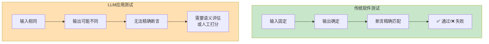
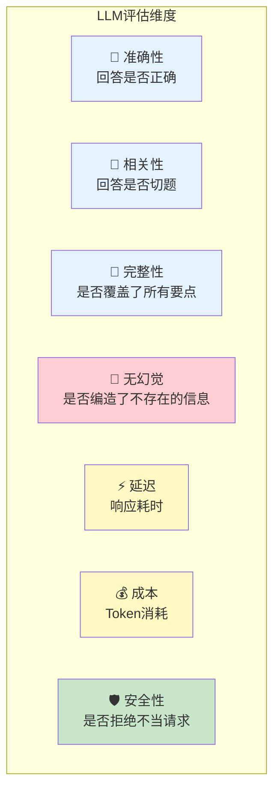
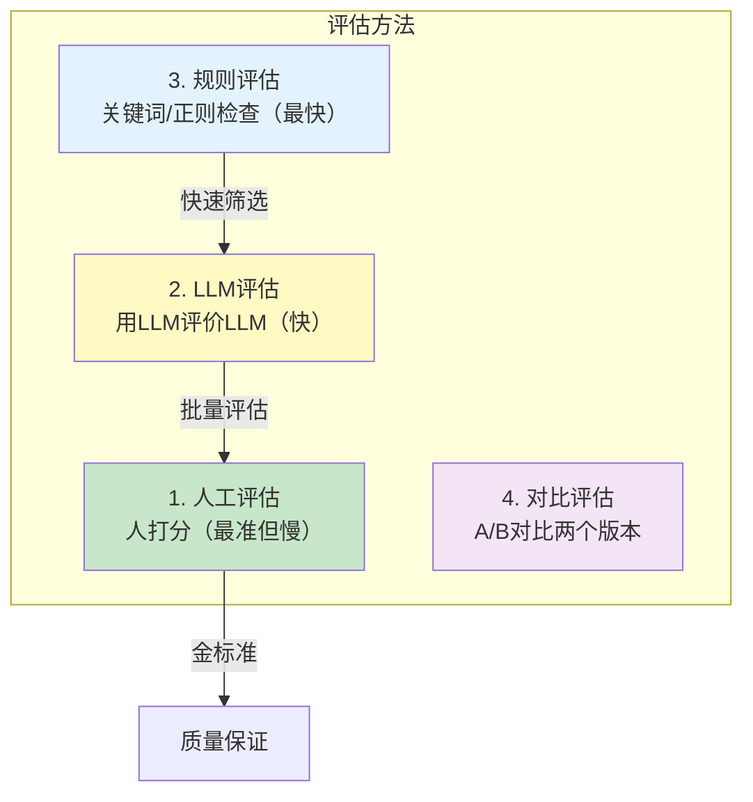
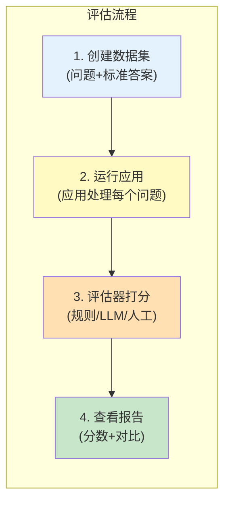
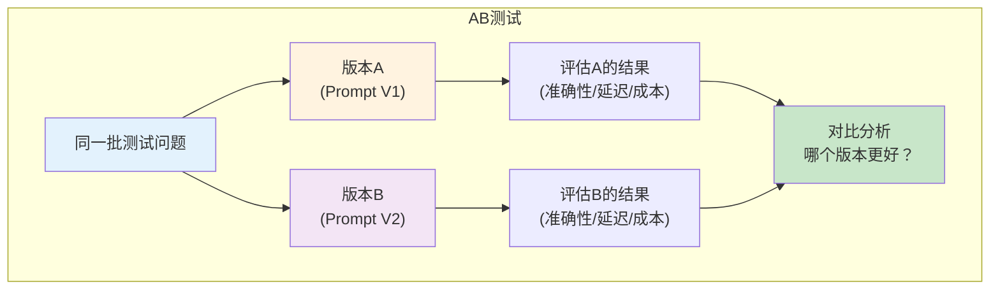
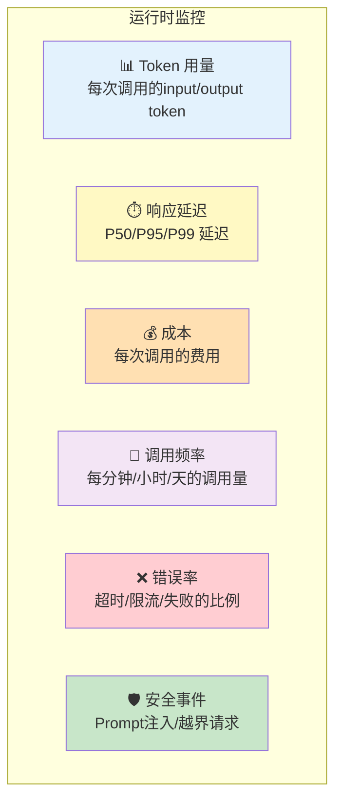
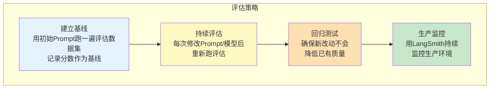

# LLM 应用评估与测试

> LLM 的输出是不确定的，传统单元测试不够用。这份指南教你系统化地评估和测试 LLM 应用。

---

## 一、为什么 LLM 测试与传统测试不同



核心挑战：同一个输入，LLM 可能给出不同的回答（尤其 temperature > 0 时），传统 `assert output == "expected"` 行不通。

## 二、评估维度



## 三、评估方法

### 3.1 方法总览



### 3.2 规则评估（最快）

```python
import re

def evaluate_by_rules(output: str, expected_keywords: list[str]) -> dict:
    """基于规则的简单评估"""
    result = &#123;
        "has_all_keywords": True,
        "missing_keywords": [],
        "length_ok": 50 <= len(output) <= 2000,
        "no_forbidden": True,
    &#125;
    
    for keyword in expected_keywords:
        if keyword.lower() not in output.lower():
            result["has_all_keywords"] = False
            result["missing_keywords"].append(keyword)
    
    return result

# 使用
output = "LangChain是一个用于构建LLM应用的开源框架..."
metrics = evaluate_by_rules(output, ["LangChain", "框架", "LLM"])
# &#123;"has_all_keywords": True, "missing_keywords": [], "length_ok": True, "no_forbidden": True&#125;
```

### 3.3 LLM 评估（推荐）

用一个 LLM 去评估另一个 LLM 的输出：

```python
from langchain_openai import ChatOpenAI
from langchain_core.prompts import ChatPromptTemplate
from langchain_core.output_parsers import JsonOutputParser
from pydantic import BaseModel, Field

llm = ChatOpenAI(model="gpt-4o-mini", temperature=0)

class EvaluationResult(BaseModel):
    accuracy: int = Field(description="准确性评分1-5")
    relevance: int = Field(description="相关性评分1-5")
    completeness: int = Field(description="完整性评分1-5")
    hallucination: bool = Field(description="是否疑似幻觉")
    reasoning: str = Field(description="评分理由")

def llm_evaluate(question: str, answer: str, context: str = "") -> dict:
    """用LLM评估回答质量"""
    parser = JsonOutputParser(pydantic_object=EvaluationResult)
    
    prompt = ChatPromptTemplate.from_template(
        """请评估以下问答对的质量。

问题：&#123;question&#125;
回答：&#123;answer&#125;
背景知识（如有）：&#123;context&#125;

评分标准（1=极差，5=完美）：
- accuracy: 回答是否正确
- relevance: 回答是否切题
- completeness: 是否覆盖了所有要点
- hallucination: 是否编造了背景知识中没有的信息

&#123;format_instructions&#125;"""
    )
    
    chain = prompt | llm | parser
    return chain.invoke(&#123;
        "question": question,
        "answer": answer,
        "context": context or "(无背景知识)",
        "format_instructions": parser.get_format_instructions(),
    &#125;)

# 使用
result = llm_evaluate(
    question="什么是RAG？",
    answer="RAG是检索增强生成，先检索再生成。",
    context="RAG（Retrieval-Augmented Generation）是一种先从知识库检索相关文档，再交给LLM生成回答的技术。"
)
# &#123;"accuracy": 5, "relevance": 5, "completeness": 3, "hallucination": false, "reasoning": "..."&#125;
```

### 3.4 人工评估（金标准）

```python
# 创建评估数据集
EVAL_DATASET = [
    &#123;
        "id": "q001",
        "question": "LangChain是什么？",
        "expected_keywords": ["框架", "LLM", "应用"],
        "reference_answer": "LangChain是一个用于构建LLM应用的开源框架",
        "notes": "回答应提到'框架'和'LLM应用'"
    &#125;,
    &#123;
        "id": "q002",
        "question": "什么是RAG？",
        "expected_keywords": ["检索", "生成", "增强"],
        "reference_answer": "RAG是检索增强生成技术",
        "notes": "应解释Retrieval-Augmented Generation"
    &#125;,
]

# 运行评估
def run_evaluation(chain, dataset: list) -> list:
    """对整个数据集运行评估"""
    results = []
    for item in dataset:
        answer = chain.invoke(&#123;"input": item["question"]&#125;)
        
        # 规则评估
        rule_result = evaluate_by_rules(answer, item["expected_keywords"])
        
        # LLM评估
        llm_result = llm_evaluate(item["question"], answer, item.get("reference_answer", ""))
        
        results.append(&#123;
            "id": item["id"],
            "question": item["question"],
            "answer": answer,
            "rule_check": rule_result,
            "llm_eval": llm_result,
        &#125;)
    
    return results
```

## 四、LangSmith 评估

### 4.1 LangSmith 评估流程



### 4.2 使用 LangSmith 的 Python API

```python
from langsmith import Client

client = Client()

# 1. 创建数据集
dataset = client.create_dataset("rag_eval_dataset", description="RAG系统评估")

# 2. 添加测试用例
test_cases = [
    &#123;"question": "LangChain是什么？", "answer": "一个LLM应用框架"&#125;,
    &#123;"question": "RAG的步骤有哪些？", "answer": "加载→分割→向量化→存储→检索→生成"&#125;,
]

for case in test_cases:
    client.create_example(
        inputs=&#123;"question": case["question"]&#125;,
        outputs=&#123;"answer": case["answer"]&#125;,
        dataset_id=dataset.id,
    )

# 3. 定义评估器
def accuracy_evaluator(run, example):
    """准确性评估器"""
    prediction = run.outputs.get("output", "")
    reference = example.outputs.get("answer", "")
    
    # 用LLM判断是否匹配
    result = llm_evaluate(example.inputs["question"], prediction, reference)
    score = result.get("accuracy", 0) / 5.0  # 归一化到0-1
    
    return &#123;
        "key": "accuracy",
        "score": score,
        "comment": result.get("reasoning", ""),
    &#125;

# 4. 运行评估（需要配置 LangSmith）
# results = client.run_on_dataset(
#     dataset_name="rag_eval_dataset",
#     llm_or_chain_factory=your_chain,
#     evaluation=RunEvalConfig(custom_evaluators=[accuracy_evaluator]),
# )
```

## 五、A/B 测试



```python
def ab_test(chain_a, chain_b, test_cases: list) -> dict:
    """对比两个Chain的输出质量"""
    results = &#123;"A": [], "B": []&#125;
    
    for case in test_cases:
        # 运行两个版本
        answer_a = chain_a.invoke(&#123;"input": case["question"]&#125;)
        answer_b = chain_b.invoke(&#123;"input": case["question"]&#125;)
        
        # 评估
        eval_a = llm_evaluate(case["question"], answer_a, case.get("answer", ""))
        eval_b = llm_evaluate(case["question"], answer_b, case.get("answer", ""))
        
        results["A"].append(eval_a)
        results["B"].append(eval_b)
    
    # 汇总
    avg_a = sum(e["accuracy"] for e in results["A"]) / len(results["A"])
    avg_b = sum(e["accuracy"] for e in results["B"]) / len(results["B"])
    
    return &#123;
        "A_avg_accuracy": avg_a,
        "B_avg_accuracy": avg_b,
        "winner": "A" if avg_a > avg_b else "B",
        "details": results,
    &#125;
```

## 六、性能监控指标



```python
import time
from langchain_core.callbacks import BaseCallbackHandler

class MetricsCallback(BaseCallbackHandler):
    """收集运行时指标"""
    def __init__(self):
        self.metrics = []
    
    def on_llm_start(self, serialized, prompts, **kwargs):
        self._start = time.time()
    
    def on_llm_end(self, response, **kwargs):
        elapsed = time.time() - self._start
        usage = response.llm_output.get("token_usage", &#123;&#125;) if response.llm_output else &#123;&#125;
        
        self.metrics.append(&#123;
            "latency": elapsed,
            "input_tokens": usage.get("prompt_tokens", 0),
            "output_tokens": usage.get("completion_tokens", 0),
            "total_tokens": usage.get("total_tokens", 0),
        &#125;)
    
    def summary(self) -> dict:
        """汇总统计"""
        if not self.metrics:
            return &#123;&#125;
        
        n = len(self.metrics)
        total_tokens = sum(m["total_tokens"] for m in self.metrics)
        latencies = sorted(m["latency"] for m in self.metrics)
        
        return &#123;
            "total_calls": n,
            "total_tokens": total_tokens,
            "avg_latency": sum(latencies) / n,
            "p50_latency": latencies[n // 2],
            "p95_latency": latencies[int(n * 0.95)],
            "estimated_cost": total_tokens * 0.00015 / 1000,  # GPT-4o-mini 估算
        &#125;

# 使用
metrics_cb = MetricsCallback()
llm = ChatOpenAI(model="gpt-4o-mini", callbacks=[metrics_cb])

# ... 运行应用 ...

# 查看统计
print(metrics_cb.summary())
# &#123;"total_calls": 10, "total_tokens": 5000, "avg_latency": 1.2, ...&#125;
```

## 七、评估最佳实践



| 实践 | 说明 | 何时做 |
|------|------|--------|
| 建立测试集 | 准备 20-50 个典型问答对 | 开发初期 |
| 建立基线 | 记录初始版本分数 | 开发初期 |
| 规则先行 | 先用规则评估快速筛选 | 每次改动 |
| LLM 兜底 | 规则通过的再用 LLM 评估 | 重要版本 |
| 人工抽检 | 抽取 10% 人工检查 | 发布前 |
| 生产监控 | 持续收集生产指标 | 上线后 |
