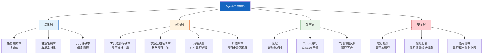
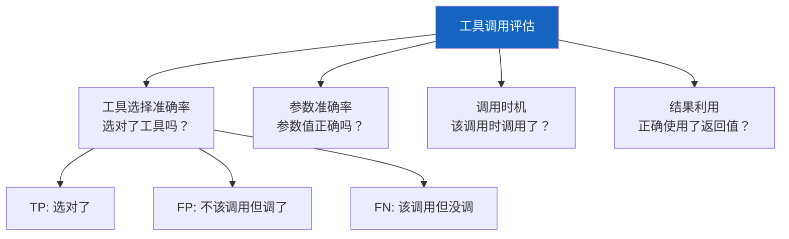

# Agent 评估与基准测试

> Agent 不同于单次 LLM 调用，它涉及多步推理、工具调用和动态决策。这份指南系统讲解如何评估 Agent 的表现，覆盖轨迹评估、工具调用准确率、端到端任务完成率等核心维度。

---

## 一、为什么 Agent 评估更难

```mermaid
graph TB
    subgraph 对比 &#123;"单次LLM调用 vs Agent"&#125;
        direction LR
        subgraph S1["单次LLM调用"]
            A1["输入prompt"] --> A2["LLM"] --> A3["输出"]
            A4["评估：对比标准答案"]
        end
        subgraph S2["Agent多步"]
            B1["输入任务"] --> B2["LLM推理"]
            B2 --> B3["调用工具A"]
            B3 --> B4["观察结果"]
            B4 --> B2
            B2 --> B5["调用工具B"]
            B5 --> B6["观察结果"]
            B6 --> B2
            B2 --> B7["最终回答"]
            B8["评估：轨迹+决策+工具+结果"]
        end
    end

    style S1 fill:#E3F2FD,stroke:#1565C0
    style S2 fill:#FFF3E0,stroke:#E65100
```

单次 LLM 调用只需评估最终输出质量。但 Agent 的评估必须覆盖三个层次：

| 层次 | 评估什么 | 难点 |
|------|----------|------|
| 最终结果 | 任务是否正确完成 | 同一任务可能有多条正确路径 |
| 决策轨迹 | 每步推理是否合理 | 中间步骤没有唯一正确答案 |
| 工具使用 | 工具选择和参数是否正确 | 参数细微差异可能都合理 |

---

## 二、评估维度全景



---

## 三、轨迹评估方法

### 3.1 轨迹匹配法

将 Agent 的实际执行轨迹与参考轨迹（专家标注）对比。

```mermaid
graph LR
    subgraph 参考轨迹 &#123;"专家参考轨迹"&#125;
        R1["检索知识库"] --> R2["调用计算器"] --> R3["生成答案"]
    end
    subgraph 实际轨迹 &#123;"Agent实际轨迹"&#125;
        A1["检索知识库"] --> A2["检索Web"] --> A3["调用计算器"] --> A4["生成答案"]
    end

    style 参考轨迹 fill:#E8F5E9
    style 实际轨迹 fill:#FFF3E0
```

```python
from typing import Literal

def evaluate_trajectory(
    actual_steps: list[dict],
    reference_steps: list[dict],
    mode: Literal["exact", "set", "orderless"] = "set",
) -> dict:
    """评估Agent轨迹与参考轨迹的匹配度。

    Args:
        actual_steps: Agent实际执行步骤 [&#123;action, input&#125;]
        reference_steps: 专家参考步骤 [&#123;action, input&#125;]
        mode: exact=精确顺序匹配, set=集合匹配(允许额外步骤), orderless=忽略顺序

    Returns:
        匹配率和冗余率
    """
    actual_actions = [s["action"] for s in actual_steps]
    reference_actions = [s["action"] for s in reference_steps]

    if mode == "exact":
        # 精确匹配：顺序和内容都要一致
        matches = sum(
            a == r for a, r in zip(actual_actions, reference_actions)
        )
        match_rate = matches / len(reference_actions) if reference_actions else 0

    elif mode == "set":
        # 集合匹配：参考步骤都被执行（顺序不限），允许额外步骤
        ref_set = set(reference_actions)
        act_set = set(actual_actions)
        matched = ref_set & act_set
        match_rate = len(matched) / len(ref_set) if ref_set else 0

    elif mode == "orderless":
        # 无序匹配：使用最长公共子序列
        match_rate = _lcs_ratio(actual_actions, reference_actions)

    # 冗余率：不在参考轨迹中的步骤比例
    extra = len(actual_actions) - len(reference_actions)
    redundancy_rate = max(0, extra) / len(actual_actions) if actual_actions else 0

    return &#123;
        "match_rate": round(match_rate, 4),
        "redundancy_rate": round(redundancy_rate, 4),
        "actual_steps": len(actual_actions),
        "reference_steps": len(reference_steps),
        "mode": mode,
    &#125;


def _lcs_ratio(a: list, b: list) -> float:
    """最长公共子序列占比"""
    m, n = len(a), len(b)
    dp = [[0] * (n + 1) for _ in range(m + 1)]
    for i in range(1, m + 1):
        for j in range(1, n + 1):
            if a[i - 1] == b[j - 1]:
                dp[i][j] = dp[i - 1][j - 1] + 1
            else:
                dp[i][j] = max(dp[i - 1][j], dp[i][j - 1])
    lcs_len = dp[m][n]
    return lcs_len / max(len(a), len(b), 1)
```

### 3.2 LLM-as-Judge 轨迹评估

当没有参考轨迹时，用 LLM 来评判 Agent 的每步决策质量。

```python
from langchain_core.language_models import BaseChatModel
from langchain_core.messages import HumanMessage

TRAJECTORY_JUDGE_PROMPT = """你是一个Agent评估专家。请评估以下Agent执行轨迹的每一步决策。

## 任务
&#123;task&#125;

## 执行轨迹
&#123;trajectory&#125;

## 评估标准
对每一步，从以下维度打分（1-5分）：
1. **决策合理性**：这一步的选择是否合理推进了任务
2. **工具选择**：是否选了最合适的工具
3. **参数质量**：工具参数是否准确
4. **信息利用**：是否有效利用了之前的观察结果

## 输出格式
```json
&#123;&#123;
  "steps": [
    &#123;&#123;
      "step": 1,
      "action": "...",
      "decision_score": 5,
      "tool_score": 4,
      "param_score": 5,
      "info_score": 4,
      "reason": "..."
    &#125;&#125;
  ],
  "overall_score": 4.3,
  "overall_reason": "...",
  "suggestions": ["建议1", "建议2"]
&#125;&#125;
```"""

async def judge_trajectory(
    llm: BaseChatModel,
    task: str,
    trajectory: list[dict],
) -> dict:
    """用LLM评估Agent轨迹质量。

    Args:
        llm: 评估用LLM
        task: 用户原始任务
        trajectory: [&#123;step, thought, action, input, observation&#125;]

    Returns:
        LLM评估结果
    """
    traj_text = "\n\n".join(
        f"### 步骤 &#123;s['step']&#125;\n"
        f"思考: &#123;s['thought']&#125;\n"
        f"动作: &#123;s['action']&#125;\n"
        f"输入: &#123;s['input']&#125;\n"
        f"观察: &#123;s['observation'][:200]&#125;..."
        for s in trajectory
    )

    prompt = TRAJECTORY_JUDGE_PROMPT.format(
        task=task,
        trajectory=traj_text,
    )

    response = await llm.ainvoke([HumanMessage(content=prompt)])
    return response.content
```

---

## 四、工具调用评估

### 4.1 工具调用准确率分解



### 4.2 实现

```python
from dataclasses import dataclass, field

@dataclass
class ToolCallEval:
    """单次工具调用评估"""
    expected_tool: str          # 应该调用的工具
    expected_args: dict         # 应该的参数
    actual_tool: str            # 实际调用的工具
    actual_args: dict           # 实际的参数

    @property
    def tool_correct(self) -> bool:
        return self.expected_tool == self.actual_tool

    @property
    def args_correct(self) -> bool:
        if not self.tool_correct:
            return False
        return self.expected_args == self.actual_args

    @property
    def partial_args_match(self) -> float:
        """参数部分匹配率"""
        if not self.expected_args:
            return 1.0
        matched = sum(
            self.actual_args.get(k) == v
            for k, v in self.expected_args.items()
        )
        return matched / len(self.expected_args)


def evaluate_tool_calls(
    evals: list[ToolCallEval],
) -> dict:
    """批量评估工具调用质量。

    Returns:
        包含各维度指标的字典
    """
    total = len(evals)
    if total == 0:
        return &#123;"error": "no evaluations"&#125;

    tool_correct = sum(e.tool_correct for e in evals)
    args_correct = sum(e.args_correct for e in evals)
    partial_scores = [e.partial_args_match for e in evals]

    return &#123;
        "total_calls": total,
        "tool_selection_accuracy": round(tool_correct / total, 4),
        "args_accuracy": round(args_correct / total, 4),
        "args_partial_match": round(sum(partial_scores) / total, 4),
        "failures": [
            &#123;
                "expected": e.expected_tool,
                "actual": e.actual_tool,
                "expected_args": e.expected_args,
                "actual_args": e.actual_args,
            &#125;
            for e in evals if not e.args_correct
        ],
    &#125;
```

---

## 五、端到端任务完成率

### 5.1 测试集设计

```mermaid
graph TB
    subgraph 测试集设计 &#123;"Agent测试集分层"&#125;
        T1["简单任务 30%<br/>1-2步即可完成<br/>如：查询天气"]
        T2["中等任务 50%<br/>3-5步<br/>如：检索+计算+总结"]
        T3["复杂任务 20%<br/>5+步+多工具<br/>如：研究+分析+报告"]
    end

    subgraph 标注 &#123;"每条测试用例标注"&#125;
        L1["任务描述"]
        L2["参考答案/参考轨迹"]
        L3["必备工具列表"]
        L4["禁用操作列表"]
        L5["成功标准<br/>精确匹配 or 包含 or LLM判定"]
    end

    style 测试集设计 fill:#E3F2FD
    style 标注 fill:#FFF9C4
```

### 5.2 端到端评估器

```python
from enum import Enum
from typing import Callable, Awaitable

class MatchType(str, Enum):
    EXACT = "exact"          # 精确匹配
    CONTAINS = "contains"    # 包�回包含关键词
    LLM_JUDGE = "llm_judge"  # LLM判定
    CUSTOM = "custom"        # 自定义函数

@dataclass
class AgentTestCase:
    """Agent测试用例"""
    task: str                           # 任务描述
    match_type: MatchType               # 匹配方式
    expected_answer: str | None = None  # 期望答案
    keywords: list[str] | None = None   # 关键词（contains模式）
    required_tools: list[str] = field(default_factory=list)  # 必须用到的工具
    forbidden_tools: list[str] = field(default_factory=list) # 禁止使用的工具
    max_steps: int = 15                 # 最大步数限制
    custom_checker: Callable | None = None  # 自定义检查函数


async def evaluate_agent_on_test(
    agent_run: Callable,  # async def agent_run(task) -> (answer, trajectory)
    test_case: AgentTestCase,
    judge_llm: BaseChatModel | None = None,
) -> dict:
    """对单个测试用例评估Agent表现。

    Args:
        agent_run: Agent执行函数，接收任务返回(答案, 轨迹)
        test_case: 测试用例
        judge_llm: LLM判定模式时使用的LLM

    Returns:
        评估结果
    """
    answer, trajectory = await agent_run(test_case.task)
    tools_used = [t["action"] for t in trajectory]
    num_steps = len(trajectory)

    # 1. 答案正确性
    answer_correct = False
    if test_case.match_type == MatchType.EXACT:
        answer_correct = answer.strip() == (test_case.expected_answer or "").strip()

    elif test_case.match_type == MatchType.CONTAINS:
        answer_correct = all(
            kw.lower() in answer.lower()
            for kw in (test_case.keywords or [])
        )

    elif test_case.match_type == MatchType.LLM_JUDGE and judge_llm:
        answer_correct = await _llm_judge_answer(
            judge_llm, test_case.task, answer, test_case.expected_answer
        )

    elif test_case.match_type == MatchType.CUSTOM and test_case.custom_checker:
        answer_correct = await test_case.custom_checker(answer, trajectory)

    # 2. 工具使用检查
    required_ok = all(t in tools_used for t in test_case.required_tools)
    forbidden_ok = not any(t in tools_used for t in test_case.forbidden_tools)

    # 3. 步数检查
    steps_ok = num_steps <= test_case.max_steps

    # 4. 综合判定
    passed = answer_correct and required_ok and forbidden_ok and steps_ok

    return &#123;
        "task": test_case.task,
        "passed": passed,
        "answer_correct": answer_correct,
        "required_tools_used": required_ok,
        "no_forbidden_tools": forbidden_ok,
        "within_step_limit": steps_ok,
        "actual_steps": num_steps,
        "answer": answer[:200],
    &#125;


async def _llm_judge_answer(
    llm: BaseChatModel,
    task: str,
    actual: str,
    expected: str | None,
) -> bool:
    """用LLM判定答案是否正确"""
    prompt = f"""判断以下答案是否正确回答了任务。

任务: &#123;task&#125;
参考答案: &#123;expected or '（无参考答案，请自行判断）'&#125;
实际答案: &#123;actual&#125;

只回答 "正确" 或 "错误"，然后简要说明理由。"""
    resp = await llm.ainvoke([HumanMessage(content=prompt)])
    return "正确" in resp.content[:10]


async def run_eval_suite(
    agent_run: Callable,
    test_cases: list[AgentTestCase],
    judge_llm: BaseChatModel | None = None,
) -> dict:
    """运行完整测试集，返回汇总报告"""
    results = []
    for tc in test_cases:
        result = await evaluate_agent_on_test(agent_run, tc, judge_llm)
        results.append(result)

    total = len(results)
    passed = sum(r["passed"] for r in results)

    return &#123;
        "total": total,
        "passed": passed,
        "pass_rate": round(passed / total, 4) if total else 0,
        "avg_steps": round(sum(r["actual_steps"] for r in results) / total, 1) if total else 0,
        "details": results,
    &#125;
```

---

## 六、回归测试与持续评估

```mermaid
graph TB
    subgraph CI &#123;"CI/CD中的Agent回归测试"&#125;
        DEV["开发者修改Agent"] --> COMMIT["提交代码"]
        COMMIT --> CI1["运行测试集<br/>100条用例"]
        CI1 --> COMPARE&#123;"对比上次结果"&#125;
        COMPARE -->|通过率不变或上升| PASS["✅ 通过"]
        COMPARE -->|通过率下降| FAIL["❌ 阻止合并<br/>显示退化用例"]
    end

    subgraph 基线 &#123;"评估基线管理"&#125;
        B1["v1.0基线<br/>pass_rate=0.82"]
        B2["v1.1基线<br/>pass_rate=0.85"]
        B3["v1.2基线<br/>pass_rate=0.83 → 回退"]
    end

    style CI fill:#E3F2FD
    style 基线 fill:#FFF9C4
```

### 6.1 基线对比实现

```python
import json
from pathlib import Path

class AgentEvalBaseline:
    """Agent评估基线管理"""

    def __init__(self, baseline_path: str = "agent_eval_baseline.json"):
        self.path = Path(baseline_path)
        self.data = self._load()

    def _load(self) -> dict:
        if self.path.exists():
            return json.loads(self.path.read_text())
        return &#123;"version": "", "pass_rate": 0, "details": []&#125;

    def save_baseline(self, eval_result: dict, version: str):
        """保存新的评估基线"""
        self.data = &#123;**eval_result, "version": version&#125;
        self.path.write_text(
            json.dumps(self.data, ensure_ascii=False, indent=2)
        )

    def compare(self, current: dict) -> dict:
        """对比当前结果与基线"""
        baseline_rate = self.data.get("pass_rate", 0)
        current_rate = current.get("pass_rate", 0)

        # 找出退化的用例
        baseline_tasks = &#123;
            d["task"]: d for d in self.data.get("details", [])
        &#125;
        regressions = []
        improvements = []

        for detail in current.get("details", []):
            task = detail["task"]
            if task in baseline_tasks:
                old_passed = baseline_tasks[task]["passed"]
                new_passed = detail["passed"]
                if old_passed and not new_passed:
                    regressions.append(&#123;
                        "task": task,
                        "old": "PASS",
                        "new": "FAIL",
                    &#125;)
                elif not old_passed and new_passed:
                    improvements.append(task)

        return &#123;
            "baseline_version": self.data.get("version", "unknown"),
            "baseline_pass_rate": baseline_rate,
            "current_pass_rate": current_rate,
            "delta": round(current_rate - baseline_rate, 4),
            "regressed_count": len(regressions),
            "improved_count": len(improvements),
            "regressions": regressions,
            "improvements": improvements,
            "should_block": len(regressions) > 0,
        &#125;
```

---

## 七、效率指标采集

```python
import time
import functools
from collections import defaultdict

class AgentMetricsCollector:
    """采集Agent运行过程中的效率指标"""

    def __init__(self):
        self.reset()

    def reset(self):
        self.metrics = &#123;
            "total_tokens": 0,
            "prompt_tokens": 0,
            "completion_tokens": 0,
            "tool_calls": defaultdict(int),
            "tool_call_count": 0,
            "llm_calls": 0,
            "start_time": None,
            "end_time": None,
        &#125;

    def __enter__(self):
        self.metrics["start_time"] = time.time()
        return self

    def __exit__(self, *args):
        self.metrics["end_time"] = time.time()
        return False

    def record_llm_call(self, usage: dict):
        """记录一次LLM调用的token使用"""
        self.metrics["llm_calls"] += 1
        self.metrics["prompt_tokens"] += usage.get("prompt_tokens", 0)
        self.metrics["completion_tokens"] += usage.get("completion_tokens", 0)
        self.metrics["total_tokens"] += usage.get("total_tokens", 0)

    def record_tool_call(self, tool_name: str):
        """记录一次工具调用"""
        self.metrics["tool_calls"][tool_name] += 1
        self.metrics["tool_call_count"] += 1

    def summary(self) -> dict:
        elapsed = 0
        if self.metrics["start_time"] and self.metrics["end_time"]:
            elapsed = self.metrics["end_time"] - self.metrics["start_time"]

        return &#123;
            "elapsed_seconds": round(elapsed, 2),
            "llm_calls": self.metrics["llm_calls"],
            "tool_call_count": self.metrics["tool_call_count"],
            "tool_calls_breakdown": dict(self.metrics["tool_calls"]),
            "total_tokens": self.metrics["total_tokens"],
            "prompt_tokens": self.metrics["prompt_tokens"],
            "completion_tokens": self.metrics["completion_tokens"],
            "tokens_per_second": round(
                self.metrics["total_tokens"] / elapsed, 1
            ) if elapsed > 0 else 0,
        &#125;
```

---

## 八、评估结果可视化

```mermaid
graph TB
    subgraph 报告 &#123;"Agent评估报告模板"&#125;
        R1["📊 总览<br/>通过率: 85%<br/>平均步数: 4.2<br/>平均Token: 3200"]
        R2["🔧 工具分析<br/>工具选择准确率: 92%<br/>参数准确率: 78%<br/>冗余调用: 15%"]
        R3["⚡ 效率分析<br/>平均延迟: 3.5s<br/>Token/任务: 3200<br/>调用次数: 4.2"]
        R4["⚠️ 问题诊断<br/>退化用例: 3<br/>最常见错误: 参数格式<br/>最冗余工具: web_search"]
    end

    style 报告 fill:#E3F2FD
```

---

## 九、与 LangSmith 集成

```python
from langsmith import Client

def export_to_langsmith(
    eval_results: dict,
    project_name: str = "agent-eval",
):
    """将评估结果导出到LangSmith追踪"""
    client = Client()

    for detail in eval_results.get("details", []):
        client.create_example(
            inputs=&#123;"task": detail["task"]&#125;,
            outputs=&#123;
                "passed": detail["passed"],
                "answer": detail["answer"],
                "steps": detail["actual_steps"],
            &#125;,
            dataset_name=f"&#123;project_name&#125;-dataset",
        )
```

---

## 十、最佳实践

```mermaid
graph TB
    subgraph 原则 &#123;"Agent评估五原则"&#125;
        P1["1.分层评估<br/>结果+过程+效率+安全<br/>不要只看最终答案"]
        P2["2.测试集分层<br/>简单/中等/复杂<br/>按比例覆盖"]
        P3["3.基线管理<br/>每次发版对比基线<br/>阻止退化"]
        P4["4.人在回路<br/>LLM-as-Judge+人工抽检<br/>LLM判定有偏差"]
        P5["5.持续收集<br/>线上失败案例→测试集<br/>形成飞轮"]
    end

    style 原则 fill:#E8F5E9
```

| 实践 | 说明 | 优先级 |
|------|------|--------|
| 建立评估基线 | 每个版本有固定的通过率基线，回归不降 | ★★★ |
| 测试集分层 | 按 3:5:2 比例分配简单/中等/复杂任务 | ★★★ |
| LLM-Judge + 人工抽检 | LLM 判定快但有偏差，人工抽检 10% 校准 | ★★☆ |
| 效率指标并行采集 | 在评估正确性的同时采集 Token、延迟、调用次数 | ★★☆ |
| 线上失败回流 | 收集线上失败案例，加入测试集，形成飞轮 | ★★☆ |
| 多模型对比 | 同一测试集跑不同底层模型，选最优 | ★☆☆ |

---

## 十一、检查清单

| 检查项 | 状态 |
|--------|------|
| 定义了至少 3 个评估维度（结果/过程/效率） | ☐ |
| 测试集按难度分层（简单/中等/复杂） | ☐ |
| 有参考轨迹或 LLM-as-Judge 方案 | ☐ |
| 工具调用准确率有自动化采集 | ☐ |
| 建立了评估基线并纳入 CI/CD | ☐ |
| 效率指标（Token/延迟/调用次数）已采集 | ☐ |
| 线上失败案例有回流到测试集的机制 | ☐ |
| 评估报告可自动生成 | ☐ |
