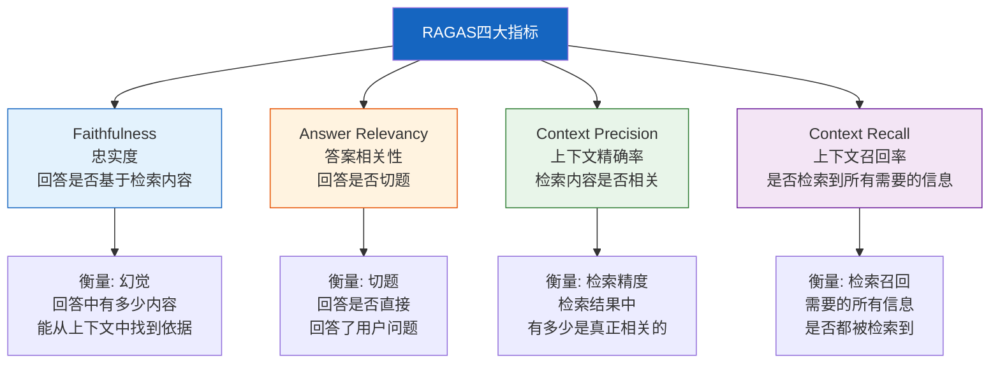

# RAGAS 评估框架实践

> RAGAS（RAG Assessment）是 RAG 评估的事实标准框架。它用 LLM-as-Judge 自动评估 RAG 系统的四大核心指标，无需人工标注。这份指南覆盖 RAGAS 的原理、安装、使用和与 LangChain 的集成。

---

## 一、为什么选择 RAGAS

```mermaid
graph TB
    subgraph 传统评估 &#123;"传统RAG评估的困难"&#125;
        T1["需要人工标注<br/>答案正确性判断"]
        T2["成本高<br/>每条样本都要专家看"]
        T3["不可扩展<br/>评估1000条要数天"]
        T4["主观偏差<br/>不同标注者标准不同"]
    end

    subgraph RAGAS &#123;"RAGAS解决方案"&#125;
        R1["LLM-as-Judge<br/>自动评估"]
        R2["无需人工标注<br/>只需原始四元组"]
        R3["可扩展<br/>1000条几分钟"]
        R4["标准化<br/>统一评估维度"]
    end

    style 传统评估 fill:#FFCDD2
    style RAGAS fill:#C8E6C9
```

---

## 二、RAGAS 四大核心指标



---

## 三、评估输入：四元组

RAGAS 需要四个输入字段，构成一个评估单元：

```mermaid
graph LR
    subgraph 四元组 &#123;"RAGAS评估输入"&#125;
        Q["question<br/>用户问题"]
        A["answer<br/>LLM生成的回答"]
        C["contexts<br/>检索到的上下文"]
        G["ground_truth<br/>标准答案（可选）"]
    end

    Q --> M1["→ Faithfulness"]
    A --> M1
    C --> M1

    Q --> M2["→ Answer Relevancy"]
    A --> M2

    Q --> M3["→ Context Precision"]
    C --> M3
    G --> M3

    Q --> M4["→ Context Recall"]
    C --> M4
    G --> M4

    style 四元组 fill:#E3F2FD
```

---

## 四、安装与基本用法

### 4.1 安装

```bash
pip install ragas langchain langchain-openai
```

### 4.2 基本评估

```python
from ragas import evaluate
from ragas.metrics import (
    faithfulness,
    answer_relevancy,
    context_precision,
    context_recall,
)
from datasets import Dataset
import os

os.environ["OPENAI_API_KEY"] = "sk-..."

# 准备评估数据
eval_data = &#123;
    "question": [
        "什么是RAG？",
        "向量数据库有哪些？",
        "如何优化RAG的检索质量？",
    ],
    "answer": [
        "RAG是检索增强生成，通过检索外部知识来增强LLM的回答能力。",
        "常见的向量数据库包括FAISS、Chroma、Milvus和Pinecone等。",
        "可以通过优化分块策略、使用混合检索和重排序来提升检索质量。",
    ],
    "contexts": [
        ["RAG（Retrieval-Augmented Generation）通过检索相关文档来增强LLM的回答。"],
        ["向量数据库包括FAISS、Chroma、Milvus、Pinecone、Weaviate等。"],
        ["RAG检索质量优化方法：更好的分块、混合检索、重排序、查询重写等。"],
    ],
    "ground_truth": [
        "RAG是检索增强生成技术，通过检索外部知识库中的相关文档来增强LLM的回答质量。",
        "常用向量数据库有FAISS、Chroma、Milvus、Pinecone、Weaviate、Qdrant等。",
        "优化RAG检索质量的方法包括分块策略优化、混合检索、结果重排序、查询重写和扩展。",
    ],
&#125;

# 转为Dataset
dataset = Dataset.from_dict(eval_data)

# 评估
results = evaluate(
    dataset,
    metrics=[
        faithfulness,
        answer_relevancy,
        context_precision,
        context_recall,
    ],
)

print(results)
# 输出: &#123;'faithfulness': 0.85, 'answer_relevancy': 0.92, ...&#125;
```

---

## 五、指标原理详解

### 5.1 Faithfulness（忠实度）

```mermaid
graph TB
    subgraph 忠实度 &#123;"忠实度计算流程"&#125;
        A["LLM回答"] --> SPLIT["拆分为陈述句"]
        SPLIT --> S1["陈述1: RAG通过检索增强生成"]
        SPLIT --> S2["陈述2: 它可以减少幻觉"]
        SPLIT --> S3["陈述3: RAG于2023年发明"]
        C["检索上下文"] --> CHECK["逐条验证:<br/>这个陈述能从上下文推断吗？"]
        S1 --> CHECK
        S2 --> CHECK
        S3 --> CHECK
        CHECK --> R["支持: 2条<br/>不支持: 1条"]
        R --> SCORE["忠实度 = 2/3 = 0.67"]
    end

    style CHECK fill:#FFF9C4
    style SCORE fill:#C8E6C9
```

```python
# 手动实现忠实度计算（理解原理）
from langchain_core.language_models import BaseChatModel
from langchain_core.messages import HumanMessage

FAITHFULNESS_PROMPT = """请判断以下陈述是否能从给定的上下文中推断出来。

上下文:
&#123;context&#125;

陈述:
&#123;statement&#125;

只回答"是"或"否"，然后简要说明理由。"""

async def compute_faithfulness(
    llm: BaseChatModel,
    answer: str,
    context: list[str],
) -> float:
    """计算忠实度: 回答中有多少内容能从上下文推断"""
    # 1. 将回答拆分为陈述句
    statements = [s.strip() for s in answer.split("。") if s.strip()]

    if not statements:
        return 1.0

    context_text = "\n".join(context)

    # 2. 逐条验证
    supported = 0
    for stmt in statements:
        prompt = FAITHFULNESS_PROMPT.format(context=context_text, statement=stmt)
        resp = await llm.ainvoke([HumanMessage(content=prompt)])
        if "是" in resp.content[:5]:
            supported += 1

    return supported / len(statements)
```

### 5.2 Answer Relevancy（答案相关性）

```mermaid
graph TB
    subgraph 相关性 &#123;"答案相关性计算流程"&#125;
        Q["用户问题"] --> GEN["从回答反向生成<br/>可能的原始问题"]
        A["LLM回答"] --> GEN
        GEN --> GQ1["生成问题1"]
        GEN --> GQ2["生成问题2"]
        GEN --> GQ3["生成问题3"]
        Q --> SIM["计算原始问题与<br/>生成问题的语义相似度"]
        GQ1 --> SIM
        GQ2 --> SIM
        GQ3 --> SIM
        SIM --> SCORE["相关性 = 平均相似度"]
    end

    style GEN fill:#FFF9C4
    style SCORE fill:#C8E6C9
```

### 5.3 Context Precision & Recall

```mermaid
graph TB
    subgraph 精确率 &#123;"Context Precision"&#125;
        C["检索到的N条上下文"] --> RANK["LLM对每条<br/>按相关性排序"]
        G["标准答案"] --> RANK
        RANK --> P["精确率: 相关的排在前面吗？"]
    end

    subgraph 召回率 &#123;"Context Recall"&#125;
        G["标准答案"] --> SPLIT["拆分为信息点"]
        SPLIT --> SP1["信息点1"]
        SPLIT --> SP2["信息点2"]
        C["检索到的上下文"] --> COVER["每个信息点<br/>能从上下文找到吗？"]
        SP1 --> COVER
        SP2 --> COVER
        COVER --> R["召回率: 找到几条/总几条"]
    end

    style 精确率 fill:#E3F2FD
    style 召回率 fill:#FFF3E0
```

---

## 六、与 LangChain RAG 集成

### 6.1 端到端 RAG 评估

```python
from langchain_openai import ChatOpenAI, OpenAIEmbeddings
from langchain_core.vectorstores import InMemoryVectorStore
from langchain_text_splitters import RecursiveCharacterTextSplitter
from ragas import evaluate
from ragas.metrics import faithfulness, answer_relevancy, context_precision, context_recall
from datasets import Dataset

class RAGRAGASEvaluator:
    """端到端RAG系统RAGAS评估器。

    将LangChain RAG系统的输出转为RAGAS格式，
    自动执行评估。
    """

    def __init__(
        self,
        llm: ChatOpenAI,
        vectorstore: InMemoryVectorStore,
        eval_llm: ChatOpenAI | None = None,
    ):
        self.llm = llm
        self.vectorstore = vectorstore
        # 评估用LLM（可与主LLM不同）
        self.eval_llm = eval_llm or ChatOpenAI(model="gpt-4o")

    async def run_rag(self, question: str) -> dict:
        """运行RAG获取回答和上下文"""
        # 检索
        docs = await self.vectorstore.asimilarity_search(question, k=3)
        contexts = [doc.page_content for doc in docs]

        # 生成
        context_text = "\n\n".join(contexts)
        prompt = f"基于以下信息回答问题。\n\n信息:\n&#123;context_text&#125;\n\n问题: &#123;question&#125;"

        response = await self.llm.ainvoke(prompt)
        answer = response.content

        return &#123;
            "question": question,
            "answer": answer,
            "contexts": contexts,
        &#125;

    async def evaluate_questions(
        self,
        test_cases: list[dict],  # [&#123;question, ground_truth&#125;]
    ) -> dict:
        """评估测试集

        Args:
            test_cases: 测试用例列表
            ground_truth可选（没有时跳过precision/recall）

        Returns:
            RAGAS评估结果
        """
        results = []
        for tc in test_cases:
            # 运行RAG
            rag_output = await self.run_rag(tc["question"])

            # 组装RAGAS输入
            entry = &#123;
                "question": tc["question"],
                "answer": rag_output["answer"],
                "contexts": rag_output["contexts"],
            &#125;
            if "ground_truth" in tc:
                entry["ground_truth"] = tc["ground_truth"]

            results.append(entry)

        # 转为Dataset
        dataset = Dataset.from_list(results)

        # 确定指标
        metrics = [faithfulness, answer_relevancy]
        if "ground_truth" in results[0]:
            metrics.extend([context_precision, context_recall])

        # 运行RAGAS
        eval_results = evaluate(dataset, metrics=metrics)

        return &#123;
            "overall": dict(eval_results),
            "per_question": dataset.to_pandas().to_dict("records"),
            "num_questions": len(test_cases),
        &#125;
```

### 6.2 评估不同 RAG 配置

```python
async def compare_rag_configs(
    documents: list[str],
    test_cases: list[dict],
    configs: dict[str, dict],  # &#123;name: &#123;chunk_size, k, ...&#125;&#125;
) -> dict:
    """对比不同RAG配置的RAGAS评分。

    用于系统性调优RAG参数。
    """
    from langchain_text_splitters import RecursiveCharacterTextSplitter

    all_results = &#123;&#125;

    for config_name, params in configs.items():
        # 用当前配置构建RAG
        splitter = RecursiveCharacterTextSplitter(
            chunk_size=params.get("chunk_size", 500),
            chunk_overlap=params.get("chunk_overlap", 50),
        )

        chunks = splitter.split_text("\n\n".join(documents))
        vectorstore = InMemoryVectorStore(OpenAIEmbeddings())
        await vectorstore.aadd_texts(chunks)

        evaluator = RAGRAGASEvaluator(
            llm=ChatOpenAI(model="gpt-4o"),
            vectorstore=vectorstore,
        )

        results = await evaluator.evaluate_questions(test_cases)
        all_results[config_name] = results["overall"]

        print(f"\n&#123;config_name&#125;:")
        for metric, score in results["overall"].items():
            print(f"  &#123;metric&#125;: &#123;score:.4f&#125;")

    return all_results

# 使用示例
configs = &#123;
    "small_chunks": &#123;"chunk_size": 200, "chunk_overlap": 20, "k": 5&#125;,
    "medium_chunks": &#123;"chunk_size": 500, "chunk_overlap": 50, "k": 3&#125;,
    "large_chunks": &#123;"chunk_size": 1000, "chunk_overlap": 100, "k": 2&#125;,
&#125;

# results = await compare_rag_configs(documents, test_cases, configs)
```

```mermaid
graph TB
    subgraph 对比 &#123;"RAG配置对比调优"&#125;
        C1["小块200字符<br/>k=5"] --> E1["RAGAS评分"]
        C2["中块500字符<br/>k=3"] --> E2["RAGAS评分"]
        C3["大块1000字符<br/>k=2"] --> E3["RAGAS评分"]
        E1 & E2 & E3 --> BEST["选最优配置"]
    end

    style BEST fill:#C8E6C9
```

---

## 七、自定义指标

```python
from ragas.metrics.base import Metric

class ConcisenessMetric(Metric):
    """简洁性指标: 回答是否简洁不冗余"""

    @property
    def name(self) -> str:
        return "conciseness"

    async def _ascore(self, row) -> float:
        answer = row["answer"]
        question = row["question"]

        prompt = f"""评估回答的简洁性。

问题: &#123;question&#125;
回答: &#123;answer&#125;

评分标准:
- 1.0: 完全切题，无冗余信息
- 0.5: 有一些无关内容
- 0.0: 大量无关内容

只输出0到1之间的数字。"""

        response = await self.eval_llm.ainvoke(prompt)
        try:
            score = float(response.content.strip())
            return max(0, min(1, score))
        except ValueError:
            return 0.5

# 使用自定义指标
# results = evaluate(dataset, metrics=[faithfulness, answer_relevancy, ConcisenessMetric()])
```

---

## 八、评估报告

```mermaid
graph TB
    subgraph 报告 &#123;"RAGAS评估报告模板"&#125;
        R1["总览<br/>四大指标评分"]
        R2["分项分析<br/>每条问题的详细评分"]
        R3["弱项诊断<br/>低分问题分析"]
        R4["优化建议<br/>基于弱项给出改进方向"]
    end

    style 报告 fill:#E3F2FD
```

```python
def generate_ragas_report(eval_results: dict) -> str:
    """生成RAGAS评估报告"""
    scores = eval_results["overall"]

    report = "# RAGAS 评估报告\n\n"
    report += "## 总览\n\n"
    report += "| 指标 | 评分 | 评价 |\n"
    report += "|------|------|------|\n"

    for metric, score in scores.items():
        if score >= 0.8:
            grade = "✅ 优秀"
        elif score >= 0.6:
            grade = "⚠️ 一般"
        else:
            grade = "❌ 需改进"
        report += f"| &#123;metric&#125; | &#123;score:.4f&#125; | &#123;grade&#125; |\n"

    # 弱项分析
    report += "\n## 弱项诊断\n\n"
    weakest = min(scores.items(), key=lambda x: x[1])
    report += f"最弱项: **&#123;weakest[0]&#125;** (&#123;weakest[1]:.4f&#125;)\n\n"

    suggestions = &#123;
        "faithfulness": "回答与上下文不一致，检查检索质量或Prompt引导",
        "answer_relevancy": "回答不切题，优化Prompt或增加查询理解",
        "context_precision": "检索结果不相关，优化嵌入模型或增加重排序",
        "context_recall": "检索遗漏信息，增加k值或优化分块策略",
    &#125;
    report += f"建议: &#123;suggestions.get(weakest[0], '具体分析问题')&#125;\n"

    return report
```

---

## 九、最佳实践

| 实践 | 说明 | 优先级 |
|------|------|--------|
| 评估用比生成更强的LLM | 评估LLM能力不足会导致评分偏差 | ★★★ |
| 评估集覆盖典型问题 | 包含简单/复杂/边界问题 | ★★★ |
| 每次改动后重新评估 | 形成回归基线，防止退化 | ★★☆ |
| 对比不同配置的评分 | 用RAGAS做参数调优的量化依据 | ★★☆ |
| 标准答案可选但推荐 | 有标准答案才能评估Precision/Recall | ★★☆ |
| 结合人工抽检 | RAGAS有偏差，10%人工校准 | ★☆☆ |

---

## 十、检查清单

| 检查项 | 状态 |
|--------|------|
| 理解四大指标的含义和计算原理 | ☐ |
| 能安装RAGAS并运行基本评估 | ☐ |
| 能将LangChain RAG输出转为RAGAS格式 | ☐ |
| 能用RAGAS对比不同RAG配置 | ☐ |
| 能自定义评估指标 | ☐ |
| 能生成评估报告 | ☐ |
| 有基于评估结果的优化流程 | ☐ |
