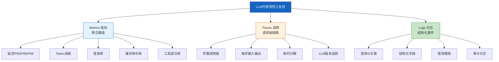
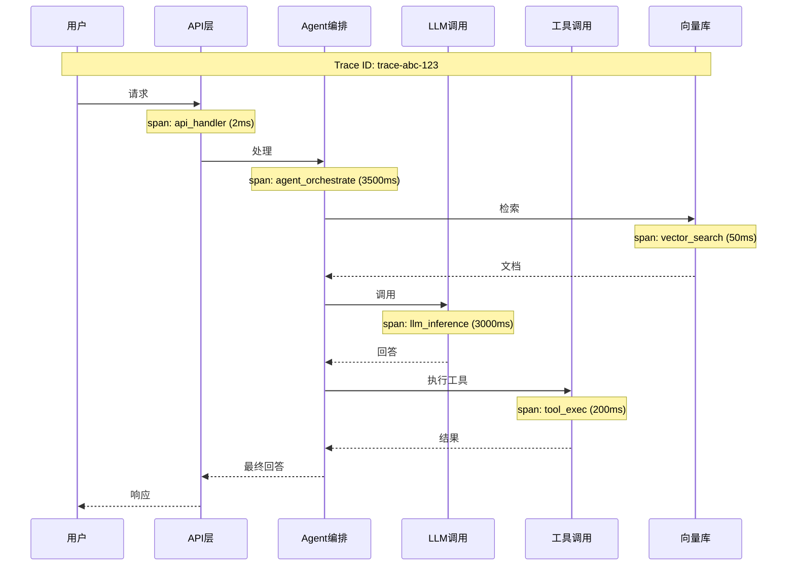

# LLM 应用可观测性体系

> LangSmith 解决了追踪问题，但生产级 LLM 应用需要完整的可观测性体系：指标（Metrics）、追踪（Traces）、日志（Logs）三位一体。这份指南讲透如何构建覆盖 LLM 调用、工具执行、向量检索的全链路可观测性。

---

## 一、可观测性三支柱



---

## 二、指标采集体系

### 2.1 核心指标分类

```mermaid
graph TB
    subgraph 指标 &#123;"LLM应用核心指标"&#125;
        P["性能指标"] --> P1["端到端延迟 P50/P95/P99"]
        P --> P2["首Token延迟 TTFT"]
        P --> P3["Token生成速率 TPS"]

        C["成本指标"] --> C1["每次请求Token数"]
        C --> C2["日/月总Token消耗"]
        C --> C3["每请求成本($/req)"]

        Q["质量指标"] --> Q1["工具调用成功率"]
        Q --> Q2["结构化输出解析成功率"]
        Q --> Q3["护栏触发率"]

        R["可靠性指标"] --> R1["错误率(5xx)"]
        R --> R2["超时率"]
        R --> R3["重试次数"]
        R --> R4["降级触发率"]
    end

    style 指标 fill:#E3F2FD
```

### 2.2 指标采集器

```python
import time
import functools
from collections import defaultdict
from dataclasses import dataclass, field
from typing import Callable, Any

@dataclass
class MetricPoint:
    """单个指标数据点"""
    name: str
    value: float
    tags: dict
    timestamp: float = field(default_factory=time.time)

class MetricsCollector:
    """LLM应用指标采集器。

    采用类似Prometheus的标签模型：
    - 每个指标带标签（model, endpoint, status等）
    - 支持Counter（累加）和Histogram（分布）
    """

    def __init__(self):
        self.counters: dict[str, dict[str, float]] = defaultdict(lambda: defaultdict(float))
        self.histograms: dict[str, list[float]] = defaultdict(list)
        self.gauges: dict[str, float] = &#123;&#125;

    def increment(self, name: str, value: float = 1, **tags):
        """Counter: 累加"""
        tag_key = self._tag_key(tags)
        self.counters[name][tag_key] += value

    def observe(self, name: str, value: float, **tags):
        """Histogram: 记录分布值"""
        self.histograms[name].append(value)
        self.increment(f"&#123;name&#125;_count", **tags)
        self.increment(f"&#123;name&#125;_sum", value, **tags)

    def set_gauge(self, name: str, value: float, **tags):
        """Gauge: 设置当前值"""
        self.gauges[name] = value

    def percentiles(self, name: str, percentiles: list[float] = [0.5, 0.95, 0.99]) -> dict:
        """计算百分位值"""
        values = sorted(self.histograms.get(name, []))
        if not values:
            return &#123;&#125;

        results = &#123;&#125;
        for p in percentiles:
            idx = int(len(values) * p)
            results[f"p&#123;int(p*100)&#125;"] = round(values[min(idx, len(values)-1)], 4)

        return results

    def summary(self) -> dict:
        """生成指标摘要"""
        return &#123;
            "counters": &#123;k: dict(v) for k, v in self.counters.items()&#125;,
            "gauges": dict(self.gauges),
            "histograms": &#123;
                name: self.percentiles(name)
                for name in self.histograms
            &#125;,
        &#125;

    @staticmethod
    def _tag_key(tags: dict) -> str:
        return ",".join(f"&#123;k&#125;=&#123;v&#125;" for k, v in sorted(tags.items()))

# 全局指标采集器
metrics = MetricsCollector()
```

### 2.3 LLM 调用指标装饰器

```python
def instrument_llm_call(collector: MetricsCollector):
    """LLM调用指标采集装饰器。

    自动采集：延迟、Token使用、成功率
    """
    def decorator(func):
        @functools.wraps(func)
        async def wrapper(*args, **kwargs):
            model = kwargs.get("model", "unknown")
            start = time.time()
            status = "success"

            try:
                result = await func(*args, **kwargs)

                # 采集Token使用
                if hasattr(result, "usage_metadata"):
                    usage = result.usage_metadata
                    collector.increment(
                        "llm_tokens_total",
                        usage.get("total_tokens", 0),
                        model=model, type="total",
                    )
                    collector.increment(
                        "llm_tokens_total",
                        usage.get("prompt_tokens", 0),
                        model=model, type="prompt",
                    )
                    collector.increment(
                        "llm_tokens_total",
                        usage.get("completion_tokens", 0),
                        model=model, type="completion",
                    )

                return result

            except Exception as e:
                status = "error"
                collector.increment("llm_errors_total", model=model, error=type(e).__name__)
                raise

            finally:
                elapsed = time.time() - start
                collector.observe(
                    "llm_latency_seconds", elapsed,
                    model=model, status=status,
                )
                collector.increment(
                    "llm_calls_total", model=model, status=status,
                )

        return wrapper
    return decorator

# 使用
from langchain_openai import ChatOpenAI

class InstrumentedLLM:
    """带指标采集的LLM包装器"""

    def __init__(self, model: str = "gpt-4o"):
        self.llm = ChatOpenAI(model=model)
        self.model = model

    @instrument_llm_call(metrics)
    async def ainvoke(self, messages, **kwargs):
        kwargs["model"] = self.model
        return await self.llm.ainvoke(messages, **kwargs)
```

---

## 三、结构化日志

```python
import logging
import json
import time
import uuid

class StructuredLogger:
    """结构化日志：每条日志是JSON对象。

    包含：时间戳、级别、消息、上下文字段、请求ID。
    便于在ELK/Loki中搜索和聚合。
    """

    def __init__(self, name: str):
        self.logger = logging.getLogger(name)
        self.request_context: dict = &#123;&#125;

    def set_request_context(self, request_id: str = None, **kwargs):
        """设置当前请求上下文"""
        self.request_context = &#123;
            "request_id": request_id or str(uuid.uuid4()),
            **kwargs,
        &#125;

    def clear_request_context(self):
        """清除请求上下文"""
        self.request_context = &#123;&#125;

    def log(self, level: str, message: str, **fields):
        """记录结构化日志"""
        entry = &#123;
            "timestamp": time.time(),
            "level": level,
            "message": message,
            **self.request_context,
            **fields,
        &#125;
        self.logger.log(
            getattr(logging, level.upper()),
            json.dumps(entry, ensure_ascii=False, default=str),
        )

    def info(self, message: str, **fields):
        self.log("INFO", message, **fields)

    def warning(self, message: str, **fields):
        self.log("WARNING", message, **fields)

    def error(self, message: str, **fields):
        self.log("ERROR", message, **fields)

# 使用
logger = StructuredLogger("llm_app")
logger.set_request_context(
    request_id="req-123",
    user_id="user-456",
    session_id="sess-789",
)

logger.info("LLM调用开始", model="gpt-4o", prompt_tokens=150)
logger.info("工具调用", tool="search", query="AI trends")
logger.error("LLM调用失败", error="timeout", timeout_seconds=30)
```

---

## 四、分布式追踪



```python
from dataclasses import dataclass, field
from typing import Any
import time
import uuid

@dataclass
class Span:
    """追踪中的一个Span（一段操作）"""
    span_id: str
    trace_id: str
    parent_id: str | None
    name: str
    start_time: float = field(default_factory=time.time)
    end_time: float | None = None
    attributes: dict = field(default_factory=dict)
    events: list[dict] = field(default_factory=list)

    @property
    def duration_ms(self) -> float:
        end = self.end_time or time.time()
        return round((end - self.start_time) * 1000, 2)

    def add_event(self, name: str, **attributes):
        self.events.append(&#123;
            "name": name,
            "timestamp": time.time(),
            "attributes": attributes,
        &#125;)

    def set_attribute(self, key: str, value: Any):
        self.attributes[key] = value

    def end(self):
        self.end_time = time.time()

class Tracer:
    """分布式追踪器。

    为每次请求创建Trace，
    每个操作创建Span，
    支持父子嵌套。
    """

    def __init__(self):
        self.spans: list[Span] = []
        self._current_span: Span | None = None

    def start_trace(self, name: str) -> Span:
        """开始新的Trace（根Span）"""
        trace_id = str(uuid.uuid4())
        span = Span(
            span_id=str(uuid.uuid4()),
            trace_id=trace_id,
            parent_id=None,
            name=name,
        )
        self.spans.append(span)
        self._current_span = span
        return span

    def start_span(self, name: str) -> Span:
        """开始子Span"""
        parent = self._current_span
        span = Span(
            span_id=str(uuid.uuid4()),
            trace_id=parent.trace_id if parent else str(uuid.uuid4()),
            parent_id=parent.span_id if parent else None,
            name=name,
        )
        self.spans.append(span)
        self._current_span = span
        return span

    def end_span(self, span: Span):
        """结束Span"""
        span.end()
        # 恢复父Span为当前
        if span.parent_id:
            self._current_span = next(
                (s for s in self.spans if s.span_id == span.parent_id),
                None,
            )
        else:
            self._current_span = None

    def get_trace(self, trace_id: str) -> list[Span]:
        """获取一个Trace的所有Span"""
        return [s for s in self.spans if s.trace_id == trace_id]

    def trace_summary(self) -> dict:
        """追踪摘要"""
        if not self.spans:
            return &#123;&#125;

        root = self.spans[0]
        return &#123;
            "trace_id": root.trace_id,
            "root_span": root.name,
            "total_duration_ms": root.duration_ms,
            "span_count": len(self.spans),
            "spans": [
                &#123;
                    "name": s.name,
                    "duration_ms": s.duration_ms,
                    "parent": s.parent_id,
                    "attributes": s.attributes,
                &#125;
                for s in self.spans
            ],
        &#125;

# 上下文管理器：自动创建Span
from contextlib import contextmanager

@contextmanager
def trace_span(tracer: Tracer, name: str, **attributes):
    """追踪Span上下文管理器"""
    span = tracer.start_span(name)
    for k, v in attributes.items():
        span.set_attribute(k, v)
    try:
        yield span
    finally:
        tracer.end_span(span)

# 使用
tracer = Tracer()

# 在Agent中使用追踪
async def traced_agent_call(question: str, llm):
    tracer.start_trace("agent_request")

    with trace_span(tracer, "vector_search", k=3):
        # 向量检索
        docs = await vectorstore.asimilarity_search(question, k=3)
        # Span自动记录耗时

    with trace_span(tracer, "llm_inference", model="gpt-4o"):
        response = await llm.ainvoke(question)

    return response.content
```

---

## 五、与 LangSmith 集成

```python
from langchain.callbacks.tracers import LangChainTracer
from langchain_core.callbacks import CallbackManager

def create_langsmith_callback():
    """创建LangSmith追踪回调"""
    tracer = LangChainTracer(
        project_name="production-agent",
        # 自动从环境变量读取LANGSMITH_API_KEY
    )
    return tracer

# 使用方式1: 通过回调
agent_with_tracing = create_react_agent(
    model,
    tools,
    # LangGraph自动集成LangSmith追踪
    # 设置环境变量即可:
    # LANGSMITH_TRACING=true
    # LANGSMITH_API_KEY=ls-xxx
    # LANGSMITH_PROJECT=production-agent
)

# 使用方式2: 手动追踪
from langchain_core.tracers.context import tracing_v2_enabled

async def traced_execution(question: str):
    with tracing_v2_enabled(project_name="production-agent"):
        result = await agent.ainvoke(&#123;
            "messages": [&#123;"role": "user", "content": question&#125;]
        &#125;)
    return result
```

```mermaid
graph TB
    subgraph 追踪层级 &#123;"LangSmith追踪层级"&#125;
        L1["Level 1: 请求追踪<br/>端到端一次Agent执行"]
        L1 --> L2["Level 2: 组件追踪<br/>LLM调用/工具调用/检索"]
        L2 --> L3["Level 3: 细节追踪<br/>Token使用/Prompt内容/返回内容"]

        L1 --> S1["端到端延迟"]
        L1 --> S2["总Token消耗"]
        L1 --> S3["成功率"]

        L2 --> S4["LLM延迟"]
        L2 --> S5["工具延迟"]
        L2 --> S6["检索延迟"]

        L3 --> S7["Prompt token数"]
        L3 --> S8["Completion token数"]
        L3 --> S9["工具参数和返回"]
    end

    style 追踪层级 fill:#E3F2FD
```

---

## 六、告警体系

```python
from dataclasses import dataclass
from enum import Enum

class AlertSeverity(str, Enum):
    INFO = "info"
    WARNING = "warning"
    CRITICAL = "critical"

@dataclass
class AlertRule:
    """告警规则"""
    name: str
    metric: str
    condition: str          # >, <, ==
    threshold: float
    severity: AlertSeverity
    window_seconds: int = 300  # 5分钟窗口

class AlertManager:
    """LLM应用告警管理"""

    def __init__(self, collector: MetricsCollector):
        self.collector = collector
        self.rules: list[AlertRule] = []
        self.alerts_sent: set[str] = set()

    def add_rule(self, rule: AlertRule):
        self.rules.append(rule)

    def check_and_alert(self) -> list[dict]:
        """检查所有规则，返回触发的告警"""
        triggered = []
        summary = self.collector.summary()

        for rule in self.rules:
            value = self._get_metric_value(summary, rule.metric)
            if value is None:
                continue

            is_triggered = self._evaluate_condition(
                rule.condition, value, rule.threshold
            )

            if is_triggered:
                alert_key = f"&#123;rule.name&#125;:&#123;rule.metric&#125;"
                alert = &#123;
                    "rule": rule.name,
                    "metric": rule.metric,
                    "value": value,
                    "threshold": rule.threshold,
                    "severity": rule.severity.value,
                    "message": f"&#123;rule.name&#125;: &#123;rule.metric&#125;=&#123;value&#125; &#123;rule.condition&#125; &#123;rule.threshold&#125;",
                &#125;
                triggered.append(alert)

        return triggered

    def _get_metric_value(self, summary: dict, metric: str) -> float | None:
        # 从摘要中提取指标值
        for category in ("counters", "gauges"):
            if metric in summary.get(category, &#123;&#125;):
                val = summary[category][metric]
                if isinstance(val, dict):
                    return sum(val.values())
                return val
        return None

    @staticmethod
    def _evaluate_condition(op: str, value: float, threshold: float) -> bool:
        if op == ">": return value > threshold
        if op == "<": return value < threshold
        if op == "==": return value == threshold
        return False

# 定义告警规则
alert_manager = AlertManager(metrics)
alert_manager.add_rule(AlertRule(
    name="LLM错误率过高",
    metric="llm_errors_total",
    condition=">",
    threshold=10,
    severity=AlertSeverity.CRITICAL,
))
```

---

## 七、仪表盘设计

```mermaid
graph TB
    subgraph 仪表盘 &#123;"LLM应用监控仪表盘"&#125;
        D1["实时指标面板<br/>QPS / 延迟 / 错误率"]
        D2["Token消耗面板<br/>日/周/月趋势<br/>按模型分解"]
        D3["延迟分布面板<br/>P50/P95/P99<br/>按组件分解"]
        D4["工具面板<br/>各工具调用次数<br/>成功率/延迟"]
        D5["告警面板<br/>活跃告警列表<br/>告警历史"]
    end

    style 仪表盘 fill:#E3F2FD
```

---

## 八、最佳实践

| 实践 | 说明 | 优先级 |
|------|------|--------|
| 每个请求有唯一ID | 贯穿日志/追踪/指标 | ★★★ |
| 关键路径必采追踪 | LLM调用+工具+检索 | ★★★ |
| 延迟看P95不看平均 | 平均值被异常值拉偏 | ★★★ |
| Token消耗实时监控 | 防止成本失控 | ★★☆ |
| 错误率告警在5分钟窗口 | 避免单次波动触发告警 | ★★☆ |
| 日志结构化为JSON | 便于搜索和聚合 | ★★☆ |
| 追踪采样而非全量 | 高QPS下全量追踪成本高 | ★☆☆ |

---

## 九、检查清单

| 检查项 | 状态 |
|--------|------|
| 实现了指标采集器 | ☐ |
| LLM调用有指标装饰器 | ☐ |
| 实现了结构化日志 | ☐ |
| 实现了分布式追踪 | ☐ |
| 集成了LangSmith | ☐ |
| 定义了告警规则 | ☐ |
| 有监控仪表盘 | ☐ |
| 延迟按P50/P95/P99展示 | ☐ |
| Token消耗有实时监控 | ☐ |
