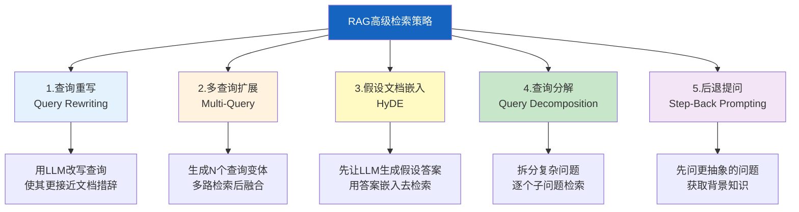
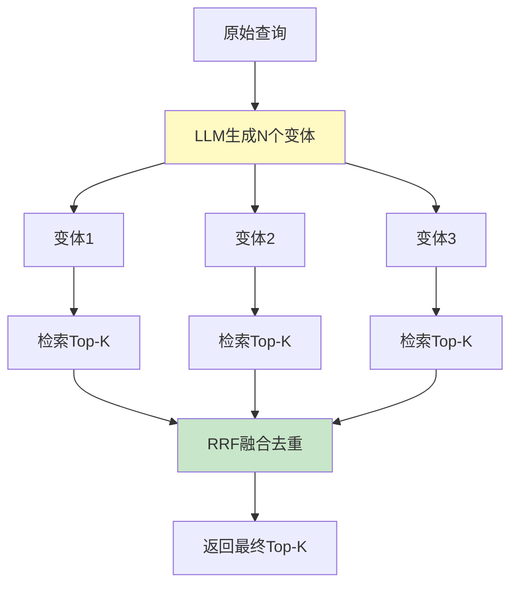
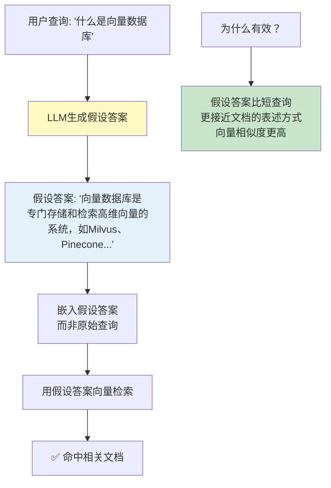
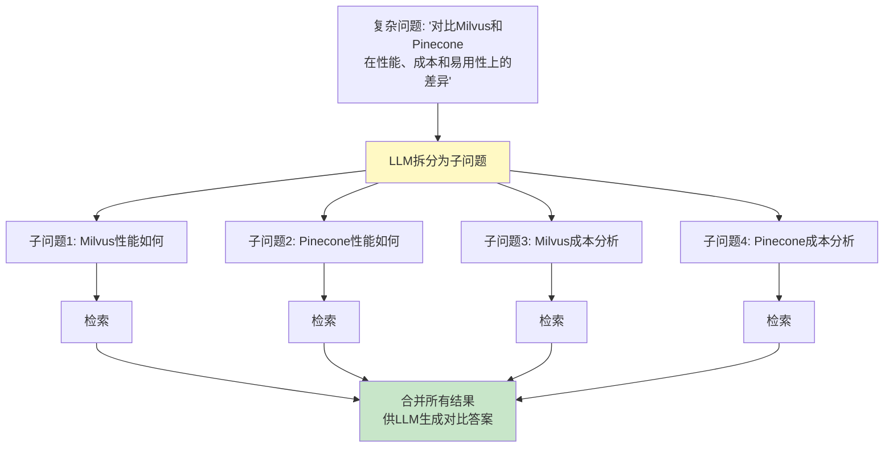
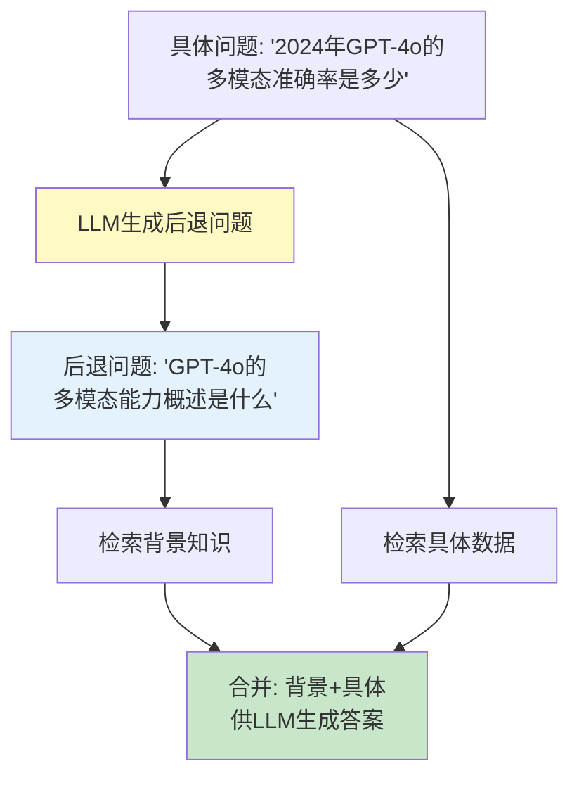

# RAG 高级检索策略：查询重写与扩展

> 用户问"怎么提升模型效果"时，知识库里写的是"如何提高模型性能"——措辞不同，语义相同，但向量检索可能召回不到。查询重写和扩展技术让 RAG 跨越措辞障碍，大幅提升召回率。这份指南覆盖 5 种核心策略的原理、实现和效果对比。

---

## 一、为什么需要查询重写

```mermaid
graph TB
    subgraph 问题 &#123;"直接检索的盲区"&#125;
        Q1["用户问: '怎么提升模型效果'"] --> E1["嵌入向量A"]
        D1["文档写: '如何提高模型性能'"] --> E2["嵌入向量B"]
        E1 --> SIM["cosine_sim = 0.78<br/>低于阈值"]
        SIM --> MISS["❌ 检索失败"]
    end

    subgraph 解决 &#123;"查询重写后"&#125;
        Q2["原始查询"] --> REWRITE["重写为多个变体"]
        REWRITE --> R1["'如何提高模型性能'"]
        REWRITE --> R2["'模型优化方法'"]
        REWRITE --> R3["'提升AI效果的技术'"]
        R1 & R2 & R3 --> SEARCH["多路检索"]
        SEARCH --> HIT["✅ 命中"]
    end

    style 问题 fill:#FFCDD2
    style 解决 fill:#C8E6C9
```

---

## 二、五种核心策略总览



---

## 三、策略1：查询重写

```python
from langchain_core.language_models import BaseChatModel
from langchain_core.messages import HumanMessage, SystemMessage
from langchain_core.vectorstores import VectorStore

REWRITE_PROMPT = """你是一个查询重写专家。请将用户查询重写为3个不同的表达方式，
使其更容易匹配到知识库中的相关文档。

要求：
1. 保持原意不变
2. 使用不同的措辞和术语
3. 覆盖同义词和近义词
4. 第一个重写最接近原始查询

用户查询: &#123;query&#125;

输出格式（每行一个）:
1. 重写查询1
2. 重写查询2
3. 重写查询3"""

async def rewrite_query(
    llm: BaseChatModel,
    query: str,
) -> list[str]:
    """用LLM重写查询为多个变体。

    Args:
        llm: 重写用LLM
        query: 原始查询

    Returns:
        重写后的查询列表（含原始查询）
    """
    prompt = REWRITE_PROMPT.format(query=query)
    response = await llm.ainvoke([HumanMessage(content=prompt)])

    # 解析输出
    lines = response.content.strip().split("\n")
    rewrites = []
    for line in lines:
        # 去掉编号前缀 "1. " "2. " 等
        cleaned = line.strip()
        for prefix in ["1. ", "2. ", "3. ", "1)", "2)", "3)", "- "]:
            if cleaned.startswith(prefix):
                cleaned = cleaned[len(prefix):]
                break
        if cleaned:
            rewrites.append(cleaned)

    # 原始查询始终包含
    return [query] + rewrites[:3]
```

---

## 四、策略2：多查询扩展检索



```python
from langchain_core.documents import Document
from langchain_core.vectorstores import VectorStore

class MultiQueryRetriever:
    """多查询扩展检索器。

    用LLM将原始查询扩展为多个变体，
    分别检索后用RRF融合结果。
    """

    def __init__(
        self,
        llm: BaseChatModel,
        vectorstore: VectorStore,
        num_queries: int = 4,
        k_per_query: int = 3,
    ):
        self.llm = llm
        self.vectorstore = vectorstore
        self.num_queries = num_queries
        self.k_per_query = k_per_query

    async def retrieve(self, query: str) -> list[Document]:
        """多查询检索。

        Args:
            query: 原始查询

        Returns:
            融合后的文档列表
        """
        # 1. 生成查询变体
        queries = await rewrite_query(self.llm, query)

        # 2. 多路检索
        all_results: list[list[Document]] = []
        for q in queries[:self.num_queries]:
            docs = await self.vectorstore.asimilarity_search(q, k=self.k_per_query)
            all_results.append(docs)

        # 3. RRF融合
        fused = self._rrf_fuse(all_results)

        return fused

    def _rrf_fuse(
        self,
        result_lists: list[list[Document]],
        k: int = 60,
        top_k: int = 5,
    ) -> list[Document]:
        """RRF（Reciprocal Rank Fusion）融合多路结果。

        对每个文档按排名倒数加权，
        多路都召回的文档得分更高。
        """
        scores: dict[str, float] = &#123;&#125;
        doc_map: dict[str, Document] = &#123;&#125;

        for result_list in result_lists:
            for rank, doc in enumerate(result_list):
                # 用文档内容hash作为唯一键
                doc_key = hash(doc.page_content[:200])
                rrf_score = 1.0 / (k + rank + 1)

                if doc_key in scores:
                    scores[doc_key] += rrf_score
                else:
                    scores[doc_key] = rrf_score
                    doc_map[doc_key] = doc

        # 按RRF分数排序
        sorted_keys = sorted(scores.keys(), key=lambda x: scores[x], reverse=True)
        return [doc_map[k] for k in sorted_keys[:top_k]]
```

---

## 五、策略3：假设文档嵌入



```python
HYDE_PROMPT = """请为以下问题生成一个简短的假设性回答（2-3句话）。
不需要准确，但要用专业术语表述。

问题: &#123;query&#125;

假设回答:"""

async def hyde_retrieve(
    llm: BaseChatModel,
    vectorstore: VectorStore,
    query: str,
    k: int = 3,
) -> list[Document]:
    """HyDE: 假设文档嵌入检索。

    1. 让LLM为查询生成假设答案
    2. 用假设答案（而非查询）嵌入向量
    3. 用假设答案的向量去检索

    原理：假设答案的表述方式更接近知识库文档，
    因此向量相似度比直接用短查询更高。

    Args:
        llm: 生成假设答案的LLM
        vectorstore: 向量库
        query: 用户查询
        k: 返回文档数

    Returns:
        检索到的文档
    """
    # 1. 生成假设答案
    prompt = HYDE_PROMPT.format(query=query)
    response = await llm.ainvoke([HumanMessage(content=prompt)])
    hypothetical_answer = response.content.strip()

    # 2. 用假设答案检索（而非原始查询）
    docs = await vectorstore.asimilarity_search(hypothetical_answer, k=k)

    return docs
```

---

## 六、策略4：查询分解



```python
DECOMPOSE_PROMPT = """你是一个问题分解专家。请将以下复杂问题拆分为2-4个更简单的子问题，
每个子问题可以独立检索和回答。

复杂问题: &#123;question&#125;

输出格式（每行一个子问题，带编号）:
1. 子问题1
2. 子问题2
..."""

async def decompose_query(
    llm: BaseChatModel,
    question: str,
) -> list[str]:
    """将复杂问题分解为子问题。

    Args:
        llm: 分解用LLM
        question: 复杂问题

    Returns:
        子问题列表
    """
    prompt = DECOMPOSE_PROMPT.format(question=question)
    response = await llm.ainvoke([HumanMessage(content=prompt)])

    lines = response.content.strip().split("\n")
    sub_questions = []
    for line in lines:
        cleaned = line.strip()
        # 去掉编号
        for i in range(1, 5):
            prefix = f"&#123;i&#125;. "
            if cleaned.startswith(prefix):
                cleaned = cleaned[len(prefix):]
                break
        if cleaned and len(cleaned) > 5:
            sub_questions.append(cleaned)

    return sub_questions


async def decomposed_retrieve(
    llm: BaseChatModel,
    vectorstore: VectorStore,
    question: str,
    k_per_subq: int = 2,
) -> list[Document]:
    """分解查询后多路检索。

    适合需要多方面信息才能回答的复杂问题。
    """
    sub_questions = await decompose_query(llm, question)

    all_docs: list[Document] = []
    seen = set()

    for sq in sub_questions:
        docs = await vectorstore.asimilarity_search(sq, k=k_per_subq)
        for doc in docs:
            key = hash(doc.page_content[:200])
            if key not in seen:
                seen.add(key)
                all_docs.append(doc)

    return all_docs
```

---

## 七、策略5：后退提问



```python
STEPBACK_PROMPT = """你是一个研究方法论专家。对于以下具体问题，请生成一个更抽象、更广泛的"后退问题"。

后退问题应该：
1. 比原问题更抽象、更广泛
2. 涵盖原问题的背景和上下文
3. 检索后退问题能获得回答原问题所需的背景知识

具体问题: &#123;question&#125;

后退问题:"""

async def stepback_retrieve(
    llm: BaseChatModel,
    vectorstore: VectorStore,
    question: str,
    k: int = 3,
) -> list[Document]:
    """后退提问检索。

    1. 用LLM将具体问题抽象为更广泛的后退问题
    2. 同时检索具体问题和后退问题
    3. 合并结果：背景知识+具体信息

    适合需要背景知识支撑的具体问题。
    """
    # 1. 生成后退问题
    prompt = STEPBACK_PROMPT.format(question=question)
    response = await llm.ainvoke([HumanMessage(content=prompt)])
    stepback_question = response.content.strip()

    # 2. 双路检索
    specific_docs = await vectorstore.asimilarity_search(question, k=k)
    background_docs = await vectorstore.asimilarity_search(stepback_question, k=k)

    # 3. 合并去重
    seen = set()
    all_docs = []
    for doc in specific_docs + background_docs:
        key = hash(doc.page_content[:200])
        if key not in seen:
            seen.add(key)
            all_docs.append(doc)

    return all_docs
```

---

## 八、策略对比与选型

```mermaid
graph TB
    Q["选择策略"] --> Q1&#123;"查询措辞与文档<br/>差异大？"&#125;
    Q1 -->|是| S1["查询重写 / Multi-Query"]
    Q1 -->|否| Q2&#123;"问题复杂<br/>需要多方面？"&#125;
    Q2 -->|是| S2["查询分解"]
    Q2 -->|否| Q3&#123;"需要背景知识<br/>才能回答？"&#125;
    Q3 -->|是| S3["后退提问"]
    Q3 -->|否| Q4&#123;"查询太短<br/>难以匹配？"&#125;
    Q4 -->|是| S4["HyDE"]
    Q4 -->|否| S5["直接检索"]

    style S1 fill:#E3F2FD
    style S2 fill:#C8E6C9
    style S3 fill:#F3E5F5
    style S4 fill:#FFF9C4
    style S5 fill:#E0E0E0
```

| 策略 | 额外LLM调用 | 适用场景 | 效果提升 | 成本 |
|------|------------|----------|----------|------|
| 查询重写 | 1次 | 措辞差异大 | ★★★ | 低 |
| Multi-Query | 1次 | 召回率不足 | ★★★ | 中（多路检索） |
| HyDE | 1次 | 短查询匹配差 | ★★☆ | 低 |
| 查询分解 | 1次 | 复杂多步问题 | ★★★ | 中（多路检索） |
| 后退提问 | 1次 | 需背景知识 | ★★☆ | 低 |

---

## 九、组合使用

```python
class AdvancedRAGRetriever:
    """高级RAG检索器：自动选择策略组合。

    根据查询特征自动选择最合适的检索策略。
    """

    def __init__(
        self,
        llm: BaseChatModel,
        vectorstore: VectorStore,
    ):
        self.llm = llm
        self.vectorstore = vectorstore

    async def retrieve(self, query: str, k: int = 5) -> list[Document]:
        """智能检索：根据查询特征选择策略。"""
        # 1. 判断查询复杂度
        is_complex = len(query) > 30 or "对比" in query or "比较" in query or "和" in query
        is_short = len(query) < 10

        if is_complex:
            # 复杂问题→分解
            return await decomposed_retrieve(self.llm, self.vectorstore, query)
        elif is_short:
            # 短查询→HyDE
            return await hyde_retrieve(self.llm, self.vectorstore, query)
        else:
            # 一般查询→Multi-Query
            retriever = MultiQueryRetriever(self.llm, self.vectorstore)
            return await retriever.retrieve(query)
```

---

## 十、评估检索效果

```python
async def evaluate_retrieval_strategies(
    llm: BaseChatModel,
    vectorstore: VectorStore,
    test_cases: list[dict],  # [&#123;query, expected_doc_ids&#125;]
) -> dict:
    """对比不同检索策略的召回率。"""
    from langchain_core.documents import Document

    strategies = &#123;
        "直接检索": lambda q: vectorstore.asimilarity_search(q, k=3),
        "查询重写": lambda q: _rewrite_retrieve(llm, vectorstore, q),
        "Multi-Query": lambda q: MultiQueryRetriever(llm, vectorstore).retrieve(q),
        "HyDE": lambda q: hyde_retrieve(llm, vectorstore, q),
        "查询分解": lambda q: decomposed_retrieve(llm, vectorstore, q),
        "后退提问": lambda q: stepback_retrieve(llm, vectorstore, q),
    &#125;

    results = &#123;&#125;
    for name, strategy_fn in strategies.items():
        recalls = []
        for tc in test_cases:
            docs = await strategy_fn(tc["query"])
            retrieved_ids = &#123;d.metadata.get("doc_id") for d in docs&#125;
            expected_ids = set(tc["expected_doc_ids"])
            recall = len(retrieved_ids & expected_ids) / len(expected_ids) if expected_ids else 0
            recalls.append(recall)

        results[name] = &#123;
            "avg_recall": round(sum(recalls) / len(recalls), 4),
            "min_recall": round(min(recalls), 4),
            "max_recall": round(max(recalls), 4),
        &#125;

    return results
```

---

## 十一、最佳实践

| 实践 | 说明 | 优先级 |
|------|------|--------|
| 默认用Multi-Query | 性价比最高，覆盖大部分场景 | ★★★ |
| 复杂问题用查询分解 | 多步问题拆分后检索更精准 | ★★☆ |
| HyDE适合短查询 | 假设答案比短查询更接近文档 | ★★☆ |
| 评估后再选策略 | 不同数据集最优策略不同 | ★★☆ |
| 控制LLM调用次数 | 每次重写都是一次LLM调用 | ★★☆ |
| RRF融合优于简单合并 | 按排名加权比去重合并更合理 | ★☆☆ |

---

## 十二、检查清单

| 检查项 | 状态 |
|--------|------|
| 理解查询重写的原理和价值 | ☐ |
| 实现了Multi-Query扩展检索 | ☐ |
| 理解HyDE的原理和适用场景 | ☐ |
| 能实现查询分解处理复杂问题 | ☐ |
| 能实现后退提问获取背景知识 | ☐ |
| 有检索策略选型决策 | ☐ |
| 评估了不同策略的召回率 | ☐ |
