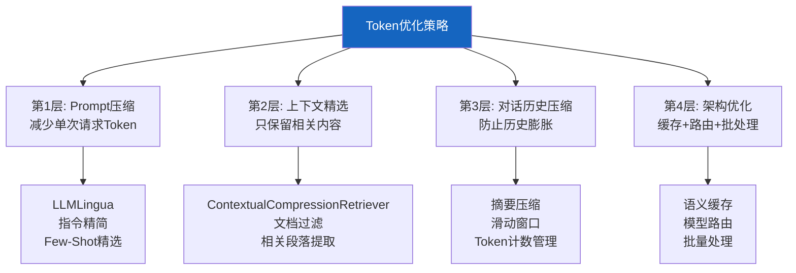

# Token 优化与上下文压缩技术

> LLM 应用的最大成本是 Token 消耗。检索回来的文档太长、对话历史不断膨胀、系统提示重复发送——这些都在浪费 Token。这份指南覆盖 Prompt 压缩、上下文窗口管理和对话历史压缩的完整技术栈，目标是降低 30-50% 的 Token 成本。

---

## 一、Token 成本全景

```mermaid
graph TB
    subgraph 成本 &#123;"Token消耗来源"&#125;
        C1["系统提示<br/>每次调用重复发送<br/>~500-2000 tokens"]
        C2["检索上下文<br/>RAG返回的文档<br/>~2000-8000 tokens"]
        C3["对话历史<br/>多轮对话累积<br/>~1000-10000+ tokens"]
        C4["用户输入<br/>原始查询<br/>~50-500 tokens"]
        C5["LLM输出<br/>生成的回答<br/>~200-2000 tokens"]
    end

    subgraph 优化空间 &#123;"最大优化空间"&#125;
        O1["检索上下文: 压缩+精选<br/>可减50%"]
        O2["对话历史: 摘要+截断<br/>可减70%"]
        O3["系统提示: 精简+缓存<br/>可减30%"]
    end

    style 成本 fill:#FFCDD2
    style 优化空间 fill:#C8E6C9
```

---

## 二、四层优化策略



---

## 三、第1层：Prompt 压缩

### 3.1 LLMLingua：用小模型压缩 Prompt

```mermaid
graph LR
    subgraph 压缩流程 &#123;"LLMLingua压缩流程"&#125;
        ORIGINAL["原始Prompt<br/>2000 tokens"] --> SMALL["小模型(GPT-4o-mini)"]
        SMALL --> SCORE["对每个token打重要性分"]
        SCORE --> FILTER["丢弃低重要性token"]
        FILTER --> COMPRESSED["压缩后Prompt<br/>800 tokens<br/>减少60%"]
        COMPRESSED --> BIG["大模型(GPT-4o)生成"]
    end

    style SMALL fill:#FFF9C4
    style COMPRESSED fill:#C8E6C9
    style BIG fill:#E3F2FD
```

```python
# LLMLingua: 用小模型压缩Prompt，用大模型生成
# 安装: pip install llmlingua

from llmlingua import PromptCompressor

class PromptCompressor:
    """使用LLMLingua压缩Prompt。

    核心思路：
    1. 用小模型（便宜）评估每个token的重要性
    2. 丢弃不重要的token（连词、修饰语等）
    3. 压缩后的Prompt发给大模型（贵）

    适用于：长系统提示、长文档上下文
    """

    def __init__(
        self,
        model_name: str = "microsoft/llmlingua-2-bert-base-multilingual-cased-meetingbank",
        rate: float = 0.5,  # 压缩率：保留50%
    ):
        self._compressor = PromptCompressor(model_name=model_name)
        self.rate = rate

    def compress(self, prompt: str) -> tuple[str, dict]:
        """压缩Prompt。

        Args:
            prompt: 原始Prompt

        Returns:
            (压缩后Prompt, 统计信息)
        """
        compressed = self._compressor.compress_prompt(
            prompt,
            rate=self.rate,
            force_tokens=["\n", "?", ".", "。"],
        )

        stats = &#123;
            "origin_tokens": compressed.get("origin_tokens", 0),
            "compressed_tokens": compressed.get("compressed_tokens", 0),
            "ratio": compressed.get("ratio", 0),
            "saving": compressed.get("saving", 0),
        &#125;

        return compressed.get("compressed_prompt", prompt), stats

    def compress_context(
        self,
        system_prompt: str,
        context: str,
        query: str,
    ) -> str:
        """压缩RAG上下文。

        只压缩检索回来的文档上下文，
        不压缩系统提示和用户查询。
        """
        compressed_ctx, stats = self.compress(context)

        return (
            f"&#123;system_prompt&#125;\n\n"
            f"## 检索到的信息（已压缩，原&#123;stats['origin_tokens']&#125;→"
            f"现&#123;stats['compressed_tokens']&#125; tokens）\n"
            f"&#123;compressed_ctx&#125;\n\n"
            f"## 用户问题\n&#123;query&#125;"
        )
```

### 3.2 指令精简

```python
# 原始Prompt vs 精简后
VERBOSE_PROMPT = """你是一个专业的AI助手。你的主要任务是帮助用户解答各种问题。
在回答问题时，请遵循以下原则：
1. 首先仔细阅读用户的问题，理解用户的真实意图
2. 基于提供的上下文信息来回答问题，不要编造信息
3. 如果上下文中有相关信息，请引用具体的来源
4. 如果上下文中没有足够的信息，请诚实地说"我不知道"
5. 回答要简洁明了，不要过多废话
6. 使用中文回答
"""  # ~200 tokens

CONCISE_PROMPT = """基于上下文回答问题。无信息则说"不知道"。中文回答。引用来源。"""
# ~20 tokens，节省90%
```

---

## 四、第2层：上下文精选

### 4.1 ContextualCompressionRetriever

```mermaid
graph TB
    subgraph 传统RAG &#123;"传统RAG"&#125;
        Q1["查询"] --> SEARCH1["向量检索Top-K"]
        SEARCH1 --> ALL["返回K个完整文档"]
        ALL --> LLM1["全部发给LLM<br/>可能含大量无关内容"]
    end

    subgraph 压缩RAG &#123;"压缩RAG"&#125;
        Q2["查询"] --> SEARCH2["向量检索Top-K"]
        SEARCH2 --> DOCS["K个文档"]
        DOCS --> COMPRESS["LLM/过滤器压缩"]
        COMPRESS --> RELEVANT["只保留相关段落"]
        RELEVANT --> LLM2["精选内容发给LLM<br/>Token大幅减少"]
    end

    style 传统RAG fill:#FFCDD2
    style 压缩RAG fill:#C8E6C9
    style COMPRESS fill:#FFF9C4
```

```python
from langchain.retrievers.document_compressors import LLMChainExtractor
from langchain.retrievers import ContextualCompressionRetriever
from langchain_core.vectorstores import VectorStore
from langchain_core.language_models import BaseChatModel

def create_compression_retriever(
    base_retriever: VectorStore,
    llm: BaseChatModel,
):
    """创建上下文压缩检索器。

    工作流程：
    1. 先用向量检索获取Top-K文档
    2. 用LLM从每个文档中提取与查询相关的部分
    3. 只返回相关部分，丢弃无关内容

    效果：Token消耗减少50-80%
    """
    # LLM驱动的文档压缩器
    compressor = LLMChainExtractor.from_llm(llm)

    # 包装为基础检索器的压缩层
    compression_retriever = ContextualCompressionRetriever(
        base_compressor=compressor,
        base_retriever=base_retriever.as_retriever(search_kwargs=&#123;"k": 10&#125;),
    )

    return compression_retriever

# 使用
# retriever = create_compression_retriever(vectorstore, llm)
# docs = await retriever.ainvoke("查询内容")
# 返回的文档已被压缩，只包含与查询相关的部分
```

### 4.2 文档分块再精选

```python
async def retrieve_and_filter(
    vectorstore: VectorStore,
    llm: BaseChatModel,
    query: str,
    initial_k: int = 10,
    final_k: int = 3,
) -> list:
    """两阶段检索：先多检索，再精选。

    1. 第一阶段：检索较多文档（initial_k）
    2. 第二阶段：用LLM评估每个文档的相关性
    3. 只保留最相关的final_k个
    """
    from langchain_core.messages import HumanMessage

    # 第一阶段：多检索
    docs = await vectorstore.asimilarity_search(query, k=initial_k)

    # 第二阶段：LLM精选
    doc_summaries = "\n".join(
        f"[&#123;i&#125;] &#123;doc.page_content[:200]&#125;"
        for i, doc in enumerate(docs)
    )

    rank_prompt = f"""以下是检索到的文档片段。请按与查询的相关性排序，输出最相关的&#123;final_k&#125;个文档的编号。

查询: &#123;query&#125;

文档:
&#123;doc_summaries&#125;

输出格式: 只输出编号，用逗号分隔，如: 0,3,5"""

    response = await llm.ainvoke([HumanMessage(content=rank_prompt)])

    # 解析编号
    import re
    numbers = re.findall(r'\d+', response.content)
    selected_indices = [int(n) for n in numbers[:final_k] if int(n) < len(docs)]

    # 兜底：如果解析失败，取前final_k个
    if not selected_indices:
        selected_indices = list(range(min(final_k, len(docs))))

    return [docs[i] for i in selected_indices]
```

---

## 五、第3层：对话历史压缩

```mermaid
graph TB
    subgraph 压缩前 &#123;"对话历史膨胀"&#125;
        H1["第1轮: 500 tokens"]
        H2["第2轮: 800 tokens"]
        H3["第3轮: 1200 tokens"]
        H4["第4轮: 2000 tokens"]
        H5["第5轮: 3500 tokens"]
        H1 & H2 & H3 & H4 & H5 --> TOTAL["总计: 8000 tokens<br/>每次请求都重复发送"]
    end

    subgraph 压缩后 &#123;"摘要压缩"&#125;
        S1["早期对话→摘要<br/>500 tokens"]
        S2["最近2轮原文<br/>1500 tokens"]
        S1 & S2 --> TOTAL2["总计: 2000 tokens<br/>减少75%"]
    end

    style 压缩前 fill:#FFCDD2
    style 压缩后 fill:#C8E6C9
```

```python
from langchain_core.language_models import BaseChatModel
from langchain_core.messages import HumanMessage, SystemMessage, AIMessage
from dataclasses import dataclass

@dataclass
class ConversationCompressor:
    """对话历史压缩器。

    当对话超过阈值时，自动将早期对话摘要化。
    """

    llm: BaseChatModel
    max_recent_messages: int = 6       # 保留最近N条原文
    max_summary_tokens: int = 500     # 摘要最大Token数
    compression_threshold: int = 10    # 超过N条时触发压缩

    async def compress_if_needed(
        self,
        messages: list,
    ) -> list:
        """如果对话历史过长，压缩早期消息。"""
        if len(messages) <= self.compression_threshold:
            return messages

        # 分割：早期消息 vs 最近消息
        early_messages = messages[:-self.max_recent_messages]
        recent_messages = messages[-self.max_recent_messages:]

        # 检查是否已有摘要
        has_summary = (
            len(early_messages) > 0
            and isinstance(early_messages[0], SystemMessage)
            and "对话摘要" in early_messages[0].content
        )

        if has_summary:
            # 将旧摘要 + 新的早期消息一起重新摘要
            old_summary = early_messages[0]
            new_to_summarize = early_messages[1:]
            to_summarize = [old_summary] + new_to_summarize
        else:
            to_summarize = early_messages

        if not to_summarize:
            return recent_messages

        # 生成摘要
        summary = await self._summarize(to_summarize)

        # 组装压缩后的消息
        return [
            SystemMessage(content=f"## 早期对话摘要\n&#123;summary&#125;"),
            *recent_messages,
        ]

    async def _summarize(self, messages: list) -> str:
        """将消息列表压缩为摘要。"""
        conversation = "\n".join(
            f"&#123;'用户' if isinstance(m, HumanMessage) else '助手'&#125;: &#123;m.content[:200]&#125;"
            for m in messages
            if isinstance(m, (HumanMessage, AIMessage))
        )

        prompt = f"""请将以下对话压缩为简洁摘要，保留关键信息、用户意图和重要结论。
摘要不超过&#123;self.max_summary_tokens&#125;个Token。

对话:
&#123;conversation&#125;

摘要:"""

        response = await self.llm.ainvoke([HumanMessage(content=prompt)])
        return response.content
```

---

## 六、第4层：架构优化

### 6.1 Token 预算管理

```python
import tiktoken

class TokenBudgetManager:
    """Token预算管理器。

    在发送给LLM前计算总Token数，
    如果超出预算则触发压缩。
    """

    def __init__(
        self,
        model: str = "gpt-4o",
        max_tokens: int = 8000,  # 上下文窗口的70%留给输入
    ):
        self.encoder = tiktoken.encoding_for_model(model)
        self.max_tokens = max_tokens

    def count_tokens(self, text: str) -> int:
        """计算文本的Token数"""
        return len(self.encoder.encode(text))

    def count_messages_tokens(self, messages: list) -> int:
        """计算消息列表的总Token数"""
        total = 0
        for msg in messages:
            # 每条消息有固定开销
            total += 4  # role + content标记
            total += self.count_tokens(msg.content if hasattr(msg, 'content') else str(msg))
        total += 2  # 结束标记
        return total

    def fits_budget(self, messages: list) -> bool:
        """检查是否在Token预算内"""
        return self.count_messages_tokens(messages) <= self.max_tokens

    def trim_to_budget(
        self,
        messages: list,
        keep_system: bool = True,
    ) -> list:
        """裁剪消息到预算内。

        从最早的消息开始删除（保留系统消息）。
        """
        if self.fits_budget(messages):
            return messages

        # 分离系统消息和对话消息
        system_msgs = []
        conv_msgs = []
        for msg in messages:
            if isinstance(msg, SystemMessage) and keep_system:
                system_msgs.append(msg)
            else:
                conv_msgs.append(msg)

        # 从最早的对话消息开始删除
        while conv_msgs and not self.fits_budget(system_msgs + conv_msgs):
            conv_msgs.pop(0)

        return system_msgs + conv_msgs
```

### 6.2 语义缓存减少重复调用

```python
# 与知识库116-语义缓存层设计配合
# 相似查询直接返回缓存结果，完全不消耗Token

class TokenAwareCache:
    """Token感知缓存：统计节省的Token数。"""

    def __init__(self, semantic_cache):
        self.cache = semantic_cache
        self.saved_tokens = 0

    async def lookup_or_call(
        self,
        query: str,
        llm_call: callable,  # 实际LLM调用
        token_counter: callable = None,
    ):
        """先查缓存，未命中再调用LLM。"""
        # 查缓存
        entry, score = await self.cache.lookup(query)
        if entry:
            # 命中：统计节省的Token
            if token_counter:
                self.saved_tokens += token_counter(entry.answer)
            return entry.answer, &#123;"cached": True, "score": score&#125;

        # 未命中：调用LLM
        result = await llm_call(query)
        answer = result.content if hasattr(result, 'content') else str(result)

        # 存入缓存
        await self.cache.store(query, answer)

        return answer, &#123;"cached": False&#125;
```

---

## 七、效果评估

```python
async def evaluate_token_optimization(
    llm: BaseChatModel,
    vectorstore: VectorStore,
    test_queries: list[str],
) -> dict:
    """对比优化前后的Token消耗。"""
    import tiktoken
    encoder = tiktoken.encoding_for_model("gpt-4o")

    results = &#123;"baseline": [], "optimized": []&#125;

    for query in test_queries:
        # Baseline: 直接检索全部文档
        docs = await vectorstore.asimilarity_search(query, k=5)
        baseline_context = "\n\n".join(d.page_content for d in docs)
        baseline_tokens = len(encoder.encode(baseline_context))
        results["baseline"].append(baseline_tokens)

        # Optimized: 压缩检索
        compressed_docs = await retrieve_and_filter(
            vectorstore, llm, query, initial_k=10, final_k=3
        )
        optimized_context = "\n\n".join(d.page_content for d in compressed_docs)
        optimized_tokens = len(encoder.encode(optimized_context))
        results["optimized"].append(optimized_tokens)

    avg_baseline = sum(results["baseline"]) / len(test_queries)
    avg_optimized = sum(results["optimized"]) / len(test_queries)

    return &#123;
        "avg_baseline_tokens": round(avg_baseline),
        "avg_optimized_tokens": round(avg_optimized),
        "reduction_ratio": round(1 - avg_optimized / avg_baseline, 4),
        "tokens_saved_per_query": round(avg_baseline - avg_optimized),
    &#125;
```

---

## 八、成本节省估算

```mermaid
graph TB
    subgraph 估算 &#123;"月度Token成本节省估算"&#125;
        BEFORE["优化前<br/>每请求8000 tokens<br/>日均1000请求<br/>月度240M tokens<br/>月成本$1200"]
        AFTER["优化后<br/>压缩50%→4000 tokens<br/>缓存命中30%→等效2800 tokens<br/>月度84M tokens<br/>月成本$420"]
        BEFORE --> SAVING["节省65%<br/>月省$780"]
    end

    style BEFORE fill:#FFCDD2
    style AFTER fill:#C8E6C9
    style SAVING fill:#FFF9C4
```

---

## 九、最佳实践

| 实践 | 节省比例 | 实施难度 | 优先级 |
|------|----------|----------|--------|
| 精简系统提示 | 10-20% | 低 | ★★★ |
| ContextualCompressionRetriever | 30-50% | 中 | ★★★ |
| 对话历史摘要压缩 | 50-70% | 中 | ★★★ |
| 语义缓存 | 20-40% | 高 | ★★☆ |
| LLMLingua Prompt压缩 | 30-60% | 中 | ★★☆ |
| 两阶段检索精选 | 20-40% | 低 | ★★☆ |
| Token预算管理 | 防止超限 | 低 | ★★☆ |

---

## 十、检查清单

| 检查项 | 状态 |
|--------|------|
| 精简了系统提示 | ☐ |
| 实现了ContextualCompressionRetriever | ☐ |
| 实现了对话历史压缩 | ☐ |
| 有Token预算管理 | ☐ |
| 评估了优化前后的Token消耗 | ☐ |
| 配合语义缓存减少重复调用 | ☐ |
| 月度Token成本有监控 | ☐ |
