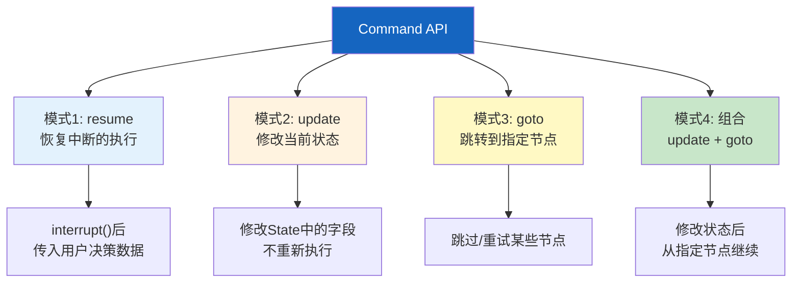

```mermaid
sequenceDiagram
    participant U as 用户
    participant A as Agent
    participant T as send_email工具

    U->>A: 发邮件给张三
    A->>T: 调用send_email
    T-->>A: interrupt()暂停
    A-->>U: 等待审批
    Note over U: 用户决定批准
    U->>A: Command(resume=&#123;approved: True&#125;)
    A->>T: 恢复执行，approval=&#123;approved: True&#125;
    T-->>A: 邮件已发送
    A-->>U: 完成
```

# LangGraph Command API 与高级状态管理

> LangGraph 的 Command API 是控制图执行的高级接口：中断后恢复、动态修改状态、从特定节点重启。这份指南讲透 Command 的四种模式、update_state 的用法和时间旅行的实现。

---

## 一、Command 解决什么问题

```mermaid
graph TB
    subgraph 没有Command &#123;"没有Command时"&#125;
        N1["图执行到一半"] --> N2["想修改状态？<br/>❌ 需要重新执行"]
        N3["interrupt后恢复"] --> N4["想传入额外数据？<br/>❌ 只能从输入重跑"]
        N5["想从第3步重新开始"] --> N6["❌ 只能从头执行"]
    end

    subgraph 有Command &#123;"有Command后"&#125;
        C1["Command(resume=data)<br/>✅ 恢复执行+传数据"]
        C2["Command(update=state)<br/>✅ 动态修改状态"]
        C3["Command(goto=node)<br/>✅ 跳转到指定节点"]
    end

    style 没有Command fill:#FFCDD2
    style 有Command fill:#C8E6C9
```

---

## 二、Command 四种模式



---

## 三、模式1：resume 恢复中断

```python
from langgraph.types import Command, interrupt
from langgraph.graph import StateGraph, START, END
from langgraph.checkpoint.memory import MemorySaver
from langgraph.prebuilt import create_react_agent
from langchain_core.tools import tool
from typing import TypedDict, Annotated
from langgraph.graph.message import add_messages

@tool
def send_email(to: str, subject: str) -> str:
    """发送邮件——需要人工审批"""
    # 中断执行，等待人工决策
    approval = interrupt(&#123;
        "type": "email_approval",
        "to": to,
        "subject": subject,
    &#125;)
    if approval.get("approved"):
        return f"邮件已发送给&#123;to&#125;"
    return "邮件被拒绝发送"

# 创建带检查点的Agent
agent = create_react_agent(
    model,
    [send_email],
    checkpointer=MemorySaver(),
)

config = &#123;"configurable": &#123;"thread_id": "email-1"&#125;&#125;

# 第一次调用——会中断在send_email处
result1 = agent.invoke(
    &#123;"messages": [&#123;"role": "user", "content": "给张三发邮件，主题'项目更新'"&#125;]&#125;,
    config,
)
# → 返回interrupt信息

# 用Command恢复——传入审批结果
result2 = agent.invoke(
    Command(resume=&#123;"approved": True&#125;),
    config,
)
# → Agent继续执行，send_email收到approval
```



---

## 四、模式2：update 动态修改状态

```python
from langgraph.types import Command

# 在图执行过程中动态修改状态
# 不需要重新执行已完成的节点

class State(TypedDict):
    messages: Annotated[list, add_messages]
    user_tier: str  # 用户等级
    approved: bool

async def check_tier(state: State) -> dict:
    """检查用户等级"""
    return &#123;"user_tier": "standard"&#125;

async def process_request(state: State) -> dict:
    """处理请求"""
    if state["user_tier"] == "vip":
        return &#123;"messages": [&#123;"role": "ai", "content": "VIP快速处理"&#125;]&#125;
    return &#123;"messages": [&#123;"role": "ai", "content": "标准处理"&#125;]&#125;

graph = StateGraph(State)
graph.add_node("check_tier", check_tier)
graph.add_node("process", process_request)
graph.add_edge(START, "check_tier")
graph.add_edge("check_tier", "process")
graph.add_edge("process", END)

app = graph.compile(checkpointer=MemorySaver())

config = &#123;"configurable": &#123;"thread_id": "user-1"&#125;&#125;

# 第一次执行
result = app.invoke(
    &#123;"messages": [&#123;"role": "user", "content": "处理我的请求"&#125;], "user_tier": ""&#125;,
    config,
)
# → "标准处理"

# 用Command.update修改用户等级（不重新执行）
app.invoke(
    Command(update=&#123;"user_tier": "vip"&#125;),
    config,
)
# 状态中user_tier现在是"vip"

# 再次执行时使用新状态
result2 = app.invoke(
    &#123;"messages": [&#123;"role": "user", "content": "再处理一次"&#125;]&#125;,
    config,
)
# → "VIP快速处理"
```

---

## 五、模式3：goto 跳转

```python
from langgraph.types import Command

# Command(goto=...)可以跳转到指定节点
# 用于：跳过某些步骤、重试某些步骤

async def step_a(state: State) -> dict:
    return &#123;"messages": [&#123;"role": "ai", "content": "步骤A完成"&#125;]&#125;

async def step_b(state: State) -> dict:
    return &#123;"messages": [&#123;"role": "ai", "content": "步骤B完成"&#125;]&#125;

async def step_c(state: State) -> dict:
    return &#123;"messages": [&#123;"role": "ai", "content": "步骤C完成"&#125;]&#125;

# 条件路由：可以返回Command决定下一步去哪
async def router(state: State) -> Command:
    """根据条件决定下一步"""
    last_msg = state["messages"][-1].content
    if "重试" in last_msg:
        # 跳回到step_a重试
        return Command(goto="step_a")
    return Command(goto="step_b")

graph = StateGraph(State)
graph.add_node("step_a", step_a)
graph.add_node("router", router)
graph.add_node("step_b", step_b)
graph.add_node("step_c", step_c)

graph.add_edge(START, "step_a")
graph.add_edge("step_a", "router")
graph.add_edge("step_b", "step_c")
graph.add_edge("step_c", END)
# router节点返回Command(goto=...)决定下一步

app = graph.compile(checkpointer=MemorySaver())
```

---

## 六、模式4：update + goto 组合

```python
from langgraph.types import Command

# 修改状态后跳转到指定节点
# 典型场景：人工修改中间结果后从某步重新执行

# 在interrupt后，同时修改状态和指定恢复点
result = app.invoke(
    Command(
        update=&#123;"messages": [&#123;"role": "user", "content": "改用方案B"&#125;]&#125;,
        goto="step_b",  # 从step_b重新开始
    ),
    config,
)
```

---

## 七、update_state：外部修改状态

```mermaid
graph TB
    subgraph 外部修改 &#123;"update_state用法"&#125;
        S1["图已执行到step_c"] --> EXT["外部调用update_state"]
        EXT --> MOD["修改State中的字段"]
        MOD --> NEXT["下次invoke时使用新状态"]
    end

    subgraph 场景 &#123;"典型场景"&#125;
        SC1["人工修正中间结果"]
        SC2["调试时注入测试数据"]
        SC3["管理员覆盖某些决策"]
    end

    style 外部修改 fill:#E3F2FD
    style 场景 fill:#FFF9C4
```

```python
# update_state: 不执行图，只修改状态
config = &#123;"configurable": &#123;"thread_id": "debug-1"&#125;&#125;

# 查看当前状态
state = app.get_state(config)
print(f"当前状态: &#123;state.values&#125;")

# 修改状态
app.update_state(
    config,
    values=&#123;"user_tier": "vip", "approved": True&#125;,
    # as_node: 模拟从某个节点更新（影响下一步路由）
    as_node="check_tier",
)

# 验证修改
state = app.get_state(config)
print(f"修改后状态: &#123;state.values&#125;")

# 继续执行（会用修改后的状态）
result = app.invoke(None, config)  # None表示继续执行
```

---

## 八、时间旅行

```mermaid
graph TB
    subgraph 时间旅行 &#123;"LangGraph时间旅行"&#125;
        S1["步骤1完成<br/>checkpoint-1"]
        S1 --> S2["步骤2完成<br/>checkpoint-2"]
        S2 --> S3["步骤3完成<br/>checkpoint-3"]
        S3 --> S4["步骤4完成<br/>checkpoint-4"]

        S4 --> TRAVEL["回退到checkpoint-2"]
        TRAVEL --> MOD["修改状态"]
        MOD --> RERUN["从checkpoint-2重新执行"]
    end

    style TRAVEL fill:#FFF9C4
    style RERUN fill:#C8E6C9
```

```python
# 时间旅行：回到历史检查点

config = &#123;"configurable": &#123;"thread_id": "travel-1"&#125;&#125;

# 执行图
app.invoke(&#123;"messages": [&#123;"role": "user", "content": "开始"&#125;]&#125;, config)

# 查看所有检查点
history = list(app.get_state_history(config))
for i, state in enumerate(history):
    print(f"Checkpoint &#123;i&#125;: next=&#123;state.next&#125;, values_keys=&#123;list(state.values.keys())&#125;")

# 回退到第3个检查点
target_state = history[2]

# 从该检查点重新执行
result = app.invoke(
    None,  # None表示继续执行
    &#123;**config, "checkpoint_id": target_state.config["configurable"]["checkpoint_id"]&#125;,
)
# 图会从target_state的next节点开始重新执行
```

---

## 九、完整示例：带人工审批的工作流

```python
from langgraph.graph import StateGraph, START, END
from langgraph.types import Command, interrupt
from langgraph.checkpoint.memory import MemorySaver
from typing import TypedDict, Annotated
from langgraph.graph.message import add_messages

class WorkflowState(TypedDict):
    messages: Annotated[list, add_messages]
    draft: str
    approved: bool
    final: str

async def generate_draft(state: WorkflowState) -> dict:
    """生成草稿"""
    return &#123;"draft": f"关于&#123;state['messages'][-1].content&#125;的草稿..."&#125;

async def human_review(state: WorkflowState) -> Command:
    """人工审批——中断等待"""
    decision = interrupt(&#123;
        "type": "review",
        "draft": state["draft"],
        "question": "草稿是否通过？",
    &#125;)

    if decision.get("action") == "approve":
        return Command(
            update=&#123;"approved": True&#125;,
            goto="finalize",
        )
    elif decision.get("action") == "edit":
        return Command(
            update=&#123;
                "draft": decision.get("content", state["draft"]),
                "approved": True,
            &#125;,
            goto="finalize",
        )
    else:
        # 拒绝——回到草稿生成
        return Command(goto="generate_draft")

async def finalize(state: WorkflowState) -> dict:
    """最终输出"""
    return &#123;
        "final": f"最终版: &#123;state['draft']&#125;",
        "messages": [&#123;"role": "ai", "content": f"最终版: &#123;state['draft']&#125;"&#125;],
    &#125;

# 构建图
graph = StateGraph(WorkflowState)
graph.add_node("generate_draft", generate_draft)
graph.add_node("human_review", human_review)
graph.add_node("finalize", finalize)

graph.add_edge(START, "generate_draft")
graph.add_edge("generate_draft", "human_review")
graph.add_edge("finalize", END)

app = graph.compile(checkpointer=MemorySaver())

# 使用
config = &#123;"configurable": &#123;"thread_id": "wf-1"&#125;&#125;

# 第一次调用——中断在human_review
result = app.invoke(
    &#123;"messages": [&#123;"role": "user", "content": "季度报告"&#125;]&#125;,
    config,
)

# 审批通过
result = app.invoke(
    Command(resume=&#123;"action": "approve"&#125;),
    config,
)
# → finalize节点执行，返回最终结果

# 或者要求修改
result = app.invoke(
    Command(resume=&#123;"action": "edit", "content": "修改后的草稿内容..."&#125;),
    config,
)
# → 用修改后内容执行finalize
```

---

## 十、最佳实践

| 实践 | 说明 | 优先级 |
|------|------|--------|
| interrupt必须有checkpointer | 没有检查点，中断无法恢复 | ★★★ |
| resume的数据要校验 | 人工传入的数据不可信 | ★★☆ |
| goto的目标节点必须存在 | 跳转到不存在的节点会报错 | ★★☆ |
| 时间旅行用于调试 | 生产环境慎用回退 | ★☆☆ |
| update_state用于人工修正 | 管理员修正错误的中间结果 | ★★☆ |

---

## 十一、检查清单

| 检查项 | 状态 |
|--------|------|
| 理解Command的四种模式 | ☐ |
| 能用resume恢复interrupt | ☐ |
| 能用update动态修改状态 | ☐ |
| 能用goto跳转节点 | ☐ |
| 理解update_state的用法 | ☐ |
| 能实现时间旅行调试 | ☐ |
| 能构建带人工审批的完整工作流 | ☐ |
