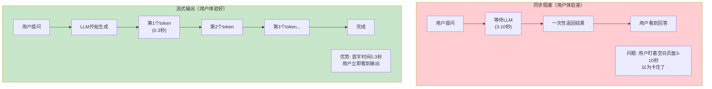
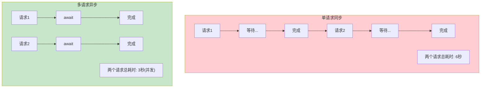
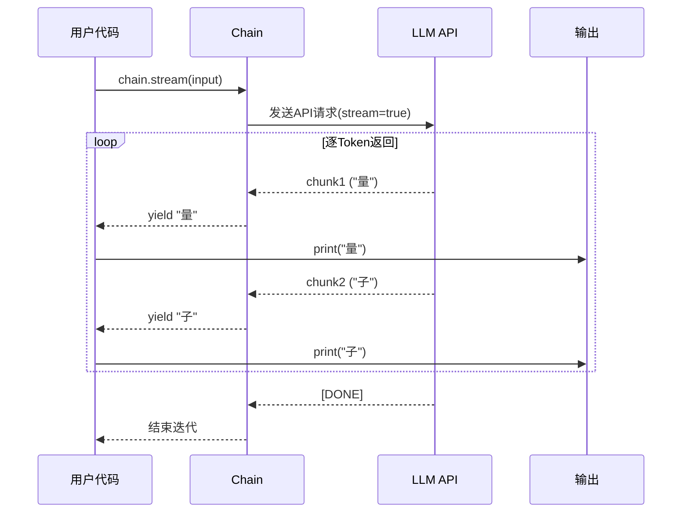
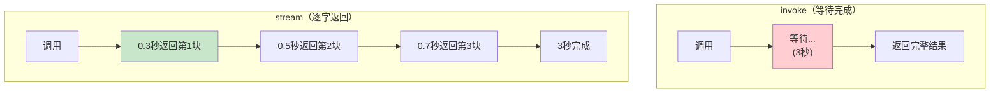
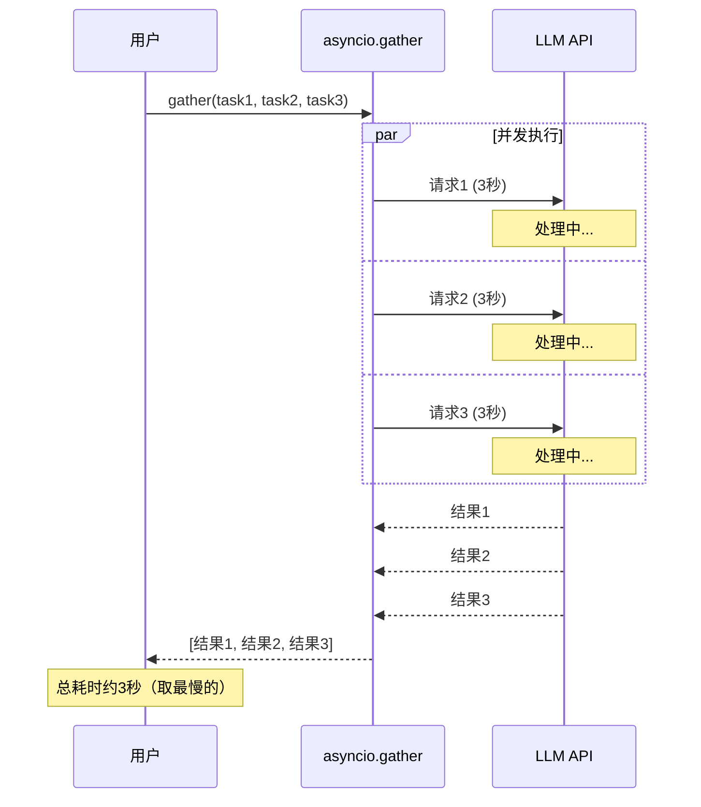
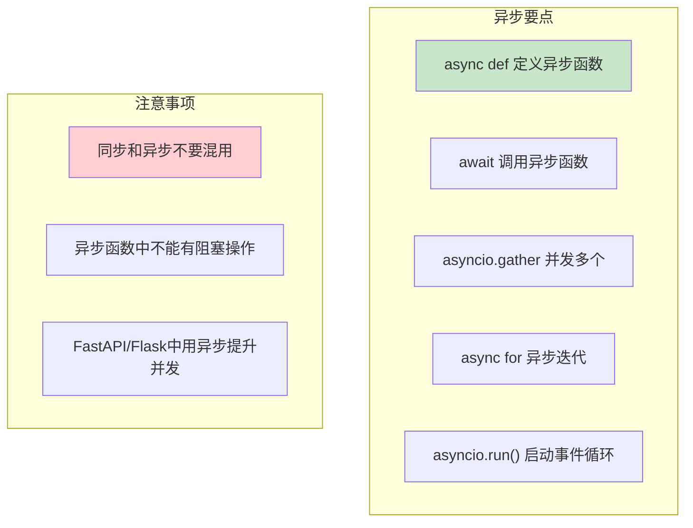

# 流式输出与异步编程专题

> 流式输出让用户逐字看到回复，异步让应用同时处理多请求。这是生产级 LLM 应用的必备技能。

---

## 一、为什么需要流式和异步





## 二、流式输出

### 2.1 基础流式

```python
from langchain_openai import ChatOpenAI
from langchain_core.prompts import ChatPromptTemplate
from langchain_core.output_parsers import StrOutputParser

llm = ChatOpenAI(model="gpt-4o-mini")
prompt = ChatPromptTemplate.from_template("用200字解释&#123;concept&#125;")
chain = prompt | llm | StrOutputParser()

# 流式输出
print("回答: ", end="", flush=True)
for chunk in chain.stream(&#123;"concept": "量子计算"&#125;):
    print(chunk, end="", flush=True)
print()  # 换行
```

### 2.2 流式输出的数据流



### 2.3 异步流式（Web应用用）

```python
import asyncio

async def async_stream():
    chain = prompt | llm | StrOutputParser()
    
    async for chunk in chain.astream(&#123;"concept": "量子计算"&#125;):
        print(chunk, end="", flush=True)
    
    print()

# 运行
asyncio.run(async_stream())
```

### 2.4 LangGraph 流式

```python
# LangGraph 的流式输出
from langgraph.graph import StateGraph, START, END

# 编译图
app = graph.compile()

# 方式1：节点级别流式（每执行完一个节点输出一次）
for event in app.stream(input_data, config=config):
    print(f"节点输出: &#123;event&#125;")

# 方式2：Token级别流式（LLM逐Token输出）
async for event in app.astream_events(
    input_data,
    config=config,
    version="v2"
):
    if event["event"] == "on_chat_model_stream":
        # 只输出LLM生成的token
        chunk = event["data"]["chunk"]
        print(chunk.content, end="", flush=True)
```

### 2.5 流式 vs 非流式对比



## 三、异步编程

### 3.1 同步 vs 异步

```python
import time
import asyncio

# --- 同步（串行）---
def sync_example():
    start = time.time()
    
    result1 = llm.invoke("问题1")  # 等待3秒
    result2 = llm.invoke("问题2")  # 再等3秒
    result3 = llm.invoke("问题3")  # 再等3秒
    
    print(f"总耗时: &#123;time.time()-start:.1f&#125;s")  # 约9秒

# --- 异步（并发）---
async def async_example():
    start = time.time()
    
    # 三个请求同时发起
    tasks = [
        llm.ainvoke("问题1"),
        llm.ainvoke("问题2"),
        llm.ainvoke("问题3"),
    ]
    results = await asyncio.gather(*tasks)
    
    print(f"总耗时: &#123;time.time()-start:.1f&#125;s")  # 约3秒（并发）

asyncio.run(async_example())
```

### 3.2 异步执行流程



### 3.3 异步 Chain

```python
# 异步调用 Chain
chain = prompt | llm | StrOutputParser()

# 单条异步
result = await chain.ainvoke(&#123;"topic": "AI"&#125;)

# 异步流式
async for chunk in chain.astream(&#123;"topic": "AI"&#125;):
    print(chunk, end="")

# 异步批量
results = await chain.abatch([
    &#123;"topic": "AI"&#125;,
    &#123;"topic": "区块链"&#125;,
    &#123;"topic": "量子计算"&#125;,
])
```

### 3.4 异步批处理 vs 同步批处理

```mermaid
graph TB
    subgraph batch ["batch（同步批量）"]
        B1["3条输入"] --> B2["内部自动并发"]
        B2 --> B3["等待全部完成"]
        B3 --> B4["返回3条结果"]
    end

    subgraph abatch ["abatch（异步批量）"]
        A1["3条输入"] --> A2["内部自动并发"]
        A2 --> A3["await全部完成"]
        A3 --> A4["返回3条结果"]
    end

    subgraph gather ["gather（手动异步）"]
        G1["手动创建3个任务"] --> G2["asyncio.gather"]
        G2 --> G3["并发执行"]
        G3 --> G4["返回3条结果"]
    end

    style batch fill:#E3F2FD
    style abatch fill:#C8E6C9
    style gather fill:#FFF3E0
```



## 四、FastAPI 中的流式和异步

```python
from fastapi import FastAPI
from fastapi.responses import StreamingResponse
from langchain_openai import ChatOpenAI
from langchain_core.prompts import ChatPromptTemplate
from langchain_core.output_parsers import StrOutputParser
from pydantic import BaseModel

app = FastAPI()
llm = ChatOpenAI(model="gpt-4o-mini")

chain = (
    ChatPromptTemplate.from_template("回答问题：&#123;question&#125;")
    | llm
    | StrOutputParser()
)

class QuestionRequest(BaseModel):
    question: str

# 同步端点
@app.post("/ask")
async def ask(request: QuestionRequest):
    result = await chain.ainvoke(&#123;"question": request.question&#125;)
    return &#123;"answer": result&#125;

# 流式端点（逐字返回到前端）
@app.post("/ask/stream")
async def ask_stream(request: QuestionRequest):
    async def generate():
        async for chunk in chain.astream(&#123;"question": request.question&#125;):
            yield f"data: &#123;chunk&#125;\n\n"
    
    return StreamingResponse(generate(), media_type="text/event-stream")

# 运行: uvicorn server:app --reload
```

### 请求流程

```mermaid
sequenceDiagram
    participant C as 客户端
    participant F as FastAPI
    participant L as LLM

    C->>F: POST /ask/stream &#123;"question": "什么是AI?"&#125;
    F->>L: astream 请求
    
    loop 逐Token
        L-->>F: chunk1 ("A")
        F-->>C: data: A\n\n
        L-->>F: chunk2 ("I")
        F-->>C: data: I\n\n
    end
    
    L-->>F: [DONE]
    F-->>C: 关闭连接
```



## 五、异步编程要点



### 常见陷阱

```python
# ❌ 错误：在异步函数中使用同步调用
async def bad_example():
    # 这会阻塞事件循环！
    result = llm.invoke("question")  # 同步调用阻塞了整个事件循环
    return result

# ✅ 正确：使用异步调用
async def good_example():
    result = await llm.ainvoke("question")  # 非阻塞
    return result

# ❌ 错误：同步函数中调用异步函数
def sync_calling_async():
    # 需要用 asyncio.run() 包装
    result = chain.ainvoke(&#123;"input": "test"&#125;)  # 报错：返回coroutine
    return result

# ✅ 正确
def sync_calling_async_fixed():
    result = asyncio.run(chain.ainvoke(&#123;"input": "test"&#125;))
    return result

# ✅ 最佳：全程异步
async def best_example():
    tasks = [
        chain.ainvoke(&#123;"input": "问题1"&#125;),
        chain.ainvoke(&#123;"input": "问题2"&#125;),
    ]
    results = await asyncio.gather(*tasks)
    return results
```

## 六、性能对比实测

```python
import time
import asyncio
from langchain_openai import ChatOpenAI

llm = ChatOpenAI(model="gpt-4o-mini")

# 测试同步
def test_sync():
    start = time.time()
    for _ in range(5):
        llm.invoke("说一个词")
    return time.time() - start

# 测试批量
def test_batch():
    start = time.time()
    llm.batch(["说一个词"] * 5)
    return time.time() - start

# 测试异步
async def test_async():
    start = time.time()
    tasks = [llm.ainvoke("说一个词") for _ in range(5)]
    await asyncio.gather(*tasks)
    return time.time() - start

# 运行对比
print(f"同步串行: &#123;test_sync():.2f&#125;s")     # ~15秒 (3s × 5)
print(f"批量并发: &#123;test_batch():.2f&#125;s&#125;")    # ~3秒
print(f"异步并发: &#123;asyncio.run(test_async()):.2f&#125;s&#125;")  # ~3秒
```
