```mermaid
sequenceDiagram
    participant U as 用户
    participant FE as 前端
    participant BE as 后端
    participant LLM as LLM

    U->>FE: 发送消息
    FE->>BE: POST /chat/stream
    BE->>LLM: 流式请求
    loop Token流
        LLM-->>BE: Token chunk
        BE-->>FE: SSE: data &#123;content&#125;
        FE->>U: 打字机效果
    end
    BE-->>FE: SSE: &#123;done: true&#125;
    FE->>U: 渲染完成
```

# 流式输出前端集成指南

> 后端流式输出只是第一步——用户真正看到的是前端 UI。打字机效果、Token 实时渲染、工具调用进度展示、Markdown 流式解析，这些前端体验决定了 LLM 应用的感知质量。这份指南覆盖从 SSE 协议到 React/Vue 集成的完整前端流式方案。

---

## 一、流式输出的全链路

```mermaid
graph LR
    subgraph 全链路 &#123;"流式输出全链路"&#125;
        LLM["LLM API<br/>流式返回Token"] --> BACKEND["后端<br/>SSE/WebSocket"] --> FRONTEND["前端<br/>EventSource/WS"] --> UI["UI<br/>打字机+Markdown"]
    end

    style 全链路 fill:#E3F2FD
```



---

## 二、后端 SSE 实现

### 2.1 FastAPI 流式端点

```python
from fastapi import FastAPI
from fastapi.responses import StreamingResponse
from langchain_openai import ChatOpenAI
from langchain_core.messages import HumanMessage, SystemMessage
import json
import asyncio

app = FastAPI()

@app.post("/chat/stream")
async def chat_stream(request: dict):
    """SSE流式对话端点"""
    message = request["message"]
    history = request.get("history", [])

    async def event_generator():
        # 构建消息
        messages = [SystemMessage(content="你是AI助手")]
        for msg in history[-6:]:  # 保留最近3轮
            if msg["role"] == "user":
                messages.append(HumanMessage(content=msg["content"]))
            else:
                messages.append(SystemMessage(content=msg["content"]))
        messages.append(HumanMessage(content=message))

        # 流式调用LLM
        llm = ChatOpenAI(model="gpt-4o", streaming=True)

        async for chunk in llm.astream(messages):
            if chunk.content:
                # SSE格式：data: &#123;json&#125;\n\n
                data = json.dumps(&#123;
                    "type": "token",
                    "content": chunk.content,
                &#125;, ensure_ascii=False)
                yield f"data: &#123;data&#125;\n\n"

        # 发送完成标记
        yield f"data: &#123;json.dumps(&#123;'type': 'done'&#125;)&#125;\n\n"

    return StreamingResponse(
        event_generator(),
        media_type="text/event-stream",
        headers=&#123;
            "Cache-Control": "no-cache",
            "Connection": "keep-alive",
            "X-Accel-Buffering": "no",  # Nginx禁用缓冲
        &#125;,
    )
```

### 2.2 带工具调用的流式

```python
@app.post("/chat/stream/agent")
async def agent_stream(request: dict):
    """Agent流式端点：展示工具调用+Token流"""
    from langgraph.prebuilt import create_react_agent
    from langchain_core.tools import tool

    @tool
    def search(query: str) -> str:
        """搜索信息"""
        return f"搜索结果: &#123;query&#125;"

    agent = create_react_agent(
        ChatOpenAI(model="gpt-4o"),
        [search],
    )

    async def event_generator():
        async for event in agent.astream_events(
            &#123;"messages": [&#123;"role": "user", "content": request["message"]&#125;]&#125;,
            version="v2",
        ):
            kind = event["event"]

            if kind == "on_chat_model_stream":
                # LLM Token流
                chunk = event["data"]["chunk"]
                if chunk.content:
                    yield f"data: &#123;json.dumps(&#123;'type': 'token', 'content': chunk.content&#125;)&#125;\n\n"

            elif kind == "on_tool_start":
                # 工具调用开始
                yield f"data: &#123;json.dumps(&#123;'type': 'tool_start', 'name': event['name']&#125;)&#125;\n\n"

            elif kind == "on_tool_end":
                # 工具调用结束
                yield f"data: &#123;json.dumps(&#123;'type': 'tool_end', 'name': event['name'], 'result': str(event['data'])[:200]&#125;)&#125;\n\n"

        yield f"data: &#123;json.dumps(&#123;'type': 'done'&#125;)&#125;\n\n"

    return StreamingResponse(event_generator(), media_type="text/event-stream")
```

---

## 三、前端 React 集成

### 3.1 基础 SSE 消费

```jsx
// useStreamingChat.js — React Hook
import &#123; useState, useRef, useCallback &#125; from "react";

export function useStreamingChat(apiUrl = "/chat/stream") &#123;
    const [messages, setMessages] = useState([]);
    const [isStreaming, setIsStreaming] = useState(false);
    const [currentResponse, setCurrentResponse] = useState("");
    const eventSourceRef = useRef(null);

    const sendMessage = useCallback(async (content) => &#123;
        // 添加用户消息
        const userMsg = &#123; role: "user", content &#125;;
        setMessages((prev) => [...prev, userMsg]);
        setIsStreaming(true);
        setCurrentResponse("");

        // 使用fetch + ReadableStream（比EventSource更灵活）
        const response = await fetch(apiUrl, &#123;
            method: "POST",
            headers: &#123; "Content-Type": "application/json" &#125;,
            body: JSON.stringify(&#123;
                message: content,
                history: messages.slice(-6),
            &#125;),
        &#125;);

        const reader = response.body.getReader();
        const decoder = new TextDecoder();
        let buffer = "";

        try &#123;
            while (true) &#123;
                const &#123; done, value &#125; = await reader.read();
                if (done) break;

                buffer += decoder.decode(value, &#123; stream: true &#125;);
                const lines = buffer.split("\n");
                buffer = lines.pop(); // 保留不完整的行

                for (const line of lines) &#123;
                    if (line.startsWith("data: ")) &#123;
                        const data = JSON.parse(line.slice(6));

                        if (data.type === "token") &#123;
                            // 逐Token更新
                            setCurrentResponse((prev) => prev + data.content);
                        &#125; else if (data.type === "tool_start") &#123;
                            setCurrentResponse((prev) =>
                                prev + `\n\n🔍 [调用工具: $&#123;data.name&#125;...]\n`
                            );
                        &#125; else if (data.type === "tool_end") &#123;
                            setCurrentResponse((prev) =>
                                prev + `✅ [工具完成: $&#123;data.name&#125;]\n\n`
                            );
                        &#125; else if (data.type === "done") &#123;
                            // 流式结束
                            setMessages((prev) => [
                                ...prev,
                                &#123; role: "assistant", content: currentResponse &#125;,
                            ]);
                            setCurrentResponse("");
                        &#125;
                    &#125;
                &#125;
            &#125;
        &#125; finally &#123;
            setIsStreaming(false);
        &#125;
    &#125;, [messages, apiUrl]);

    const stopStreaming = useCallback(() => &#123;
        if (eventSourceRef.current) &#123;
            eventSourceRef.current.close();
            setIsStreaming(false);
        &#125;
    &#125;, []);

    return &#123; messages, currentResponse, isStreaming, sendMessage, stopStreaming &#125;;
&#125;
```

### 3.2 打字机效果组件

```jsx
// StreamingMessage.jsx — 打字机效果渲染
import &#123; useEffect, useState &#125; from "react";

export function StreamingMessage(&#123; content, isStreaming &#125;) &#123;
    const [displayedContent, setDisplayedContent] = useState("");

    useEffect(() => &#123;
        if (!content) &#123;
            setDisplayedContent("");
            return;
        &#125;

        // 如果内容比显示的多，逐字显示
        if (content.length > displayedContent.length) &#123;
            const timer = setTimeout(() => &#123;
                setDisplayedContent(content.slice(0, displayedContent.length + 1));
            &#125;, 10); // 10ms/字符
            return () => clearTimeout(timer);
        &#125;
    &#125;, [content, displayedContent]);

    return (
        <div className="streaming-message">
            <MarkdownRenderer content=&#123;displayedContent&#125; />
            &#123;isStreaming && (
                <span className="cursor-blink">▊</span>
            )&#125;
        </div>
    );
&#125;
```

### 3.3 流式 Markdown 渲染

```jsx
// MarkdownRenderer.jsx — 流式Markdown渲染
import ReactMarkdown from "react-markdown";
import &#123; Prism as SyntaxHighlighter &#125; from "react-syntax-highlighter";

export function MarkdownRenderer(&#123; content &#125;) &#123;
    return (
        <ReactMarkdown
            components=&#123;&#123;
                // 代码块高亮
                code(&#123; node, inline, className, children, ...props &#125;) &#123;
                    const match = /language-(\w+)/.exec(className || "");
                    return !inline && match ? (
                        <SyntaxHighlighter
                            language=&#123;match[1]&#125;
                            PreTag="div"
                        >
                            &#123;String(children).replace(/\n$/, "")&#125;
                        </SyntaxHighlighter>
                    ) : (
                        <code className=&#123;className&#125; &#123;...props&#125;>
                            &#123;children&#125;
                        </code>
                    );
                &#125;,
                // 表格
                table(&#123; children &#125;) &#123;
                    return (
                        <div className="overflow-x-auto">
                            <table className="min-w-full">&#123;children&#125;</table>
                        </div>
                    );
                &#125;,
            &#125;&#125;
        >
            &#123;content&#125;
        </ReactMarkdown>
    );
&#125;
```

---

## 四、前端 Vue 集成

```vue
<!-- StreamingChat.vue -->
<template>
  <div class="chat-container">
    <div v-for="msg in messages" :key="msg.id" :class="msg.role">
      <div v-html="renderMarkdown(msg.content)"></div>
    </div>

    <!-- 流式输出中 -->
    <div v-if="isStreaming" class="assistant">
      <div v-html="renderMarkdown(currentResponse)"></div>
      <span class="cursor">▊</span>
    </div>

    <input v-model="input" @keyup.enter="send" :disabled="isStreaming" />
    <button @click="send" :disabled="isStreaming">发送</button>
    <button @click="stop" v-if="isStreaming">停止</button>
  </div>
</template>

<script setup>
import &#123; ref &#125; from "vue";
import &#123; marked &#125; from "marked";

const messages = ref([]);
const currentResponse = ref("");
const isStreaming = ref(false);
const input = ref("");
let controller = null;

const renderMarkdown = (content) => marked(content);

async function send() &#123;
  if (!input.value.trim()) return;

  messages.value.push(&#123; id: Date.now(), role: "user", content: input.value &#125;);
  const userMessage = input.value;
  input.value = "";
  isStreaming.value = true;
  currentResponse.value = "";

  controller = new AbortController();

  try &#123;
    const response = await fetch("/chat/stream", &#123;
      method: "POST",
      headers: &#123; "Content-Type": "application/json" &#125;,
      body: JSON.stringify(&#123; message: userMessage &#125;),
      signal: controller.signal,
    &#125;);

    const reader = response.body.getReader();
    const decoder = new TextDecoder();
    let buffer = "";

    while (true) &#123;
      const &#123; done, value &#125; = await reader.read();
      if (done) break;

      buffer += decoder.decode(value, &#123; stream: true &#125;);
      const lines = buffer.split("\n");
      buffer = lines.pop();

      for (const line of lines) &#123;
        if (line.startsWith("data: ")) &#123;
          const data = JSON.parse(line.slice(6));
          if (data.type === "token") &#123;
            currentResponse.value += data.content;
          &#125; else if (data.type === "done") &#123;
            messages.value.push(&#123;
              id: Date.now(),
              role: "assistant",
              content: currentResponse.value,
            &#125;);
            currentResponse.value = "";
            isStreaming.value = false;
          &#125;
        &#125;
      &#125;
    &#125;
  &#125; catch (e) &#123;
    if (e.name !== "AbortError") console.error(e);
    isStreaming.value = false;
  &#125;
&#125;

function stop() &#123;
  if (controller) controller.abort();
  isStreaming.value = false;
&#125;
</script>
```

---

## 五、状态管理与体验优化

```mermaid
graph TB
    subgraph 体验 &#123;"流式输出体验优化"&#125;
        E1["首Token延迟<br/>尽快显示第一个Token<br/>TTFT < 500ms"]
        E2["打字机速度<br/>不需要逐字<br/>按chunk渲染即可"]
        E3["滚动跟随<br/>自动滚动到底部<br/>但用户上滚时暂停"]
        E4["停止生成<br/>用户可随时中断<br/>保留已生成内容"]
        E5["错误恢复<br/>网络断开重连<br/>断点续传"]
        E6["Markdown渲染<br/>流式解析<br/>代码块/表格/列表"]
    end

    style 体验 fill:#E3F2FD
```

### 5.1 自动滚动

```jsx
// AutoScroll.jsx — 智能自动滚动
import &#123; useEffect, useRef &#125; from "react";

export function useAutoScroll(dependency) &#123;
    const containerRef = useRef(null);
    const shouldAutoScroll = useRef(true);

    useEffect(() => &#123;
        const container = containerRef.current;
        if (!container) return;

        const handleScroll = () => &#123;
            const &#123; scrollTop, scrollHeight, clientHeight &#125; = container;
            // 用户距离底部100px以内才自动滚动
            shouldAutoScroll.current = scrollHeight - scrollTop - clientHeight < 100;
        &#125;;

        container.addEventListener("scroll", handleScroll);
        return () => container.removeEventListener("scroll", handleScroll);
    &#125;, []);

    useEffect(() => &#123;
        if (shouldAutoScroll.current && containerRef.current) &#123;
            containerRef.current.scrollTop = containerRef.current.scrollHeight;
        &#125;
    &#125;, [dependency]);

    return containerRef;
&#125;
```

---

## 六、SSE vs WebSocket 选型

```mermaid
graph TB
    subgraph 对比 &#123;"SSE vs WebSocket"&#125;
        SSE["SSE (Server-Sent Events)<br/>单向: 服务器→客户端<br/>HTTP协议<br/>自动重连<br/>简单<br/>✅ 推荐用于LLM流式"]
        WS["WebSocket<br/>双向<br/>独立协议<br/>需手动重连<br/>复杂<br/>适合实时交互"]
    end

    style SSE fill:#C8E6C9,stroke:#2E7D32,stroke-width:3px
    style WS fill:#FFF3E0
```

| 维度 | SSE | WebSocket |
|------|-----|-----------|
| 方向 | 服务器→客户端（单向） | 双向 |
| 协议 | HTTP | 独立协议 |
| 自动重连 | 内置 | 需手动实现 |
| 浏览器支持 | 原生EventSource | 原生WebSocket |
| 代理/防火墙 | 无障碍 | 可能被阻断 |
| 适合场景 | LLM流式输出 | 实时聊天/游戏 |
| 复杂度 | 低 | 高 |

LLM 流式输出场景推荐 SSE：只需要服务器→客户端的单向流，SSE 更简单、更可靠。

---

## 七、Vercel AI SDK 方案

```jsx
// 使用Vercel AI SDK简化流式集成
import &#123; useChat &#125; from "ai/react";

function ChatComponent() &#123;
    const &#123; messages, input, handleInputChange, handleSubmit, isLoading, stop &#125; = useChat(&#123;
        api: "/api/chat",
    &#125;);

    return (
        <div>
            &#123;messages.map((m) => (
                <div key=&#123;m.id&#125; className=&#123;m.role&#125;>
                    <ReactMarkdown>&#123;m.content&#125;</ReactMarkdown>
                </div>
            ))&#125;
            <form onSubmit=&#123;handleSubmit&#125;>
                <input value=&#123;input&#125; onChange=&#123;handleInputChange&#125; />
                <button type="submit" disabled=&#123;isLoading&#125;>发送</button>
                &#123;isLoading && <button onClick=&#123;stop&#125;>停止</button>
            </form>
        </div>
    );
&#125;

// 后端API路由 (Next.js)
// app/api/chat/route.js
import &#123; openai &#125; from "@ai-sdk/openai";
import &#123; streamText &#125; from "ai";

export async function POST(req) &#123;
    const &#123; messages &#125; = await req.json();
    const result = streamText(&#123;
        model: openai("gpt-4o"),
        messages,
    &#125;);
    return result.toDataStreamResponse();
&#125;
```

---

## 八、最佳实践

| 实践 | 说明 | 优先级 |
|------|------|--------|
| 用fetch+ReadableStream替代EventSource | POST请求更灵活 | ★★★ |
| chunk渲染而非逐字 | LLM本身按chunk返回 | ★★★ |
| 用户上滚时暂停自动滚动 | 尊重用户阅读行为 | ★★☆ |
| 提供停止按钮 | 用户可中断生成 | ★★☆ |
| Markdown流式渲染 | 边生成边格式化 | ★★☆ |
| Nginx关闭缓冲 | X-Accel-Buffering: no | ★★☆ |
| 考虑Vercel AI SDK | 封装好了流式逻辑 | ★☆☆ |

---

## 九、检查清单

| 检查项 | 状态 |
|--------|------|
| 后端实现了SSE流式端点 | ☐ |
| 前端能消费SSE流并实时渲染 | ☐ |
| 有打字机效果 | ☐ |
| 支持流式Markdown渲染 | ☐ |
| 有停止生成功能 | ☐ |
| 自动滚动且用户上滚时暂停 | ☐ |
| 配置了Nginx缓冲关闭 | ☐ |
| Agent模式能展示工具调用进度 | ☐ |
