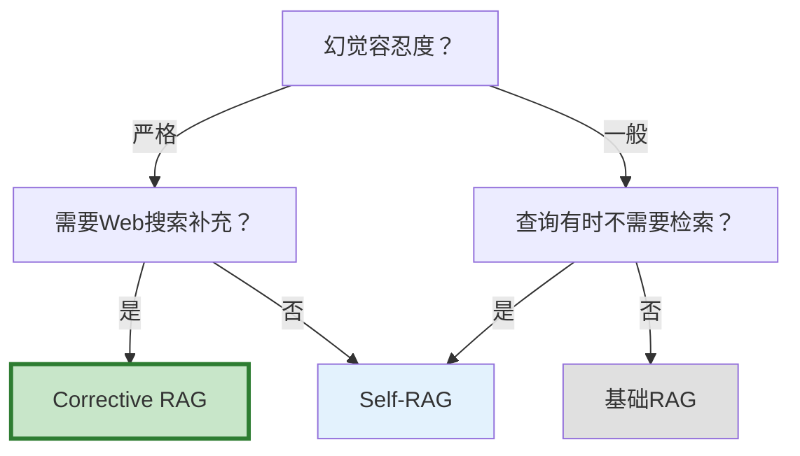

# 自适应 RAG：Self-RAG 与 Corrective RAG

> 基础 RAG 是流水线：检索→生成，不管检索到什么照单全收。但如果检索结果是垃圾呢？如果根本不需要检索呢？自适应 RAG 让系统学会判断"要不要检索""检索到的够不够好""要不要重新检索"，大幅减少幻觉。

---

## 一、三种 RAG 策略对比

```mermaid
graph TB
    subgraph 基础RAG &#123;"基础RAG: 无脑检索"&#125;
        Q1["查询"] --> R1["总是检索"] --> G1["LLM生成<br/>不管检索质量"]
    end

    subgraph SelfRAG &#123;"Self-RAG: 自我反思"&#125;
        Q2["查询"] --> D1&#123;"需要检索？"&#125;
        D1 -->|是| R2["检索"] --> RELEVANT&#123;"相关？"&#125;
        RELEVANT -->|是| G2["生成"]
        RELEVANT -->|否| R2
        D1 -->|否| G2
        G2 --> SUPPORTED&#123;"有支撑？"&#125;
        SUPPORTED -->|否| G2
        SUPPORTED -->|是| OUT2["输出"]
    end

    subgraph CorrectiveRAG &#123;"Corrective RAG: 纠错检索"&#125;
        Q3["查询"] --> R3["检索"] --> GRADE&#123;"评估质量<br/>低/中/高"&#125;
        GRADE -->|高| G3["直接生成"]
        GRADE -->|中| G3
        GRADE -->|低| WEB["Web搜索补充"]
        WEB --> G3
        G3 --> OUT3["输出"]
    end

    style 基础RAG fill:#FFCDD2
    style SelfRAG fill:#E3F2FD
    style CorrectiveRAG fill:#C8E6C9
```

---

## 二、Self-RAG：自我反思检索增强生成

```mermaid
graph TB
    subgraph SelfRAG &#123;"Self-RAG四个反思token"&#125;
        T1["Retrieve?<br/>是否需要检索"]
        T2["IsRelevant?<br/>检索结果是否相关"]
        T3["IsSupported?<br/>生成内容是否有依据"]
        T4["IsUseful?<br/>回答是否有用"]
    end

    Q["查询"] --> T1
    T1 -->|需要| RET["检索"]
    T1 -->|不需要| GEN["直接生成"]
    RET --> T2
    T2 -->|相关| GEN
    T2 -->|不相关| RET2["重新检索或放弃"]
    GEN --> T3
    T3 -->|有依据| T4
    T3 -->|无依据| REV["修改生成"]
    T4 -->|有用| OUT["输出"]
    T4 -->|无用| REV

    style T1 fill:#FFF9C4,stroke:#F9A825,stroke-width:3px
    style T2 fill:#FFF9C4
    style T3 fill:#FFF9C4
    style T4 fill:#FFF9C4
    style OUT fill:#C8E6C9
```

### 2.1 实现

```python
from langchain_core.language_models import BaseChatModel
from langchain_core.messages import HumanMessage
from langchain_core.vectorstores import VectorStore
from langchain_core.documents import Document

class SelfRAG:
    """Self-RAG: 带自我反思的RAG。

    四个反思判断：
    1. Retrieve? — 这个查询需要检索吗？
    2. IsRelevant? — 检索到的文档相关吗？
    3. IsSupported? — 生成的回答有依据吗？
    4. IsUseful? — 回答对用户有用吗？
    """

    def __init__(self, llm: BaseChatModel, vectorstore: VectorStore):
        self.llm = llm
        self.vectorstore = vectorstore

    async def answer(self, question: str, max_retries: int = 2) -> dict:
        """Self-RAG完整流程。"""
        # 1. 判断是否需要检索
        need_retrieve = await self._need_retrieval(question)

        if not need_retrieve:
            # 不需要检索，直接生成
            answer = await self._generate(question, [])
            return &#123;"answer": answer, "retrieved": False, "iterations": 0&#125;

        # 2. 检索+反思循环
        for attempt in range(max_retries + 1):
            docs = await self.vectorstore.asimilarity_search(question, k=3)

            # 3. 评估检索相关性
            relevant_docs = await self._filter_relevant(question, docs)

            if relevant_docs:
                # 4. 生成
                answer = await self._generate(question, relevant_docs)

                # 5. 验证回答是否有依据
                supported = await self._check_support(answer, relevant_docs)

                if supported:
                    return &#123;
                        "answer": answer,
                        "retrieved": True,
                        "docs": len(relevant_docs),
                        "iterations": attempt + 1,
                    &#125;
                else:
                    # 无依据，重试
                    continue
            else:
                # 检索不相关，重试
                continue

        # 兜底：生成不带上下文的回答
        answer = await self._generate(question, [])
        return &#123;"answer": answer, "retrieved": False, "iterations": max_retries&#125;

    async def _need_retrieval(self, question: str) -> bool:
        """判断是否需要检索。"""
        prompt = f"""判断以下问题是否需要检索外部知识库来回答。

问题: &#123;question&#125;

需要检索的情况:
- 涉及特定事实、数据、事件
- 涉及领域专业知识
- 涉及最新信息

不需要检索的情况:
- 常识问题
- 通用编程问题
- 创意写作
- 纯逻辑推理

只回答"需要"或"不需要":"""""

        response = await self.llm.ainvoke([HumanMessage(content=prompt)])
        return "需要" in response.content[:5]

    async def _filter_relevant(self, question: str, docs: list[Document]) -> list[Document]:
        """过滤相关文档。"""
        if not docs:
            return []

        docs_text = "\n\n".join(
            f"[文档&#123;i+1&#125;] &#123;d.page_content[:300]&#125;" for i, d in enumerate(docs)
        )

        prompt = f"""判断以下文档哪些与问题相关。

问题: &#123;question&#125;

&#123;docs_text&#125;

输出相关文档的编号（用逗号分隔），如: 1,3
如果都不相关，输出: none"""

        response = await self.llm.ainvoke([HumanMessage(content=prompt)])

        if "none" in response.content.lower():
            return []

        import re
        numbers = re.findall(r'\d+', response.content)
        return [docs[int(n) - 1] for n in numbers if int(n) <= len(docs)]

    async def _generate(self, question: str, docs: list[Document]) -> str:
        """生成回答。"""
        context = "\n\n".join(d.page_content for d in docs)
        if context:
            prompt = f"基于以下信息回答问题。\n\n信息:\n&#123;context&#125;\n\n问题: &#123;question&#125;"
        else:
            prompt = f"问题: &#123;question&#125;"

        response = await self.llm.ainvoke([HumanMessage(content=prompt)])
        return response.content

    async def _check_support(self, answer: str, docs: list[Document]) -> bool:
        """验证回答是否有文档支撑。"""
        context = "\n\n".join(d.page_content for d in docs)

        prompt = f"""判断以下回答的内容是否都能从给定的上下文中找到依据。

上下文:
&#123;context[:1000]&#125;

回答:
&#123;answer[:500]&#125;

只回答"有依据"或"无依据":"""""

        response = await self.llm.ainvoke([HumanMessage(content=prompt)])
        return "有依据" in response.content[:5]
```

---

## 三、Corrective RAG (CRAG)：纠错检索

```mermaid
graph TB
    subgraph CRAG &#123;"Corrective RAG流程"&#125;
        Q["查询"] --> RET["检索"]
        RET --> GRADE&#123;"检索质量评估<br/>置信度评分"&#125;
        GRADE -->|高: ≥0.8| CORRECT["正确<br/>直接使用"]
        GRADE -->|中: 0.5-0.8| AMBIGUOUS["模糊<br/>精炼查询<br/>重新检索"]
        GRADE -->|低: <0.5| INCORRECT["不正确<br/>Web搜索补充"]
        CORRECT --> GEN["LLM生成"]
        AMBIGUOUS --> RET
        INCORRECT --> WEB["Web搜索"]
        WEB --> GEN
        GEN --> OUT["输出"]
    end

    style GRADE fill:#FFF9C4,stroke:#F9A825,stroke-width:3px
    style CORRECT fill:#C8E6C9
    style AMBIGUOUS fill:#FFF3E0
    style INCORRECT fill:#FFCDD2
```

### 3.1 实现

```python
from langchain_core.tools import tool

class CorrectiveRAG:
    """Corrective RAG: 检索质量评估+纠错。

    核心思想：
    1. 检索后评估文档质量
    2. 质量高→直接使用
    3. 质量中→精炼查询重新检索
    4. 质量低→Web搜索补充
    """

    def __init__(self, llm: BaseChatModel, vectorstore: VectorStore):
        self.llm = llm
        self.vectorstore = vectorstore

    async def answer(self, question: str) -> dict:
        """CRAG完整流程。"""
        # 1. 检索
        docs = await self.vectorstore.asimilarity_search(question, k=5)

        # 2. 评估检索质量
        confidence, assessment = await self._assess_retrieval(question, docs)

        if confidence >= 0.8:
            # 高质量：直接生成
            answer = await self._generate(question, docs)
            return &#123;"answer": answer, "strategy": "correct", "confidence": confidence&#125;

        elif confidence >= 0.5:
            # 中等：精炼查询重新检索
            refined_query = await self._refine_query(question, assessment)
            new_docs = await self.vectorstore.asimilarity_search(refined_query, k=5)
            all_docs = self._dedupe(docs + new_docs)
            answer = await self._generate(question, all_docs)
            return &#123;"answer": answer, "strategy": "refine", "confidence": confidence&#125;

        else:
            # 低质量：Web搜索补充
            web_results = await self._web_search(question)
            combined = docs + web_results
            answer = await self._generate(question, combined)
            return &#123;"answer": answer, "strategy": "web_supplement", "confidence": confidence&#125;

    async def _assess_retrieval(
        self, question: str, docs: list[Document]
    ) -> tuple[float, str]:
        """评估检索质量，返回置信度和评估说明。"""
        if not docs:
            return 0.0, "无检索结果"

        docs_text = "\n\n".join(d.page_content[:300] for d in docs[:3])

        prompt = f"""评估检索结果对回答问题的帮助程度。

问题: &#123;question&#125;

检索到的文档:
&#123;docs_text&#125;

请评估：
1. 文档是否直接回答了问题？（0-1分）
2. 文档信息是否准确且充分？

输出格式:
置信度: 0.X
评估: 简要说明"""

        response = await self.llm.ainvoke([HumanMessage(content=prompt)])

        import re
        match = re.search(r'0\.\d+|[01]', response.content)
        confidence = float(match.group()) if match else 0.5

        return confidence, response.content

    async def _refine_query(self, question: str, assessment: str) -> str:
        """精炼查询。"""
        prompt = f"""原始查询的检索质量不佳，请重新措辞。

原始查询: &#123;question&#125;
检索评估: &#123;assessment[:200]&#125;

请生成一个更精确的查询（直接输出查询，不要解释）:"""

        response = await self.llm.ainvoke([HumanMessage(content=prompt)])
        return response.content.strip()

    async def _web_search(self, question: str) -> list[Document]:
        """Web搜索补充。"""
        # 实际接入搜索API
        # from langchain_community.tools.tavily_search import TavilySearchResults
        # search = TavilySearchResults(max_results=3)
        # results = search.invoke(question)
        # return [Document(page_content=r["content"]) for r in results]
        return [Document(page_content=f"[Web搜索结果] &#123;question&#125;")]

    async def _generate(self, question: str, docs: list[Document]) -> str:
        """生成回答。"""
        context = "\n\n".join(d.page_content for d in docs)
        prompt = f"基于以下信息回答问题。\n\n信息:\n&#123;context[:3000]&#125;\n\n问题: &#123;question&#125;"
        response = await self.llm.ainvoke([HumanMessage(content=prompt)])
        return response.content

    def _dedupe(self, docs: list[Document]) -> list[Document]:
        """去重。"""
        seen = set()
        result = []
        for d in docs:
            key = hash(d.page_content[:200])
            if key not in seen:
                seen.add(key)
                result.append(d)
        return result
```

---

## 四、与 LangGraph 集成

```python
from langgraph.graph import StateGraph, START, END
from typing import TypedDict, Annotated
from langgraph.graph.message import add_messages

class AdaptiveRAGState(TypedDict):
    question: str
    documents: list[Document]
    generation: str
    web_search_needed: bool

def build_adaptive_rag(llm, vectorstore):
    """用LangGraph构建自适应RAG。"""
    crag = CorrectiveRAG(llm, vectorstore)

    async def retrieve(state: AdaptiveRAGState) -> dict:
        docs = await vectorstore.asimilarity_search(state["question"], k=5)
        return &#123;"documents": docs&#125;

    async def grade_documents(state: AdaptiveRAGState) -> dict:
        confidence, _ = await crag._assess_retrieval(
            state["question"], state["documents"]
        )
        return &#123;"web_search_needed": confidence < 0.5&#125;

    async def generate(state: AdaptiveRAGState) -> dict:
        answer = await crag._generate(state["question"], state["documents"])
        return &#123;"generation": answer&#125;

    async def web_search(state: AdaptiveRAGState) -> dict:
        web_docs = await crag._web_search(state["question"])
        return &#123;"documents": state["documents"] + web_docs&#125;

    def route(state: AdaptiveRAGState) -> str:
        if state.get("web_search_needed"):
            return "web_search"
        return "generate"

    graph = StateGraph(AdaptiveRAGState)
    graph.add_node("retrieve", retrieve)
    graph.add_node("grade", grade_documents)
    graph.add_node("generate", generate)
    graph.add_node("web_search", web_search)

    graph.add_edge(START, "retrieve")
    graph.add_edge("retrieve", "grade")
    graph.add_conditional_edges("grade", route, &#123;
        "web_search": "web_search",
        "generate": "generate",
    &#125;)
    graph.add_edge("web_search", "generate")
    graph.add_edge("generate", END)

    return graph.compile()
```

---

## 五、三种策略效果对比

```mermaid
graph TB
    subgraph 对比 &#123;"RAG策略对比"&#125;
        B["基础RAG<br/>召回: 70%<br/>幻觉: 15%<br/>延迟: 1x"]
        S["Self-RAG<br/>召回: 85%<br/>幻觉: 5%<br/>延迟: 1.5x"]
        C["Corrective RAG<br/>召回: 90%<br/>幻觉: 3%<br/>延迟: 1.3x"]
    end

    style B fill:#FFCDD2
    style S fill:#E3F2FD
    style C fill:#C8E6C9
```

| 策略 | 召回率 | 幻觉率 | 延迟 | LLM调用 | 适合场景 |
|------|--------|--------|------|---------|----------|
| 基础RAG | 中 | 高 | 低 | 1次 | 简单问答 |
| Self-RAG | 高 | 低 | 中 | 3-5次 | 高质量要求 |
| Corrective RAG | 最高 | 最低 | 中 | 2-3次 | 需要Web补充 |

---

## 六、选型决策



---

## 七、最佳实践

| 实践 | 说明 | 优先级 |
|------|------|--------|
| 高质量场景用Self-RAG | 多次反思减少幻觉 | ★★★ |
| 检索质量不稳定用CRAG | 低质量自动转Web | ★★★ |
| 性能敏感用基础RAG | 自适应增加LLM调用 | ★★☆ |
| 用LangGraph编排 | 条件路由天然适配 | ★★☆ |
| 限制重试次数 | 防止无限循环 | ★★★ |
| 监控策略分布 | 统计各策略触发比例 | ★☆☆ |

---

## 八、检查清单

| 检查项 | 状态 |
|--------|------|
| 理解Self-RAG的四个反思token | ☐ |
| 实现了Self-RAG | ☐ |
| 理解CRAG的三级评估 | ☐ |
| 实现了Corrective RAG | ☐ |
| 能用LangGraph编排自适应路由 | ☐ |
| 知道何时选哪种策略 | ☐ |
