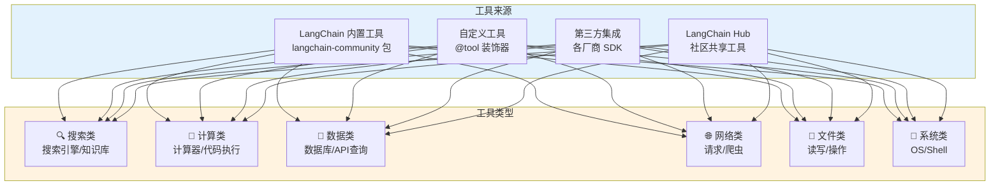
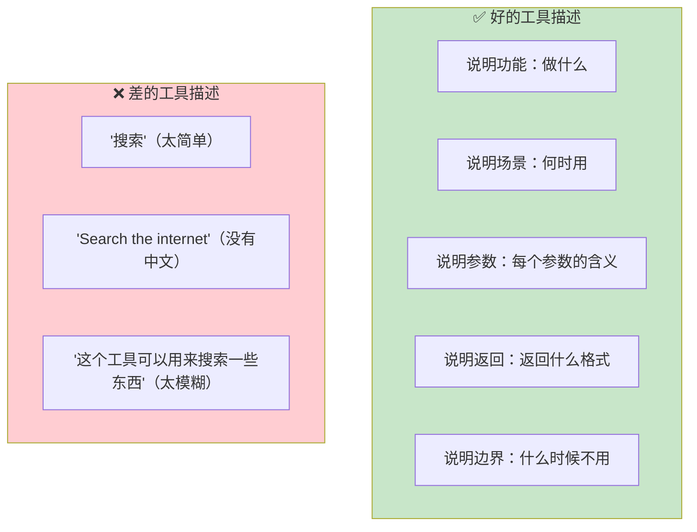
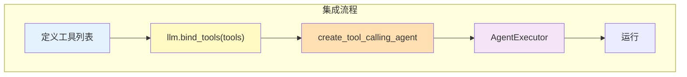
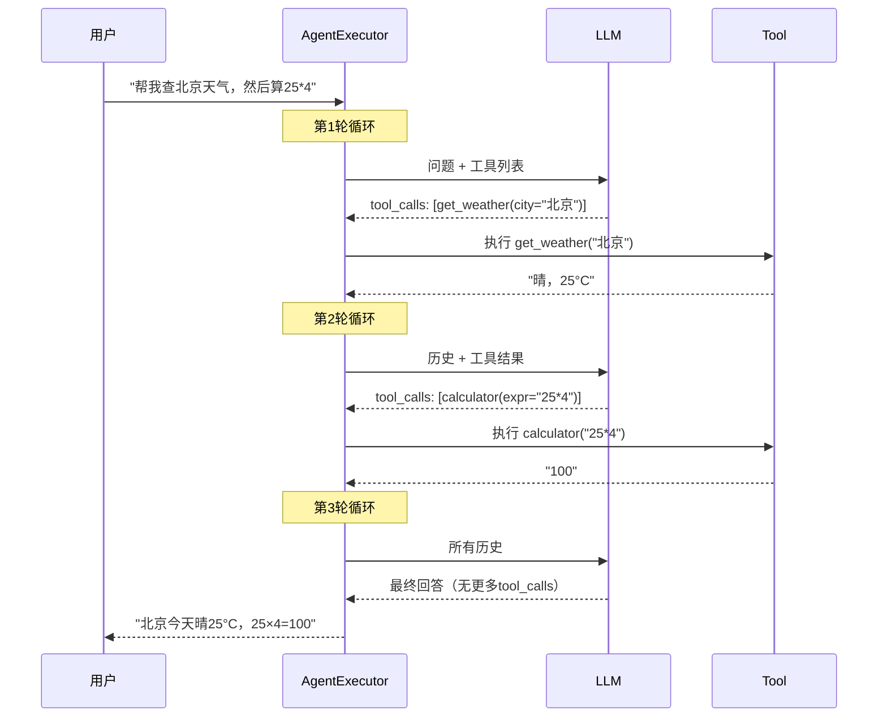
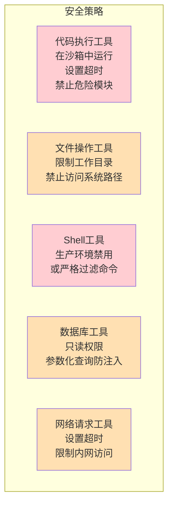
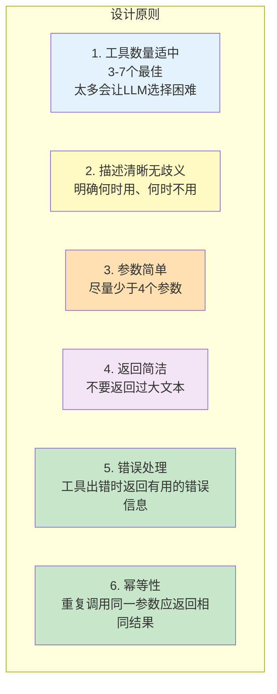
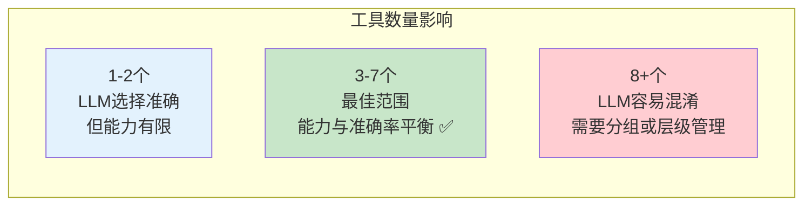

# LangChain 工具集成大全

> 工具（Tool）是 Agent 与外部世界交互的能力。本指南覆盖所有常用工具的安装、使用和自定义方法。

---

## 一、工具体系全景



## 二、创建自定义工具的三种方式

### 方式一：@tool 装饰器（推荐，最简单）

```python
from langchain_core.tools import tool

@tool
def search_product(product_name: str, max_results: int = 5) -> str:
    """在产品目录中搜索商品。当用户想查找产品信息、价格、库存时使用此工具。

    Args:
        product_name: 产品名称或关键词
        max_results: 最大返回数量，默认5

    Returns:
        匹配的产品列表
    """
    # 实际实现
    products = &#123;"耳机": "蓝牙耳机 ¥299", "手机": "智能手机 ¥3999"&#125;
    return products.get(product_name, f"未找到产品: &#123;product_name&#125;")
```

### 方式二：StructuredTool（精细控制参数）

```python
from langchain_core.tools import StructuredTool
from pydantic import BaseModel, Field

class WeatherQuery(BaseModel):
    city: str = Field(description="城市名称，如'北京'")
    date: str = Field(default="今天", description="日期，格式 YYYY-MM-DD")

def get_weather(city: str, date: str = "今天") -> str:
    return f"&#123;city&#125;在&#123;date&#125;的天气：晴，25°C"

weather_tool = StructuredTool.from_function(
    func=get_weather,
    name="get_weather",
    description="查询指定城市和日期的天气",
    args_schema=WeatherQuery,
)
```

### 方式三：继承 BaseTool（最灵活，支持异步）

```python
from langchain_core.tools import BaseTool

class CalculatorTool(BaseTool):
    name: str = "calculator"
    description: str = "计算数学表达式。输入一个数学表达式如 '2+3*4'，返回计算结果。"

    def _run(self, expression: str) -> str:
        """同步执行"""
        try:
            return str(eval(expression))
        except Exception as e:
            return f"计算失败: &#123;e&#125;"

    async def _arun(self, expression: str) -> str:
        """异步执行"""
        return self._run(expression)  # 简单委托给同步版本
```

## 三、三种方式对比

```mermaid
graph TB
    subgraph 选择决策
        Q&#123;"需求?"&#125;
        Q -->|"快速创建，简单函数"| A["@tool 装饰器<br/>最简单最常用 ✅"]
        Q -->|"需要精细参数描述"| B["StructuredTool<br/>Pydantic schema"]
        Q -->|"需要异步/复杂逻辑"| C["继承 BaseTool<br/>最灵活"]
    end

    style A fill:#C8E6C9
    style B fill:#FFF3E0
    style C fill:#F3E5F5
```

## 四、常用内置工具速查

### 4.1 搜索类工具

| 工具 | 安装 | 描述 |
|------|------|------|
| DuckDuckGoSearchRun | `pip install duckduckgo-search` | 免费搜索，无需 API Key |
| TavilySearchResults | `pip install langchain-tavily` | AI 优化搜索结果 |
| WikipediaQueryRun | 内置 | 维基百科查询 |
| ArxivQueryRun | 内置 | 学术论文搜索 |

```python
# DuckDuckGo 搜索
from langchain_community.tools import DuckDuckGoSearchRun
search = DuckDuckGoSearchRun()
result = search.invoke("LangChain 教程")

# Wikipedia
from langchain_community.tools import WikipediaQueryRun
from langchain_community.utilities import WikipediaAPIWrapper
wiki = WikipediaQueryRun(api_wrapper=WikipediaAPIWrapper(top_k_results=2))
result = wiki.invoke("Python programming language")

# Tavily（需要 API Key）
from langchain_tavily import TavilySearch
tavily = TavilySearch(max_results=3)
result = tavily.invoke("最新的 AI 新闻")
```

### 4.2 计算与代码执行类

| 工具 | 安装 | 描述 |
|------|------|------|
| PythonREPLTool | 内置 | 执行 Python 代码 |
| ShellTool | 内置 | 执行 Shell 命令 |
| Calculator | 内置 | 简单数学计算 |

```python
# Python 代码执行
from langchain_experimental.tools import PythonREPLTool
python_tool = PythonREPLTool()
result = python_tool.invoke("print(2**10)")  # 1024

# Shell 命令（注意安全风险）
from langchain_community.tools import ShellTool
shell = ShellTool()
result = shell.invoke(&#123;"commands": ["echo hello"]&#125;)
```

### 4.3 数据库查询类

```python
# SQL 数据库查询
from langchain_community.utilities import SQLDatabase
from langchain_community.tools import QuerySQLDatabaseTool

db = SQLDatabase.from_uri("sqlite:///mydata.db")
sql_tool = QuerySQLDatabaseTool(db=db)
result = sql_tool.invoke("SELECT COUNT(*) FROM users")
```

### 4.4 文件操作类

```python
from langchain_community.tools.file_management import (
    ReadFileTool,
    WriteFileTool,
    ListDirectoryTool,
    CopyFileTool,
    MoveFileTool,
)

# 需要配置工作目录
from langchain_community.agent_toolkits import FileManagementToolkit
toolkit = FileManagementToolkit(
    root_dir="./workspace",
    selected_tools=["read_file", "write_file", "list_directory"]
)
tools = toolkit.get_tools()
```

## 五、工具描述的最佳实践

工具描述是 Agent 决策的核心依据——LLM 完全通过描述来判断何时使用哪个工具。



### 对比示例

```python
# ❌ 差：描述太简单
@tool
def search(query: str) -> str:
    """搜索"""
    pass

# ❌ 差：没有中文，没有参数说明
@tool
def search(query: str) -> str:
    """Search the internet for information."""
    pass

# ✅ 好：完整描述
@tool
def search_web(query: str, max_results: int = 5) -> str:
    """在互联网上搜索最新信息。

    适用场景：
    - 用户询问实时信息（新闻、天气、股价）
    - 需要最新数据而非已有知识
    - 需要验证某个事实

    不适用场景：
    - 用户问的是常识性问题（直接回答即可）
    - 用户问的是代码编写问题

    Args:
        query: 搜索关键词，用中英文均可
        max_results: 返回结果数量，默认5

    Returns:
        搜索结果摘要列表
    """
    pass
```

## 六、工具与 Agent 的集成



```python
from langchain_openai import ChatOpenAI
from langchain.agents import create_tool_calling_agent, AgentExecutor
from langchain_core.prompts import ChatPromptTemplate, MessagesPlaceholder

# 1. 定义工具
tools = [search_web, calculator, get_weather]

# 2. 创建 LLM 并绑定工具
llm = ChatOpenAI(model="gpt-4o-mini")
llm_with_tools = llm.bind_tools(tools)

# 3. 创建 Agent
prompt = ChatPromptTemplate.from_messages([
    ("system", "你是一个智能助手，可以使用工具帮助回答问题。"),
    ("human", "&#123;input&#125;"),
    MessagesPlaceholder(variable_name="agent_scratchpad"),
])

agent = create_tool_calling_agent(llm, tools, prompt)

# 4. 创建执行器
executor = AgentExecutor(
    agent=agent,
    tools=tools,
    verbose=True,
    max_iterations=5,
)

# 5. 运行
result = executor.invoke(&#123;"input": "北京今天天气怎么样？"&#125;)
```

## 七、工具调用全链路



## 八、工具调用的安全注意事项



```python
# 安全的代码执行工具示例
import subprocess
import tempfile

@tool
def safe_python_execute(code: str, timeout: int = 10) -> str:
    """安全执行Python代码。有超时限制和模块过滤。

    Args:
        code: Python代码字符串
        timeout: 超时秒数，默认10
    """
    # 危险关键词过滤
    forbidden = ["import os", "import subprocess", "import sys",
                 "os.system", "eval(", "exec(", "__import__", "open("]
    for kw in forbidden:
        if kw in code:
            return f"禁止使用: &#123;kw&#125;"

    # 在临时文件中执行
    with tempfile.NamedTemporaryFile(mode="w", suffix=".py", delete=False) as f:
        f.write(code)
        f.flush()
        try:
            result = subprocess.run(
                ["python", f.name],
                capture_output=True, text=True,
                timeout=timeout,
            )
            return result.stdout or result.stderr
        except subprocess.TimeoutExpired:
            return "执行超时"
        finally:
            import os; os.unlink(f.name)
```

## 九、工具集设计原则



### 工具数量建议



## 十、LangGraph 中使用工具

在 LangGraph 中，工具的使用更加灵活，可以用 `ToolNode` 或手动实现：

```python
from langgraph.prebuilt import ToolNode, create_react_agent

# 方式一：快速创建带工具的Agent
tools = [search_web, calculator, get_weather]
agent = create_react_agent(llm, tools)
result = agent.invoke(&#123;"messages": [HumanMessage(content="北京天气")]&#125;)

# 方式二：手动集成到自定义图中
from langgraph.graph import StateGraph, START, END

# ToolNode 自动处理 LLM 的 tool_calls
tool_node = ToolNode(tools=tools)

graph = StateGraph(AgentState)
graph.add_node("agent", agent_node)
graph.add_node("tools", tool_node)

graph.add_edge(START, "agent")
# agent 节点判断是否需要调用工具
graph.add_conditional_edges(
    "agent",
    lambda state: "tools" if state["messages"][-1].tool_calls else "end",
    &#123;"tools": "tools", "end": END&#125;
)
graph.add_edge("tools", "agent")  # 工具执行后回到agent
```
