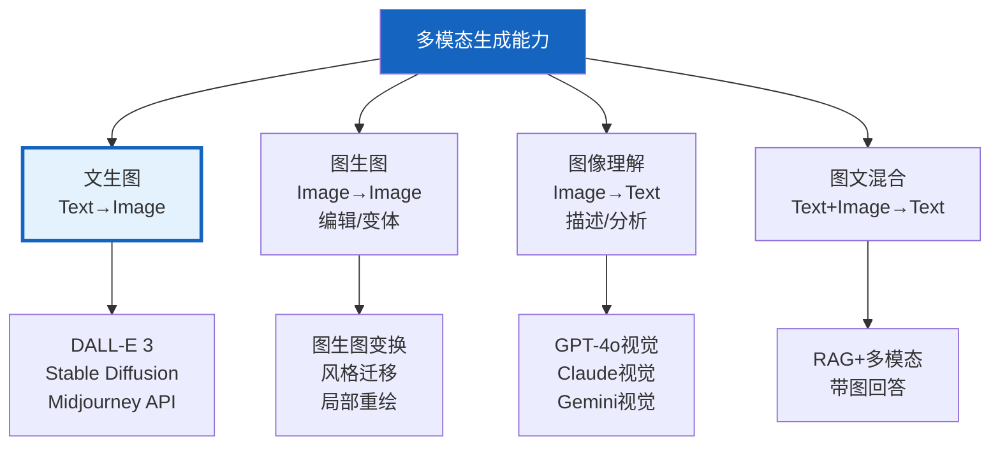

# 多模态生成：文生图与图像理解集成

> 之前的多模态文档（知识库 113/15）聚焦于"读图"——把图像转成文本。这份指南聚焦于"写图"——用 LLM 生成和编辑图像。覆盖 DALL-E、Stable Diffusion 集成，以及文生图 + 图像理解的全链路应用。

---

## 一、文生图能力全景



---

## 二、DALL-E 集成

### 2.1 文生图

```python
from langchain_core.tools import tool
import base64
import httpx

@tool
def generate_image(prompt: str, size: str = "1024x1024") -> dict:
    """用DALL-E 3生成图像。

    Args:
        prompt: 图像描述（英文效果更好）
        size: 图像尺寸 1024x1024/1792x1024/1024x1792

    Returns:
        &#123;"url": "图像URL", "revised_prompt": "优化后的提示"&#125;
    """
    from openai import OpenAI
    client = OpenAI()

    response = client.images.generate(
        model="dall-e-3",
        prompt=prompt,
        size=size,
        quality="standard",
        n=1,
    )

    return &#123;
        "url": response.data[0].url,
        "revised_prompt": response.data[0].revised_prompt,
    &#125;
```

### 2.2 作为 Agent 工具

```python
from langgraph.prebuilt import create_react_agent
from langchain_openai import ChatOpenAI

# 图像生成工具
image_tools = [generate_image]

# Agent可以自主决定何时生成图像
agent = create_react_agent(
    ChatOpenAI(model="gpt-4o"),
    image_tools + [search_web, calculate],
    prompt="""你是一个多模态助手。可以：
1. 搜索信息
2. 生成图像（用英文描述效果更好）
3. 分析和理解图像

当用户要求生成图像时，用英文描述场景并调用generate_image。""",
)

# 使用
result = agent.invoke(&#123;
    "messages": [&#123;"role": "user", "content": "画一只在月球上喝咖啡的猫"&#125;]
&#125;)
# Agent会自动调用generate_image
```

---

## 三、Stable Diffusion 集成

```python
class StableDiffusionGenerator:
    """Stable Diffusion图像生成。

    相比DALL-E：
    - 可本地部署（数据不出内网）
    - 可自定义模型（LoRA微调）
    - 可精细控制（ControlNet）
    - 但需要GPU
    """

    def __init__(self, api_url: str = "http://localhost:7860"):
        self.api_url = api_url

    async def generate(
        self,
        prompt: str,
        negative_prompt: str = "",
        width: int = 512,
        height: int = 512,
        steps: int = 20,
        cfg_scale: float = 7.0,
    ) -> bytes:
        """生成图像。"""
        async with httpx.AsyncClient() as client:
            response = await client.post(
                f"&#123;self.api_url&#125;/sdapi/v1/txt2img",
                json=&#123;
                    "prompt": prompt,
                    "negative_prompt": negative_prompt,
                    "width": width,
                    "height": height,
                    "steps": steps,
                    "cfg_scale": cfg_scale,
                &#125;,
                timeout=60,
            )
            data = response.json()
            # 返回base64编码的图像
            return base64.b64decode(data["images"][0])
```

---

## 四、图像理解集成

```mermaid
graph LR
    subgraph 流程 &#123;"图文混合流程"&#125;
        U["用户: '分析这张图表'"] --> AGENT["Agent"]
        IMG["上传图像"] --> AGENT
        AGENT --> VISION["GPT-4o视觉<br/>理解图像内容"]
        VISION --> ANSWER["回答+引用图像信息"]
    end

    style AGENT fill:#E3F2FD
    style VISION fill:#FFF9C4
    style ANSWER fill:#C8E6C9
```

```python
from langchain_core.messages import HumanMessage
import base64

async def analyze_image(
    llm,
    image_bytes: bytes,
    question: str,
) -> str:
    """用多模态LLM分析图像。"""
    b64 = base64.b64encode(image_bytes).decode()

    message = HumanMessage(content=[
        &#123;"type": "text", "text": question&#125;,
        &#123;
            "type": "image_url",
            "image_url": &#123;"url": f"data:image/png;base64,&#123;b64&#125;"&#125;,
        &#125;,
    ])

    response = await llm.ainvoke([message])
    return response.content
```

---

## 五、图文生成工作流

```mermaid
graph TB
    subgraph 工作流 &#123;"图文生成工作流"&#125;
        Q["用户: '写一篇关于深海的<br/>文章，配上插图'"] --> WRITE["写作Agent<br/>写文章"]
        WRITE --> EXTRACT["提取插图描述<br/>每段提取场景描述"]
        EXTRACT --> GEN["图像生成Agent<br/>根据描述生成图"]
        GEN --> COMBINE["合并<br/>文章+插图"]
        COMBINE --> OUT["图文并茂的结果"]
    end

    style WRITE fill:#E3F2FD
    style EXTRACT fill:#FFF9C4
    style GEN fill:#FFF3E0
    style OUT fill:#C8E6C9
```

```python
from langgraph.graph import StateGraph, START, END
from typing import TypedDict, Annotated
from operator import add

class ContentState(TypedDict):
    topic: str
    article: str
    image_prompts: list[str]
    images: Annotated[list[str], add]
    final_content: str

async def write_article(state: ContentState, llm) -> dict:
    """写文章节点。"""
    prompt = f"写一篇关于&#123;state['topic']&#125;的文章，600字。"
    response = await llm.ainvoke([HumanMessage(content=prompt)])
    return &#123;"article": response.content&#125;

async def extract_image_prompts(state: ContentState, llm) -> dict:
    """提取插图描述。"""
    prompt = f"""从以下文章中提取2个适合做插图的场景描述。
每个描述用英文，适合DALL-E生成。

文章:
&#123;state['article'][:1500]&#125;

输出格式（每行一个）:
1. English prompt 1
2. English prompt 2"""

    response = await llm.ainvoke([HumanMessage(content=prompt)])
    prompts = [l.strip() for l in response.content.split("\n") if l.strip()]
    # 去掉编号
    prompts = [p.split(".", 1)[-1].strip() if p[0].isdigit() else p for p in prompts]
    return &#123;"image_prompts": prompts[:2]&#125;

async def generate_images(state: ContentState) -> dict:
    """生成插图。"""
    images = []
    for prompt in state["image_prompts"]:
        result = generate_image.invoke(&#123;"prompt": prompt&#125;)
        images.append(result.get("url", ""))
    return &#123;"images": images&#125;

async def combine_content(state: ContentState, llm) -> dict:
    """合并文章和插图。"""
    img_markdown = "\n\n".join(
        f"" for i, url in enumerate(state["images"]) if url
    )
    final = f"&#123;state['article']&#125;\n\n&#123;img_markdown&#125;"
    return &#123;"final_content": final&#125;

def build_content_workflow(llm):
    graph = StateGraph(ContentState)
    graph.add_node("write", lambda s: write_article(s, llm))
    graph.add_node("extract", lambda s: extract_image_prompts(s, llm))
    graph.add_node("generate", generate_images)
    graph.add_node("combine", lambda s: combine_content(s, llm))

    graph.add_edge(START, "write")
    graph.add_edge("write", "extract")
    graph.add_edge("extract", "generate")
    graph.add_edge("generate", "combine")
    graph.add_edge("combine", END)

    return graph.compile()
```

---

## 六、图像编辑（图生图）

```python
@tool
def edit_image(
    image_url: str,
    edit_prompt: str,
) -> dict:
    """用DALL-E编辑现有图像。

    Args:
        image_url: 原始图像URL
        edit_prompt: 编辑指令（英文）

    Returns:
        &#123;"url": "编辑后图像URL"&#125;
    """
    from openai import OpenAI
    client = OpenAI()

    # 下载图像
    import httpx
    img_response = httpx.get(image_url)
    img_bytes = img_response.content

    from io import BytesIO
    img_file = BytesIO(img_bytes)

    response = client.images.edit(
        model="dall-e-2",
        image=img_file,
        prompt=edit_prompt,
        size="1024x1024",
    )

    return &#123;"url": response.data[0].url&#125;
```

---

## 七、最佳实践

| 实践 | 说明 | 优先级 |
|------|------|--------|
| 英文提示效果更好 | DALL-E/SD对英文理解更准 | ★★★ |
| 图像理解用GPT-4o | 视觉理解能力最强 | ★★★ |
| 数据敏感用本地SD | 图像不出内网 | ★★☆ |
| 生成后验证可用性 | LLM生成可能失败 | ★★☆ |
| 图文工作流用LangGraph | 编排写作+生成+合并 | ★★☆ |
| 图像描述要具体 | "猫"不如"橘猫坐在窗台上" | ★★☆ |

---

## 八、检查清单

| 检查项 | 状态 |
|--------|------|
| 能用DALL-E生成图像 | ☐ |
| 能用Stable Diffusion生成 | ☐ |
| 能集成到Agent中 | ☐ |
| 能做图像理解分析 | ☐ |
| 能构建图文混合工作流 | ☐ |
| 能做图像编辑 | ☐ |
