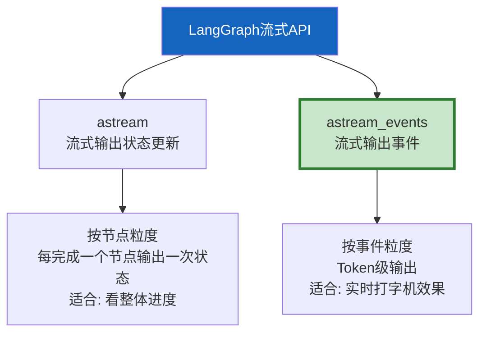
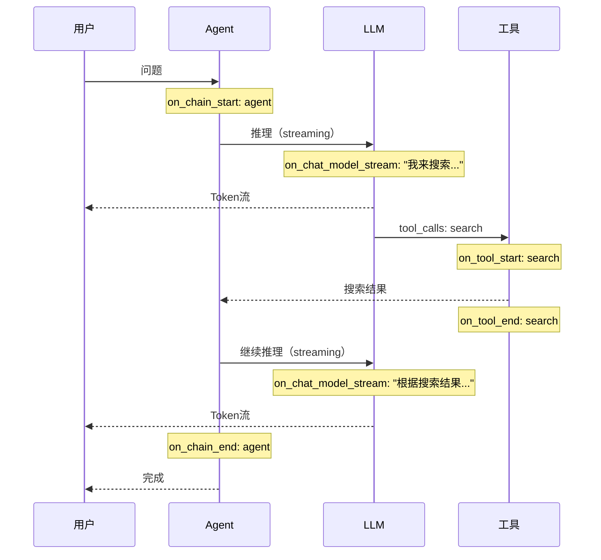

# LangGraph 流式 API 深度指南

> astream 和 astream_events 是 LangGraph 最强大也最容易误解的 API。用对可以实时输出 Token、展示工具调用进度、实现打字机效果；用错会导致输出混乱、事件丢失。这份指南深入讲解两种流式模式的区别、事件类型和实际用法。

---

## 一、两种流式模式



---

## 二、astream：状态级流式

```python
# astream: 每完成一个节点，输出当前完整状态
# 适合看整体进度，不适合实时打字机效果

from langgraph.graph import StateGraph, START, END
from typing import TypedDict

class State(TypedDict):
    messages: list
    step: str

async def step_a(state: State) -> dict:
    return &#123;"step": "A完成"&#125;

async def step_b(state: State) -> dict:
    return &#123;"step": "B完成"&#125;

graph = StateGraph(State)
graph.add_node("a", step_a)
graph.add_node("b", step_b)
graph.add_edge(START, "a")
graph.add_edge("a", "b")
graph.add_edge("b", END)
app = graph.compile()

# astream: 每个节点完成后输出状态
async for state in app.astream(&#123;"messages": [], "step": ""&#125;):
    print(f"状态更新: &#123;state['step']&#125;")
# 输出:
# 状态更新: A完成
# 状态更新: B完成
```

---

## 三、astream_events：事件级流式（重点）

```mermaid
graph TB
    subgraph 事件流 &#123;"astream_events事件类型"&#125;
        E1["on_chat_model_stream<br/>LLM Token流<br/>实时打字机"]
        E2["on_tool_start<br/>工具调用开始"]
        E3["on_tool_end<br/>工具调用结束"]
        E4["on_chain_start<br/>链/节点开始"]
        E5["on_chain_end<br/>链/节点结束"]
    end

    style E1 fill:#C8E6C9,stroke:#2E7D32,stroke-width:3px
```

### 3.1 基本用法

```python
from langgraph.prebuilt import create_react_agent
from langchain_openai import ChatOpenAI
from langchain_core.tools import tool

@tool
def search(query: str) -> str:
    """搜索信息"""
    return f"搜索结果: &#123;query&#125;"

agent = create_react_agent(
    ChatOpenAI(model="gpt-4o", streaming=True),  # 必须开启streaming
    [search],
)

async def stream_agent(question: str):
    """流式输出Agent响应。"""
    async for event in agent.astream_events(
        &#123;"messages": [&#123;"role": "user", "content": question&#125;]&#125;,
        version="v2",  # 必须指定version
    ):
        kind = event["event"]
        name = event["name"]

        if kind == "on_chat_model_stream":
            # LLM Token流——打字机效果的核心
            chunk = event["data"]["chunk"]
            if chunk.content:
                print(chunk.content, end="", flush=True)

        elif kind == "on_tool_start":
            print(f"\n[工具开始: &#123;name&#125;]")

        elif kind == "on_tool_end":
            output = event["data"]
            print(f"\n[工具完成: &#123;name&#125;]")

# 使用
import asyncio
asyncio.run(stream_agent("搜索Python最新特性并总结"))
```

### 3.2 stream_mode 参数

```python
# astream支持不同的stream_mode

# Mode 1: values — 输出完整状态（默认）
async for state in agent.astream(input, stream_mode="values"):
    print(state)  # 每次输出完整状态

# Mode 2: updates — 只输出变更部分
async for update in agent.astream(input, stream_mode="updates"):
    print(update)  # 只输出本轮更新的字段

# Mode 3: messages — 输出消息级别的流
async for msg, metadata in agent.astream(input, stream_mode="messages"):
    print(f"[&#123;msg.__class__.__name__&#125;] &#123;msg.content[:50]&#125;")

# Mode 4: 自定义 — 同时用多个模式
async for output in agent.astream(
    input,
    stream_mode=["messages", "updates"],  # 多模式同时
):
    # output是(mode, data)元组
    mode, data = output
    if mode == "messages":
        msg, meta = data
        print(msg.content, end="", flush=True)
    elif mode == "updates":
        print(f"\n状态更新: &#123;data&#125;")
```

---

## 四、事件过滤

```python
async def stream_filtered(question: str):
    """过滤事件：只关注特定类型。"""
    async for event in agent.astream_events(
        &#123;"messages": [&#123;"role": "user", "content": question&#125;]&#125;,
        version="v2",
    ):
        kind = event["event"]

        # 只关注LLM Token和工具事件
        if kind == "on_chat_model_stream":
            chunk = event["data"]["chunk"]
            if chunk.content:
                print(chunk.content, end="", flush=True)

        elif kind in ("on_tool_start", "on_tool_end"):
            print(f"\n[&#123;kind&#125;: &#123;event['name']&#125;]")

        # 忽略其他事件（on_chain_start/end等）
```

---

## 五、流式输出 + 工具调用 + 最终回答



```python
async def stream_with_progress(question: str):
    """流式输出 + 工具调用进度展示。"""
    print(f"用户: &#123;question&#125;\n")

    async for event in agent.astream_events(
        &#123;"messages": [&#123;"role": "user", "content": question&#125;]&#125;,
        version="v2",
    ):
        kind = event["event"]
        name = event["name"]
        data = event.get("data", &#123;&#125;)

        if kind == "on_chat_model_stream":
            chunk = data.get("chunk")
            if chunk and chunk.content:
                print(chunk.content, end="", flush=True)

        elif kind == "on_tool_start":
            # 工具调用时显示进度
            print(f"\n  🔍 调用工具: &#123;name&#125;...")

        elif kind == "on_tool_end":
            # 工具完成
            output = str(data.get("output", ""))[:50]
            print(f"  ✅ 工具完成: &#123;name&#125; → &#123;output&#125;")

    print("\n\n[Agent完成]")

# 使用
asyncio.run(stream_with_progress("搜索AI Agent最新进展并总结要点"))
```

---

## 六、流式输出到SSE

```python
from fastapi import FastAPI
from fastapi.responses import StreamingResponse
import json

app = FastAPI()

@app.post("/chat/stream")
async def chat_stream(request: dict):
    """SSE流式端点。"""
    question = request["message"]

    async def generate():
        async for event in agent.astream_events(
            &#123;"messages": [&#123;"role": "user", "content": question&#125;]&#125;,
            version="v2",
        ):
            kind = event["event"]

            if kind == "on_chat_model_stream":
                chunk = event["data"].get("chunk")
                if chunk and chunk.content:
                    data = json.dumps(&#123;"type": "token", "content": chunk.content&#125;)
                    yield f"data: &#123;data&#125;\n\n"

            elif kind == "on_tool_start":
                data = json.dumps(&#123;"type": "tool_start", "name": event["name"]&#125;)
                yield f"data: &#123;data&#125;\n\n"

            elif kind == "on_tool_end":
                data = json.dumps(&#123;"type": "tool_end", "name": event["name"]&#125;)
                yield f"data: &#123;data&#125;\n\n"

        yield f"data: &#123;json.dumps(&#123;'type': 'done'&#125;)&#125;\n\n"

    return StreamingResponse(generate(), media_type="text/event-stream")
```

---

## 七、常见陷阱

```mermaid
graph TB
    subgraph 陷阱 &#123;"astream_events常见陷阱"&#125;
        T1["❌ 忘记streaming=True<br/>LLM不流式返回Token"]
        T2["❌ 忘记version='v2'<br/>事件格式不同"]
        T3["❌ 不区分content和tool_calls<br/>chunk.content可能为空"]
        T4["❌ on_chain事件太多<br/>不过滤会刷屏"]
    end

    style 陷阱 fill:#FFCDD2
```

```python
# 陷阱1: 必须在ChatOpenAI设置streaming=True
# ❌ 错误: ChatOpenAI(model="gpt-4o")  — 不会流式
# ✅ 正确: ChatOpenAI(model="gpt-4o", streaming=True)  — 流式

# 陷阱2: chunk.content可能为空（当LLM在生成tool_calls时）
async for event in agent.astream_events(input, version="v2"):
    if event["event"] == "on_chat_model_stream":
        chunk = event["data"]["chunk"]
        # ✅ 必须检查content是否存在
        if chunk.content:  # tool_calls时content为空
            print(chunk.content, end="")
```

---

## 八、最佳实践

| 实践 | 说明 | 优先级 |
|------|------|--------|
| 用astream_events而非astream | Token级流式体验更好 | ★★★ |
| 必须设streaming=True | 否则LLM不流式返回 | ★★★ |
| 必须指定version="v2" | v1已过时 | ★★★ |
| 过滤事件类型 | on_chain事件太多会刷屏 | ★★☆ |
| 检查chunk.content非空 | tool_calls时content为空 | ★★☆ |
| SSE配合astream_events | 后端流式→前端SSE | ★★☆ |
| stream_mode="messages" | 消息级别流式更直观 | ★☆☆ |

---

## 九、检查清单

| 检查项 | 状态 |
|--------|------|
| 理解astream和astream_events区别 | ☐ |
| 能用astream_events做打字机效果 | ☐ |
| 知道stream_mode的4种模式 | ☐ |
| 能过滤事件类型 | ☐ |
| 能展示工具调用进度 | ☐ |
| 能输出到SSE | ☐ |
| 避免了常见陷阱 | ☐ |
