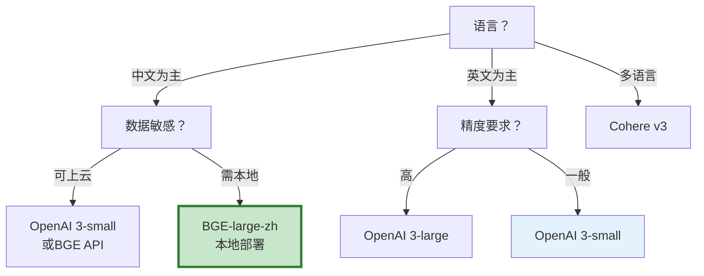

# Embedding 模型进阶选择与评估

> 选 Embedding 模型不能只看排行榜。维度、语言、领域、速度、成本——每个维度都可能让"排行榜第一"的模型在你的场景翻车。这份指南从实际评估出发，教你用数据选对 Embedding 模型。

---

## 一、为什么 Embedding 选择很难

```mermaid
graph TB
    subgraph 矛盾 &#123;"Embedding选择的矛盾"&#125;
        S1["维度高→精度高<br/>但存储大、查询慢"] --> C1["需要权衡"]
        S2["通用模型→覆盖广<br/>但领域精度不足"] --> C1
        S3["英文模型→英文强<br/>但中文差"] --> C1
        S4["大模型→质量好<br/>但贵且慢"] --> C1
        S5["排行榜第一<br/>但你的数据上可能不行"] --> C1
    end

    style 矛盾 fill:#FFF3E0
    style C1 fill:#FFF9C4
```

---

## 二、主流 Embedding 模型对比

```mermaid
graph TB
    subgraph 模型 &#123;"主流Embedding模型"&#125;
        M1["OpenAI text-embedding-3-small<br/>1536维<br/>通用<br/>$0.02/1M tokens"]
        M2["OpenAI text-embedding-3-large<br/>3072维<br/>高精度<br/>$0.13/1M tokens"]
        M3["BGE-large-zh-v1.5<br/>1024维<br/>中文优化<br/>可本地部署"]
        M4["Cohere embed-v3<br/>1024维<br/>多语言<br/>$0.10/1M tokens"]
        M5["GTE-large<br/>1024维<br/>开源<br/>免费本地部署"]
    end

    style M1 fill:#E3F2FD
    style M3 fill:#C8E6C9,stroke:#2E7D32,stroke-width:3px
    style M5 fill:#FFF3E0
```

| 模型 | 维度 | 中文 | 英文 | 成本 | 本地部署 | 适合场景 |
|------|------|------|------|------|----------|----------|
| OpenAI 3-small | 1536 | 中 | 强 | 低 | ❌ | 通用英文为主 |
| OpenAI 3-large | 3072 | 中 | 强 | 中 | ❌ | 高精度要求 |
| BGE-large-zh | 1024 | 强 | 中 | 免费 | ✅ | 中文为主 |
| Cohere v3 | 1024 | 中 | 强 | 中 | ❌ | 多语言 |
| GTE-large | 1024 | 中 | 强 | 免费 | ✅ | 开源自建 |

---

## 三、评估方法

```python
from dataclasses import dataclass
from typing import list
import numpy as np

@dataclass
class EmbeddingEvalResult:
    """Embedding模型评估结果"""
    model_name: str
    dimension: int
    avg_latency_ms: float
    retrieval_recall: float     # Top-K召回率
    retrieval_precision: float  # Top-K精确率
    mrr: float                  # 平均倒数排名
    cost_per_1m_tokens: float

class EmbeddingEvaluator:
    """Embedding模型评估器。

    用真实的查询-文档对评估不同模型的检索质量。
    """

    def __init__(self, test_cases: list[dict]):
        """
        Args:
            test_cases: [&#123;query, relevant_doc_ids, all_docs&#125;]
        """
        self.test_cases = test_cases

    async def evaluate(
        self,
        embeddings_model,
        model_name: str,
        k: int = 5,
    ) -> EmbeddingEvalResult:
        """评估一个Embedding模型。"""
        import time
        from langchain_core.vectorstores import InMemoryVectorStore

        latencies = []
        all_recalls = []
        all_precisions = []
        all_ranks = []

        for tc in self.test_cases:
            # 嵌入所有文档
            docs = tc["all_docs"]
            store = InMemoryVectorStore(embeddings_model)
            await store.aadd_texts(docs)

            # 嵌入查询（计时）
            start = time.time()
            results = await store.asimilarity_search(tc["query"], k=k)
            latency = (time.time() - start) * 1000
            latencies.append(latency)

            # 计算指标
            retrieved = [hash(r[:200]) for r in results]
            relevant = set(tc["relevant_doc_ids"])

            # 召回率：相关文档被检索到的比例
            retrieved_relevant = sum(1 for r in retrieved if r in relevant)
            recall = retrieved_relevant / len(relevant) if relevant else 0
            all_recalls.append(recall)

            # 精确率：检索结果中相关的比例
            precision = retrieved_relevant / k if k > 0 else 0
            all_precisions.append(precision)

            # MRR: 第一个相关文档的排名倒数
            for rank, r in enumerate(retrieved):
                if r in relevant:
                    all_ranks.append(1 / (rank + 1))
                    break
            else:
                all_ranks.append(0)

        return EmbeddingEvalResult(
            model_name=model_name,
            dimension=getattr(embeddings_model, 'dimension', 0),
            avg_latency_ms=round(np.mean(latencies), 2),
            retrieval_recall=round(np.mean(all_recalls), 4),
            retrieval_precision=round(np.mean(all_precisions), 4),
            mrr=round(np.mean(all_ranks), 4),
            cost_per_1m_tokens=0,  # 从定价表查
        )

    async def compare_models(self, models: dict) -> list[EmbeddingEvalResult]:
        """对比多个Embedding模型。"""
        results = []
        for name, model in models.items():
            result = await self.evaluate(model, name)
            results.append(result)
            print(f"&#123;name&#125;: 召回=&#123;result.retrieval_recall&#125;, "
                  f"精确=&#123;result.retrieval_precision&#125;, "
                  f"MRR=&#123;result.mrr&#125;, "
                  f"延迟=&#123;result.avg_latency_ms&#125;ms")
        return results
```

---

## 四、维度选择权衡

```mermaid
graph TB
    subgraph 维度权衡 &#123;"维度选择的权衡"&#125;
        D1["768维<br/>存储小<br/>查询快<br/>精度低"]
        D2["1024维<br/>平衡<br/>推荐默认"]
        D3["1536维<br/>精度高<br/>存储大<br/>查询慢"]
        D4["3072维<br/>最高精度<br/>成本高<br/>仅高精度场景"]
    end

    style D2 fill:#C8E6C9,stroke:#2E7D32,stroke-width:3px
```

---

## 五、降维优化

```python
class DimensionReducer:
    """Embedding降维：高维→低维，减少存储和查询成本。"""

    @staticmethod
    def reduce_pca(
        embeddings: np.ndarray,
        target_dim: int,
    ) -> tuple[np.ndarray, object]:
        """用PCA降维。

        Returns:
            (降维后向量, PCA模型)
        """
        from sklearn.decomposition import PCA
        pca = PCA(n_components=target_dim)
        reduced = pca.fit_transform(embeddings)
        explained_variance = pca.explained_variance_ratio_.sum()
        print(f"PCA降维: &#123;embeddings.shape[1]&#125;→&#123;target_dim&#125;, "
              f"保留方差: &#123;explained_variance:.2%&#125;")
        return reduced, pca

    @staticmethod
    def evaluate_dimension_reduction(
        original_vectors: np.ndarray,
        target_dims: list[int],
        queries: np.ndarray,
        ground_truth: list[list[int]],
    ) -> dict:
        """评估不同降维维度的效果。"""
        from sklearn.decomposition import PCA
        results = &#123;&#125;

        for dim in target_dims:
            if dim >= original_vectors.shape[1]:
                continue

            pca = PCA(n_components=dim)
            reduced = pca.fit_transform(original_vectors)
            reduced_queries = pca.transform(queries)

            # 计算降维后的召回率
            recalls = []
            for i, q in enumerate(reduced_queries):
                sims = reduced @ q
                top_k = np.argsort(sims)[-5:][::-1]
                relevant = set(ground_truth[i])
                recall = len(set(top_k) & relevant) / len(relevant) if relevant else 0
                recalls.append(recall)

            results[dim] = &#123;
                "recall": round(np.mean(recalls), 4),
                "variance_retained": round(pca.explained_variance_ratio_.sum(), 4),
                "storage_reduction": round(1 - dim / original_vectors.shape[1], 4),
            &#125;

        return results
```

---

## 六、选型决策



---

## 七、最佳实践

| 实践 | 说明 | 优先级 |
|------|------|--------|
| 用真实数据评估 | 排行榜不代表你的场景 | ★★★ |
| 中文用BGE | 中文Embedding最强 | ★★★ |
| 数据敏感用本地 | 开源模型可本地部署 | ★★★ |
| 1024维是平衡点 | 精度和成本兼顾 | ★★☆ |
| 高维可PCA降维 | 减少存储和查询成本 | ★★☆ |
| 嵌入模型不轻易换 | 换模型要重建全部索引 | ★★★ |
| 对比MRR不只看召回 | MRR反映排名质量 | ★★☆ |

---

## 八、检查清单

| 检查项 | 状态 |
|--------|------|
| 用真实数据评估了模型 | ☐ |
| 对比了多个模型 | ☐ |
| 考虑了维度权衡 | ☐ |
| 考虑了语言适配 | ☐ |
| 考虑了数据敏感度 | ☐ |
| 有选型决策依据 | ☐ |
