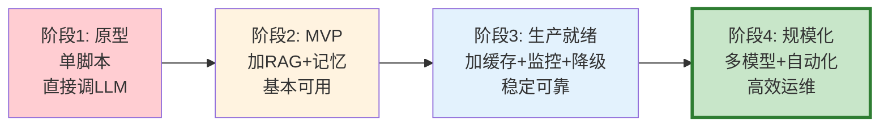

# LLM 应用架构演进：从原型到生产

> 每个 LLM 应用都经历相似的成熟度旅程：从一个脚本原型开始，逐步加上缓存、路由、监控、降级，最终成为生产级系统。这份指南画出完整的演进路线图，让你知道自己在哪个阶段、下一步该加什么。

---

## 一、四个成熟度阶段



---

## 二、各阶段架构对比

```mermaid
graph TB
    subgraph 原型 &#123;"阶段1: 原型"&#125;
        P1["用户"] --> P2["Python脚本<br/>直接调OpenAI API"]
    end

    subgraph MVP &#123;"阶段2: MVP"&#125;
        M1["用户"] --> M2["FastAPI<br/>+RAG检索<br/>+对话记忆"]
    end

    subgraph 生产 &#123;"阶段3: 生产就绪"&#125;
        PR1["用户"] --> PR2["负载均衡<br/>+语义缓存<br/>+模型路由<br/>+监控告警<br/>+降级熔断"]
    end

    subgraph 规模 &#123;"阶段4: 规模化"&#125;
        SC1["用户"] --> SC2["LLM网关<br/>+多模型<br/>+自动扩缩容<br/>+A/B测试<br/>+红队测试<br/>+混沌工程"]
    end

    style 原型 fill:#FFCDD2
    style MVP fill:#FFF3E0
    style 生产 fill:#E3F2FD
    style 规模 fill:#C8E6C9
```

---

## 三、阶段1→2：原型到 MVP

```mermaid
graph TB
    subgraph 升级 &#123;"原型→MVP需要加什么"&#125;
        A1["+ 向量库<br/>RAG检索增强"]
        A2["+ 对话记忆<br/>Checkpointer"]
        A3["+ 流式输出<br/>SSE"]
        A4["+ 前端界面<br/>简单Web UI"]
        A5["+ 错误处理<br/>重试+超时"]
    end

    style 升级 fill:#FFF3E0
```

```python
# 阶段1: 原型（20行代码）
from langchain_openai import ChatOpenAI
from langchain_core.messages import HumanMessage

llm = ChatOpenAI(model="gpt-4o")
response = llm.invoke([HumanMessage(content="你好")])
print(response.content)

# 阶段2: MVP（加RAG+记忆+流式）
from langgraph.prebuilt import create_react_agent
from langgraph.checkpoint.memory import MemorySaver
from langchain_core.vectorstores import InMemoryVectorStore
from langchain_openai import OpenAIEmbeddings

vectorstore = InMemoryVectorStore(OpenAIEmbeddings())
agent = create_react_agent(
    ChatOpenAI(model="gpt-4o", streaming=True),
    tools=[search_tool],
    checkpointer=MemorySaver(),
)
# 有了RAG、记忆、流式输出
```

---

## 四、阶段2→3：MVP 到生产就绪

```mermaid
graph TB
    subgraph 升级 &#123;"MVP→生产需要加什么"&#125;
        B1["+ 语义缓存<br/>减少30%重复调用"]
        B2["+ 模型路由<br/>简单→mini 省成本"]
        B3["+ 监控<br/>延迟/错误率/成本"]
        B4["+ 降级链<br/>主模型失败→备用"]
        B5["+ 断路器<br/>错误率>阈值自动熔断"]
        B6["+ 限流<br/>令牌桶防超载"]
        B7["+ 持久化<br/>Memory→PostgreSQL"]
        B8["+ 日志<br/>结构化+请求ID"]
    end

    style 升级 fill:#E3F2FD
```

```python
# 阶段3: 生产就绪架构
from langgraph.checkpoint.postgres import PostgresSaver
from langgraph.store.postgres import PostgresStore

class ProductionConfig:
    """生产环境配置清单。"""
    # 持久化
    CHECKPOINTER = PostgresSaver  # 不再用MemorySaver
    STORE = PostgresStore          # 长期记忆

    # 缓存
    SEMANTIC_CACHE = True          # 语义缓存
    CACHE_THRESHOLD = 0.92         # 相似度阈值

    # 模型路由
    MODEL_ROUTING = True           # 按复杂度选模型
    FAST_MODEL = "gpt-4o-mini"    # 80%请求走小模型

    # 可靠性
    FALLBACK_CHAIN = True          # 降级链
    CIRCUIT_BREAKER = True         # 断路器
    RATE_LIMIT = 100              # QPS限制

    # 可观测性
    METRICS_ENDPOINT = "/metrics"  # Prometheus
    STRUCTURED_LOGS = True        # 结构化日志
    LANGSMITH_TRACING = True      # 追踪

    # 安全
    INPUT_VALIDATION = True        # 输入校验
    OUTPUT_FILTERING = True       # 输出过滤
    PII_REDACTION = True          # PII脱敏
```

---

## 五、阶段3→4：生产到规模化

```mermaid
graph TB
    subgraph 升级 &#123;"生产→规模化需要加什么"&#125;
        C1["+ LLM网关<br/>统一多模型管理"]
        C2["+ A/B测试<br/>数据驱动迭代"]
        C3["+ 红队测试<br/>主动安全评估"]
        C4["+ 混沌工程<br/>验证韧性"]
        C5["+ 自动扩缩容<br/>Kubernetes"]
        C6["+ 评估管线<br/>CI/CD回归测试"]
        C7["+ 成本优化<br/>Token预算管理"]
        C8["+ 多租户<br/>资源隔离"]
    end

    style 升级 fill:#C8E6C9
```

---

## 六、成熟度评估清单

```python
class MaturityAssessment:
    """LLM应用成熟度评估器。"""

    CHECKLIST = &#123;
        "原型": &#123;
            "直接调LLM API": True,
            "无RAG": True,
            "无对话记忆": True,
            "无错误处理": True,
            "无监控": True,
        &#125;,
        "MVP": &#123;
            "有RAG检索": False,
            "有对话记忆": False,
            "有流式输出": False,
            "有基本错误处理": False,
            "有Web界面": False,
        &#125;,
        "生产就绪": &#123;
            "有语义缓存": False,
            "有模型路由": False,
            "有监控告警": False,
            "有降级链": False,
            "有断路器": False,
            "有限流": False,
            "用PostgreSQL持久化": False,
            "有结构化日志": False,
        &#125;,
        "规模化": &#123;
            "有LLM网关": False,
            "有A/B测试": False,
            "有红队测试": False,
            "有混沌工程": False,
            "有自动扩缩容": False,
            "有CI评估管线": False,
            "有成本优化": False,
            "有多租户": False,
        &#125;,
    &#125;

    @classmethod
    def assess(cls, status: dict) -> dict:
        """评估当前成熟度。"""
        scores = &#123;&#125;
        for stage, items in cls.CHECKLIST.items():
            if stage == "原型":
                continue
            passed = sum(1 for k in items if status.get(k, False))
            total = len(items)
            scores[stage] = &#123;
                "score": f"&#123;passed&#125;/&#123;total&#125;",
                "percentage": round(passed / total * 100),
                "ready": passed == total,
            &#125;

        # 确定当前阶段
        current = "原型"
        for stage in ["MVP", "生产就绪", "规模化"]:
            if scores[stage]["ready"]:
                current = stage

        return &#123;"current_stage": current, "details": scores&#125;
```

---

## 七、演进路线图

```mermaid
graph TB
    subgraph 路线图 &#123;"演进优先级"&#125;
        P1["优先级1<br/>RAG+记忆+流式<br/>让应用可用"]
        P2["优先级2<br/>缓存+路由+监控<br/>让应用稳定"]
        P3["优先级3<br/>降级+断路器+限流<br/>让应用可靠"]
        P4["优先级4<br/>网关+A/B+红队<br/>让应用高效安全"]
    end

    P1 --> P2 --> P3 --> P4

    style P1 fill:#FFCDD2
    style P2 fill:#FFF3E0
    style P3 fill:#E3F2FD
    style P4 fill:#C8E6C9
```

---

## 八、最佳实践

| 实践 | 阶段 | 优先级 |
|------|------|--------|
| 先跑通再优化 | 原型 | ★★★ |
| 持久化用PostgreSQL | 生产就绪 | ★★★ |
| 监控在降级之前 | 生产就绪 | ★★★ |
| 降级链是生命线 | 生产就绪 | ★★★ |
| 成本优化看模型路由 | 规模化 | ★★☆ |
| A/B测试驱动迭代 | 规模化 | ★★☆ |

---

## 九、检查清单

| 检查项 | 状态 |
|--------|------|
| 知道自己在哪个阶段 | ☐ |
| 知道下一步该加什么 | ☐ |
| 有持久化存储 | ☐ |
| 有监控告警 | ☐ |
| 有降级链 | ☐ |
| 有成本优化 | ☐ |
