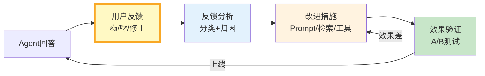

# Agent 反馈学习与持续优化

> Agent 上线不是终点而是起点。用户反馈（点赞/点踩/修正）是金矿——但如果不去收集和分析，就永远浪费了。这份指南覆盖反馈收集、分析、自动改进和持续优化的完整闭环。

---

## 一、反馈学习闭环



---

## 二、反馈收集

```mermaid
graph TB
    subgraph 收集 &#123;"三种反馈类型"&#125;
        F1["显式反馈<br/>用户主动给<br/>👍/👎/评分"]
        F2["隐式反馈<br/>行为推断<br/>复制/重新提问/转人工"]
        F3["修正反馈<br/>用户改了答案<br/>直接学习正确版"]
    end

    style 收集 fill:#E3F2FD
    style F3 fill:#C8E6C9,stroke:#2E7D32,stroke-width:3px
```

```python
from dataclasses import dataclass, field
from enum import Enum
from datetime import datetime
from typing import Any

class FeedbackType(str, Enum):
    THUMBS_UP = "thumbs_up"
    THUMBS_DOWN = "thumbs_down"
    RATING = "rating"           # 1-5星
    CORRECTION = "correction"   # 用户修正了答案
    REGENERATE = "regenerate"   # 用户要求重新生成
    COPY = "copy"               # 用户复制了答案（正面信号）
    ESCALATE = "escalate"       # 用户转人工（负面信号）

@dataclass
class UserFeedback:
    """用户反馈数据。"""
    feedback_id: str
    session_id: str
    query: str
    agent_response: str
    feedback_type: FeedbackType
    rating: int | None = None          # 1-5
    corrected_response: str | None = None  # 用户修正后的答案
    feedback_text: str = ""            # 文字反馈
    timestamp: str = field(default_factory=lambda: datetime.now().isoformat())
    metadata: dict = field(default_factory=dict)

class FeedbackCollector:
    """反馈收集器。"""

    def __init__(self):
        self.feedback_store: list[UserFeedback] = []

    def record(self, feedback: UserFeedback):
        """记录反馈。"""
        self.feedback_store.append(feedback)

    def get_negative_feedback(self) -> list[UserFeedback]:
        """获取负面反馈。"""
        return [
            f for f in self.feedback_store
            if f.feedback_type in (FeedbackType.THUMBS_DOWN, FeedbackType.ESCALATE)
            or (f.feedback_type == FeedbackType.RATING and f.rating and f.rating <= 2)
        ]

    def get_corrections(self) -> list[UserFeedback]:
        """获取用户修正的反馈——最有价值。"""
        return [
            f for f in self.feedback_store
            if f.feedback_type == FeedbackType.CORRECTION and f.corrected_response
        ]
```

---

## 三、反馈分析

```python
from langchain_core.language_models import BaseChatModel
from langchain_core.messages import HumanMessage

ANALYSIS_PROMPT = """分析以下负面反馈，找出问题根因。

用户问题: &#123;query&#125;
Agent回答: &#123;response&#125;
反馈类型: &#123;feedback_type&#125;
用户修正: &#123;correction&#125;

请分析：
1. 问题类别（检索不准/推理错误/格式错误/内容缺失/幻觉/安全违规）
2. 根因分析
3. 改进建议

输出JSON:
```json
&#123;&#123;
  "category": "...",
  "root_cause": "...",
  "improvement": "...",
  "severity": "high/medium/low"
&#125;&#125;
```"""

class FeedbackAnalyzer:
    """反馈分析器。"""

    def __init__(self, llm: BaseChatModel):
        self.llm = llm

    async def analyze_feedback(self, feedback: UserFeedback) -> dict:
        """分析单条反馈。"""
        prompt = ANALYSIS_PROMPT.format(
            query=feedback.query,
            response=feedback.agent_response[:500],
            feedback_type=feedback.feedback_type.value,
            correction=feedback.corrected_response or "无",
        )

        response = await self.llm.ainvoke([HumanMessage(content=prompt)])

        import json, re
        json_match = re.search(r'\&#123;.*\&#125;', response.content, re.DOTALL)
        if json_match:
            return json.loads(json_match.group())
        return &#123;"category": "unknown", "root_cause": response.content[:200]&#125;

    async def analyze_batch(
        self,
        feedbacks: list[UserFeedback],
    ) -> dict:
        """批量分析反馈，生成总结报告。"""
        analyses = []
        for f in feedbacks:
            analysis = await self.analyze_feedback(f)
            analyses.append(analysis)

        # 按类别统计
        from collections import Counter
        categories = Counter(a["category"] for a in analyses)

        return &#123;
            "total_analyzed": len(analyses),
            "by_category": dict(categories),
            "top_issue": categories.most_common(1)[0] if categories else None,
            "high_severity": sum(1 for a in analyses if a.get("severity") == "high"),
            "analyses": analyses,
        &#125;
```

---

## 四、自动改进

```mermaid
graph TB
    subgraph 改进 &#123;"基于反馈的改进措施"&#125;
        I1["检索不准<br/>→ 优化分块/嵌入<br/>→ 加重排序"]
        I2["推理错误<br/>→ 改进Prompt<br/>→ 加CoT推理"]
        I3["格式错误<br/>→ 加输出约束<br/>→ Few-Shot示例"]
        I4["内容缺失<br/>→ 补充知识库<br/>→ 加Web搜索"]
        I5["幻觉<br/>→ 加Self-RAG验证<br/>→ 输出护栏"]
    end

    style 改进 fill:#E3F2FD
```

```python
class FeedbackDrivenImprover:
    """基于反馈的自动改进器。"""

    IMPROVEMENT_ACTIONS = &#123;
        "检索不准": [
            "检查检索Top-K是否太小",
            "尝试查询重写",
            "加Cross-Encoder重排序",
            "评估分块策略",
        ],
        "推理错误": [
            "在Prompt中加'让我们一步步思考'",
            "检查Few-Shot示例是否有效",
            "考虑用Plan-Execute模式",
        ],
        "格式错误": [
            "加结构化输出约束",
            "加输出格式Few-Shot",
            "加输出验证和重试",
        ],
        "内容缺失": [
            "补充知识库文档",
            "增加Web搜索工具",
            "检查文档是否过时",
        ],
        "幻觉": [
            "加Self-RAG验证",
            "加输出护栏",
            "降低temperature",
        ],
    &#125;

    @classmethod
    def get_improvement_plan(cls, category: str) -> list[str]:
        """根据问题类别获取改进建议。"""
        return cls.IMPROVEMENT_ACTIONS.get(category, ["具体分析问题原因"])

    @classmethod
    async def generate_prompt_fix(
        cls,
        llm: BaseChatModel,
        current_prompt: str,
        bad_case: dict,
    ) -> str:
        """基于坏案例自动改进Prompt。"""
        prompt = f"""请基于以下坏案例改进系统提示。

当前提示:
&#123;current_prompt&#125;

坏案例:
- 用户问题: &#123;bad_case['query']&#125;
- 错误回答: &#123;bad_case['response']&#125;
- 问题原因: &#123;bad_case['cause']&#125;
- 正确答案: &#123;bad_case.get('correction', '未知')&#125;

请改进提示，使其能避免这类错误。
直接输出改进后的提示:"""

        response = await llm.ainvoke([HumanMessage(content=prompt)])
        return response.content
```

---

## 五、效果验证

```python
class ABTestRunner:
    """A/B测试：验证改进效果。"""

    def __init__(self):
        self.results: dict[str, list[dict]] = &#123;"A": [], "B": []&#125;

    async def run_test(
        self,
        agent_a,  # 原版
        agent_b,  # 改进版
        test_cases: list[str],
    ) -> dict:
        """对同一批测试用例跑两个版本。"""
        for query in test_cases:
            # 版本A
            result_a = await agent_a.ainvoke(&#123;"messages": [&#123;"role": "user", "content": query&#125;]&#125;)
            answer_a = result_a["messages"][-1].content
            self.results["A"].append(&#123;"query": query, "answer": answer_a&#125;)

            # 版本B
            result_b = await agent_b.ainvoke(&#123;"messages": [&#123;"role": "user", "content": query&#125;]&#125;)
            answer_b = result_b["messages"][-1].content
            self.results["B"].append(&#123;"query": query, "answer": answer_b&#125;)

        return self._compare()

    def _compare(self) -> dict:
        """对比两个版本。"""
        return &#123;
            "total_cases": len(self.results["A"]),
            "version_a": &#123;"count": len(self.results["A"])&#125;,
            "version_b": &#123;"count": len(self.results["B"])&#125;,
            "note": "需要人工或LLM-as-Judge评估哪个版本更好",
        &#125;
```

---

## 六、持续优化飞轮

```mermaid
graph TB
    subgraph 飞轮 &#123;"持续优化飞轮"&#125;
        F1["上线运行"] --> F2["收集反馈"]
        F2 --> F3["分析归因"]
        F3 --> F4["制定改进"]
        F4 --> F5["A/B测试"]
        F5 -->|"B更好"| F6["上线B版本"]
        F5 -->|"A更好"| F2
        F6 --> F1
    end

    style F2 fill:#FFF9C4
    style F5 fill:#C8E6C9
    style F6 fill:#C8E6C9
```

---

## 七、最佳实践

| 实践 | 说明 | 优先级 |
|------|------|--------|
| 修正反馈最有价值 | 用户改了答案=免费标注 | ★★★ |
| 负面反馈优先处理 | 差评是改进金矿 | ★★★ |
| 改进必须A/B验证 | 不能凭感觉上线 | ★★★ |
| 反馈分类归因 | 找到系统性问题 | ★★☆ |
| 每周分析反馈 | 不要积压 | ★★☆ |
| 高严重度立即修 | 幻觉/安全必须立即处理 | ★★★ |

---

## 八、检查清单

| 检查项 | 状态 |
|--------|------|
| 有反馈收集机制 | ☐ |
| 有显式反馈（👍/👎） | ☐ |
| 有隐式反馈（复制/转人工） | ☐ |
| 有修正反馈收集 | ☐ |
| 有反馈分析归因 | ☐ |
| 有A/B测试验证 | ☐ |
| 有持续优化飞轮 | ☐ |
