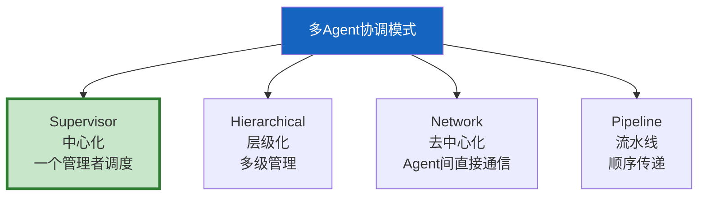

# 多 Agent 协调模式与拓扑设计

> 多 Agent 不是简单地把多个 Agent 放在一起——它们如何通信、谁做决策、任务怎么分配，决定了系统的效率和可靠性。这份指南覆盖 4 种核心协调模式和拓扑设计。

---

## 一、四种协调模式



---

## 二、模式1：Supervisor（中心化）

```mermaid
graph TB
    subgraph Supervisor &#123;"Supervisor模式"&#125;
        SUP["Supervisor<br/>接收→分配→收集→综合"]
        SUP --> A1["Agent A<br/>搜索"]
        SUP --> A2["Agent B<br/>分析"]
        SUP --> A3["Agent C<br/>写作"]
        A1 --> SUP
        A2 --> SUP
        A3 --> SUP
    end

    style SUP fill:#1565C0,color:#fff,stroke-width:3px
```

**特点：** 一个中心管理者接收用户请求，分发给工作 Agent，收集结果后综合输出。

**优点：** 控制清晰、容易调试、Agent 间不直接通信减少冲突。

**缺点：** Supervisor 是单点瓶颈、所有通信经过中心节点。

```python
from langgraph.graph import StateGraph, START, END
from typing import TypedDict, Annotated
from operator import add

class SupervisorState(TypedDict):
    messages: Annotated[list, add]
    task: str
    agent_results: Annotated[list[str], add]
    final: str

async def supervisor_route(state: SupervisorState) -> str:
    """Supervisor决定下一步调用哪个Agent。"""
    task = state.get("task", "")
    # 用LLM决定路由
    if "搜索" in task or "查找" in task:
        return "searcher"
    elif "分析" in task or "分析" in task:
        return "analyst"
    elif "写" in task or "报告" in task:
        return "writer"
    return "end"

async def searcher(state: SupervisorState) -> dict:
    return &#123;"agent_results": ["搜索结果..."]&#125;

async def analyst(state: SupervisorState) -> dict:
    return &#123;"agent_results": ["分析结果..."]&#125;

async def writer(state: SupervisorState) -> dict:
    results = state.get("agent_results", [])
    return &#123;"final": f"报告: &#123;'; '.join(results)&#125;"&#125;

def build_supervisor_graph():
    graph = StateGraph(SupervisorState)
    graph.add_node("supervisor", lambda s: &#123;&#125;)  # 路由节点
    graph.add_node("searcher", searcher)
    graph.add_node("analyst", analyst)
    graph.add_node("writer", writer)

    graph.add_edge(START, "supervisor")
    graph.add_conditional_edges("supervisor", supervisor_route, &#123;
        "searcher": "searcher",
        "analyst": "analyst",
        "writer": "writer",
        "end": END,
    &#125;)
    # 工作Agent完成后回到Supervisor
    graph.add_edge("searcher", "supervisor")
    graph.add_edge("analyst", "supervisor")
    graph.add_edge("writer", END)

    return graph.compile()
```

---

## 三、模式2：Hierarchical（层级化）

```mermaid
graph TB
    subgraph Hierarchical &#123;"层级模式"&#125;
        TOP["顶层Supervisor<br/>总调度"]
        TOP --> M1["中层Supervisor A<br/>研究组"]
        TOP --> M2["中层Supervisor B<br/>分析组"]
        M1 --> A1["搜索Agent"]
        M1 --> A2["检索Agent"]
        M2 --> A3["统计Agent"]
        M2 --> A4["可视化Agent"]
    end

    style TOP fill:#1565C0,color:#fff,stroke-width:3px
    style M1 fill:#E3F2FD
    style M2 fill:#E3F2FD
```

**特点：** 多级管理，顶层 Supervisor 调度中层 Supervisor，中层再调度工作 Agent。

**适合：** 大规模多 Agent 系统，单层 Supervisor 无法管理所有 Agent。

```python
def build_hierarchical_graph():
    """层级化多Agent系统。

    顶层Supervisor → 中层Supervisor(子图) → 工作Agent
    """
    # 研究组子图
    research_subgraph = build_supervisor_graph()  # 复用Supervisor模式

    # 分析组子图
    analysis_subgraph = build_supervisor_graph()

    class HierarchicalState(TypedDict):
        task: str
        research_result: str
        analysis_result: str
        final: str

    async def top_supervisor(state: HierarchicalState) -> dict:
        return &#123;&#125;  # 只做路由

    async def research_team(state: HierarchicalState) -> dict:
        result = await research_subgraph.ainvoke(&#123;
            "messages": [], "task": state["task"],
            "agent_results": [], "final": "",
        &#125;)
        return &#123;"research_result": result.get("final", "")&#125;

    async def analysis_team(state: HierarchicalState) -> dict:
        result = await analysis_subgraph.ainvoke(&#123;
            "messages": [], "task": state.get("research_result", ""),
            "agent_results": [], "final": "",
        &#125;)
        return &#123;"analysis_result": result.get("final", "")&#125;

    async def combine(state: HierarchicalState) -> dict:
        return &#123;"final": f"&#123;state['research_result']&#125;\n&#123;state['analysis_result']&#125;"&#125;

    graph = StateGraph(HierarchicalState)
    graph.add_node("top", top_supervisor)
    graph.add_node("research", research_team)
    graph.add_node("analysis", analysis_team)
    graph.add_node("combine", combine)

    graph.add_edge(START, "top")
    graph.add_edge("top", "research")
    graph.add_edge("research", "analysis")
    graph.add_edge("analysis", "combine")
    graph.add_edge("combine", END)

    return graph.compile()
```

---

## 四、模式3：Network（去中心化）

```mermaid
graph TB
    subgraph Network &#123;"网络模式"&#125;
        A1["Agent A"] <--> A2["Agent B"]
        A2 <--> A3["Agent C"]
        A1 <--> A3
        A3 <--> A4["Agent D"]
    end

    style Network fill:#FFF3E0
```

**特点：** Agent 之间直接通信，无中心管理者。通过对话协商完成任务。

**适合：** 需要多视角讨论、辩论、共识的场景。

**缺点：** 难以控制、调试困难、可能死循环。

```python
from langgraph.graph import StateGraph, START, END
from typing import TypedDict, Annotated
from operator import add

class NetworkState(TypedDict):
    messages: Annotated[list, add]
    topic: str
    consensus: str
    turn_count: int

async def agent_a(state: NetworkState) -> dict:
    """Agent A：提出观点。"""
    messages = state.get("messages", [])
    last = messages[-1]["content"] if messages else state["topic"]

    from langchain_core.messages import HumanMessage, AIMessage
    # Agent A基于其他Agent的观点回应
    response = await llm.ainvoke([HumanMessage(content=f"作为Agent A，回应: &#123;last&#125;")])
    return &#123;
        "messages": [AIMessage(content=f"[A] &#123;response.content&#125;")],
        "turn_count": state.get("turn_count", 0) + 1,
    &#125;

async def agent_b(state: NetworkState) -> dict:
    """Agent B：质疑和补充。"""
    messages = state.get("messages", [])
    last = messages[-1].content if messages else ""

    from langchain_core.messages import HumanMessage, AIMessage
    response = await llm.ainvoke([HumanMessage(content=f"作为Agent B，质疑: &#123;last[:200]&#125;")])
    return &#123;
        "messages": [AIMessage(content=f"[B] &#123;response.content&#125;")],
        "turn_count": state.get("turn_count", 0) + 1,
    &#125;

def should_continue(state: NetworkState) -> str:
    """决定是否继续对话。"""
    if state.get("turn_count", 0) >= 6:  # 最多3轮（每人3次）
        return "consensus"
    return "continue"

async def reach_consensus(state: NetworkState) -> dict:
    """达成共识。"""
    messages = state.get("messages", [])
    history = "\n".join(m.content if hasattr(m, "content") else str(m) for m in messages)

    from langchain_core.messages import HumanMessage
    response = await llm.ainvoke([HumanMessage(content=f"基于以下对话达成共识:\n&#123;history&#125;")])
    return &#123;"consensus": response.content&#125;

def build_network_graph():
    graph = StateGraph(NetworkState)
    graph.add_node("agent_a", agent_a)
    graph.add_node("agent_b", agent_b)
    graph.add_node("consensus", reach_consensus)

    graph.add_edge(START, "agent_a")
    graph.add_edge("agent_a", "agent_b")
    graph.add_conditional_edges("agent_b", should_continue, &#123;
        "continue": "agent_a",
        "consensus": "consensus",
    &#125;)
    graph.add_edge("consensus", END)

    return graph.compile()
```

---

## 五、模式4：Pipeline（流水线）

```mermaid
graph LR
    subgraph Pipeline &#123;"流水线模式"&#125;
        A["Agent A<br/>收集"] --> B["Agent B<br/>分析"]
        B --> C["Agent C<br/>写作"]
        C --> D["Agent D<br/>审查"]
        D --> E["输出"]
    end

    style A fill:#E3F2FD
    style C fill:#FFF3E0
    style D fill:#C8E6C9
```

**特点：** Agent 按固定顺序执行，前一个的输出是后一个的输入。

**适合：** 有明确步骤的线性流程。

```python
def build_pipeline_graph():
    """流水线模式：收集→分析→写作→审查。"""
    class PipelineState(TypedDict):
        topic: str
        data: str
        analysis: str
        draft: str
        final: str

    async def collect(state: PipelineState) -> dict:
        return &#123;"data": f"关于&#123;state['topic']&#125;的数据"&#125;

    async def analyze(state: PipelineState) -> dict:
        return &#123;"analysis": f"分析: &#123;state['data']&#125;"&#125;

    async def write(state: PipelineState) -> dict:
        return &#123;"draft": f"报告: &#123;state['analysis']&#125;"&#125;

    async def review(state: PipelineState) -> dict:
        return &#123;"final": f"&#123;state['draft']&#125; [已审查]"&#125;

    graph = StateGraph(PipelineState)
    graph.add_node("collect", collect)
    graph.add_node("analyze", analyze)
    graph.add_node("write", write)
    graph.add_node("review", review)

    graph.add_edge(START, "collect")
    graph.add_edge("collect", "analyze")
    graph.add_edge("analyze", "write")
    graph.add_edge("write", "review")
    graph.add_edge("review", END)

    return graph.compile()
```

---

## 六、模式对比与选型

```mermaid
graph TB
    Q1["Agent数量？"] --> Q2&#123;"<5个？"&#125;
    Q2 -->|是| Q3&#123;"有明确步骤？"&#125;
    Q3 -->|是| PIPELINE["Pipeline流水线"]
    Q3 -->|否| SUP["Supervisor"]
    Q2 -->|否,5-15个| HIER["Hierarchical层级"]
    Q2 -->|否,需要辩论| NET["Network去中心化"]

    style SUP fill:#C8E6C9,stroke:#2E7D32,stroke-width:3px
    style PIPELINE fill:#E3F2FD
    style HIER fill:#FFF3E0
    style NET fill:#FFCDD2
```

| 模式 | Agent数 | 通信方式 | 控制力 | 适合场景 |
|------|---------|----------|--------|----------|
| Supervisor | 2-5 | 中心调度 | 强 | 通用多Agent |
| Hierarchical | 5-15 | 多级管理 | 强 | 大规模系统 |
| Network | 2-6 | 直接通信 | 弱 | 辩论/共识 |
| Pipeline | 3-6 | 顺序传递 | 强 | 线性流程 |

---

## 七、最佳实践

| 实践 | 说明 | 优先级 |
|------|------|--------|
| 默认用Supervisor | 80%场景够用 | ★★★ |
| 大规模用层级化 | 超过5个Agent分层管理 | ★★★ |
| Pipeline最简单 | 有明确步骤时首选 | ★★☆ |
| Network设最大轮次 | 防止无限对话 | ★★★ |
| 每个Agent有明确角色 | 职责不重叠 | ★★☆ |
| 复用子图模式 | 各模式可作为子图嵌套 | ★★☆ |

---

## 八、检查清单

| 检查项 | 状态 |
|--------|------|
| 理解四种协调模式 | ☐ |
| 能实现Supervisor模式 | ☐ |
| 能实现Pipeline模式 | ☐ |
| 理解层级化和网络模式 | ☐ |
| 能根据场景选模式 | ☐ |
