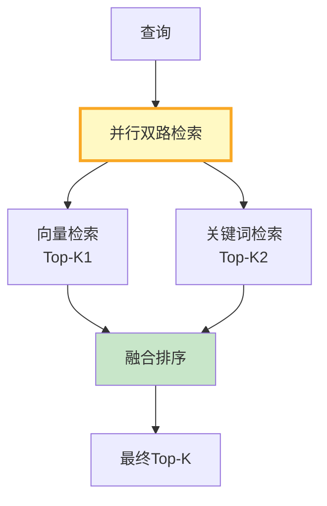

# RAG 混合检索深度调优

> 纯向量检索懂语义但不擅长精确匹配——搜"订单号 ABC123"时可能匹配不到。关键词检索擅长精确匹配但不懂语义。混合检索把两者结合，取长补短。这份指南覆盖混合检索原理、权重调优和融合策略。

---

## 一、为什么需要混合检索

```mermaid
graph TB
    subgraph 向量检索 &#123;"向量检索(Bi-Encoder)"&#125;
        V1["✅ 懂语义<br/>'怎么做'匹配'如何实现'"]
        V2["❌ 精确匹配差<br/>'ABC123'可能搜不到"]
        V3["✅ 召回宽<br/>语义相近都能召回"]
    end

    subgraph 关键词检索 &#123;"关键词检索(BM25)"&#125;
        K1["❌ 不懂语义<br/>'怎么做'≠'如何实现'"]
        K2["✅ 精确匹配强<br/>'ABC123'精确命中"]
        K3["✅ 速度快<br/>倒排索引O(1)"]
    end

    subgraph 混合 &#123;"混合检索"&#125;
        H1["✅ 语义+精确<br/>两者优势兼得"]
    end

    style 向量检索 fill:#E3F2FD
    style 关键词检索 fill:#FFF3E0
    style 混合 fill:#C8E6C9,stroke:#2E7D32,stroke-width:3px
```

---

## 二、混合检索架构



---

## 三、实现

### 3.1 BM25 关键词检索

```python
from langchain_core.documents import Document
from rank_bm25 import BM25Okapi
import jieba

class BM25Retriever:
    """BM25关键词检索器。

    BM25是经典的文本检索算法：
    - 基于词频和逆文档频率
    - 擅长精确匹配（ID、专有名词、代码）
    - 不懂语义但速度快
    """

    def __init__(self, documents: list[Document]):
        self.documents = documents
        # 中文需要分词
        self.tokenized = [
            list(jieba.cut(doc.page_content)) for doc in documents
        ]
        self.bm25 = BM25Okapi(self.tokenized)

    def search(self, query: str, k: int = 5) -> list[Document]:
        """关键词检索。"""
        query_tokens = list(jieba.cut(query))
        scores = self.bm25.get_scores(query_tokens)

        # 按分数排序
        ranked = sorted(
            enumerate(scores), key=lambda x: x[1], reverse=True
        )

        return [self.documents[i] for i, _ in ranked[:k]]
```

### 3.2 混合检索器

```python
from langchain_core.vectorstores import VectorStore
from langchain_core.embeddings import Embeddings
import numpy as np

class HybridRetriever:
    """混合检索器：向量+关键词。

    两路并行检索，用加权融合排序。
    """

    def __init__(
        self,
        vectorstore: VectorStore,
        documents: list[Document],
        vector_weight: float = 0.5,
        keyword_weight: float = 0.5,
        k_per_route: int = 10,
        final_k: int = 5,
    ):
        self.vectorstore = vectorstore
        self.bm25 = BM25Retriever(documents)
        self.vec_weight = vector_weight
        self.kw_weight = keyword_weight
        self.k_per_route = k_per_route
        self.final_k = final_k

    async def retrieve(self, query: str) -> list[Document]:
        """混合检索。"""
        # 1. 向量检索
        vec_docs = await self.vectorstore.asimilarity_search_with_score(
            query, k=self.k_per_route
        )
        # 归一化向量分数（越大越好）
        vec_scores = self._normalize_scores([s for _, s in vec_docs])

        # 2. 关键词检索
        kw_docs = self.bm25.search(query, k=self.k_per_route)
        # BM25分数（需要重新计算）
        kw_scores = self._normalize_scores(
            self._get_bm25_scores(query, kw_docs)
        )

        # 3. 加权融合
        fused = self._weighted_fuse(
            [(doc, score * self.vec_weight) for doc, score in zip(
                [d for d, _ in vec_docs], vec_scores
            )],
            [(doc, score * self.kw_weight) for doc, score in zip(
                kw_docs, kw_scores
            )],
        )

        return [doc for doc, _ in fused[:self.final_k]]

    def _weighted_fuse(
        self,
        vec_results: list[tuple[Document, float]],
        kw_results: list[tuple[Document, float]],
    ) -> list[tuple[Document, float]]:
        """加权融合：相同文档分数相加。"""
        score_map: dict[str, float] = &#123;&#125;
        doc_map: dict[str, Document] = &#123;&#125;

        for doc, score in vec_results + kw_results:
            key = hash(doc.page_content[:200])
            score_map[key] = score_map.get(key, 0) + score
            if key not in doc_map:
                doc_map[key] = doc

        return sorted(
            [(doc_map[k], s) for k, s in score_map.items()],
            key=lambda x: x[1], reverse=True
        )

    def _normalize_scores(self, scores: list[float]) -> list[float]:
        """归一化分数到0-1。"""
        if not scores:
            return []
        min_s, max_s = min(scores), max(scores)
        if max_s == min_s:
            return [0.5] * len(scores)
        return [(s - min_s) / (max_s - min_s) for s in scores]

    def _get_bm25_scores(self, query: str, docs: list[Document]) -> list[float]:
        """获取BM25分数。"""
        query_tokens = list(jieba.cut(query))
        all_scores = self.bm25.bm25.get_scores(query_tokens)
        # 只返回检索到的文档的分数
        doc_indices = [
            self.bm25.documents.index(d) if d in self.bm25.documents else 0
            for d in docs
        ]
        return [all_scores[i] if i < len(all_scores) else 0 for i in doc_indices]
```

---

## 四、权重调优

```mermaid
graph TB
    subgraph 权重 &#123;"权重调优策略"&#125;
        W1["向量0.5 + 关键词0.5<br/>默认均衡"]
        W2["向量0.7 + 关键词0.3<br/>语义为主"]
        W3["向量0.3 + 关键词0.7<br/>精确为主"]
    end

    subgraph 场景 &#123;"按场景选权重"&#125;
        S1["自然语言问答<br/>→向量0.7"]
        S2["ID/代码搜索<br/>→关键词0.7"]
        S3["混合场景<br/>→0.5/0.5"]
    end

    style 权重 fill:#E3F2FD
    style 场景 fill:#FFF9C4
```

```python
class WeightOptimizer:
    """权重自动调优器。"""

    @staticmethod
    async def optimize(
        retriever: HybridRetriever,
        test_cases: list[dict],  # [&#123;query, expected_doc_ids&#125;]
        weight_options: list[tuple[float, float]] = None,
    ) -> dict:
        """遍历权重组合，选最优。

        Args:
            test_cases: 测试用例
            weight_options: [(vec_weight, kw_weight), ...]
        """
        if weight_options is None:
            weight_options = [
                (0.3, 0.7), (0.4, 0.6), (0.5, 0.5),
                (0.6, 0.4), (0.7, 0.3),
            ]

        results = &#123;&#125;
        for vec_w, kw_w in weight_options:
            retriever.vec_weight = vec_w
            retriever.kw_weight = kw_w

            recalls = []
            for tc in test_cases:
                docs = await retriever.retrieve(tc["query"])
                retrieved_ids = &#123;d.metadata.get("id") for d in docs&#125;
                expected = set(tc["expected_doc_ids"])
                recall = len(retrieved_ids & expected) / len(expected) if expected else 0
                recalls.append(recall)

            avg_recall = sum(recalls) / len(recalls) if recalls else 0
            key = f"vec=&#123;vec_w&#125;,kw=&#123;kw_w&#125;"
            results[key] = round(avg_recall, 4)

        # 找最优
        best = max(results, key=results.get)
        return &#123;"best_weight": best, "best_recall": results[best], "all": results&#125;
```

---

## 五、RRF 融合替代方案

```python
class RRFFusion:
    """RRF融合（替代加权融合）。

    RRF不依赖分数归一化，更鲁棒。
    """

    @staticmethod
    def fuse(
        vec_results: list[Document],
        kw_results: list[Document],
        k: int = 60,
        final_k: int = 5,
    ) -> list[Document]:
        """RRF融合两路结果。"""
        scores: dict[int, float] = &#123;&#125;
        doc_map: dict[int, Document] = &#123;&#125;

        for rank, doc in enumerate(vec_results):
            key = hash(doc.page_content[:200])
            scores[key] = scores.get(key, 0) + 1.0 / (k + rank + 1)
            doc_map[key] = doc

        for rank, doc in enumerate(kw_results):
            key = hash(doc.page_content[:200])
            scores[key] = scores.get(key, 0) + 1.0 / (k + rank + 1)
            if key not in doc_map:
                doc_map[key] = doc

        sorted_keys = sorted(scores.keys(), key=lambda x: scores[x], reverse=True)
        return [doc_map[key] for key in sorted_keys[:final_k]]
```

---

## 六、与 LangChain 集成

```python
from langchain_core.retrievers import BaseRetriever
from langchain_core.documents import Document

class LangChainHybridRetriever(BaseRetriever):
    """LangChain兼容的混合检索器。

    可直接用于LangChain的RetrievalQA等组件。
    """

    def _get_relevant_documents(self, query: str) -> list[Document]:
        """同步接口。"""
        import asyncio
        loop = asyncio.new_event_loop()
        try:
            return loop.run_until_complete(self._hybrid_retrieve(query))
        finally:
            loop.close()

    async def _hybrid_retrieve(self, query: str) -> list[Document]:
        """异步混合检索。"""
        retriever = HybridRetriever(
            self.vectorstore, self.documents
        )
        return await retriever.retrieve(query)

    # 注入属性
    vectorstore: any = None
    documents: list = []
```

---

## 七、效果对比

```mermaid
graph TB
    subgraph 对比 &#123;"三种检索效果对比"&#125;
        V["纯向量检索<br/>召回: 72%<br/>精确: 60%"]
        K["纯关键词检索<br/>召回: 65%<br/>精确: 85%"]
        H["混合检索<br/>召回: 88%<br/>精确: 80%"]
    end

    style V fill:#E3F2FD
    style K fill:#FFF3E0
    style H fill:#C8E6C9,stroke:#2E7D32,stroke-width:3px
```

| 检索方式 | 召回率 | 精确匹配 | 语义匹配 | 适合场景 |
|----------|--------|----------|----------|----------|
| 纯向量 | 72% | 差 | 好 | 自然语言问答 |
| 纯关键词 | 65% | 好 | 差 | ID/代码搜索 |
| 混合 | 88% | 好 | 好 | 通用场景 |

---

## 八、最佳实践

| 实践 | 说明 | 优先级 |
|------|------|--------|
| 默认0.5/0.5权重 | 均衡覆盖大多数场景 | ★★★ |
| 中文必须分词 | jieba分词是BM25前提 | ★★★ |
| 权重按场景调 | 问答偏向量,搜索偏关键词 | ★★☆ |
| RRF比加权更鲁棒 | 不依赖分数归一化 | ★★☆ |
| 两路并行检索 | 用asyncio并行加速 | ★★☆ |

---

## 九、检查清单

| 检查项 | 状态 |
|--------|------|
| 理解向量vs关键词优劣 | ☐ |
| 实现了BM25检索器 | ☐ |
| 实现了混合检索器 | ☐ |
| 能调优权重 | ☐ |
| 评估了混合检索效果 | ☐ |
