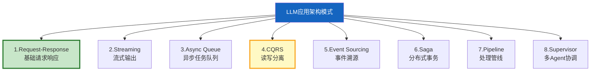
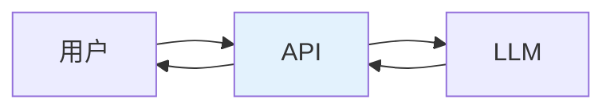
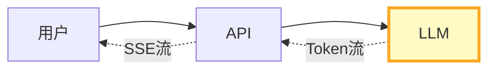
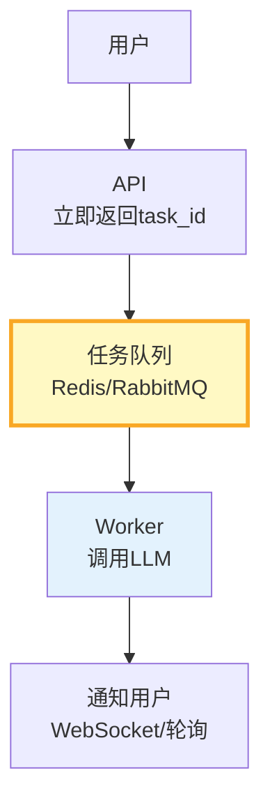
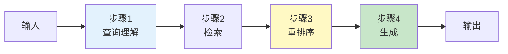
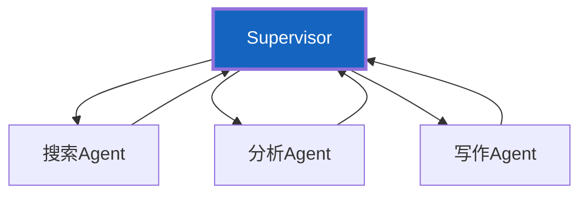
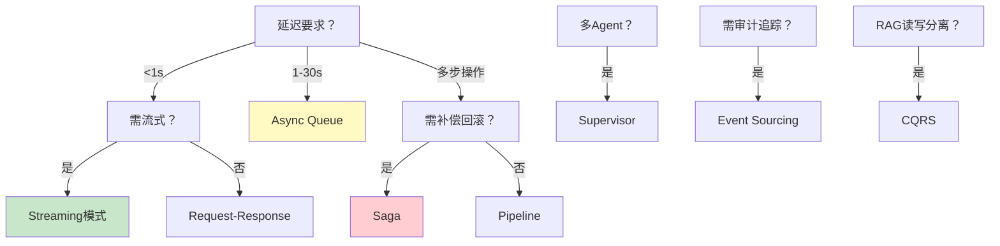

# LLM 应用架构模式全集

> LLM 应用不只是"调 API + RAG"——它涉及数据流、事件处理、状态管理、读写分离。传统架构模式（CQRS、事件溯源、Saga）在 LLM 场景有新的应用方式。这份指南系统讲解 LLM 应用的 8 种架构模式。

---

## 一、8 种架构模式总览



---

## 二、模式1：Request-Response



最基础的模式：用户请求→同步调用 LLM→返回结果。适合延迟可接受的简单问答。

---

## 三、模式2：Streaming（流式输出）



LLM 逐 Token 返回，API 通过 SSE 流式推送给用户。首 Token 延迟 < 500ms。

---

## 四、模式3：Async Queue（异步任务队列）



**适用场景：** LLM 调用 > 10 秒的长任务（报告生成、批量翻译）。用户提交后立即返回 task_id，完成后通知。

```python
from fastapi import FastAPI
from pydantic import BaseModel
import uuid

app = FastAPI()

class TaskRequest(BaseModel):
    task_type: str
    payload: dict

@app.post("/v1/tasks")
async def create_task(request: TaskRequest):
    """提交异步任务。"""
    task_id = str(uuid.uuid4())[:8]
    # 入队
    # await queue.enqueue(task_id, request.task_type, request.payload)
    return &#123;"task_id": task_id, "status": "queued"&#125;

@app.get("/v1/tasks/&#123;task_id&#125;")
async def get_task_status(task_id: str):
    """查询任务状态。"""
    return &#123;"task_id": task_id, "status": "processing"&#125;  # queued/processing/completed/failed
```

---

## 五、模式4：CQRS（读写分离）

```mermaid
graph TB
    subgraph 写 &#123;"写路径(离线)"&#125;
        W1["文档摄入"] --> ETL["ETL: 清洗→分块→嵌入"] --> W2["写入向量库"]
    end

    subgraph 读 &#123;"读路径(在线)"&#125;
        R1["用户查询"] --> SEARCH["向量检索"] --> R2["LLM生成"]
    end

    style 写 fill:#E3F2FD,stroke:#1565C0,stroke-width:3px
    style 读 fill:#C8E6C9,stroke:#2E7D32,stroke-width:3px
```

**核心理念：** RAG 的写入（文档摄入+嵌入）和读取（检索+生成）完全分离，各自优化。

**优势：** 写入慢不影响读取、读写可独立扩缩容、写入可批量异步。

---

## 六、模式5：Event Sourcing（事件溯源）

```mermaid
graph TB
    subgraph 事件溯源 &#123;"对话事件溯源"&#125;
        E1["事件1: 用户问了X"] --> STORE["事件存储"]
        E2["事件2: Agent搜索了Y"] --> STORE
        E3["事件3: Agent回答了Z"] --> STORE
        STORE --> REPLAY["重放事件→重建状态"]
    end

    style STORE fill:#FFF9C4,stroke:#F9A825,stroke-width:3px
```

**适用场景：** 需要完整审计追踪的 Agent 系统。每次操作（用户消息、工具调用、Agent 回答）都作为事件记录，可重放重建任意时刻的状态。

```python
from dataclasses import dataclass, field
from datetime import datetime

@dataclass
class DomainEvent:
    """领域事件。"""
    event_type: str          # user_message/agent_response/tool_call/tool_result
    timestamp: str
    data: dict
    sequence: int            # 序列号

class EventStore:
    """事件存储器。"""
    def __init__(self):
        self.events: list[DomainEvent] = []
        self._seq = 0

    def append(self, event_type: str, data: dict):
        self._seq += 1
        self.events.append(DomainEvent(
            event_type=event_type,
            timestamp=datetime.now().isoformat(),
            data=data,
            sequence=self._seq,
        ))

    def replay(self, from_seq: int = 0) -> list[DomainEvent]:
        """重放事件。"""
        return [e for e in self.events if e.sequence > from_seq]
```

---

## 七、模式6：Saga（分布式事务）

```mermaid
graph TB
    subgraph Saga &#123;"Agent多步操作的Saga"&#125;
        S1["步骤1: 搜索信息"] --> S2["步骤2: 分析数据"]
        S2 --> S3["步骤3: 生成报告"]
        S3 --> S4["步骤4: 发送邮件"]
        S4 --> S5["✅ 完成"]
        S2 -.->|"失败"| C1["补偿: 清除搜索缓存"]
        S3 -.->|"失败"| C2["补偿: 删除分析结果"]
        S4 -.->|"失败"| C3["补偿: 标记报告为草稿"]
    end

    style S5 fill:#C8E6C9
    style C1 fill:#FFCDD2
    style C2 fill:#FFCDD2
```

**适用场景：** Agent 执行多步操作，每步可能失败。Saga 模式为每步定义补偿操作，失败时回滚。

---

## 八、模式7：Pipeline（处理管线）



**适用场景：** RAG 的经典模式——查询→检索→重排序→生成，每步处理上一步的输出。

---

## 九、模式8：Supervisor（多Agent协调）



**适用场景：** 多 Agent 协作，中心 Supervisor 调度。已在前面的知识库 156 深入讲解。

---

## 十、模式对比与选型



| 模式 | 延迟 | 复杂度 | 适合场景 |
|------|------|--------|----------|
| Request-Response | 低 | 低 | 简单问答 |
| Streaming | 中(感知低) | 中 | 实时对话 |
| Async Queue | 高(异步) | 中 | 长任务 |
| CQRS | 读写分离 | 中 | RAG系统 |
| Event Sourcing | 中 | 高 | 审计追踪 |
| Saga | 中 | 高 | 多步操作 |
| Pipeline | 中 | 低 | RAG管线 |
| Supervisor | 中 | 中 | 多Agent |

---

## 十一、组合使用

```python
# 实际系统通常组合多种模式
ARCHITECTURE_EXAMPLE = """
生产级LLM应用架构 = CQRS + Streaming + Pipeline + Async Queue

写路径(离线):
  文档→ETL Pipeline→嵌入→写入向量库 (CQRS写侧)

读路径(在线):
  用户查询→Pipeline(查询理解→检索→重排序→生成)
  →Streaming(SSE流式输出)
  →Async Queue(长任务异步化)

可观测性:
  Event Sourcing(事件记录每次操作)
"""
```

---

## 十二、最佳实践

| 实践 | 说明 | 优先级 |
|------|------|--------|
| RAG系统必用CQRS | 读写分离是基础 | ★★★ |
| 实时对话用Streaming | 用户体验好 | ★★★ |
| 长任务用Async Queue | 不阻塞用户 | ★★☆ |
| 多步操作考虑Saga | 失败可回滚 | ★★☆ |
| 模式可组合 | 实际系统多用组合 | ★★☆ |

---

## 十三、检查清单

| 检查项 | 状态 |
|--------|------|
| 理解8种架构模式 | ☐ |
| 知道CQRS在RAG中的应用 | ☐ |
| 理解Event Sourcing的价值 | ☐ |
| 能根据场景选模式 | ☐ |
| 理解模式可组合 | ☐ |
